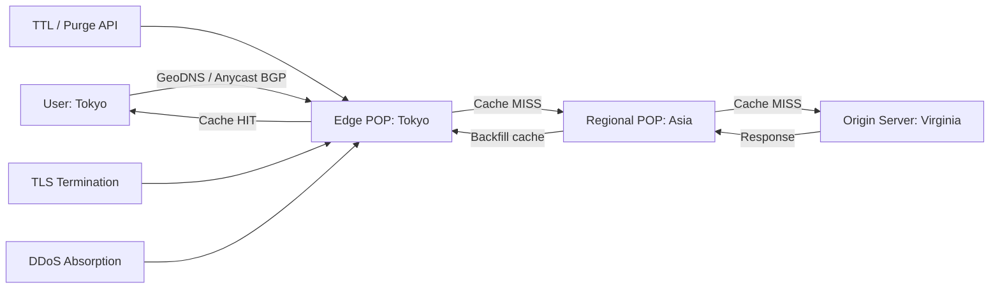
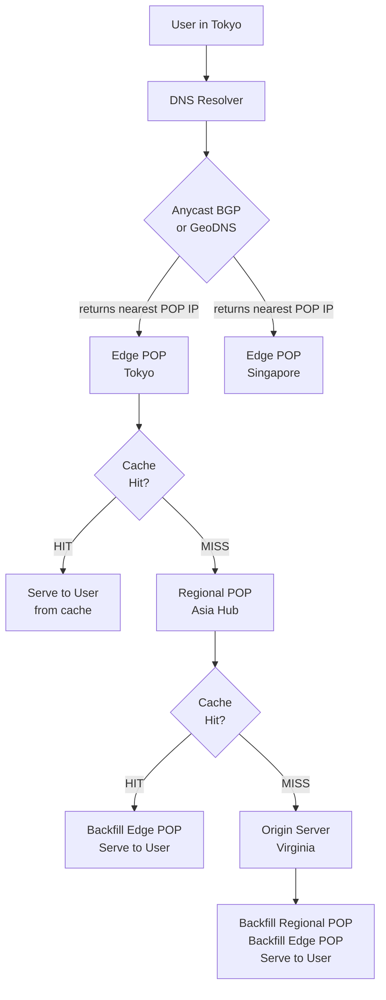

# Design a CDN from Scratch

## 🗺️ Quick Overview



*Three-tier cache hierarchy: Edge POP → Regional POP → Origin. Cache misses travel up the chain; hits serve locally.*

**Interview Question**: *"Design a Content Delivery Network (CDN) like Cloudflare or Akamai"*

**Difficulty**: 🔴 Advanced
**Asked by**: Cloudflare, Akamai, Fastly, Amazon (CloudFront), Netflix, Google
**Time to Answer**: 10-15 minutes

---

## 🎯 Quick Answer (30 seconds)

A CDN is a globally distributed network of edge servers that caches content close to end users, reducing latency and origin server load. A user's DNS request is routed (via Anycast BGP or GeoDNS) to the nearest Point of Presence (POP). The edge server serves from cache on a hit, or fetches from origin (backfilling the cache) on a miss. Cache invalidation, DDoS absorption, and TLS termination all happen at the edge.

**Key Components**:
1. Edge POPs (Points of Presence): geographically distributed caching servers
2. Routing layer: Anycast BGP or GeoDNS to send users to the nearest POP
3. Cache hierarchy: Edge POP → Regional POP → Origin
4. Cache management: TTL-based expiry, purge API, cache tags

---

## 📚 Detailed Explanation

### Problem Breakdown

Without a CDN, every user request travels to your single origin server. If your users are in Tokyo and your server is in Virginia, that is 150ms of round-trip time minimum — before any processing. A CDN eliminates that by serving from a server 5ms away.

The scale numbers make this concrete:
- **Cloudflare**: 330+ Points of Presence, handles 46 million HTTP requests per second
- **Akamai**: 4,000+ POPs in 130+ countries, serves ~30% of all internet traffic
- **Netflix Open Connect**: Custom CDN embedded inside ISPs, serves 700 Gbps of video traffic

Core problems a CDN solves:
1. **Latency**: Geographic proximity reduces RTT from 150ms to 5ms
2. **Origin load**: 90%+ cache hit ratio means 90% fewer requests reach origin
3. **Availability**: Edge POPs absorb DDoS attacks before they reach the application
4. **Bandwidth cost**: Serving from edge is cheaper than egress from origin cloud

### High-Level Architecture



The three-tier hierarchy — edge → regional → origin — balances storage cost against cache hit rate. Edge POPs have limited storage (SSDs, expensive) and are spread thin. Regional POPs are fewer but larger. Most cache misses are caught at the regional tier, so origin traffic stays low.

### Deep Dive: Routing — How Users Get to the Nearest POP

This is the most important and often misunderstood part of CDN design.

**Option 1: Anycast BGP (Cloudflare, Fastly)**

Multiple POPs in different physical locations advertise the **same IP address** to the internet. BGP (the routing protocol of the internet) routes each user's packets to the topologically nearest server announcing that IP.

```
# Example: all 3 POPs announce 1.1.1.1

Tokyo POP:     BGP ANNOUNCE 1.1.1.1 via AS12345
Frankfurt POP: BGP ANNOUNCE 1.1.1.1 via AS12345
New York POP:  BGP ANNOUNCE 1.1.1.1 via AS12345

# User in Tokyo sends packet to 1.1.1.1
# BGP routes it to Tokyo POP (fewest hops)
# User in Paris sends packet to 1.1.1.1
# BGP routes it to Frankfurt POP (fewest hops)
```

Pros: extremely fast (routing happens at network layer), automatic failover (BGP re-routes around outages), no DNS TTL delay.
Cons: limited to anycast-compatible protocols (UDP fine, TCP works but with caveats), harder to implement without BGP infrastructure.

**Option 2: GeoDNS (Akamai traditional approach)**

DNS resolver maps the client's IP to a geographic region, returns the IP of the nearest POP. Different DNS responses for different users.

```
# DNS lookup for cdn.example.com
# User from 103.x.x.x (Tokyo) → gets 43.28.10.1 (Tokyo POP IP)
# User from 85.x.x.x (Paris) → gets 185.40.4.5 (Frankfurt POP IP)
# User from 74.x.x.x (New York) → gets 151.101.1.1 (New York POP IP)
```

Pros: simpler to implement, works with any DNS provider.
Cons: DNS TTL means routing changes take time to propagate (stale entries), resolver location may not match user location (corporate proxies), requires accurate IP geolocation database.

Most large CDNs use both: Anycast for the DNS nameservers themselves, GeoDNS for granular control.

### Deep Dive: Cache Key Design

The cache key determines when two requests share the same cached object. Bad cache key design causes cache pollution (storing many near-identical variants) or stale content (serving wrong variant to wrong user).

```
# Naive (wrong) cache key
cache_key = URL
# Problem: same URL serves different content for different Accept-Language values
# French user gets English content, English user gets French content

# Better cache key
cache_key = URL + normalize(Accept-Encoding) + normalize(Accept-Language)

# Even better: Vary header
# Origin sets: Vary: Accept-Encoding, Accept-Language
# CDN automatically includes those headers in cache key
```

Cache key components to consider:

| Component | Include? | Reason |
|---|---|---|
| URL path | Always | Core identity of resource |
| Query string | Usually | `?v=2` is different from `?v=1` (versioned assets) |
| Query string (analytics) | No | Strip `?utm_source=email` — same content |
| Accept-Encoding | Yes | Compressed vs uncompressed are different bytes |
| Accept-Language | Only if content varies | Adds cache fragmentation if not needed |
| Cookie | Almost never | Creates as many cache entries as users = no caching |
| Authorization header | Never | Private content must bypass cache entirely |

### Deep Dive: Cache Invalidation

"Cache invalidation is one of the two hard problems in computer science." CDNs add geographic distribution to the difficulty.

**TTL-Based Expiry (default approach)**

Every cached object has a Time-To-Live. After TTL, the next request triggers a re-fetch from origin.

```
# Origin sets TTL via HTTP headers:
Cache-Control: public, max-age=86400    # cache for 24 hours
Cache-Control: public, max-age=31536000  # cache for 1 year (versioned static assets)
Cache-Control: no-store                  # never cache (dynamic, user-specific)
Cache-Control: no-cache                  # cache but always revalidate with origin
```

Best practice: **cache-bust via URL versioning** for static assets, **short TTL** for dynamic content:

```
# Static asset - immutable, cacheable forever at edge
<link href="/styles/main.css?v=a3f29d1c">  # hash changes on file change

# HTML page - short TTL, always fresh
Cache-Control: public, max-age=60  # cache for 1 minute
```

**Purge API (for urgent invalidation)**

When you need to invalidate before TTL expires (product recall, wrong price displayed, security incident):

```
# Cloudflare purge example
POST /zones/{zone_id}/purge_cache
{
  "files": [
    "https://example.com/product/123/image.jpg",
    "https://example.com/api/product/123"
  ]
}

# Or wildcard purge (expensive, use sparingly)
POST /zones/{zone_id}/purge_cache
{ "purge_everything": true }
```

Challenge: with 330 POPs, a purge must propagate to all of them. Cloudflare's purge propagates to all POPs in < 150ms using an internal pub/sub system.

**Cache Tags (Surrogate-Key pattern)**

Tag objects at cache time, purge all objects with a tag atomically:

```
# Origin response headers:
Surrogate-Key: product-123 category-electronics sale-event-456
Cache-Control: public, max-age=3600

# Purge all product-123 objects across all POPs:
POST /purge_cache
{ "tags": ["product-123"] }

# Use case: when product price changes, purge all pages showing that product
# (product page, category page, search results, related items sidebar)
```

### Deep Dive: Dynamic Content and Edge Computing

CDNs were originally for static files. Modern CDNs handle dynamic content too.

**ESI — Edge Side Includes**

Compose pages at the edge from fragments with different TTLs:

```html
<!-- Cached page template (TTL: 1 hour) -->
<html>
  <body>
    <!-- Static header, cached for 1 day -->
    <esi:include src="/partials/header" ttl="86400"/>

    <!-- Product content, cached for 1 hour -->
    <esi:include src="/product/123/content" ttl="3600"/>

    <!-- User cart widget: NOT cached (user-specific) -->
    <esi:include src="/user/cart" no-store="true"/>
  </body>
</html>
```

**Edge Functions (Cloudflare Workers, Lambda@Edge, Fastly Compute@Edge)**

Run JavaScript/WebAssembly at the edge server. Latency-sensitive logic without a round-trip to origin:

```javascript
// Cloudflare Worker example: A/B test at the edge
addEventListener('fetch', event => {
  event.respondWith(handleRequest(event.request))
})

async function handleRequest(request) {
  const bucket = Math.random() < 0.5 ? 'A' : 'B'
  const url = new URL(request.url)
  url.pathname = `/experiment-${bucket}${url.pathname}`
  return fetch(url.toString())
}
```

Use cases: auth at edge, A/B testing, bot filtering, geographic redirects, request transformation.

### Deep Dive: TLS Termination and Security

**TLS termination at edge** means the HTTPS handshake happens at the nearest POP, not at the origin:

```
User (Tokyo) ←—HTTPS—→ Edge POP Tokyo ←—HTTP/HTTPS—→ Origin (Virginia)
               5ms RTT                    150ms RTT (internal)
```

Benefits:
- User sees 5ms TLS handshake instead of 150ms
- Origin does not need to manage TLS certificates
- CDN handles certificate renewal (Let's Encrypt automation)
- Newer TLS versions (1.3) deployed at edge benefit all customers

**DDoS Mitigation at Edge**:

The CDN's distributed architecture is inherently DDoS-resistant. A 1 Tbps volumetric attack is distributed across 330 POPs (each absorbing ~3 Gbps). Origin never sees the traffic.

- L3/L4 attacks (SYN flood, UDP flood): absorbed at edge network layer
- L7 attacks (HTTP flood, slowloris): rate limiting, bot scoring, CAPTCHA challenge at edge
- Challenge: legitimate traffic must not be disrupted. Use challenge pages (CAPTCHAs) only for suspicious IPs.

### Data Flow with Pseudocode

```
# Edge POP request handler pseudocode
function handle_request(request):
    cache_key = build_cache_key(request)

    # Step 1: Check local edge cache (in-memory + SSD)
    cached = local_cache.get(cache_key)
    if cached and not is_expired(cached):
        metrics.increment("cache_hit")
        return serve(cached, headers={"X-Cache": "HIT"})

    # Step 2: Check regional POP (within same region)
    regional_response = regional_pop.fetch(cache_key)
    if regional_response.found:
        local_cache.set(cache_key, regional_response.content, ttl=regional_response.ttl)
        metrics.increment("regional_hit")
        return serve(regional_response.content, headers={"X-Cache": "REGIONAL-HIT"})

    # Step 3: Fetch from origin (cache miss path)
    origin_response = fetch_from_origin(request)

    # Determine cacheability from response headers
    cache_directive = parse_cache_control(origin_response.headers)

    if cache_directive.is_cacheable:
        regional_pop.set(cache_key, origin_response.content, ttl=cache_directive.max_age)
        local_cache.set(cache_key, origin_response.content, ttl=cache_directive.max_age)

    metrics.increment("cache_miss")
    return serve(origin_response.content, headers={"X-Cache": "MISS"})


# Cache key builder
function build_cache_key(request):
    url = normalize_url(request.url)
    query = strip_analytics_params(request.query_string)  # remove utm_*, fbclid, etc.
    encoding = normalize_encoding(request.headers["Accept-Encoding"])
    return hash(url + query + encoding)
```

### Health Checks and Failover

Edge POPs continuously health-check origin servers. On origin failure, traffic fails over to backup origin or serves stale content (grace period):

```
# Health check config (pseudo-YAML)
origin:
  primary: https://api.example.com
  backup:  https://api-backup.example.com
  health_check:
    path: /health
    interval: 5s
    timeout: 2s
    healthy_threshold: 2    # 2 successes to mark healthy
    unhealthy_threshold: 3  # 3 failures to mark unhealthy
  stale_while_revalidate: 60s  # serve stale content up to 60s during failures
  stale_if_error: 3600s        # serve stale content up to 1hr if origin errors
```

---

## ⚖️ Trade-offs

| Approach | Pros | Cons | When to Use |
|---|---|---|---|
| Anycast routing | Fastest, automatic failover, no DNS TTL delay | Complex BGP setup, requires own AS | Large CDNs with BGP infrastructure |
| GeoDNS routing | Simpler, flexible control | DNS TTL delay, resolver vs user location mismatch | Smaller CDNs, simpler setups |
| Pull CDN (lazy caching) | No pre-warming needed, only popular content cached | First request always misses, thundering herd on new content | Most web content |
| Push CDN (pre-loaded) | Zero first-request latency | Must push all content upfront, wasted storage if not popular | Known-popular content, video streaming |
| Short TTL | Content always fresh | More origin requests, lower cache hit ratio | Frequently changing content |
| Long TTL + URL versioning | Excellent cache hit ratio | Old URLs may be indexed/linked | Static assets (CSS, JS, images) |
| Per-POP storage (SSD) | Fast, distributed | Expensive per GB | Hot content |
| Centralized regional storage | Cheaper, higher capacity | One more network hop on miss | Warm/cold content |

---

## 🏢 Real-World Examples

**Cloudflare**:
- 330+ POPs in 100+ countries; 46M HTTP requests/second at peak
- Anycast for everything: DNS, HTTP, WebSockets
- Workers platform: 30M+ deployments, runs JS at edge in V8 isolates
- DDoS mitigation: mitigated a 2.5 Tbps attack in 2022 without customer impact

**Akamai**:
- 4,000+ POPs; ~30% of internet traffic served
- Content mapped to POPs using proprietary mapping system, updated every few minutes
- EdgeSuite: ESI, edge logic, token authentication at edge

**Netflix Open Connect**:
- Custom CDN embedded directly inside ISPs (Comcast, AT&T, etc.) — "embedded appliances"
- Stores Netflix catalog directly at the ISP; traffic never leaves ISP network
- Result: Netflix traffic is essentially zero-latency within US, ISP pays zero transit costs
- Pre-positions content: during off-peak hours, fills appliances with next-day popular content

**Fastly**:
- Targets developers; cache purge propagates globally in < 150ms (fastest in industry)
- Compute@Edge: runs WebAssembly at edge (more secure than JavaScript V8)
- Popular with media companies: NY Times, GitHub

---

## ⚠️ Common Pitfalls

**1. Cache Poisoning Attacks**
Attacker injects malicious content into the CDN cache, served to all users. Protection: validate that cached content comes from a trusted origin, use strict cache key design, sanitize Vary headers.

**2. Serving Stale Content After Deploys**
You push a new application version but CDN still serves the old JS/CSS. Solution: URL versioning (hash in filename), and/or deploy pipeline that triggers purge before traffic switches.

**3. Cache Stampede on Popular Content Purge**
After purging a popular object, thousands of edge servers simultaneously try to fetch from origin — origin gets hit with a traffic spike. Solution: "request coalescing" (only one request fetches from origin; others wait) and "probabilistic early expiry" (some requests refresh slightly before TTL).

```
# Request coalescing pseudocode
in_flight_requests = {}

function fetch_with_coalescing(cache_key):
    if cache_key in in_flight_requests:
        return wait_for(in_flight_requests[cache_key])  # queue up, wait for one fetch

    future = fetch_from_origin_async(cache_key)
    in_flight_requests[cache_key] = future
    result = await future
    del in_flight_requests[cache_key]
    return result
```

**4. HTTPS Certificate Management Across 300+ POPs**
Each POP needs a valid TLS certificate for every customer domain. At 330 POPs and millions of domains, certificate issuance and renewal is a massive automation challenge. Modern CDNs use ACME protocol (Let's Encrypt) and centralized certificate distribution.

**5. Privacy Regulations (GDPR) and Data Residency**
Cached content may include personal data. EU regulations may require that data not leave EU servers. Solution: geo-restricted caching policies, ensure EU user traffic only hits EU POPs.

**6. Streaming Video — Byte-Range Requests**
Video players request specific byte ranges (e.g., `Range: bytes=0-1023`). Naive CDN caches the full file but misses byte-range requests. Solution: CDN must support range-request cache hits — return the correct slice of a cached object.

---

## ✅ Key Takeaways

- **Core value**: Serve content from a server 5ms away instead of 150ms away; absorb origin load and DDoS at edge
- **Routing**: Anycast BGP or GeoDNS sends each user to their nearest POP; both have trade-offs
- **Three-tier cache hierarchy**: Edge → Regional → Origin; most misses caught at regional tier
- **Cache key design matters**: Include the right headers (Accept-Encoding) but not the wrong ones (Cookie, Authorization)
- **Cache invalidation**: TTL + URL versioning for statics; purge API for urgent changes; cache tags for complex dependencies
- **Dynamic content at edge**: ESI for page composition; edge functions (Workers/Lambda@Edge) for business logic
- **TLS at edge**: Reduces user-perceived latency, simplifies certificate management, protects origin
- **DDoS absorption**: Distributed architecture is inherently resilient; volumetric attacks split across hundreds of POPs
- **Cache hit ratio > 90%**: Every percentage point below 90% directly increases origin cost and latency for those users
