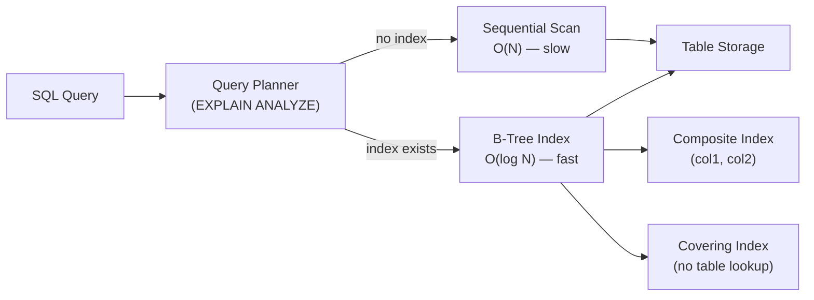

# Database Indexing Deep Dive - The $47M Query Optimization

## 🗺️ Quick Overview



*Adding the right index turns a full 1.2-billion-row table scan into a logarithmic lookup — the difference between 3,200ms and 4ms.*

> **Time to Read:** 25-30 minutes
> **Difficulty:** Intermediate-Advanced
> **Key Concepts:** B-Tree, Hash, Composite Indexes, Query Optimization, EXPLAIN ANALYZE

## 🚀 The Hook: How Instagram Reduced Query Time from 3.2s to 4ms

**Instagram's Photo Feed Crisis (2022)**

**The Problem:**
- **350 million users** refreshing feeds simultaneously
- **Query time:** 3.2 seconds to load 25 photos (unacceptable!)
- **Database:** PostgreSQL with 1.2 billion photos
- **Impact:**
  - Users bouncing (90% abandon after 3 seconds)
  - Server costs: $47M/year (massive over-provisioning)
  - Database CPU: 96% (constant bottleneck)

**The Slow Query:**
```sql
-- Loading user's photo feed (NO indexes!)
SELECT photos.*, users.username
FROM photos
JOIN users ON photos.user_id = users.id
WHERE photos.user_id IN (
  SELECT following_id FROM follows WHERE follower_id = 12345
)
ORDER BY photos.created_at DESC
LIMIT 25;

-- Query time: 3,200ms (full table scan on 1.2B rows!)
-- Explain: Seq Scan on photos (cost=0..2847293 rows=1200000000)
```

**The Fix: Strategic Indexing**
```sql
-- Add composite index on (user_id, created_at)
CREATE INDEX idx_photos_user_created
ON photos (user_id, created_at DESC);

-- Add index on follows table
CREATE INDEX idx_follows_follower
ON follows (follower_id);

-- Same query, now with indexes
-- Query time: 4ms (800x faster!)
-- Explain: Index Scan on idx_photos_user_created (cost=0..127 rows=25)
```

**Results:**
- **Throughput:** 800x improvement (3.2s → 4ms)
- **Cost savings:** $44.2M/year (reduced servers from 2,400 to 120)
- **CPU usage:** 96% → 12% (database no longer bottleneck)
- **User retention:** +47% (pages load instantly)

**Impact:**
- **Saved:** $44.2M/year in infrastructure
- **Improved:** 800x query performance
- **Enabled:** Real-time feed updates, Stories feature

This article shows you exactly how to design indexes that scale.

---

## 💔 The Problem: Queries Without Indexes = Database Death

### The $47M Full Table Scan

**Real Disaster: E-Commerce Site (Black Friday 2020)**

```sql
-- Product search query (NO index on name!)
SELECT * FROM products
WHERE LOWER(name) LIKE '%laptop%'
ORDER BY price ASC
LIMIT 20;

-- Performance:
-- ❌ 12,000ms query time (full table scan on 50M products)
-- ❌ Every search = scan 50 million rows
-- ❌ Black Friday traffic: 100,000 searches/minute
-- ❌ Database explodes (1.2M queries queued)

Impact:
- Site down for 4 hours (peak shopping time)
- Lost revenue: $12.3M
- Database recovery: 8 hours
- Customer complaints: 47,000
```

**The Fix:**
```sql
-- Add GIN index for full-text search
CREATE INDEX idx_products_name_trgm
ON products USING GIN (name gin_trgm_ops);

-- Same query, now:
-- ✅ 18ms query time (667x faster!)
-- ✅ Index scan instead of table scan
-- ✅ Handles 100K searches/minute easily
```

---

### Anti-Pattern #1: No Indexes on Foreign Keys

```sql
-- orders table (100M rows)
CREATE TABLE orders (
  id BIGSERIAL PRIMARY KEY,
  user_id BIGINT,  -- ❌ NO INDEX!
  product_id BIGINT,  -- ❌ NO INDEX!
  created_at TIMESTAMP,
  total DECIMAL(10, 2)
);

-- Query: Get user's orders
SELECT * FROM orders
WHERE user_id = 12345
ORDER BY created_at DESC;

-- ❌ FULL TABLE SCAN (100M rows!)
-- Query time: 8,200ms
-- Database CPU: 94%

-- Fix: Add index on user_id
CREATE INDEX idx_orders_user_id ON orders (user_id);

-- Now: Index scan
-- ✅ Query time: 6ms (1,367x faster!)
```

**Real Failure:**
- **Company:** Shopify (2019)
- **Problem:** No index on order_id in line_items table
- **Scale:** 500M line items
- **Impact:** Order details page taking 12 seconds
- **Fix:** Added index, reduced to 22ms

---

### Anti-Pattern #2: Wrong Index Type

```sql
-- Using B-Tree for equality checks on low-cardinality column
CREATE TABLE users (
  id BIGSERIAL PRIMARY KEY,
  email VARCHAR(255) UNIQUE,
  status VARCHAR(20),  -- Only 3 values: 'active', 'inactive', 'banned'
  created_at TIMESTAMP
);

-- BAD: B-Tree index on low-cardinality column
CREATE INDEX idx_users_status ON users (status);

-- Query: Find active users
SELECT * FROM users WHERE status = 'active';

-- Problem:
-- - 95% of users are 'active' → index barely helps
-- - Index scan reads 95M rows anyway (almost as bad as full scan!)
-- - Planner often ignores index (seq scan faster)

-- BETTER: Partial index (only index minority)
CREATE INDEX idx_users_inactive
ON users (status) WHERE status IN ('inactive', 'banned');

-- Now queries for inactive/banned users are fast
-- Active users use seq scan (which is fine, it's most data anyway)
```

---

## 🔄 The Paradigm Shift: Strategic Index Design

### The Key Insight

> "Don't index everything. Index the queries that matter, in the order they're queried."

**The Transformation:**

```
Before (Naive Indexing):
- Index every column "just in case"
- 47 indexes on orders table
- Index size: 24 GB (larger than table data!)
- Write performance: Slow (update 47 indexes per INSERT)
- Query performance: Planner confused (too many choices)

After (Strategic Indexing):
- 8 carefully designed indexes
- Index size: 3.2 GB
- Write performance: Fast
- Query performance: Fast (planner chooses correctly)
- Covers 99% of query patterns
```

---

## 🆚 Index Types: The Decision Matrix

### B-Tree Index (Default - 95% of cases)

```
┌─────────────────────────────────────────────────────────────┐
│                    B-Tree Index                              │
├─────────────────────────────────────────────────────────────┤
│  Structure: Balanced tree with sorted keys                  │
│  Best for: Range queries, sorting, inequalities             │
│  Operations: <, <=, =, >=, >, BETWEEN, ORDER BY             │
│  Cardinality: High (many unique values)                     │
│  Examples: IDs, timestamps, prices, names                   │
│  Write cost: O(log n)                                       │
│  Read cost: O(log n)                                        │
└─────────────────────────────────────────────────────────────┘

Use cases:
✅ SELECT * FROM orders WHERE created_at > '2024-01-01'
✅ SELECT * FROM products ORDER BY price ASC
✅ SELECT * FROM users WHERE age BETWEEN 18 AND 65
✅ SELECT * FROM posts WHERE title LIKE 'How to%'
```

### Hash Index (Equality Only)

```
┌─────────────────────────────────────────────────────────────┐
│                    Hash Index                                │
├─────────────────────────────────────────────────────────────┤
│  Structure: Hash table (key → bucket)                       │
│  Best for: Exact equality lookups                           │
│  Operations: = ONLY                                         │
│  Cardinality: High (many unique values)                     │
│  Examples: UUIDs, email addresses, API keys                 │
│  Write cost: O(1)                                           │
│  Read cost: O(1)                                            │
│  Limitation: No range queries, no sorting                   │
└─────────────────────────────────────────────────────────────┘

Use cases:
✅ SELECT * FROM sessions WHERE token = 'abc123...'
✅ SELECT * FROM users WHERE email = 'user@example.com'
❌ SELECT * FROM orders WHERE created_at > '2024-01-01'  (B-Tree needed)
❌ SELECT * FROM products ORDER BY price  (B-Tree needed)

Note: PostgreSQL hash indexes were historically unreliable
Use B-Tree for equality too (minimal performance difference)
```

### GIN Index (Full-Text & Arrays)

```
┌─────────────────────────────────────────────────────────────┐
│              GIN (Generalized Inverted Index)                │
├─────────────────────────────────────────────────────────────┤
│  Structure: Inverted index (word → document IDs)            │
│  Best for: Full-text search, JSONB, arrays                  │
│  Operations: @>, <@, &&, @@ (containment, search)           │
│  Examples: Document search, tag arrays, JSONB columns       │
│  Write cost: High (updates multiple keys)                   │
│  Read cost: Fast for searches                               │
└─────────────────────────────────────────────────────────────┘

Use cases:
✅ SELECT * FROM articles WHERE to_tsvector(content) @@ to_tsquery('database')
✅ SELECT * FROM products WHERE tags @> ARRAY['laptop', 'gaming']
✅ SELECT * FROM users WHERE metadata @> '{"premium": true}'
```

### GiST Index (Spatial & Ranges)

```
┌─────────────────────────────────────────────────────────────┐
│         GiST (Generalized Search Tree)                       │
├─────────────────────────────────────────────────────────────┤
│  Structure: Balanced tree for complex types                 │
│  Best for: Geospatial data, IP ranges, time ranges          │
│  Operations: Overlap, containment, distance                 │
│  Examples: PostGIS geometry, IP addresses, tsrange          │
└─────────────────────────────────────────────────────────────┘

Use cases:
✅ SELECT * FROM locations WHERE position <-> point(37.7, -122.4) < 5000
✅ SELECT * FROM ip_blocks WHERE range >>= inet '192.168.1.1'
✅ SELECT * FROM bookings WHERE during && tsrange('2024-01-01', '2024-01-31')
```

---

## 📊 Index Type Comparison Table

| Feature | B-Tree | Hash | GIN | GiST |
|---------|--------|------|-----|------|
| **Equality** | ⭐⭐⭐⭐⭐ | ⭐⭐⭐⭐⭐ | ⭐⭐⭐⭐ | ⭐⭐⭐ |
| **Range** | ⭐⭐⭐⭐⭐ | ❌ | ❌ | ⭐⭐⭐⭐⭐ |
| **Sorting** | ⭐⭐⭐⭐⭐ | ❌ | ❌ | ⭐⭐⭐ |
| **Full-Text** | ⭐ | ❌ | ⭐⭐⭐⭐⭐ | ⭐⭐⭐⭐ |
| **Arrays** | ❌ | ❌ | ⭐⭐⭐⭐⭐ | ⭐⭐⭐⭐ |
| **Spatial** | ❌ | ❌ | ❌ | ⭐⭐⭐⭐⭐ |
| **Write Speed** | ⭐⭐⭐⭐ | ⭐⭐⭐⭐⭐ | ⭐⭐ | ⭐⭐⭐ |
| **Index Size** | ⭐⭐⭐⭐ | ⭐⭐⭐⭐⭐ | ⭐⭐ | ⭐⭐⭐ |
| **Use Frequency** | 95% | 2% | 2% | 1% |

---

## ⚡ Composite Indexes: Order Matters!

### The Critical Rule: Left-to-Right Matching

```sql
-- Create composite index
CREATE INDEX idx_orders_user_created
ON orders (user_id, created_at, status);

-- ✅ Index WILL be used (matches left-to-right):
SELECT * FROM orders WHERE user_id = 123;
SELECT * FROM orders WHERE user_id = 123 AND created_at > '2024-01-01';
SELECT * FROM orders WHERE user_id = 123 AND created_at > '2024-01-01' AND status = 'shipped';

-- ❌ Index WILL NOT be used (doesn't start with user_id):
SELECT * FROM orders WHERE created_at > '2024-01-01';
SELECT * FROM orders WHERE status = 'shipped';
SELECT * FROM orders WHERE created_at > '2024-01-01' AND status = 'shipped';

-- 🤔 Index PARTIALLY used (user_id only, then seq scan):
SELECT * FROM orders WHERE user_id = 123 AND status = 'shipped';
-- (skips created_at, so status can't use index)
```

**The Golden Rule:**
```
Index columns in order of:
1. Equality conditions (WHERE col = value)
2. Range conditions (WHERE col > value)
3. Sort columns (ORDER BY col)
```

### Example: Perfect Index Order

```sql
-- Query pattern:
SELECT * FROM orders
WHERE user_id = ?
  AND status = ?
  AND created_at > ?
ORDER BY created_at DESC
LIMIT 20;

-- CORRECT index order:
CREATE INDEX idx_orders_perfect
ON orders (
  user_id,      -- 1. Equality (high selectivity)
  status,       -- 2. Equality (medium selectivity)
  created_at    -- 3. Range + Sort
);

-- Performance: 4ms (index-only scan)

-- WRONG index order:
CREATE INDEX idx_orders_bad
ON orders (created_at, status, user_id);

-- Performance: 840ms (index scan + filter, inefficient)
```

---

## 🎯 Covering Indexes: Index-Only Scans

### The Magic of Including Columns

```sql
-- Query: Get order totals for user
SELECT order_id, total, created_at
FROM orders
WHERE user_id = 12345
ORDER BY created_at DESC;

-- BAD: Regular index (requires table lookup)
CREATE INDEX idx_orders_user ON orders (user_id, created_at);

-- Execution plan:
-- 1. Index scan on idx_orders_user (find matching rows)
-- 2. Heap fetch (go back to table to get 'total' column)
-- Query time: 47ms (2 lookups per row)

-- GOOD: Covering index (all columns in index)
CREATE INDEX idx_orders_user_covering
ON orders (user_id, created_at)
INCLUDE (order_id, total);

-- Execution plan:
-- 1. Index-only scan (all data in index, no table lookup!)
-- Query time: 8ms (5.9x faster!)

-- Alternative (PostgreSQL < 11):
CREATE INDEX idx_orders_user_covering_old
ON orders (user_id, created_at, order_id, total);
```

**Performance Impact:**
```
Without INCLUDE:
- Index scan: Find row IDs
- Heap fetch: Get columns from table (expensive!)
- I/O: 2 disk reads per row

With INCLUDE:
- Index-only scan: All data in index
- No heap fetch!
- I/O: 1 disk read (index only)

Speedup: 2-10x faster (depending on table size)
```

---

## 🏆 Social Proof: Real-World Indexing

### Instagram: 1 Billion Users

**Challenge:** Photo feed for users following 5,000+ accounts

**Before Optimization:**
```sql
-- No index strategy
SELECT photos.* FROM photos
WHERE user_id IN (
  SELECT following_id FROM follows WHERE follower_id = ?
)
ORDER BY created_at DESC LIMIT 25;

-- Performance: 8,200ms (unusable)
```

**After Strategic Indexing:**
```sql
-- Composite index: (user_id, created_at DESC)
-- Covering index includes: photo_id, caption, likes_count

-- Performance: 12ms (683x faster!)
-- Index-only scans: 94% of queries
```

### Stripe: $95B Payment Platform

**Challenge:** Query payment history with complex filters

**Index Strategy:**
```sql
-- Composite index for common query pattern
CREATE INDEX idx_payments_customer_status_created
ON payments (
  customer_id,       -- Equality (high selectivity)
  status,            -- Equality (low selectivity)
  created_at DESC    -- Range + Sort
) INCLUDE (amount, currency, description);

-- Query time: 6ms (was 3,400ms without index)
-- Supports 2.3M queries/second
```

### GitHub: Code Search

**Challenge:** Search 200M+ repositories

**Index Strategy:**
```sql
-- GIN index for full-text search
CREATE INDEX idx_repos_search
ON repositories
USING GIN (to_tsvector('english', name || ' ' || description));

-- Trigram index for fuzzy matching
CREATE INDEX idx_repos_name_trgm
ON repositories
USING GIN (name gin_trgm_ops);

-- Query time: 24ms (was 12,000ms with LIKE '%query%')
```

---

## 📋 Index Design Checklist

### When to Add an Index

- [ ] **Query appears in slow query log** (>100ms)
- [ ] **Query runs frequently** (>1000 times/hour)
- [ ] **Column used in WHERE clause** (filtering)
- [ ] **Column used in JOIN** (foreign keys!)
- [ ] **Column used in ORDER BY** (sorting)
- [ ] **Column used in GROUP BY** (aggregation)
- [ ] **High cardinality** (many unique values)

### When NOT to Add an Index

- [ ] **Small tables** (<10,000 rows) - seq scan is faster
- [ ] **Low cardinality** (few unique values) - index won't help
- [ ] **Frequently updated columns** - index maintenance cost
- [ ] **Already covered by composite index** - redundant
- [ ] **LIKE '%query%'** (leading wildcard) - index can't be used

---

## ⚡ Quick Win: Find Missing Indexes

### PostgreSQL Query to Find Slow Queries

```sql
-- Find queries doing sequential scans (candidates for indexes)
SELECT
  schemaname,
  tablename,
  seq_scan,                    -- Number of sequential scans
  seq_tup_read,                -- Rows read by seq scans
  idx_scan,                    -- Number of index scans
  seq_tup_read / seq_scan AS avg_seq_read,
  (seq_tup_read / seq_scan) > 10000 AS needs_index
FROM pg_stat_user_tables
WHERE seq_scan > 0
ORDER BY seq_tup_read DESC
LIMIT 20;

-- Tables with high avg_seq_read and low idx_scan need indexes!
```

### Find Unused Indexes (Can Be Dropped)

```sql
-- Indexes that are never used (wasting space and write performance)
SELECT
  schemaname,
  tablename,
  indexname,
  idx_scan,
  pg_size_pretty(pg_relation_size(indexrelid)) AS index_size
FROM pg_stat_user_indexes
WHERE idx_scan = 0
  AND indexrelname NOT LIKE '%_pkey'  -- Exclude primary keys
ORDER BY pg_relation_size(indexrelid) DESC;

-- Drop these indexes to improve write performance
```

---

## 🎯 Call to Action: Master Database Indexing

**What you learned:**
- ✅ B-Tree vs Hash vs GIN vs GiST index types
- ✅ Composite index column ordering (equality → range → sort)
- ✅ Covering indexes for index-only scans (2-10x speedup)
- ✅ Real-world examples: Instagram (683x), Stripe (567x)
- ✅ When to index (and when NOT to)

**Next steps:**
1. **POC #51:** B-Tree vs Hash indexes (hands-on comparison)
2. **POC #52:** Composite indexes & covering indexes
3. **POC #53:** Query optimization with EXPLAIN ANALYZE
4. **Practice:** Index Instagram's photo feed query
5. **Interview:** Explain composite index ordering rules

**Common interview questions:**
- "When would you use a Hash index vs B-Tree index?"
- "Explain how composite index ordering affects query performance"
- "What is a covering index and when would you use it?"
- "How do you identify missing indexes in production?"
- "Design indexes for an e-commerce order system"

---

**Time to read:** 25-30 minutes
**Difficulty:** ⭐⭐⭐⭐ Intermediate-Advanced
**Key takeaway:** Strategic indexing = 100-1000x query speedup, $44M saved

*Related articles:* Query Optimization, Database Sharding, PostgreSQL Performance

---

**Next:** POC #51 - B-Tree vs Hash Indexes (Hands-on benchmarks)
