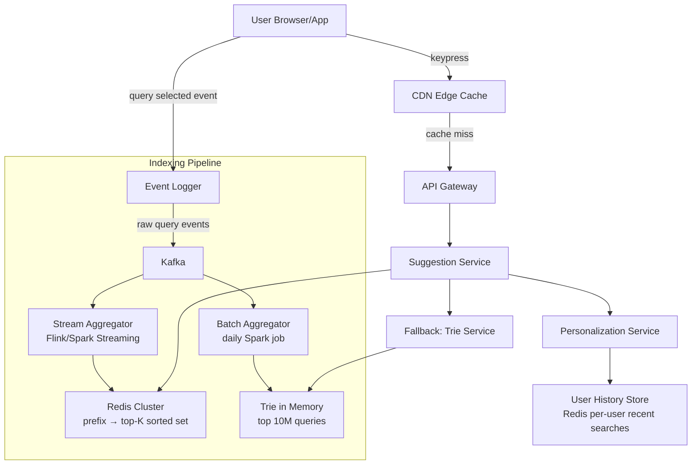

# System Design Interview: Typeahead Search System

> **Interview signal this question tests:** Low-latency read-heavy system design, trie data structure trade-offs, caching strategy, and the nuance of serving personalized results at global scale.

---

## How to Approach This Question `[Mid]`

Typeahead looks deceptively simple — "just complete the user's query." The real challenge is doing it in under 100ms for hundreds of millions of users while returning relevant, personalized results. Walk through this framework:

1. **Clarify requirements** — who sees what suggestions, how fast, how personalized
2. **Estimate scale** — DAU, keystrokes per second, data volume for top queries
3. **Define the API** — what goes in, what comes out
4. **High-level design** — separate the suggestion serving path from the indexing path
5. **Deep dive** — trie vs sorted sets, personalization layer, caching hierarchy
6. **Trade-offs** — freshness vs latency, personalization vs privacy

---

## Step 1: Clarify Requirements `[Mid]`

**Ask the interviewer:**
- "Are we designing for web search (Google-style) or in-app search (e-commerce, Spotify)?"
- "How many suggestions per query — 5? 10?"
- "Do suggestions need to be personalized per user or global for everyone?"
- "What's our latency target? Sub-100ms end-to-end?"
- "How fresh do suggestions need to be — real-time trending or updated hourly/daily?"
- "Do we need to support multiple languages or Unicode?"

**For this problem, assume:**
- Google-scale: 500M DAU, ~5 keystrokes per search = 2.5B suggestion requests/day
- Top 10 suggestions per prefix
- Globally popular suggestions + light personalization (recent searches)
- Latency target: p99 < 100ms from keypress to suggestions displayed
- Freshness: trending topics within 1 hour; general corpus updated daily

---

## Step 2: Back-of-Envelope Estimation `[Mid]`

```
Users:             500M DAU
Searches/day:      500M DAU × 5 searches = 2.5B searches/day
Keystrokes/day:    2.5B searches × 4 avg chars typed before select = 10B requests/day
Requests/sec:      10B / 86,400 = ~115,000 req/sec steady state
Peak (3x):         ~350,000 req/sec

Query corpus:      Top 10M unique queries account for 90% of traffic
Trie size:         10M queries × avg 30 chars × 2 bytes = ~600MB uncompressed
Compressed trie:   ~150MB — fits in memory per node

Storage for logs:  10B queries/day × 100 bytes = 1TB/day raw log
Top-K storage:     Top 10M queries × 50 bytes = 500MB

Cache hit rate:    80%+ for top prefixes (power law distribution)
```

> 💡 **What this means in practice:** At 350k req/sec, a single Redis node handles ~100k ops/sec. You need at minimum 4 nodes, but more importantly you need a caching layer in front to absorb the long tail of repeated common prefixes.

---

## Step 3: Define the API `[Senior]`

```
# Suggestion serving
GET /v1/suggestions?q=<prefix>&limit=10&locale=en-US&uid=<user_id_hash>

Response:
{
  "suggestions": [
    { "text": "system design interview", "type": "query", "score": 9823 },
    { "text": "system design primer", "type": "query", "score": 8710 },
    { "text": "system design course", "type": "query", "score": 7540 }
  ],
  "personalized": [
    { "text": "system design netflix", "type": "recent", "source": "history" }
  ],
  "latency_ms": 12
}

# Query event ingestion (async, fire-and-forget from client)
POST /v1/events/query-selected
{
  "prefix": "system des",
  "selected": "system design interview",
  "session_id": "abc123",
  "timestamp": 1710000000
}
```

---

## Step 4: High-Level Architecture `[Senior]`



The CDN edge layer caches suggestions for the most common prefixes — "how to", "what is", "amazon" — which can represent 40%+ of all traffic. Behind that, the Suggestion Service checks Redis sorted sets for fast O(log N) lookups. Personalization is a fast overlay that re-ranks or inserts the user's recent searches. The Trie Service is a fallback for rare prefixes not yet in Redis.

---

## Step 5: Deep Dives `[Senior]` → `[Staff+]`

### Deep Dive 1: Trie vs Redis Sorted Sets for Prefix Matching

**Option A: Trie data structure**

A trie stores characters as nodes. Each terminal node holds the top-K suggestions for that prefix path. This gives O(L) lookup where L is prefix length.

```
# Trie node structure
TrieNode {
  children: Map<char, TrieNode>
  top_k: List<(query_string, score)>  # precomputed at this prefix
  is_terminal: bool
}

# Lookup pseudocode
function get_suggestions(trie_root, prefix, k=10):
  node = trie_root
  for char in prefix:
    if char not in node.children:
      return []  # no suggestions
    node = node.children[char]
  return node.top_k[:k]  # O(1) once you navigate to node

# Update is expensive — must update all ancestor nodes
function update_score(trie_root, query, new_score):
  node = trie_root
  for i, char in enumerate(query):
    node = node.children[char]
    # re-sort top_k at every ancestor — O(K) per node, O(L*K) total
    update_top_k(node.top_k, query, new_score)
```

**Trie pros:** Very fast reads, naturally supports prefix semantics, compact for dense vocabularies.

**Trie cons:** Updates are O(L×K) — expensive when scores change frequently. Hard to shard across machines (prefix must route to same node). Requires full recomputation for score changes.

**Option B: Redis Sorted Sets (production winner)**

```
# Redis key: "suggest:<prefix>" → sorted set of (query, score)
# Example: "suggest:sys" → {("system design", 9823), ("syscall linux", 340), ...}

# Serving
function get_suggestions_redis(prefix, k=10):
  key = f"suggest:{prefix}"
  # ZREVRANGEBYSCORE returns top K by score
  return redis.ZREVRANGEBYSCORE(key, "+inf", "-inf", limit=k)

# Ingestion (stream aggregator writes this)
function update_prefix_scores(query, delta_score):
  # Update every prefix of the query
  for i in range(1, len(query)+1):
    prefix = query[:i]
    key = f"suggest:{prefix}"
    redis.ZINCRBY(key, delta_score, query)
    # Trim to top 100 to bound memory
    redis.ZREMRANGEBYRANK(key, 0, -101)  # keep top 100

# Memory estimate:
# 10M unique prefixes × 100 entries × 50 bytes = 50GB
# Shard across 10 Redis nodes = 5GB per node — manageable
```

> 💡 **What this means in practice:** Redis sorted sets let you atomically update scores across many prefixes with ZINCRBY. The real trick is trimming each sorted set to top-100 entries on every write — this bounds memory and keeps reads fast. At Google scale you'd shard by prefix hash: all "sys*" prefixes go to shard 3.

### Deep Dive 2: Caching Hierarchy for Sub-100ms Latency

```
Latency budget:
  Network round-trip (client → CDN):   5ms
  CDN cache hit:                        1ms
  CDN → API Gateway:                   10ms
  API Gateway → Suggestion Service:     2ms
  Redis lookup:                         2ms
  Personalization merge:                3ms
  Response serialization + network:     5ms
  ─────────────────────────────────────────
  Total (cache hit path):              ~28ms ✅

Cache strategy:
  L1: CDN edge (Cloudflare/Fastly)
      - Cache key: prefix + locale (NOT user ID — shared cache)
      - TTL: 5 minutes for top prefixes, 1 minute for trending
      - Coverage: top 50K prefixes handle ~70% of traffic
      - Cache-Control: public, max-age=300, s-maxage=300

  L2: In-process cache in Suggestion Service (Caffeine/Guava)
      - LRU, max 100K entries, TTL 30 seconds
      - Prevents thundering herd on CDN misses

  L3: Redis Cluster
      - Source of truth for prefix suggestions
      - Sub-2ms p99 with proper connection pooling

  L4: Trie fallback (rare prefixes)
      - Load balanced trie servers with full corpus in RAM
      - Handles < 5% of requests
```

### Deep Dive 3: Personalization Without Killing Cache Hit Rate

The critical insight: if you include user ID in the cache key, you lose all CDN caching. Instead, use a **two-phase approach**:

```
function get_personalized_suggestions(prefix, user_id, k=10):
  # Phase 1: Get global top suggestions (cached at CDN level)
  global_suggestions = get_global_suggestions(prefix, k=20)  # over-fetch

  # Phase 2: Get user's recent searches for this prefix (not cached)
  recent = user_history_store.get_prefix_matches(user_id, prefix, k=5)
  # user_history_store is Redis hash: user:{uid}:history → sorted set by timestamp

  # Phase 3: Merge and re-rank
  merged = merge_and_deduplicate(global_suggestions, recent)

  # Boost recent searches to top
  for item in recent:
    if item in merged:
      merged[item].score += RECENCY_BOOST  # additive boost

  return sorted(merged, key=score, reverse=True)[:k]

# User history storage
function record_search(user_id, query):
  key = f"user:{user_id}:history"
  redis.ZADD(key, timestamp_now(), query)
  redis.ZREMRANGEBYRANK(key, 0, -51)  # keep last 50 searches
  redis.EXPIRE(key, 30 * 86400)       # 30 day TTL
```

> 💡 **What this means in practice:** The CDN caches the global component (same for everyone). The personalization is a fast local merge on the suggestion server — it takes <1ms extra and doesn't invalidate the cache. This gives you 70%+ CDN hit rate while still personalizing.

### Deep Dive 4: Keeping Suggestions Fresh (Trending Queries)

```
# Stream processing pipeline for trending queries
# Flink job running every 30 seconds

function aggregate_trending(window_30s):
  query_counts = {}
  for event in window_30s.query_selected_events:
    query_counts[event.selected] += 1

  for query, count in query_counts.items():
    # Write to Redis with time-decayed score
    # Exponential moving average: new_score = 0.8 * old_score + 0.2 * window_count
    redis_pipeline:
      old_score = ZSCORE("trending_queries", query) or 0
      new_score = 0.8 * old_score + 0.2 * count * FRESHNESS_MULTIPLIER
      ZADD("trending_queries", new_score, query)

    # Update prefix sorted sets for affected query
    update_prefix_scores(query, new_score)

# CDN cache invalidation for trending
# Instead of invalidating (expensive), use short TTL on trending prefixes
# Detect trending: if score increased >3x in 10 min → set TTL=60s for that prefix
```

---

## Step 6: Trade-offs and Alternatives `[Staff+]`

| Decision | Choice Made | Why | Alternative | When to Use Alternative |
|---|---|---|---|---|
| Storage | Redis sorted sets | Fast updates, atomic ZINCRBY, easy sharding | Trie in memory | When prefix space is small (<1M queries) and updates are rare |
| Personalization | Two-phase (global + local merge) | Preserves CDN caching | User-specific trie per user | Never — doesn't scale |
| Freshness | 5-min CDN TTL + stream aggregation | Balances freshness with cache efficiency | Pub/sub cache invalidation | When you need real-time trending (breaking news) |
| Prefix storage | All prefixes up to 5 chars | Covers 95% of disambiguation | Full query strings as keys | When memory is unlimited |
| Scoring | Time-decayed EMA | Prevents old viral queries from dominating | Pure click-through rate | When recency matters more than long-term popularity |

---

## What Makes a Great Answer `[All Levels]`

**Junior/Mid (gets to offer):** Describes trie structure, mentions Redis caching, gets to suggestion serving. Functional design with correct components.

**Senior (gets the job):** Separates indexing pipeline from serving path. Correctly identifies CDN caching + personalization tension. Knows Redis sorted set API (ZINCRBY, ZREVRANGEBYSCORE). Discusses freshness vs latency trade-off.

**Staff+ (gets the level):** Sizes the Redis memory footprint (50GB sharded → 5GB/node). Quantifies CDN hit rate impact of cache key design. Proposes exponential moving average for scoring. Discusses Unicode and locale handling (separate tries per locale). Identifies what breaks at 10x: Redis becomes the bottleneck, need consistent hashing + replication. Mentions privacy implications of personalization (GDPR: user can request deletion of history).

---

## Common Mistakes to Avoid

- ❌ Using a single global trie — it's a single point of failure and doesn't shard
- ❌ Including user_id in the CDN cache key — destroys cache hit rate
- ❌ Not discussing the indexing pipeline — where do suggestions come from?
- ❌ Forgetting about Unicode/multibyte characters — breaks naive char-by-char trie
- ❌ Ignoring the "what happens at first character" problem — "a" prefix has billions of queries, need special handling with pre-filtered top-K

---

## Follow-up Questions Interviewers Ask

1. **"How would you handle the 'a' prefix or single character prefixes where there are billions of matching queries?"** — Pre-compute and hard-limit to top 10 globally popular + locale-specific; don't use the general system.
2. **"How do you handle offensive or blacklisted suggestions?"** — Maintain a blocklist, filter at serving time with Redis SET lookup (O(1)), update blocklist without rebuilding index.
3. **"How would you add spell-correction to the suggestions?"** — Use fuzzy matching with edit distance at the trie level or pre-expand common misspellings into the index ("recepie" → "recipe"). Adds latency so only trigger when exact prefix returns 0 results.
4. **"Your Redis cluster is down. How does the system degrade?"** — Fall back to Trie Service (pre-built static trie from yesterday's batch job), serve slightly stale but functional results. Then fall back further to static top-50 global queries if trie is also down.

---
*Part of the System Design Interview Prep series*
*Last updated: 2026-03-18*
