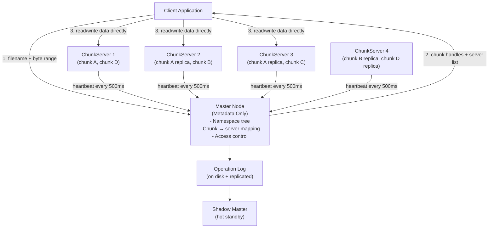

# Design a Distributed File System (GFS/HDFS)

**Interview Question**: *"Design a distributed file system like Google File System (GFS) or HDFS"*

**Difficulty**: 🔴 Advanced
**Asked by**: Google, Meta, Amazon, Microsoft, Netflix
**Time to Answer**: 10-15 minutes

---

## 🎯 Quick Answer (30 seconds)

A distributed file system splits large files into fixed-size chunks (64MB), stores each chunk on multiple servers for fault tolerance, and maintains a central metadata server that maps file paths to chunk locations. Clients talk to the metadata server to find chunk locations, then stream data directly to/from chunk servers to avoid a bottleneck.

**Key Components**:
1. **Master/NameNode** — stores namespace tree (file → chunk mappings), never actual data
2. **ChunkServers/DataNodes** — store the actual 64MB chunks, replicated 3×
3. **Client Library** — talks to master for metadata, then directly to chunkservers for data

---

## 📚 Detailed Explanation

### Problem Breakdown

Building a distributed file system is hard because you need to handle all of these simultaneously:

- **Scale**: Petabytes of data across thousands of machines
- **Fault tolerance**: Commodity hardware fails frequently (disk failures, network partitions, whole rack outages)
- **Throughput over latency**: Batch workloads (MapReduce, ML training) care more about sustained MB/s than millisecond response times
- **Large files**: Files range from GB to TB; the system is optimized for sequential reads, not random access
- **Concurrent writes**: Multiple clients appending to the same log file (think: web crawl output)

Google GFS was designed to handle 300,000+ files with petabytes of total storage running on tens of thousands of commodity Linux machines. The key insight: hardware failure is the norm, not the exception.

### High-Level Architecture



The master never moves data. It only serves metadata. This separation allows massive throughput because data flows directly between clients and chunkservers.

### Deep Dive: Chunk Design

A chunk is the fundamental storage unit. Google GFS chose 64MB chunks deliberately:

```
File: "web-crawl-2024.log" (500 GB)
  |
  ├── Chunk 0  [bytes 0         – 67,108,864]   handle: abc123
  ├── Chunk 1  [bytes 67,108,864 – 134,217,728]  handle: abc124
  ├── Chunk 2  [bytes 134,217,728 – 201,326,592] handle: abc125
  └── ... (7,812 chunks total)

Each chunk handle (abc123) maps to:
  Primary:   ChunkServer-07  (rack A)
  Replica 1: ChunkServer-23  (rack B)   <- different rack!
  Replica 2: ChunkServer-41  (rack C)   <- different rack!
```

**Why 64MB?**
- Reduces metadata size: 1 TB file = 16,384 chunks vs. 1 billion 1KB blocks
- Reduces client-master communication: fewer metadata lookups for sequential reads
- Enables persistent TCP connections: client keeps connection open for entire chunk write

**Why 3 replicas?**
- Tolerate 2 simultaneous failures
- Allows 1 replica for read while 2 others are being written
- Cross-rack placement: losing an entire rack doesn't lose data

### Deep Dive: Master Node (Metadata)

The master maintains three tables in memory (fast lookups):

```
// In-memory data structures on Master

// 1. Namespace: file path → array of chunk handles
namespace = {
  "/data/logs/web-crawl-2024.log": [
    { handle: "abc123", version: 5 },
    { handle: "abc124", version: 5 },
    { handle: "abc125", version: 4 },
    // ...
  ]
}

// 2. Chunk location map: chunk handle → list of chunkservers
// NOTE: This is NOT persisted to disk — rebuilt from chunkserver heartbeats on startup
chunkLocations = {
  "abc123": ["CS-07", "CS-23", "CS-41"],
  "abc124": ["CS-12", "CS-31", "CS-44"],
}

// 3. Chunk metadata: handle → {size, checksum, version, lease_holder}
chunkMeta = {
  "abc123": {
    size: 67108864,
    checksum: "sha256:...",
    version: 5,
    leaseHolder: "CS-07",
    leaseExpiry: 1700000060
  }
}
```

**Operation Log** (durability): Every metadata mutation (file create, chunk allocation, rename) is appended to an operation log before responding to the client. The log is replicated to shadow master machines.

**Checkpointing**: Periodically, the master serializes its entire in-memory state into a checkpoint file. On restart, it replays only the operations logged after the last checkpoint.

```
// Checkpoint + Log replay on restart
function masterRestart():
  state = loadCheckpoint("checkpoint-2024-01-15.bin")
  ops = readOperationLog("ops-after-2024-01-15.log")
  for op in ops:
    applyOperation(state, op)

  // Rebuild chunk locations by waiting for heartbeats
  waitForChunkServerHeartbeats(timeout: 30s)
  return state
```

### Deep Dive: Read Path

Reading is simple and fast — the client caches chunk locations locally:

```
// Client Read Pseudocode
function readFile(filename, offset, length):

  // Step 1: Calculate which chunks we need
  chunkIndex = floor(offset / CHUNK_SIZE)  // e.g., 64MB
  chunkOffset = offset % CHUNK_SIZE

  // Step 2: Ask master for chunk handle + locations
  // Client caches this response for ~60 seconds
  if not cached(filename, chunkIndex):
    response = master.getChunkLocations(filename, chunkIndex)
    cache.store(filename, chunkIndex, response, ttl=60s)

  chunkHandle, servers = cache.get(filename, chunkIndex)

  // Step 3: Pick closest chunkserver (prefer same rack)
  server = pickClosest(servers)  // network topology aware

  // Step 4: Read directly from chunkserver
  data = server.readChunk(chunkHandle, chunkOffset, length)

  // Step 5: Verify checksum
  if not verifyChecksum(data, chunkHandle):
    // Retry from different replica
    server = pickNext(servers)
    data = server.readChunk(chunkHandle, chunkOffset, length)

  return data
```

The master is only contacted once per chunk (not per byte), and the location is cached. For a sequential read of a 1GB file (16 chunks), the client only talks to the master 16 times.

### Deep Dive: Write Path (Pipeline Replication)

Writes use a clever pipeline to maximize network utilization:

```
// Client Write Pseudocode
function writeFile(filename, offset, data):
  chunkIndex = floor(offset / CHUNK_SIZE)

  // Step 1: Get chunk lease from master
  // Master grants a 60-second "primary" lease to one chunkserver
  primary, secondaries = master.getOrCreateChunk(filename, chunkIndex)

  // Step 2: Push data to ALL replicas (pipelined, not broadcast)
  // Client → CS-07 → CS-23 → CS-41 (chain, not star)
  // This uses full network bandwidth of each machine
  pushData(data, chain=[primary, ...secondaries])

  // Step 3: Send WRITE command to primary
  // Primary serializes concurrent writes (assigns serial numbers)
  ack = primary.applyWrite(chunkHandle, offset, dataChecksum)

  // Step 4: Primary forwards WRITE to secondaries (in serial order)
  // Secondaries apply in same order to maintain consistency

  // Step 5: All secondaries ACK primary → primary ACKs client
  if ack == SUCCESS:
    return success
  else:
    // Retry or handle partial failure

// ChunkServer: pipelined data push
function receiveAndForward(data, nextServer):
  // Start forwarding to next server immediately
  // while still receiving remaining bytes
  forwardAsync(data, nextServer)
  storeLocally(data)
  return ack
```

**Why pipeline instead of broadcast?**
- Each machine's network card gets fully utilized (bidirectional)
- Total transfer time: `N * chunk_size / bandwidth` vs. `N * chunk_size / bandwidth` for star
- Actually: pipeline time ≈ `chunk_size / bandwidth + (N-1) * latency` which is nearly the same as sending to one server

### Fault Tolerance: Heartbeat Mechanism

ChunkServers send heartbeats to the master every 500ms:

```
// Master: process incoming heartbeat
function onHeartbeat(chunkServerId, chunkList):
  lastSeen[chunkServerId] = now()

  for chunk in chunkList:
    // Detect stale chunks (version mismatch after master restart)
    if chunk.version < master.getVersion(chunk.handle):
      scheduleDelete(chunkServerId, chunk.handle)

    // Update location map
    chunkLocations[chunk.handle].add(chunkServerId)

// Master: background re-replication monitor
function replicationMonitor():
  every 30 seconds:
    for chunkServerId where now() - lastSeen[chunkServerId] > 60s:
      markDead(chunkServerId)
      for chunk in chunksOn(chunkServerId):
        if replicationFactor(chunk) < 3:
          scheduleReplicate(chunk)  // copy from healthy replica → new server

// Prioritize re-replication by urgency
function scheduleReplicate(chunk):
  factor = replicationFactor(chunk)
  if factor == 1:
    priority = URGENT    // one more failure = data loss
  elif factor == 2:
    priority = HIGH
  else:
    priority = NORMAL
  replicationQueue.add(chunk, priority)
```

### HDFS vs GFS: Key Differences

| Aspect | GFS | HDFS |
|--------|-----|------|
| Workload | General web-scale storage | Hadoop MapReduce |
| Default chunk size | 64MB | 128MB |
| Metadata server | Master node | NameNode |
| Data server | ChunkServer | DataNode |
| Replication | 3× (cross-rack) | 3× (rack-aware) |
| Federation | Shadow master (manual) | HDFS Federation (multiple NNs) |
| SPOF mitigation | Shadow master + op log | HA NameNode with ZooKeeper |
| Consistency | Relaxed for appends | Strict per-block |

HDFS was inspired by the GFS paper (2003) and became the storage layer for Apache Hadoop. HDFS NameNode HA uses ZooKeeper for automatic failover, while GFS historically used manual promotion of the shadow master.

---

## ⚖️ Trade-offs

| Approach | Pros | Cons | When to Use |
|----------|------|------|-------------|
| Large chunks (64MB) | Less metadata, fewer master RPCs | Wasted space for small files, hot spots | Batch workloads, large sequential files |
| Small chunks (4KB) | Better space utilization, no hot spots | Massive metadata overhead, more RPCs | Random access workloads (not GFS use case) |
| Strong consistency (all replicas) | No stale reads | Higher write latency, availability hit | Financial data, critical records |
| Relaxed consistency (atomic append) | High throughput concurrent writes | May get duplicates/padding in file | Log aggregation, append-only workloads |
| In-memory metadata | Fast lookups (no disk I/O) | Master RAM limits total file count | Up to ~1B files (GFS limit) |
| Single master | Simpler design, no split-brain | SPOF, limited to ~1000 clients | Early-stage, or with shadow master HA |

---

## 🏢 Real-World Examples

**Google GFS (2003)**:
- Handled petabytes across 1,000+ commodity Linux servers
- 300,000+ files, 64MB chunks
- Used for web crawl storage, BigTable storage layer, search index building
- Production clusters ran for years with daily server failures handled automatically

**HDFS at Yahoo! (2008)**:
- 4,500-node cluster, 5.5 petabytes
- Supported 50,000+ MapReduce jobs per day
- NameNode in-memory limit was a scaling bottleneck (solved later by HDFS Federation)

**Facebook's Haystack (Inspired by GFS)**:
- Optimized for billions of small image files (profile photos, posts)
- Solved GFS's "small file problem" by packing millions of images into large logical volumes
- Reduced metadata overhead by 10× compared to storing each image as a separate file

**Netflix (S3 + HDFS hybrid)**:
- Stores raw video on Amazon S3 (object storage, not POSIX file system)
- Uses HDFS for Spark/Flink processing jobs on viewing data
- Netflix encoding farm processes 100+ GB of video per title × thousands of titles

---

## ⚠️ Common Pitfalls

1. **Small file problem**: GFS/HDFS is terrible for millions of tiny files (1KB images). Each file needs a namespace entry; a billion files exhausts the master's RAM. Solution: pack small files into larger archives (like Facebook Haystack, or HBase on HDFS).

2. **Hot chunkserver**: Popular chunks (e.g., the first chunk of a viral video) create hotspots on specific servers. Mitigation: increase replication factor for hot chunks, use CDN for read-heavy content, randomize replica selection.

3. **Master bottleneck**: All metadata operations go through one master. At ~1,000 clients doing rapid metadata operations (file creates, directory listings), the master CPU becomes the bottleneck. Fix: HDFS Federation (multiple NameNodes per namespace partition), or object stores (no directory hierarchy).

4. **Naive write = data loss**: If a client writes without flushing the operation log to disk first, a master crash loses the last few operations. Always persist to operation log before acknowledging client.

5. **Stale reads after chunkserver failure**: If a chunkserver was dead for 10 minutes and comes back, its chunks may be stale (missed writes). The master tracks chunk versions; stale chunks are garbage-collected, not served.

6. **Network partition during writes**: If the primary chunkserver can reach secondaries but not the client, the client thinks the write failed but the data was written. Client retries cause duplicates. GFS handles this at the application layer (idempotent operations or record IDs).

---

## ✅ Key Takeaways

- Separate metadata (master) from data (chunkservers) — the master never touches actual file bytes, enabling massive throughput
- 64MB chunk size reduces metadata overhead and enables sequential I/O optimization
- 3-way replication across different racks provides fault tolerance against disk, machine, and rack failures
- Pipeline replication (chain, not star) fully utilizes each machine's network bandwidth
- Heartbeats drive automatic re-replication — the master detects dead servers and re-replicates under-replicated chunks
- The master's in-memory metadata + persistent operation log + periodic checkpoints enables fast restart with durability
- GFS relaxes consistency for concurrent appends (atomic append) to achieve higher throughput on log-style workloads
- HDFS solved the NameNode SPOF with ZooKeeper-based HA; GFS relied on shadow masters with manual failover
