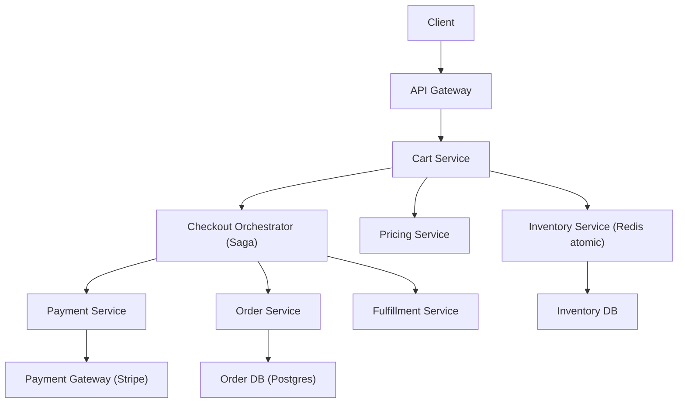
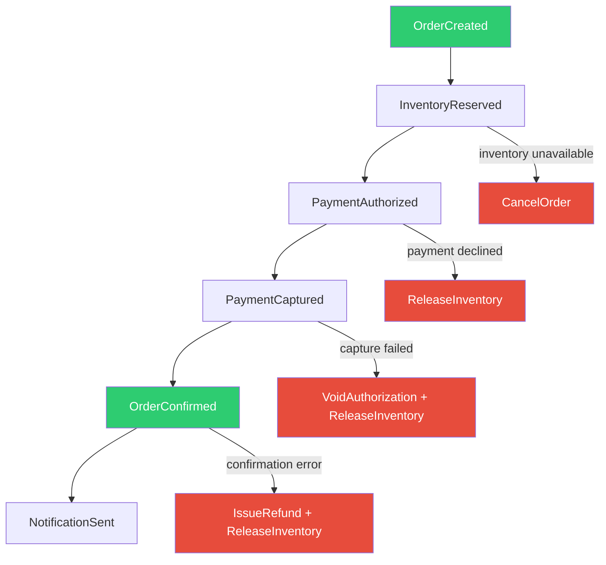
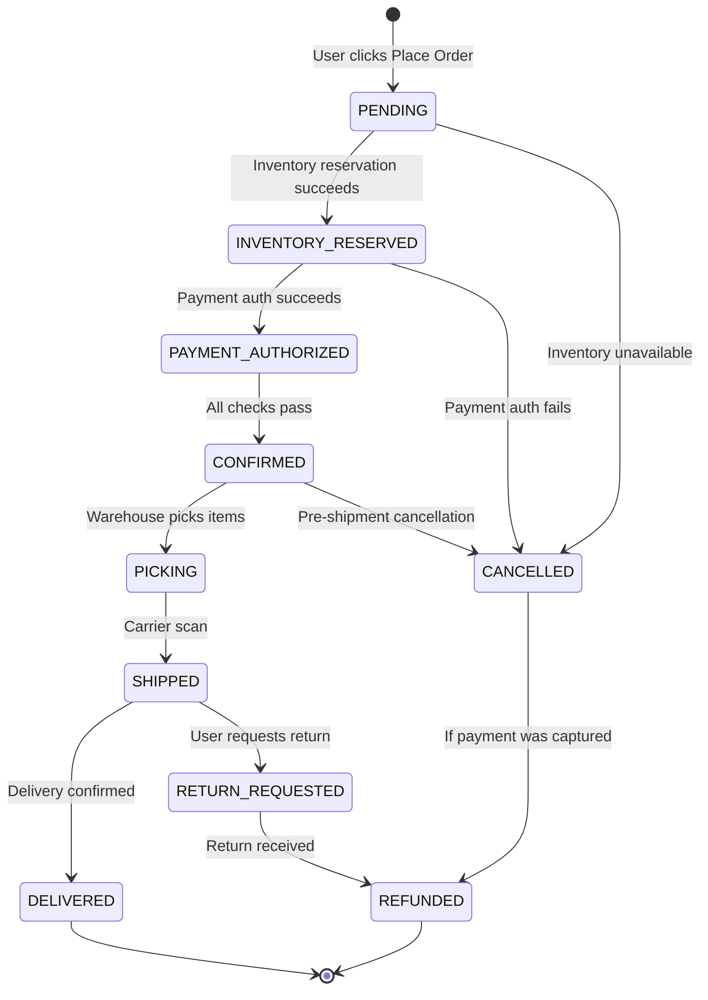
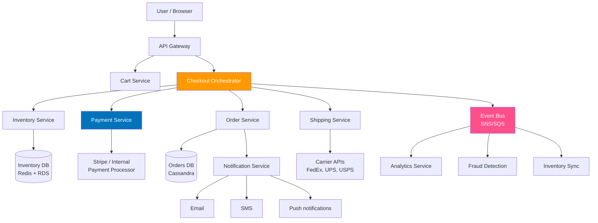

# E-Commerce Checkout System Design

**Interview Question**: *"Design Amazon's checkout flow. Handle millions of concurrent users, ensure no double charges, never oversell inventory, and keep the checkout fast."*

**Difficulty**: 🔴 Advanced
**Asked by**: Amazon, Shopify, eBay, Walmart, Stripe, Square
**Time to Answer**: 15-20 minutes

## 🗺️ Quick Overview



*A saga orchestrator coordinates inventory reservation, payment, and order creation as atomic steps with compensating transactions to roll back on any failure, preventing double charges and overselling.*

---

## The Triple Constraint

Checkout is one of the hardest distributed systems problems because you must simultaneously satisfy three constraints that naturally conflict:

```
┌─────────────────────────────────────────────────┐
│                                                  │
│   Inventory Correctness    Payment Correctness   │
│         (never oversell)   (no double charges)   │
│              ↘                    ↙              │
│                  CHECKOUT SYSTEM                  │
│                        ↑                         │
│               Checkout Speed                     │
│             (sub-2-second UX)                    │
│                                                  │
└─────────────────────────────────────────────────┘
```

- **Fast checkout** pushes toward optimistic operations and async processing
- **No oversell** pushes toward locks and serialized writes
- **No double charge** pushes toward synchronous payment confirmation

Each pair of constraints can be satisfied easily. Satisfying all three simultaneously at Amazon scale — **300,000 orders per minute on Prime Day 2023** — requires careful architecture.

---

## High-Level Flow

Before diving into complexity, understand the user-visible flow:

```
1. User is on product page → clicks "Buy Now" or "Add to Cart"
2. Cart → user clicks "Proceed to Checkout"
3. Checkout initiation → confirm address + shipping
4. Payment entry → credit card, PayPal, etc.
5. Place order → confirm + charge
6. Order confirmation → email + order ID
```

Each of these steps maps to distinct backend operations with different consistency requirements.

---

## Step 1: Inventory Reservation (Not Deduction)

The critical insight: **reserve stock when checkout begins, not when order is placed**.

If you only deduct inventory when payment succeeds, then during the time between "checkout started" and "payment confirmed," the same item could be reserved by 10 concurrent users — and you'd have to deny 9 of them at payment time, resulting in a terrible user experience.

### Reservation Pattern

```
CHECKOUT INITIATION:
  1. User clicks "Proceed to Checkout" for Product #123, qty 1
  2. Atomically reserve 1 unit:
     Redis: DECRBY inventory:product:123 1
     → Returns new value (e.g., 14)
     → If returned value is -1 or negative: INCRBY inventory:product:123 1  (rollback)
       → Return "Out of Stock" to user
  3. Create reservation record:
     reservations table: (reservation_id, product_id, qty, user_id, expires_at = now + 15min)
  4. Start checkout timer: if checkout not completed in 15 min, release reservation

RESERVATION RELEASE (three triggers):
  A. Order confirmed → convert reservation to deduction
  B. User abandons checkout → release via TTL expiry
  C. Payment fails → explicit release
```

### Redis Atomic Inventory

```
# Pseudocode for atomic inventory check-and-reserve
function reserveInventory(productId, quantity, userId):
    key = "inventory:" + productId

    # Lua script runs atomically in Redis (no race conditions)
    script = """
        local current = tonumber(redis.call('GET', KEYS[1]))
        if current == nil then
            return -1  -- product not found
        end
        if current < tonumber(ARGV[1]) then
            return -2  -- insufficient stock
        end
        local newVal = redis.call('DECRBY', KEYS[1], ARGV[1])
        return newVal
    """

    result = redis.eval(script, keys=[key], args=[quantity])

    if result == -1:
        raise ProductNotFoundException()
    if result == -2:
        raise InsufficientStockException()

    # Create reservation record in database
    reservationId = db.insert(
        "INSERT INTO reservations (product_id, qty, user_id, expires_at) VALUES (?, ?, ?, ?)",
        productId, quantity, userId, now() + 15 * MINUTES
    )

    return reservationId

# Background job: release expired reservations
function releaseExpiredReservations():
    expiredReservations = db.query(
        "SELECT * FROM reservations WHERE expires_at < NOW() AND status = 'PENDING'"
    )
    for reservation in expiredReservations:
        redis.incrby("inventory:" + reservation.product_id, reservation.qty)
        db.update("UPDATE reservations SET status = 'EXPIRED' WHERE id = ?", reservation.id)
```

**Why Redis for inventory?** A SQL `UPDATE inventory SET stock = stock - 1 WHERE stock > 0` with row-level locking works, but under high concurrent load (flash sale: 100k users hitting the same product), the lock contention serializes requests and throughput collapses. Redis's single-threaded command execution gives atomicity without locking.

---

## Step 2: Idempotency for Payments

The most common checkout failure mode: **user clicks "Place Order," browser shows a spinner, connection times out, user clicks again → double charge**.

### Idempotency Key Pattern

```
BEFORE showing "Place Order" button to user:
  1. Generate idempotency key (client-side or server-side at checkout init)
  2. Store with checkout session

idempotency_key = SHA256(
    user_id + ":" +
    cart_id + ":" +
    floor(timestamp / 60)  # round to nearest minute (prevents key expiry during slow checkout)
)

PAYMENT REQUEST:
  POST /charge
  Headers:
    Idempotency-Key: a3f8b2c9d1e4...
  Body:
    { amount: 4999, currency: "USD", payment_method: "pm_xyz" }

PAYMENT PROCESSOR (Stripe behavior):
  - First request: process charge, store response keyed by idempotency key
  - Duplicate request with same key: return stored response, DON'T charge again
  - Same idempotency key = same response, guaranteed
```

### Server-Side Idempotency Store

```
function processPayment(idempotencyKey, amount, paymentMethodId):
    # Check if we've seen this idempotency key before
    cached = redis.get("idempotency:" + idempotencyKey)
    if cached:
        return deserialize(cached)  # return previous result, don't charge again

    # Process the payment
    result = stripe.charge(amount=amount, payment_method=paymentMethodId)

    # Store result with expiry (24 hours)
    redis.setex(
        "idempotency:" + idempotencyKey,
        86400,  # 24 hours TTL
        serialize(result)
    )

    return result
```

The idempotency key must be generated **before** the first attempt and reused on every retry. Never generate a new key on retry — that defeats the purpose.

---

## Step 3: Saga Pattern for Checkout

Checkout spans multiple services (inventory, payment, order management, notifications). A traditional 2PC (two-phase commit) across these services would:
- Require all services to support 2PC protocol
- Hold locks across services for the entire transaction duration
- Create a single point of failure (the coordinator)

Instead, use the **Saga pattern**: a sequence of local transactions, each with a compensating transaction that undoes its work if a later step fails.

### Checkout Saga



### Choreography vs Orchestration

**Choreography** (event-driven): each service listens for events and reacts independently.
```
OrderService publishes OrderCreated →
  InventoryService listens, reserves stock, publishes InventoryReserved →
    PaymentService listens, authorizes payment, publishes PaymentAuthorized →
      OrderService listens, confirms order, publishes OrderConfirmed
```
- Pro: loose coupling, each service independently deployable
- Con: hard to visualize the overall flow, distributed debugging nightmare

**Orchestration** (central coordinator): a checkout orchestrator service directs each step.
```
CheckoutOrchestrator:
  1. Call InventoryService.reserve()
  2. If success: call PaymentService.authorize()
  3. If success: call PaymentService.capture()
  4. If success: call OrderService.confirm()
  5. On any failure: run compensating transactions in reverse order
```
- Pro: clear flow, easy to monitor and debug
- Con: orchestrator becomes a central coupling point

**Amazon uses orchestration** for checkout — a checkout service coordinates the flow explicitly, making it easier to implement timeouts and retries at each step.

---

## Step 4: Inventory Locking Strategies

Different scenarios call for different locking strategies.

### Pessimistic Locking

```sql
-- Hold a row-level lock for the duration of the transaction
BEGIN TRANSACTION;

SELECT * FROM inventory
WHERE product_id = 123
FOR UPDATE;  -- acquires exclusive lock

-- Check stock
-- Deduct stock
UPDATE inventory SET stock = stock - 1 WHERE product_id = 123;

COMMIT;  -- releases lock
```

- Good for: low-concurrency, high-conflict scenarios (rare products)
- Bad for: high-concurrency (1000 users hitting the same row causes lock queuing)
- At Amazon scale: **never** use pessimistic locking on inventory

### Optimistic Locking

```sql
-- Read current version number
SELECT stock, version FROM inventory WHERE product_id = 123;
-- Returns: stock=10, version=42

-- Try to update only if version hasn't changed
UPDATE inventory
SET stock = stock - 1, version = version + 1
WHERE product_id = 123
  AND version = 42;  -- fails if someone else updated first

-- Check rows affected
-- If 0 rows updated: conflict! Retry or return "try again"
-- If 1 row updated: success
```

- Good for: low-to-medium concurrency, where conflicts are rare
- Bad for: flash sales where 10,000 users all hit version=42 simultaneously

### Redis Atomic Operations (Best for High Concurrency)

As shown in Step 1 — Lua scripts on Redis give atomic check-and-decrement with no lock contention. This is the right solution for high-concurrency inventory.

### Decision Matrix

| Scenario | Recommended Approach |
|----------|---------------------|
| Normal browsing (low concurrency) | Optimistic locking in SQL |
| Flash sale (10k+ concurrent for same item) | Redis atomic decrement |
| Inventory with complex business rules | Pessimistic locking (accept lower throughput) |
| Distributed inventory (multiple warehouses) | Saga with per-warehouse locks |

---

## Step 5: Payment Processing Details

### Auth → Capture Two-Phase Pattern

**Never capture payment at order time**. Always use auth + capture:

```
PHASE 1 - AUTHORIZATION (at checkout):
  - Verify card is valid and funds are available
  - Place a hold on funds (typically 7-day expiry)
  - Does NOT transfer money
  - User sees "pending" on card statement

PHASE 2 - CAPTURE (when item ships):
  - Actually move money from customer to merchant
  - Must happen within authorization window
  - Can capture partial amount (if items are out of stock)

WHY TWO PHASES:
  - Auth at checkout → capture at ship = customer only charged for what they actually receive
  - Amazon regularly ships orders partially and charges per-shipment
  - If item never ships, authorization expires and customer isn't charged
```

### PCI-DSS Compliance

**Never store raw card numbers**. Always tokenize:

```
PAYMENT FLOW:
  1. User enters card number on checkout page
  2. JavaScript Stripe SDK sends card directly to Stripe's servers (never touches your servers)
  3. Stripe returns a payment_method token: "pm_1NqFtq2eZvKYlo2C..."
  4. Your checkout code stores and passes this token
  5. Your server charges via token: stripe.charge(payment_method="pm_1NqFtq...")

RESULT:
  - Your servers never see raw card numbers
  - PCI-DSS scope dramatically reduced
  - Card data breach at your layer: no card data to steal
```

---

## Order Status State Machine



**Important state machine rules**:
- States are append-only: never go backward (SHIPPED → CONFIRMED is invalid)
- Every transition is idempotent: receiving the same event twice should not cause a second state change
- Invalid transitions are rejected: PENDING → SHIPPED should throw an error

```
function transitionOrder(orderId, event):
    order = db.getForUpdate(orderId)  # lock the row

    validTransitions = {
        PENDING: [INVENTORY_RESERVED, CANCELLED],
        INVENTORY_RESERVED: [PAYMENT_AUTHORIZED, CANCELLED],
        PAYMENT_AUTHORIZED: [CONFIRMED, CANCELLED],
        ...
    }

    if event.targetState not in validTransitions[order.status]:
        raise InvalidTransitionException(order.status, event.targetState)

    order.status = event.targetState
    order.updated_at = now()
    db.save(order)

    # Publish event for downstream services
    eventBus.publish(OrderStatusChanged(orderId, event.targetState))
```

---

## Microservices Architecture at Amazon Scale



Each service is independently scalable:
- **Cart Service**: high read, low write. Cache-heavy (Redis).
- **Inventory Service**: very high write concurrency (Redis atomic ops). Read replicas for browsing.
- **Payment Service**: external dependency (Stripe). Must handle timeouts gracefully with idempotency.
- **Order Service**: high write throughput. Cassandra for scale.
- **Checkout Orchestrator**: stateless, horizontally scalable. Persists saga state to database.

---

## Real Numbers: Amazon Prime Day 2023

- **375 million items** sold over 48 hours
- Peak: approximately **300,000 orders per minute**
- That's **5,000 orders per second**
- Each order touches: inventory reservation, payment auth, order creation, notifications
- At 5k orders/second, any synchronous blocking operation becomes a bottleneck immediately

**What this means for your design**:
- Synchronous payment calls at 5k/s = payment service must handle 5k concurrent in-flight requests
- Inventory updates at 5k/s = no SQL row locks allowed (Redis atomic ops only)
- Order writes at 5k/s = NoSQL or sharded SQL (Cassandra, DynamoDB)
- Everything must be async-capable for peak load handling

---

## Trade-offs

| Decision | Option A | Option B | Recommendation |
|----------|----------|----------|----------------|
| Inventory deduction timing | At checkout initiation (reservation) | At payment confirmation | Reservation at checkout — better UX |
| Payment transaction | Single phase (auth+capture together) | Two phase (auth now, capture on ship) | Two-phase — more accurate billing |
| Distributed transaction | 2PC (strong consistency) | Saga (eventual consistency) | Saga — 2PC too fragile at microservice scale |
| Inventory concurrency | Pessimistic locking (SQL FOR UPDATE) | Optimistic locking / Redis atomic | Redis atomic for flash sales, optimistic for normal |
| Order processing | Synchronous (user waits) | Async (immediate confirmation, process in background) | Async with messaging queue for scale |
| Idempotency storage | Database | Redis | Redis — faster lookup, idempotency keys short-lived |

---

## Common Pitfalls

**1. No idempotency key on payment**: the single most common cause of double charges. Always generate idempotency key at checkout start; always pass on every payment attempt.

**2. Not releasing inventory on timeout**: if checkout is abandoned, inventory stays reserved forever. Implement TTL-based release with a background cleanup job.

**3. Synchronous payment blocking checkout**: if payment takes 3 seconds and you're handling 5,000 orders/second, you need 15,000 concurrent threads just for payment. Use async with queue.

**4. Using 2PC across microservices**: 2PC requires all participating services to be available and hold locks throughout. One slow service can freeze all checkout flows.

**5. Not handling partial failures in saga**: what happens if InventoryReserved succeeds, PaymentAuthorized succeeds, but OrderConfirmed fails? You need compensating transactions: void auth + release inventory.

**6. Race condition on final inventory deduction**: reservation in Redis, deduction in SQL — if Redis and SQL get out of sync (Redis restart, sync failure), you can oversell. Use Redis as source of truth and sync to SQL asynchronously.

**7. Missing audit trail**: every state transition, every payment attempt, every inventory change should be logged immutably. When a customer disputes a charge, you need to replay the exact sequence of events.

---

## Key Takeaways

- **Reserve inventory at checkout start** (not at payment), with a TTL expiry to release abandoned reservations.
- **Use Redis atomic operations** (Lua scripts + DECRBY) for high-concurrency inventory to avoid SQL lock contention.
- **Idempotency keys** are non-negotiable: generate before first payment attempt, reuse on all retries. This prevents double charges.
- **Auth-then-capture** for payments: hold funds at checkout, capture when you actually ship. This allows partial fulfillment.
- **Saga pattern** (not 2PC) for distributed checkout transactions: each step has a compensating transaction, and failures trigger rollback through compensation.
- **State machine** for order lifecycle: validate all transitions, make transitions idempotent, append-only history.
- At Amazon scale (300k orders/minute), every synchronous blocking operation is a bottleneck — design for async, queues, and horizontal scaling from the start.
