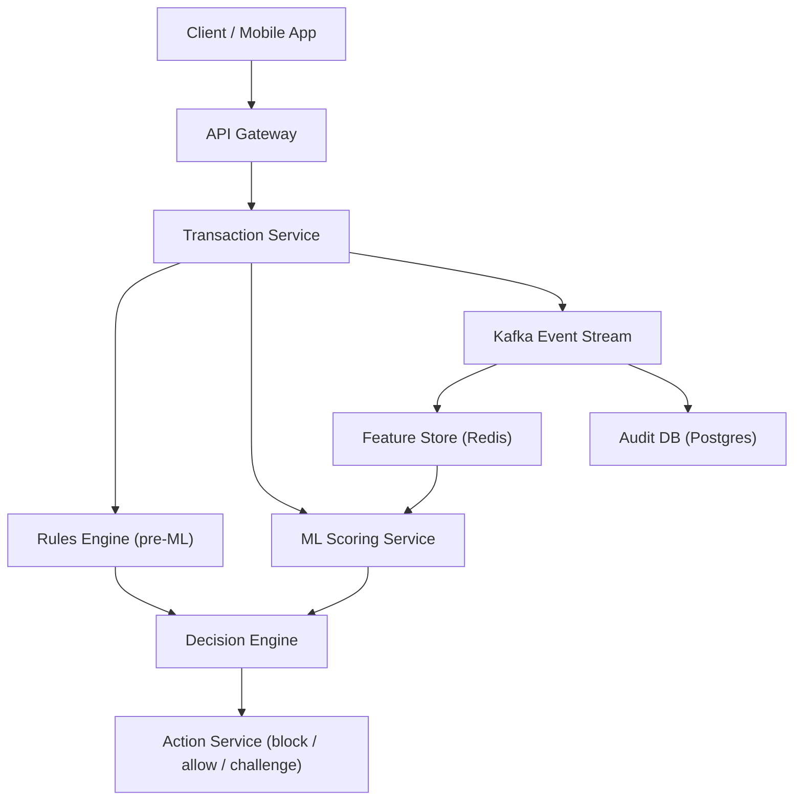
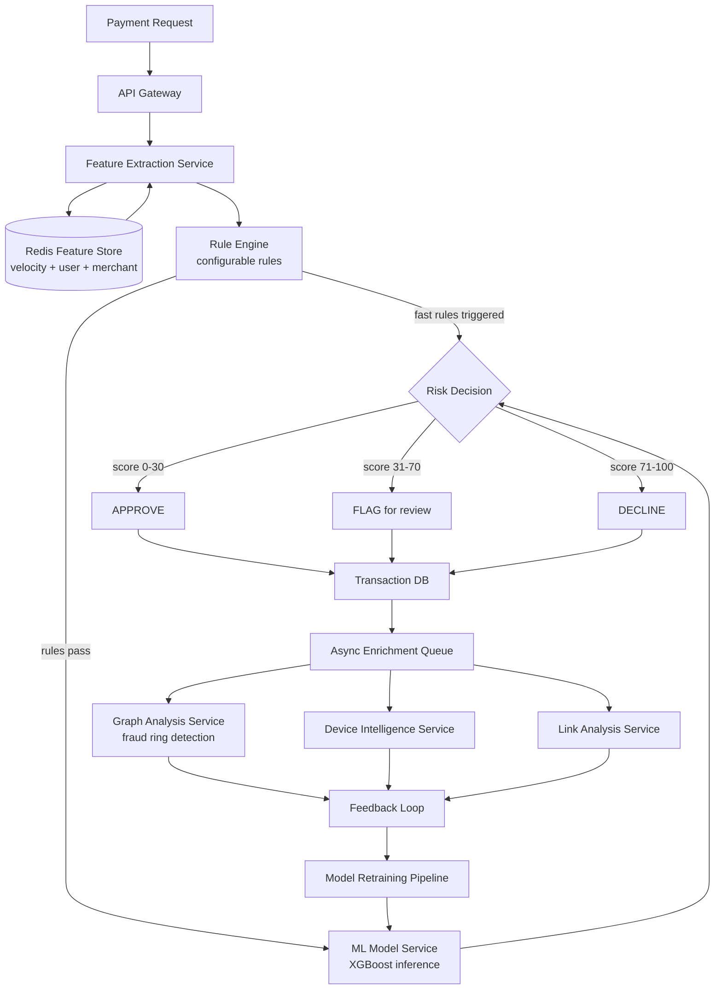
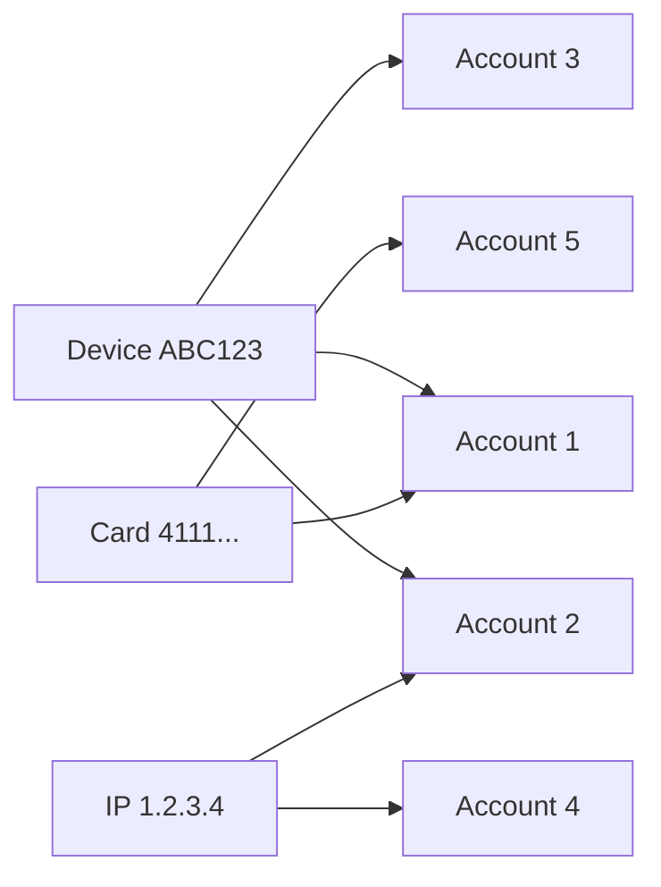

# Fraud Detection System Design

**Interview Question**: *"Design a real-time fraud detection system like Stripe Radar or PayPal's fraud engine"*

**Difficulty**: 🔴 Advanced
**Asked by**: Stripe, PayPal, Visa, Mastercard, Amazon, Uber, Airbnb
**Time to Answer**: 10-15 minutes

---

## 🗺️ Quick Overview



*High-level fraud detection flow: every transaction passes synchronous rules + ML scoring before a decision is emitted, while an async event stream feeds the feature store and audit trail.*

---

## 🎯 Quick Answer (30 seconds)

A fraud detection system intercepts every payment transaction and assigns a risk score in under 50ms by running a fast rule engine followed by an ML model inference step. Low-risk transactions are approved immediately; high-risk ones are declined or sent for manual review. A feedback loop from chargebacks and confirmed fraud continuously retrains the model to adapt to new patterns.

**Key Components**:
1. Real-time scoring pipeline (rule engine + ML model, < 50ms)
2. Feature store (Redis for sub-millisecond feature lookups)
3. Async enrichment (graph analysis, device intelligence, seconds-level deep checks)
4. Feedback loop (chargebacks → labeled training data → model retrain)

---

## 📚 Detailed Explanation

### Problem Breakdown

Fraud detection is a needle-in-a-haystack problem at enormous scale:

- **Scale**: Visa processes 65,000 transactions per second (TPS). Stripe processes $817 billion/year.
- **Latency requirement**: The decision must arrive in < 100ms total, or the customer's card terminal times out.
- **Class imbalance**: Only ~0.1% of transactions are fraudulent. Models trained naively predict "not fraud" for everything and still get 99.9% accuracy — useless.
- **Adversarial**: Fraudsters adapt within hours of detection. The model must keep up.
- **Cost of errors**: False positives (blocking legitimate users) destroy conversion rates and customer trust. False negatives (allowing fraud) cost money.

The two competing goals — high precision (don't block real customers) and high recall (don't miss fraud) — are the central tension you must address in the interview.

### High-Level Architecture



The key insight is the **two-phase design**:

- **Phase 1 — Synchronous (< 50ms)**: Fast rule engine + lightweight ML model. Must return a decision before the payment terminal times out.
- **Phase 2 — Asynchronous (seconds to minutes)**: Deeper analysis that can update the decision for flagged transactions, and feeds back into the model.

### Deep Dive: Feature Engineering at Speed

The ML model is only as good as its features. Features are pre-computed and stored in Redis to achieve sub-millisecond lookups.

**Velocity Features** (how fast is this entity acting?):

```
# Stored in Redis as sorted sets or counters with TTL
user:{user_id}:txn_count_1min     → number of transactions in last 60s
user:{user_id}:txn_count_5min     → number of transactions in last 5min
user:{user_id}:txn_count_1hr      → number of transactions in last 1hr
user:{user_id}:amount_sum_1hr     → total spend in last 1hr
card:{card_id}:decline_count_10min → declines in last 10 minutes
```

High velocity is a strong fraud signal. A card doing 20 transactions in 1 minute is almost certainly compromised.

**User Profile Features** (what is normal for this user?):

```
user:{user_id}:avg_txn_amount      → rolling average transaction amount
user:{user_id}:typical_geo_hash    → geohash of usual transaction locations
user:{user_id}:trusted_device_ids  → set of known device fingerprints
user:{user_id}:account_age_days    → how long since account creation
```

A $5,000 transaction from a user whose average is $50, from a new device, in a country they have never transacted in = high risk.

**Merchant Features**:

```
merchant:{merchant_id}:chargeback_rate  → % of transactions that became chargebacks
merchant:{merchant_id}:category_risk    → risk score for merchant category (crypto = high)
merchant:{merchant_id}:new_merchant_flag → is this merchant newly onboarded?
```

### Deep Dive: Rule Engine

The rule engine runs before the ML model. It handles obvious cases instantly and is easy to update without a model deploy.

Rules are stored as configuration (JSON/YAML), not hardcoded:

```
# Example rule definitions (pseudo-YAML)
rules:
  - id: RULE_001
    name: "Large transaction on new device"
    conditions:
      - field: transaction.amount
        operator: GREATER_THAN
        value: 10000
      AND:
      - field: device.is_trusted
        operator: EQUALS
        value: false
    action: FLAG
    risk_score_boost: 40

  - id: RULE_002
    name: "Velocity: too many declines"
    conditions:
      - field: features.card_decline_count_10min
        operator: GREATER_THAN
        value: 3
    action: DECLINE
    risk_score_boost: 100

  - id: RULE_003
    name: "Impossible travel"
    conditions:
      - field: features.km_from_last_transaction
        operator: GREATER_THAN
        value: 500
      AND:
      - field: features.minutes_since_last_transaction
        operator: LESS_THAN
        value: 30
    action: FLAG
    risk_score_boost: 60
```

Rules that trigger an immediate DECLINE skip the ML model entirely, saving latency.

### Deep Dive: ML Model — XGBoost for Speed

Gradient boosted trees (XGBoost, LightGBM) are the industry standard for fraud detection, not deep learning. Why?

- **Inference speed**: XGBoost can score a transaction in **under 1 millisecond** on CPU.
- **Explainability**: You can explain to a customer or regulator why a transaction was declined.
- **Handles tabular features well**: Fraud detection uses structured, tabular features — the domain where tree models outperform neural nets.
- **Robust to missing values**: Not every feature will be populated for every transaction.

```
# Pseudocode: ML scoring step
function score_transaction(features):
    feature_vector = [
        features.amount,
        features.amount / user_avg_amount,     # normalized amount
        features.txn_count_1min,
        features.txn_count_1hr,
        features.decline_count_10min,
        features.is_new_device,
        features.km_from_last_transaction,
        features.merchant_chargeback_rate,
        features.merchant_category_risk,
        features.account_age_days,
        features.hour_of_day,
        features.is_international,
        ...
    ]

    # XGBoost evaluation: walks ~100 trees, < 1ms
    raw_score = xgboost_model.predict_proba(feature_vector)[1]  # prob of fraud
    return int(raw_score * 100)  # returns 0-100 risk score
```

Deep learning (neural networks, transformers) is used for richer pattern detection — graph embeddings, sequence modeling of transaction history — but runs in the async enrichment phase, not the real-time path.

### Deep Dive: Async Enrichment and Graph Analysis

After the synchronous decision, flagged transactions go into a queue for deeper analysis. The most powerful technique is **graph analysis for fraud ring detection**.

Fraudsters rarely operate alone. A fraud ring shares artifacts across accounts:
- Same device fingerprint across 50 accounts
- Same IP address used to register 200 accounts
- Same phone number or email pattern



Graph databases (Neo4j, Amazon Neptune) or graph processing (Apache Spark GraphX) find these clusters. When one account in a cluster is confirmed fraudulent, the entire cluster is flagged.

```
# Pseudo-graph query: find accounts sharing device with known bad account
MATCH (bad:Account {id: "123", fraud: true})
      -[:USED]->(d:Device)
      <-[:USED]-(suspect:Account)
WHERE suspect.id <> bad.id
RETURN suspect.id, suspect.risk_score
```

### Data Flow with Pseudocode

```
# Full real-time scoring flow (must complete < 50ms)

function handle_transaction(txn):
    start_time = now()

    # Step 1: Fetch features from Redis (< 2ms)
    features = redis.pipeline([
        GET user:{txn.user_id}:avg_amount,
        GET user:{txn.user_id}:txn_count_1min,
        GET card:{txn.card_id}:decline_count_10min,
        GET device:{txn.device_id}:is_trusted,
        GET merchant:{txn.merchant_id}:chargeback_rate,
        ...
    ])

    # Step 2: Compute derived features (< 1ms)
    features.amount_ratio = txn.amount / features.avg_amount
    features.is_international = txn.country != user.home_country
    features.km_from_last = haversine(txn.geo, user.last_txn_geo)

    # Step 3: Run rule engine (< 1ms)
    rule_result = rule_engine.evaluate(txn, features)
    if rule_result.action == DECLINE:
        return Decision(DECLINE, rule_result.rule_id)

    # Step 4: ML model inference (< 5ms)
    risk_score = ml_model.score(features)
    risk_score = min(100, risk_score + rule_result.risk_score_boost)

    # Step 5: Apply threshold logic
    decision = apply_thresholds(risk_score, txn.merchant_category)

    # Step 6: Persist and enqueue async enrichment
    db.save_transaction(txn, decision, risk_score)
    queue.enqueue("async_enrichment", txn.id)

    # Step 7: Update real-time features in Redis
    redis.incr(user:{txn.user_id}:txn_count_1min, ttl=60)
    redis.incr(user:{txn.user_id}:txn_count_1hr, ttl=3600)

    log("Scored in", now() - start_time, "ms")
    return decision


function apply_thresholds(score, merchant_category):
    # Thresholds are configurable per merchant category
    thresholds = config.get_thresholds(merchant_category)
    # e.g., crypto exchange has lower thresholds than grocery store
    if score <= thresholds.approve:    return APPROVE
    if score <= thresholds.flag:       return FLAG
    return DECLINE
```

### Feedback Loop: Closing the Loop

The model degrades over time as fraud patterns evolve. The feedback loop keeps it fresh:

1. **Chargeback signal**: Customer disputes a charge → confirmed fraud label
2. **Manual review outcomes**: Analysts review flagged transactions → additional labels
3. **Pattern detection**: New fraud technique identified → rule added immediately (rules are faster to deploy than model retrains)
4. **Model retrain**: Weekly or triggered retrain using accumulated labeled data
5. **Champion/challenger**: New model version shadows the current one, takes 5% of traffic, metrics compared before full rollout

---

## ⚖️ Trade-offs

| Approach | Pros | Cons | When to Use |
|---|---|---|---|
| Rules only | Instantly explainable, easy to update, < 1ms | Can't catch novel patterns, requires manual maintenance | Complement to ML, catch obvious cases |
| XGBoost (gradient boosting) | < 1ms inference, explainable, handles tabular data | Less accurate on complex sequence patterns | Real-time scoring path |
| Deep learning (LSTM/Transformer) | Captures sequential patterns, detects complex rings | Slow (5-50ms), black box, costly | Async enrichment only |
| Low fraud threshold | Catch more fraud (high recall) | More false positives, higher customer friction | High-risk merchants (crypto) |
| High fraud threshold | Fewer false positives, smooth UX | Miss more fraud | Low-risk merchants (grocery) |
| Synchronous decision | Simple flow, immediate response | Hard to use slow models | All real-time payments |
| Async with hold | Can use richer models | Adds customer-visible delay | High-value transactions |

---

## 🏢 Real-World Examples

**Stripe Radar**:
- Processes billions of transactions per year across millions of merchants
- Uses a two-stage system: fast rules → ML model → async deep learning
- Adaptive acceptance: learns what "normal" looks like per merchant and adjusts thresholds
- Network-level signals: if card X is fraudulent at merchant A, protect merchant B too

**PayPal**:
- Processes 22 million transactions per day
- Fraud loss rate is ~0.32% of revenue, considered best-in-class
- Uses identity graph: links email, IP, device, phone across 400M+ accounts
- Machine learning since 2010; one of the earliest adopters of ML for payments

**Visa/Mastercard**:
- Visa: 65,000 TPS peak, < 100ms end-to-end including network
- Advanced Authorization: provides real-time risk score to issuing banks
- Neural networks running on custom hardware for microsecond inference

**Uber**:
- Fraud types: fake drivers, promo abuse, account takeover, payment fraud
- Feature: "impossible trip" detection — GPS path that doesn't match real roads
- Michelangelo ML platform: standardizes feature engineering and model serving

---

## ⚠️ Common Pitfalls

**1. Model Drift (Most Critical)**
Fraud patterns change faster than most ML systems retrain. A model trained 3 months ago may miss a pattern that emerged last week. Solution: monitor feature distributions, trigger retrains on performance degradation, maintain rule engine for rapid response.

**2. Cold Start Problem**
New users and new merchants have no history. You cannot compute velocity features or user-profile features. Solution: conservative defaults (lower thresholds for new entities), rely more heavily on device/IP signals, shared network signals from similar merchants.

**3. Class Imbalance**
If 0.1% of transactions are fraud, a naive model learns to say "not fraud" for everything. Solution: oversampling (SMOTE), cost-sensitive learning, calibrated probability outputs, evaluate on precision/recall not accuracy.

**4. Feature Leakage**
Accidentally including features that are only available after fraud is confirmed (e.g., chargeback_flag) in training. This makes the model look great in testing and terrible in production.

**5. Rate Limit on Enrichment APIs**
Third-party services (IP intelligence, device fingerprinting vendors) have rate limits. Solution: cache results aggressively, have fallback signals, implement circuit breakers.

**6. Blocking the Critical Path**
Slow queries (graph DB lookup, third-party API call) cannot be on the real-time path. Everything > 10ms must be async.

**7. Explainability Gaps**
Regulators and customers will ask "why was my transaction declined?" Deep learning models cannot answer this. Maintain rule reasons and top feature contributors from tree models.

---

## ✅ Key Takeaways

- **Two phases**: Real-time synchronous path (< 50ms: rules + XGBoost) for the decision, async path for deeper analysis
- **Feature store in Redis**: Pre-computed velocity and profile features available in < 2ms
- **Rule engine first**: Catch obvious fraud without touching the ML model; easy to update without deploys
- **XGBoost, not deep learning, on the hot path**: Sub-millisecond inference, explainable
- **Risk score 0-100 with configurable thresholds**: Different merchants have different risk tolerances
- **Feedback loop is essential**: Chargebacks → labels → retrain → deploy; model degrades without it
- **Graph analysis detects fraud rings**: Shared devices/IPs/cards across accounts are the strongest signals
- **False positives cost real money**: Optimizing only for catching fraud will kill conversion rates
