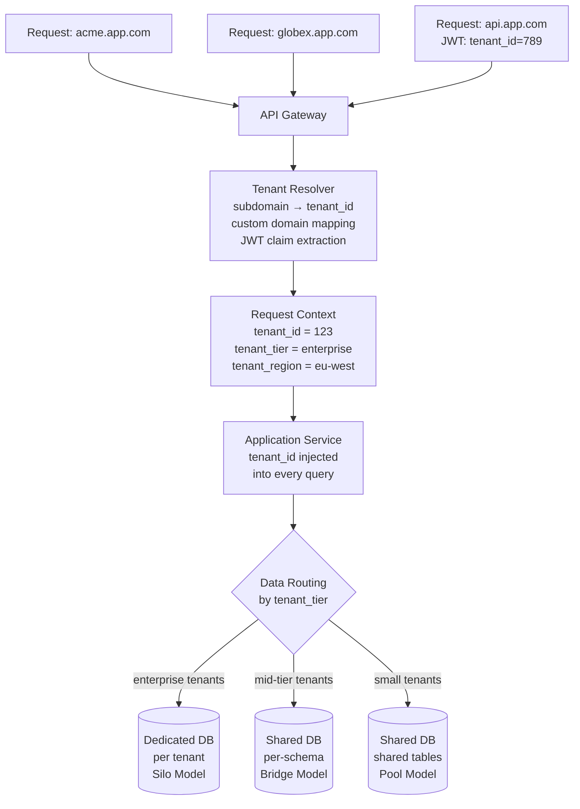
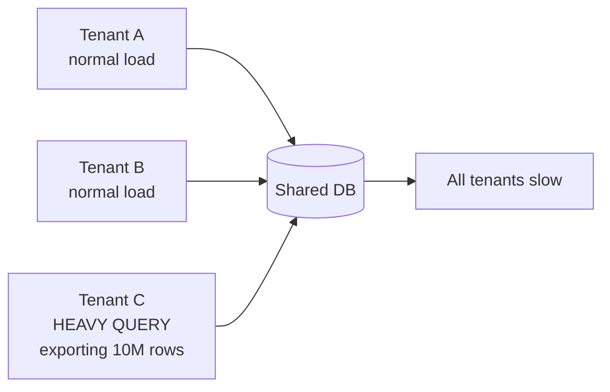
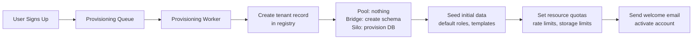

# Multi-Tenant SaaS Platform Design

**Interview Question**: *"Design a multi-tenant SaaS platform like Salesforce or Shopify. How do you isolate 100,000 tenants?"*

**Difficulty**: 🔴 Advanced
**Asked by**: Salesforce, HubSpot, Shopify, Zendesk, Atlassian, Stripe
**Time to Answer**: 10-15 minutes

---

## 🎯 Quick Answer (30 seconds)

A multi-tenant SaaS platform serves thousands of customers (tenants) from shared infrastructure. The core challenge is balancing isolation (tenants cannot see each other's data), cost efficiency (can't give each tenant their own server), and operational simplicity (can't manage 100,000 separate databases manually). The three isolation models — silo, bridge, and pool — represent different points on this spectrum. Most modern SaaS platforms use a hybrid approach: pool for small tenants, silo for enterprise customers with strict compliance requirements.

**Key Components**:
1. Tenant identification: resolve every request to a tenant ID (subdomain, JWT, custom domain)
2. Data isolation model: silo / bridge / pool (or hybrid)
3. Noisy neighbor prevention: per-tenant resource quotas and rate limiting
4. Tenant lifecycle management: provisioning, migrations, data deletion

---

## 📚 Detailed Explanation

### Problem Breakdown

Imagine you are building a CRM platform like Salesforce. You have 100,000 business customers. Each has their own users, contacts, deals, and custom fields. Your requirements:

- **Isolation**: Acme Corp cannot see Globex Corp's data — ever
- **Cost**: You cannot afford a separate server per tenant (100,000 servers)
- **Performance**: One tenant doing a massive export should not slow down others ("noisy neighbor" problem)
- **Compliance**: GDPR requires you to delete all data for a specific tenant within 30 days. HIPAA requires some tenants' data to stay in specific regions.
- **Customization**: Enterprise tenants need custom fields, custom workflows, custom roles
- **Scale**: Some tenants have 10 users; some enterprise tenants have 50,000 users

There is no single right answer. The isolation model depends on your tenant mix, compliance requirements, and engineering resources.

### High-Level Architecture



### Deep Dive: The Three Isolation Models

#### Model 1: Silo (Database per Tenant)

Each tenant gets their own database instance.

```
Tenant A → postgres://tenant-a.db:5432/tenant_a
Tenant B → postgres://tenant-b.db:5432/tenant_b
Tenant C → postgres://tenant-c.db:5432/tenant_c
```

**Cost**: Very high (each database = separate instance, ~$200-2000/month)
**Isolation**: Complete — a database compromise affects only that tenant
**Compliance**: Easiest — GDPR deletion = drop database; data residency = deploy DB in correct region
**Performance**: No noisy neighbor problem
**Operations**: Most complex — 100,000 separate databases require heavy automation

**Who uses it**: AWS RDS, large enterprise tenants (e.g., Salesforce's "Performance Edition"), healthcare/finance SaaS with strict compliance

```
# Silo: tenant routing
function get_db_connection(tenant_id):
    config = tenant_registry.get(tenant_id)
    return create_connection(
        host=config.db_host,       # tenant-specific host
        database=config.db_name,
        credentials=config.db_creds
    )
```

#### Model 2: Bridge (Schema per Tenant)

All tenants share one database server, but each tenant has their own schema (namespace) within that database.

```sql
-- Tenant A schema
CREATE SCHEMA tenant_a;
CREATE TABLE tenant_a.contacts (...);
CREATE TABLE tenant_a.deals (...);

-- Tenant B schema
CREATE SCHEMA tenant_b;
CREATE TABLE tenant_b.contacts (...);
CREATE TABLE tenant_b.deals (...);
```

**Cost**: Moderate — one database server, many schemas (1 server per ~500 tenants)
**Isolation**: Good at schema level; a bug in application code could still cross schemas
**Compliance**: Schema deletion is fast; data residency requires separate servers per region
**Operations**: Schema migrations must run across all tenant schemas

```
# Bridge: schema routing
function get_schema(tenant_id):
    return f"tenant_{tenant_id}"

# All queries use tenant-specific schema
def get_contacts(tenant_id, user_id):
    schema = get_schema(tenant_id)
    return db.execute(
        f"SELECT * FROM {schema}.contacts WHERE user_id = %s",
        user_id
    )
```

**Who uses it**: Discourse, many mid-size SaaS platforms

**Migration challenge**: Running `ALTER TABLE ADD COLUMN` across 10,000 schemas is a multi-hour operation. Use online schema change tools (pt-online-schema-change, gh-ost) and batch the migrations.

#### Model 3: Pool (Shared Tables with Row-Level Security)

All tenants share the same tables. Every row has a `tenant_id` column. Isolation is enforced by application code and/or database Row-Level Security (RLS).

```sql
-- Shared table for all tenants
CREATE TABLE contacts (
    id          UUID PRIMARY KEY,
    tenant_id   UUID NOT NULL,      -- which tenant owns this row
    name        VARCHAR(255),
    email       VARCHAR(255),
    created_at  TIMESTAMP
);

-- Index for tenant isolation queries
CREATE INDEX idx_contacts_tenant_id ON contacts (tenant_id);

-- PostgreSQL Row-Level Security
ALTER TABLE contacts ENABLE ROW LEVEL SECURITY;

CREATE POLICY tenant_isolation ON contacts
    USING (tenant_id = current_setting('app.tenant_id')::uuid);
-- Now every query on contacts auto-filters to the current tenant
-- even if application code forgets to add WHERE tenant_id = ...
```

**Cost**: Very low — thousands of tenants share the same tables
**Isolation**: Weakest — depends on consistent tenant_id filtering; RLS is a safety net
**Performance**: Potential for noisy neighbor; requires careful query design and resource limits
**Operations**: Simplest migrations (add column to one table, not 10,000 schemas)

```
# Pool: setting RLS context before queries
def handle_request(request):
    tenant_id = extract_tenant_id(request)

    # Set tenant context for RLS (PostgreSQL)
    with db.connection() as conn:
        conn.execute(
            "SET LOCAL app.tenant_id = %s", tenant_id
        )
        # All subsequent queries auto-filtered to this tenant by RLS
        contacts = conn.execute("SELECT * FROM contacts")
        # Equivalent to: SELECT * FROM contacts WHERE tenant_id = 'acme-uuid'
```

**Who uses it**: Salesforce (with heavy customization on top), Shopify (with per-merchant sharding within the pool), most early-stage SaaS platforms

### Deep Dive: Tenant Identification

Before any data access, the system must know which tenant the request belongs to. There are three common patterns:

**Subdomain-based**:
```
acme.app.com → tenant_id = lookup("acme") → "123e4567-e89b..."
globex.app.com → tenant_id = lookup("globex") → "987fcdeb-51d3..."
```

**Custom domain mapping** (enterprise feature):
```
crm.acme-corp.com → tenant_id = lookup("crm.acme-corp.com") → "123e4567..."
# Tenant sets DNS CNAME: crm.acme-corp.com → acme.app.com
# CDN/edge resolves custom domain to tenant_id via lookup table
```

**JWT claim** (API access):
```json
{
  "sub": "user-uuid",
  "tenant_id": "123e4567-e89b-12d3-a456-426614174000",
  "tenant_tier": "enterprise",
  "iat": 1700000000
}
```

The resolved tenant_id flows through the entire request as immutable context. It must be injected into every database query — missing a single query is a data leak.

```
# Middleware: enforce tenant context
function tenant_middleware(request, next):
    tenant_id = resolve_tenant(request)
    if not tenant_id:
        return 401 Unauthorized

    # Inject into request context — never trust from request body
    request.context.tenant_id = tenant_id
    request.context.tenant_tier = tenant_registry.get_tier(tenant_id)

    return next(request)
```

### Deep Dive: The Noisy Neighbor Problem

In the pool model, one tenant running a heavy query impacts all other tenants on the same database. "Noisy neighbor" is the central operational challenge.



**Mitigation strategies**:

**1. Per-tenant connection limits**:
```
# PgBouncer config: each tenant gets a max pool
[databases]
tenant_* = host=db max_db_connections=5
# Even if Tenant C floods with 100 connections, gets max 5
```

**2. Per-tenant query timeouts**:
```sql
-- Set per-tenant statement timeout (PostgreSQL)
SET statement_timeout = '30s';  -- kill queries > 30 seconds
-- Enterprise tenants get longer timeout
SET statement_timeout = '300s';
```

**3. Read replicas for expensive reads**:
```
# Route bulk exports and reports to read replica
def get_data_for_export(tenant_id):
    if is_heavy_operation():
        return read_replica_db.execute(query, tenant_id=tenant_id)
    return primary_db.execute(query, tenant_id=tenant_id)
```

**4. Query cost budgets**:
```sql
-- PostgreSQL: set max CPU/IO cost per query
SET max_parallel_workers_per_gather = 0;  -- disable parallel for this tenant
SET work_mem = '4MB';  -- limit memory per sort/hash operation
```

### Deep Dive: Tenant Provisioning Pipeline

Onboarding a new tenant should be self-service and take < 30 seconds. It must not block other tenants.



```
# Async provisioning worker
function provision_tenant(tenant_id, tier, region):
    # Step 1: Create tenant record
    tenant_registry.create({
        id: tenant_id,
        tier: tier,
        region: region,
        status: "provisioning"
    })

    # Step 2: Set up data storage (depends on isolation model)
    if tier == "enterprise":
        db_host = provision_dedicated_database(tenant_id, region)
        tenant_registry.set_db_connection(tenant_id, db_host)
    elif tier == "professional":
        schema = create_schema(tenant_id)
        run_migrations(schema)
    else:  # starter / free tier
        # Pool model: tenant_id column handles everything
        pass

    # Step 3: Seed default data
    seed_default_roles(tenant_id)
    seed_default_templates(tenant_id)

    # Step 4: Set resource quotas
    quota_service.set(tenant_id, {
        "api_requests_per_minute": TIER_LIMITS[tier]["api_rpm"],
        "storage_gb": TIER_LIMITS[tier]["storage_gb"],
        "max_users": TIER_LIMITS[tier]["max_users"],
        "connection_pool_size": TIER_LIMITS[tier]["connections"]
    })

    # Step 5: Mark provisioning complete
    tenant_registry.update_status(tenant_id, "active")
    notifications.send_welcome_email(tenant_id)
```

### Deep Dive: Schema Migrations at Scale

In the pool model, running `ALTER TABLE` is simple (one table). In the bridge model, you need to run migrations across every tenant's schema. At 10,000 tenants, this must be:
- **Online**: No downtime, no table locks
- **Batched**: Don't hammer the database with 10,000 simultaneous migrations
- **Idempotent**: Safe to retry on failure
- **Tracked**: Know which schemas are at which migration version

```
# Schema migration runner (bridge model)
function run_migration_for_all_tenants(migration_script):
    tenants = tenant_registry.list_all(status="active")

    for batch in batches(tenants, size=50):  # 50 schemas at a time
        for tenant in batch:
            try:
                schema = get_schema(tenant.id)
                if not migration_already_applied(schema, migration_script.id):
                    db.execute_in_schema(schema, migration_script.sql)
                    migration_tracker.mark_applied(schema, migration_script.id)
                    log(f"Migrated {schema}")
            except Exception as e:
                migration_tracker.mark_failed(schema, migration_script.id, e)
                alert_oncall(f"Migration failed for {schema}: {e}")

        sleep(100ms)  # backpressure: don't overwhelm DB
```

### Deep Dive: Compliance — GDPR Right-to-Erasure

GDPR Article 17 requires you to delete all data for a user/tenant within 30 days of request.

```
# GDPR tenant deletion workflow
function delete_tenant_data(tenant_id):
    # Step 1: Soft-delete immediately (account appears inactive)
    tenant_registry.mark_deleted(tenant_id, reason="gdpr_erasure")

    # Step 2: Revoke all access tokens
    auth_service.revoke_all_tokens(tenant_id)

    # Step 3: Queue hard deletion (runs within 30 days SLA)
    deletion_queue.enqueue({
        tenant_id: tenant_id,
        scheduled_at: now() + 24_hours,  # give time to cancel accidental requests
        confirmed_at: null
    })

# Hard deletion worker
function execute_hard_deletion(tenant_id):
    # Silo model: drop entire database
    if isolation_model == "silo":
        db_provisioner.drop_database(tenant_id)

    # Bridge model: drop schema
    elif isolation_model == "bridge":
        db.execute(f"DROP SCHEMA tenant_{tenant_id} CASCADE")

    # Pool model: delete all rows with tenant_id
    else:
        for table in ALL_TABLES:
            db.execute(f"DELETE FROM {table} WHERE tenant_id = %s", tenant_id)

    # Delete from object storage (files, images)
    object_storage.delete_prefix(f"tenants/{tenant_id}/")

    # Delete from backup systems (hardest part — backups contain old data)
    backup_service.schedule_tenant_exclusion(tenant_id)

    # Delete from analytics/data warehouse
    data_warehouse.delete_tenant(tenant_id)

    # Record deletion for audit trail
    audit_log.record_deletion(tenant_id, completed_at=now())
```

---

## ⚖️ Trade-offs

| Isolation Model | Cost/Tenant | Isolation | Compliance | Noisy Neighbor | Migration Complexity | Best For |
|---|---|---|---|---|---|---|
| Silo (DB per tenant) | High ($200-2000/mo) | Complete | Easiest | None | Low (per-tenant) | Enterprise, healthcare, finance |
| Bridge (schema per tenant) | Medium ($0.10-1/mo) | Strong | Moderate | Low (same server) | Medium (per-schema) | Mid-market SaaS |
| Pool (shared tables) | Very low ($0.001/mo) | Weakest (app-enforced) | Hardest | High | Low (one table) | SMB SaaS, early-stage, free tiers |
| Hybrid (pool + silo) | Tiered | Tiered | Tiered | Managed by tier | Complex | Most production SaaS |

**Key insight**: Most successful SaaS companies use a hybrid model:
- Free/starter tenants → pool (cheap to serve)
- Professional tenants → bridge (some isolation)
- Enterprise tenants → silo (full isolation, compliance, dedicated SLAs)

---

## 🏢 Real-World Examples

**Salesforce**:
- 150,000+ customers, primarily pool model with shared tables
- "Org ID" is their tenant_id, present in every table, every query
- Custom metadata layer: tenants can add custom fields without schema changes (stored as flexible JSON columns)
- Virtual private cloud option: large enterprise customers get dedicated Salesforce infrastructure

**Shopify**:
- Powers 2M+ merchants
- Pool model for most data, but shards the pool across database clusters by merchant_id range
- Pod architecture: group of merchants assigned to a "pod" (set of database servers + app servers)
- Tenant isolation at pod level + row-level tenant_id filtering within pod

**GitHub**:
- Shards by organization (tenant equivalent)
- Each organization is assigned to a MySQL shard; related data co-located on same shard
- Migrations use GitHub's Gh-ost (Ghost) tool for online schema changes at scale

**Atlassian (Jira, Confluence)**:
- Cloud version uses pool model with PostgreSQL RLS
- Migrated from per-customer data centers to cloud over several years
- Data residency feature: EU customers' data stays in EU; US customers in US

---

## ⚠️ Common Pitfalls

**1. Missing tenant_id on a Query (Critical — Data Leak)**
The most dangerous bug. A query without a `WHERE tenant_id = ?` filter returns all tenants' data. In the pool model, this is a data breach.

```
# BUG: missing tenant_id filter
def get_contacts(user_id):
    return db.query("SELECT * FROM contacts WHERE user_id = %s", user_id)
    # user_id might exist for multiple tenants!

# FIX: always include tenant_id
def get_contacts(tenant_id, user_id):
    return db.query(
        "SELECT * FROM contacts WHERE tenant_id = %s AND user_id = %s",
        tenant_id, user_id
    )
# OR: use PostgreSQL RLS as a safety net (enforced even if app code forgets)
```

**2. Connection Pool Exhaustion**
10,000 tenants × 5 connections each = 50,000 database connections. PostgreSQL handles ~500 connections before performance degrades. Solution: connection pooling at app layer (PgBouncer, RDS Proxy). Pool connections per tenant tier, not per tenant.

```
# Without pooling: catastrophic
10,000 tenants × 5 connections = 50,000 connections → PostgreSQL crashes

# With PgBouncer transaction pooling:
10,000 tenants share a pool of 500 DB connections
# Each query borrows a connection for its duration (<1ms), then returns it
```

**3. Schema Migrations Across 10,000 Tenants**
A naive migration loops over all schemas sequentially. At 10,000 schemas with 1-second per migration = 2.7 hours of migration time. Solution: batch migrations, run in parallel with rate limiting, use online schema change tools, separate migration from deploy (feature flags).

**4. Tenant Data in Caches**
Redis cache entries that contain tenant data must be namespaced by tenant_id. Forgetting to namespace means one tenant's cached data is returned to another.

```
# BUG: shared cache key
cache_key = f"user:{user_id}"

# FIX: namespace by tenant
cache_key = f"tenant:{tenant_id}:user:{user_id}"
```

**5. Backup Restoration Affects All Tenants**
In the pool model, restoring a database backup to recover one tenant's deleted data also reverts all other tenants' data. Solution: use point-in-time recovery selectively, or maintain per-tenant export snapshots for rollback.

**6. Feature Flag Rollout Across Tenant Tiers**
Rolling out a new feature to "all enterprise tenants" requires a feature flag system aware of tenant tiers. Using a simple percentage rollout may accidentally include free tenants in enterprise-only features.

---

## ✅ Key Takeaways

- **Three isolation models**: Silo (DB per tenant) for compliance/enterprise, Bridge (schema per tenant) for mid-market, Pool (shared tables + tenant_id) for small tenants at low cost
- **Hybrid is the norm**: Most SaaS companies use pool for small tenants, silo for enterprise — the decision is driven by revenue and compliance, not just scale
- **Tenant identification first**: Every request must resolve to a tenant_id before any data access; enforce this in middleware, not business logic
- **PostgreSQL RLS is your safety net**: Even if application code forgets tenant_id, RLS blocks cross-tenant queries
- **Noisy neighbor requires active mitigation**: Per-tenant connection limits, query timeouts, and read replicas prevent one tenant from degrading others
- **Connection pool exhaustion is real**: 10k tenants cannot each have their own connection pool; use PgBouncer transaction-mode pooling
- **GDPR deletion is harder than it looks**: Deleting from backups, analytics pipelines, and third-party integrations takes planning before you have customers
- **Provisioning must be async**: Tenant onboarding via a queue ensures new signups don't degrade existing tenants
