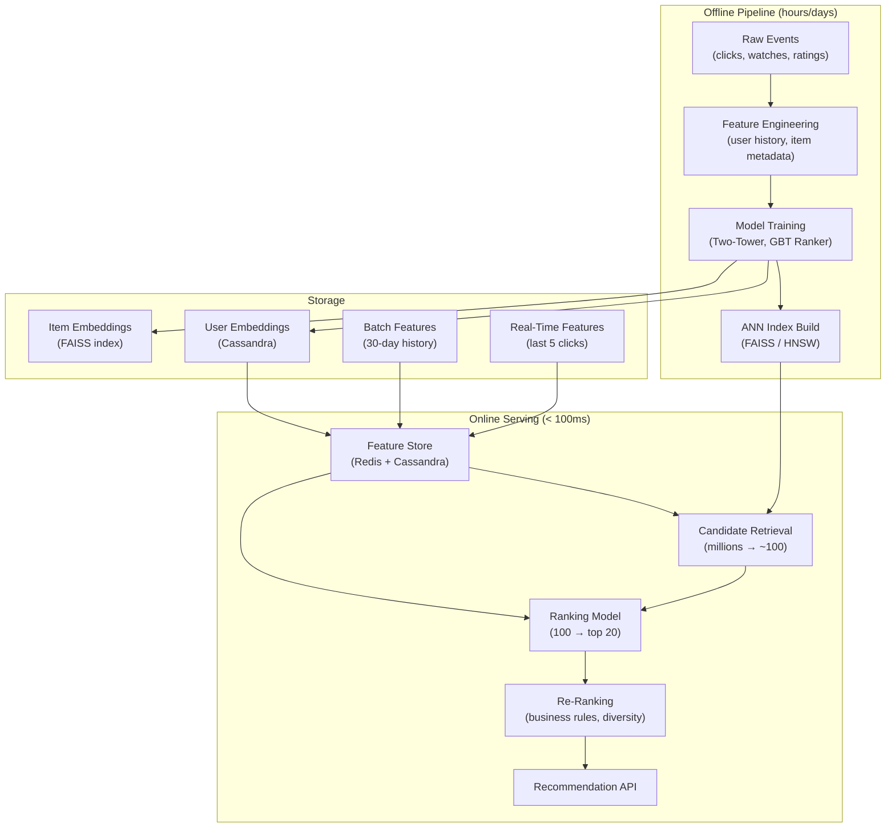

# Recommendation System Design

**Interview Question**: *"Design a recommendation system like Netflix, YouTube, or Amazon product recommendations"*

**Difficulty**: 🔴 Advanced
**Asked by**: Netflix, Amazon, Spotify, YouTube, LinkedIn, Twitter
**Time to Answer**: 10-15 minutes

---

## 🎯 Quick Answer (30 seconds)

A production recommendation system has three stages: candidate retrieval (narrow millions of items to ~100 candidates using approximate nearest neighbor search on embedding vectors), ranking (score those 100 candidates with a heavy ML model), and re-ranking (apply business rules like diversity and freshness). It combines collaborative filtering (what similar users watched) with content-based signals (item features) in a hybrid model.

**Key Components**:
1. **Feature Store** — serves pre-computed user/item embeddings and real-time behavioral signals
2. **Two-Tower Model** — separate neural networks for users and items that produce embeddings; similarity via dot product
3. **ANN Index (FAISS/HNSW)** — enables sub-millisecond approximate nearest neighbor search across millions of items
4. **Ranking Model** — a heavier model (gradient boosted trees or deep learning) that scores the shortlisted candidates
5. **Re-Ranking Layer** — applies business constraints (diversity, freshness, sponsored content, A/B experiment assignments)

---

## 📚 Detailed Explanation

### Problem Breakdown

A naive approach is to score every item for every user — but at Netflix scale that's 300 million users × 15,000 titles = 4.5 trillion pairs. Even at 1 microsecond per score, that's 52 days of compute per recommendation request.

The real challenge has multiple dimensions:
- **Scale**: Serve recommendations to 300M+ users with < 100ms latency
- **Cold start**: New users have no history; new items have no interactions
- **Exploration vs. exploitation**: Show users what they'll like (exploitation) vs. discover new preferences (exploration)
- **Feedback loops**: If you only recommend popular items, unpopular items never get a chance
- **Real-time signals**: A user who just watched a horror movie should get horror recommendations now, not tomorrow
- **Training-serving skew**: The model was trained on historical data; serving conditions may differ

### High-Level Architecture



### Deep Dive: Collaborative Filtering

Collaborative filtering answers: "Users similar to you also liked X."

```
// User-Item Matrix (simplified)
//        Movie A  Movie B  Movie C  Movie D
// User 1    5       4        ?        1
// User 2    4       ?        5        2
// User 3    ?       3        4        ?

// Find similar users using cosine similarity
function cosineSimilarity(userA, userB):
  // Treat user ratings as a vector, ignoring missing values
  sharedItems = items rated by both userA and userB
  if len(sharedItems) < MIN_OVERLAP:  // e.g., 5 items
    return 0

  dotProduct = sum(userA[i] * userB[i] for i in sharedItems)
  normA = sqrt(sum(userA[i]^2 for i in sharedItems))
  normB = sqrt(sum(userB[i]^2 for i in sharedItems))
  return dotProduct / (normA * normB)

// Predict rating for user1 on Movie C
function predictRating(targetUser, targetItem):
  similarUsers = findTopK(
    users,
    similarity=cosineSimilarity(targetUser, user),
    k=50
  )
  // Weighted average of their ratings
  weightedSum = sum(similarity(u) * u.rating(targetItem) for u in similarUsers)
  totalWeight = sum(similarity(u) for u in similarUsers)
  return weightedSum / totalWeight
```

**Problem**: This naive approach is O(users × items) and doesn't scale. It also fails for new users/items (cold start).

### Deep Dive: Two-Tower Model (Production Standard)

Modern systems learn dense vector embeddings instead:

```
// Two-Tower Architecture
// User tower and item tower trained jointly to minimize
// the distance between user and items they interacted with

// User Tower (neural network)
UserInput = {
  userId: embedding(userId),           // 32-dim learned embedding
  ageGroup: one_hot(ageGroup),         // [0,1,0,0,0]
  recentWatches: avg(itemEmbeddings),  // average of last 10 watched items
  dayOfWeek: cyclical_encoding(day),   // captures weekly patterns
  deviceType: one_hot(mobile/tv/web)
}

userEmbedding = Dense(256) → ReLU → Dense(128) → L2Normalize
// Output: 128-dimensional unit vector

// Item Tower (neural network)
ItemInput = {
  itemId: embedding(itemId),
  genre: multi_hot(genres),
  releaseYear: normalize(year),
  avgRating: normalize(rating),
  titleEmbedding: BERT(title)[:64]     // semantic title embedding
}

itemEmbedding = Dense(256) → ReLU → Dense(128) → L2Normalize
// Output: 128-dimensional unit vector

// Similarity score (during training and serving)
score = dotProduct(userEmbedding, itemEmbedding)
// Range: -1 to +1 (cosine similarity since both are L2-normalized)

// Training objective: contrastive loss
// Push score(user, positive_item) high
// Push score(user, negative_item) low
loss = -log(sigmoid(score_positive - score_negative))
```

After training, item embeddings are pre-computed and stored in an ANN index. User embeddings are computed at request time using the user tower.

### Deep Dive: Candidate Retrieval with ANN

Finding the 100 most similar items from millions requires Approximate Nearest Neighbor (ANN) search:

```
// Build FAISS index (done offline, refreshed daily)
function buildIndex(itemEmbeddings):
  // IVF (Inverted File Index) with PQ (Product Quantization)
  // IVF: cluster embeddings into N buckets (e.g., 4096 clusters)
  // PQ: compress 128-dim float32 vectors to 64 bytes (8× compression)
  index = faiss.IndexIVFPQ(
    dimension=128,
    nlist=4096,      // number of cluster centroids
    m=64,            // number of sub-quantizers
    nbits=8          // bits per sub-quantizer
  )
  index.train(itemEmbeddings)
  index.add(itemEmbeddings)
  return index

// Serving: find top-100 candidates for a user
function retrieveCandidates(userId, k=100):
  // Step 1: Compute user embedding in real-time
  userFeatures = featureStore.get(userId)
  userEmbedding = userTower.forward(userFeatures)  // ~5ms GPU inference

  // Step 2: ANN search (search only top nprobe clusters)
  index.nprobe = 64  // search 64/4096 clusters for speed vs. recall tradeoff
  distances, itemIds = index.search(userEmbedding, k=500)  // get 500, filter down

  // Step 3: Filter already-seen items
  seenItems = featureStore.getRecentlyWatched(userId, days=30)
  candidates = [item for item in itemIds if item not in seenItems][:100]

  return candidates  // ~2ms total for ANN search
```

**Why not exact search?** Exact search over 10M items × 128 dimensions × 4 bytes = 5GB of matrix multiplications per request. ANN with FAISS reduces this to milliseconds with ~95% recall.

### Deep Dive: Ranking

The ranking stage applies a heavier model to the 100 candidates:

```
// Ranking: score each candidate with a rich feature set
function rankCandidates(userId, candidates):
  scores = []

  for itemId in candidates:
    features = {
      // User features
      userEmbedding: featureStore.getUserEmbed(userId),
      userWatchHistory: featureStore.getHistory(userId, days=30),
      userSessionContext: featureStore.getSession(userId),  // last 5 clicks

      // Item features
      itemEmbedding: featureStore.getItemEmbed(itemId),
      itemPopularity7d: featureStore.getPopularity(itemId, window=7d),
      itemFreshness: daysSinceRelease(itemId),

      // Cross features (user × item interactions)
      genreAffinity: cosineSim(userGenreVector, itemGenreVector),
      priorInteractions: featureStore.getPriorInteractions(userId, itemId),

      // Context features
      timeOfDay: now().hour,
      deviceType: request.device
    }

    // Gradient Boosted Tree (GBDT) or small DNN
    // Trained to predict P(watch | features) using historical click/watch data
    score = rankingModel.predict(features)  // ~0.5ms per item
    scores.append((itemId, score))

  return sorted(scores, key=score, reverse=True)[:20]
```

### Deep Dive: Re-Ranking

Re-ranking applies business logic that can't be learned from historical data:

```
// Re-ranking with diversity and business rules
function rerank(userId, rankedItems, targetCount=10):
  result = []
  genresSeen = {}
  directorsSeen = {}

  for item in rankedItems:
    // Diversity: max 3 items per genre, 2 per director
    if genresSeen.get(item.genre, 0) >= 3:
      continue
    if directorsSeen.get(item.director, 0) >= 2:
      continue

    // Business rules
    if item.isSponsored and sponsoredCount < 2:
      result.insert(3, item)  // place sponsored at position 3
      sponsoredCount += 1
      continue

    // Freshness boost: newly released items get a position bump
    if item.daysSinceRelease < 7 and freshItemsInserted < 1:
      result.insert(0, item)
      freshItemsInserted += 1
      continue

    result.append(item)
    genresSeen[item.genre] = genresSeen.get(item.genre, 0) + 1
    directorsSeen[item.director] = directorsSeen.get(item.director, 0) + 1

    if len(result) >= targetCount:
      break

  return result
```

### Feature Store Design

```
// Feature Store: two-tier (fast real-time + rich batch)

// Real-time features (Redis, TTL: 1 hour)
// Updated on every user event (click, watch, search)
realtimeFeatures = {
  "user:u12345:recent_items": ["item_A", "item_B", "item_C"],  // last 5
  "user:u12345:session_genre": "thriller",                     // current session
  "item:i67890:click_rate_1h": 0.045,                          // trending score
}

// Batch features (Cassandra, updated daily by Spark job)
batchFeatures = {
  "user:u12345": {
    watchHistory30d: ["item_1", "item_2", ...],   // 30 days
    genreDistribution: {"drama": 0.4, "comedy": 0.3, "thriller": 0.3},
    avgSessionLength: 45,  // minutes
    preferredDevice: "TV",
  },
  "item:i67890": {
    embedding: [0.12, -0.34, 0.56, ...],    // 128-dim vector
    avgRating: 4.2,
    totalWatches7d: 15000,
    completionRate: 0.72,  // % of users who finished it
  }
}

// At request time, merge both tiers
function getFeatures(userId, itemId):
  realtime = redisClient.get(f"user:{userId}:*")
  batch = cassandraClient.get(userId, itemId)
  return merge(realtime, batch)  // realtime features override batch
```

### Cold Start Problem

```
// New user (no history)
function recommendForNewUser(userId, signupContext):
  if signupContext.preferences:
    // Explicit preferences from onboarding survey
    seedItems = lookupByGenre(signupContext.preferences)
    return contentBasedRecommend(seedItems)

  // Fall back to popularity-based recommendations
  // segmented by country, device, time of day
  return popularItemsFor(
    country=signupContext.country,
    timeOfDay=now().hour,
    exclude=seenItems
  )

// New item (no interactions)
function recommendNewItem(itemId, targetUsers):
  // Use content-based features only (no collaborative signal yet)
  itemFeatures = getContentFeatures(itemId)  // genre, cast, synopsis
  itemEmbedding = contentTower.embed(itemFeatures)

  // Find similar items using content similarity
  similarItems = annIndex.search(itemEmbedding, k=10)

  // Target users who liked similar items
  candidateUsers = getUsersWhoLiked(similarItems)
  return candidateUsers
```

### A/B Testing at Scale

Netflix runs 250+ simultaneous A/B experiments. The key: bucket users deterministically:

```
// Deterministic bucket assignment (no lookup table needed)
function getExperimentBucket(userId, experimentId):
  hash = sha256(f"{userId}:{experimentId}")
  bucketIndex = hash % 100  // 0-99

  // Experiment config: 50% control, 50% treatment
  if bucketIndex < 50:
    return "control"
  else:
    return "treatment"

// Each experiment can change: model, feature weights, re-ranking rules
function getRecommendations(userId, request):
  bucket = getExperimentBucket(userId, "rec_model_v2")
  if bucket == "treatment":
    return recommendV2(userId, request)
  else:
    return recommendV1(userId, request)

// Metrics tracked per experiment bucket:
// - Click-through rate (CTR)
// - Watch rate (% who started watching)
// - Completion rate (% who finished)
// - Long-term retention (7-day return rate)
```

---

## ⚖️ Trade-offs

| Approach | Pros | Cons | When to Use |
|----------|------|------|-------------|
| Pre-computed recommendations | Ultra-fast serving (cache hit) | Stale for fast-moving events, high storage cost | Daily digest emails, homepage shelf |
| Real-time recommendations | Fresh, context-aware | Higher latency, more compute | Homepage feed, search results |
| Matrix Factorization | Simple, interpretable | Doesn't incorporate side features | Datasets with dense ratings |
| Two-Tower Neural Model | Handles cold start via features, scalable | Complex to train, harder to debug | Production at scale (Netflix, Google) |
| Approximate ANN search | Sub-millisecond, scalable to billions | Misses ~5% of true nearest neighbors | Candidate retrieval (recall tradeoff acceptable) |
| Exact nearest neighbor | Perfect recall | O(n) per query, too slow | Small catalogs (< 10K items) |
| Collaborative filtering | Captures latent preferences | Cold start problem, popularity bias | Systems with rich interaction history |
| Content-based filtering | No cold start for items | Filter bubble, misses serendipity | New item launch, sparse interaction data |

---

## 🏢 Real-World Examples

**Netflix**:
- 300M+ users, 15,000+ titles
- Recommendations drive 80% of total watch time (vs. 20% from search)
- Runs 250+ concurrent A/B experiments
- Uses a multi-stage pipeline: retrieval → ranking → contextual bandit re-ranking
- Personalizes even the thumbnail image shown to each user (separate ML model)

**Amazon**:
- Recommendations contribute ~35% of total revenue
- "Customers who bought X also bought Y" uses item-to-item collaborative filtering
- Runs on a self-developed feature store with sub-10ms feature retrieval
- Seasonal models: holiday shopping patterns are very different from summer patterns

**YouTube**:
- "Deep Neural Networks for YouTube Recommendations" paper (2016) popularized two-tower models
- Serves 2 billion logged-in users
- Candidate retrieval: 1M videos → 100 using embedding + ANN
- Ranking: 100 → 10 using a DNN with 1 billion+ parameters
- Key insight: watch time (not just clicks) is the objective to optimize

**Spotify**:
- Collaborative filtering for music discovery (Discover Weekly)
- Audio embeddings: train CNN on raw audio to get acoustic features
- NLP embeddings: parse music blogs/Reddit to learn song associations from language
- Delivers personalized playlists to 600M+ users weekly

---

## ⚠️ Common Pitfalls

1. **Popularity bias**: If you train only on clicks, the model learns to recommend popular items because they get the most training signal. Popular items keep getting shown, obscuring long-tail content. Fix: down-weight popular items in training, use exploration strategies (epsilon-greedy, contextual bandits).

2. **Filter bubbles**: The more you show users only what they already like, the more constrained their discovery becomes. Fix: inject diversity constraints in re-ranking, explicitly explore 10% of recommendations outside the user's comfort zone.

3. **Stale recommendations**: Batch-computed recommendations go stale within hours for fast-moving events (e.g., breaking news, viral content). Fix: real-time feature updates via Kafka, smaller batch windows, or fully online recommendation models.

4. **Training-serving skew**: The model was trained on features computed at training time, but at serving time the same features are computed differently (different code, different data pipeline). Fix: use a shared feature store for both training and serving; log features at serving time for training.

5. **Data leakage during training**: If you use future interactions to predict past interactions, the model appears to perform well in evaluation but fails in production. Fix: strict temporal train/validation splits.

6. **Click-through rate vs. actual value**: Optimizing for CTR leads to clickbait. A user clicks a thumbnail but leaves after 10 seconds. Fix: optimize for watch time, completion rate, or long-term retention, not just clicks.

---

## ✅ Key Takeaways

- Production recommendation systems use a multi-stage pipeline: retrieval (millions → 100) then ranking (100 → 10) to balance quality and latency
- Two-tower models learn separate embeddings for users and items; cosine similarity enables ANN search at serving time
- FAISS/HNSW approximate nearest neighbor indexes are essential — exact search over millions of items is too slow for real-time serving
- Feature stores serve two tiers: real-time signals (last 5 clicks, Redis) and batch features (30-day history, Cassandra)
- Cold start requires fallback strategies: popularity-based for new users, content-based for new items
- A/B testing with deterministic hash-based bucketing allows running hundreds of experiments simultaneously without a lookup table
- Netflix's recommendation system drives 80% of watch time, demonstrating the business value of personalization at scale
- Collaborative filtering captures latent user preferences but suffers from cold start; content-based filtering solves cold start but creates filter bubbles; hybrid systems combine both
