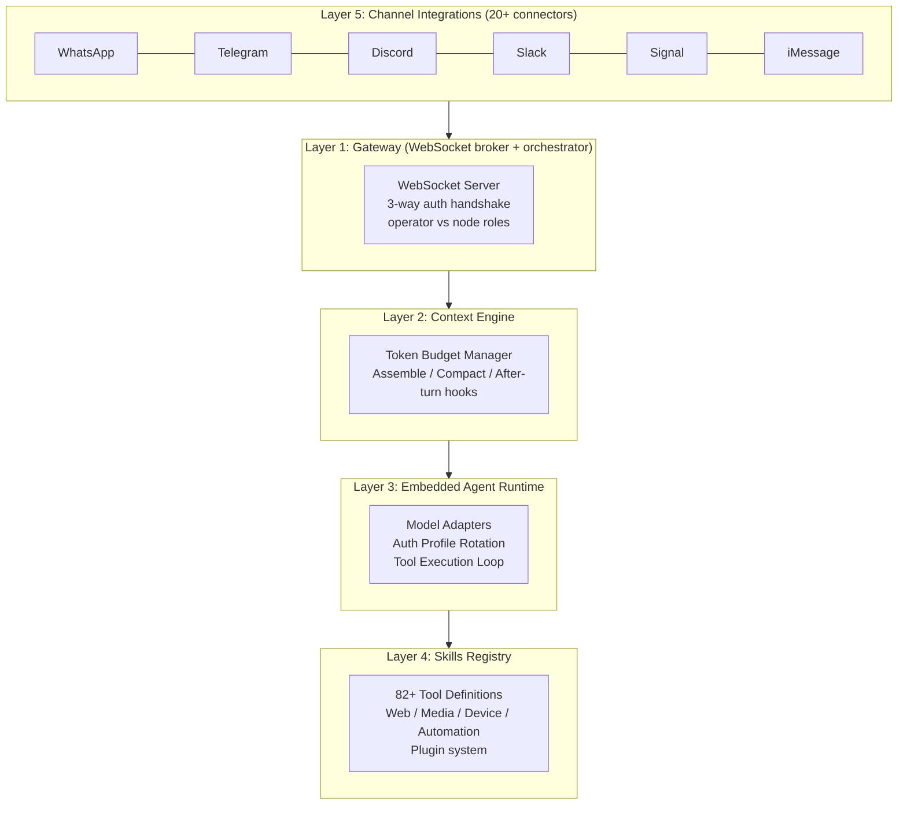
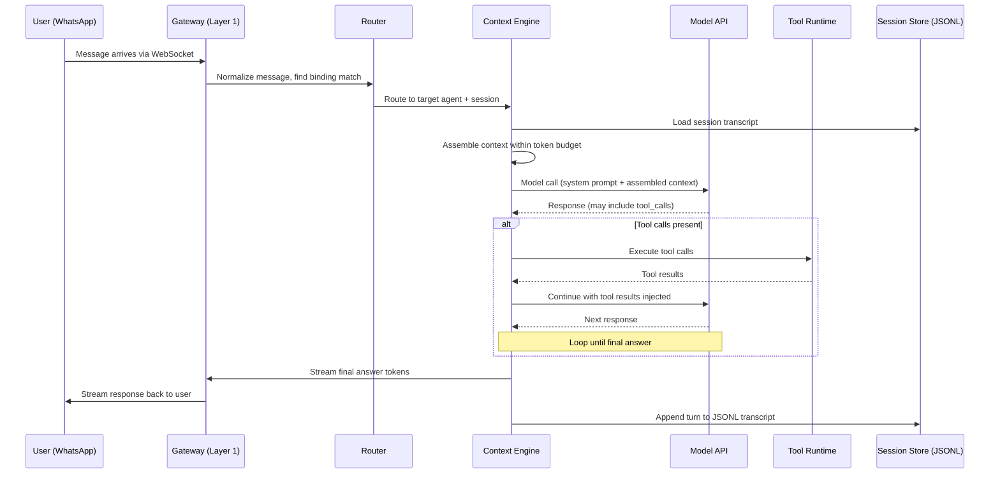
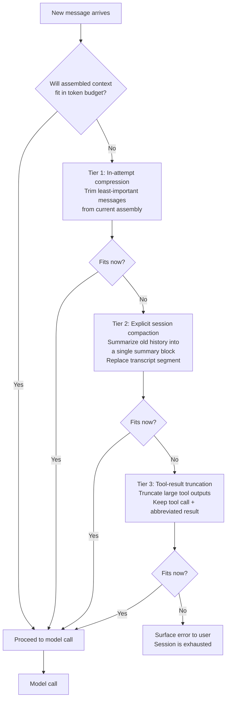
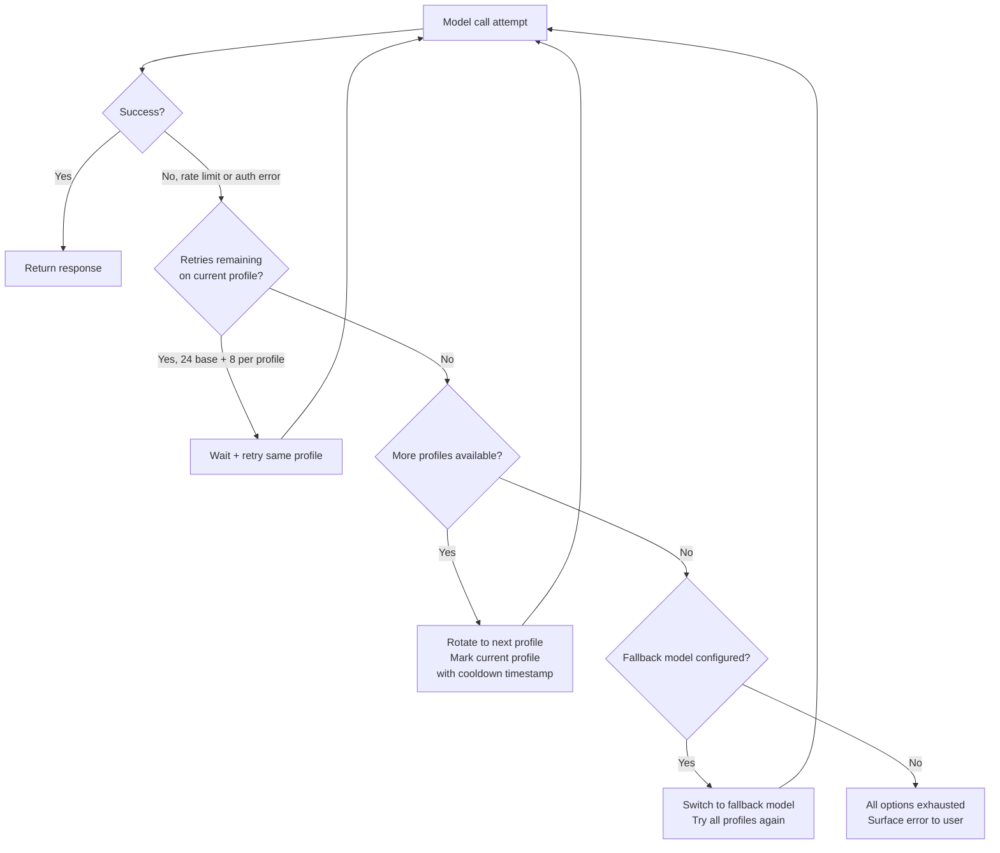

# OpenClaw: Architecture Deep Dive

**Level**: 🔴 Advanced
**Reading Time**: 20 minutes

> Most agent tutorials show you a 50-line loop. OpenClaw shows you what happens when that loop needs to handle WhatsApp, Telegram, Discord, Slack, Signal, and iMessage simultaneously — without ever leaking one user's context into another's session.

## What OpenClaw Is

OpenClaw is a self-hosted, MIT-licensed AI gateway platform written in TypeScript/Node.js. It runs on your own hardware and bridges 20+ messaging platforms with AI agents.

**The core problem it solves**: Most AI platforms are cloud-hosted, which means your conversations are stored on someone else's servers. OpenClaw lets individuals and organizations run a full AI gateway locally — on a laptop, a Raspberry Pi, or a private server — with complete data sovereignty.

**Why it matters architecturally**: It is one of the few fully open, production-complete examples of a multi-channel agent gateway. Every design decision — from session storage to auth retry logic to tool permissions — is visible and reasoned through. Most comparable systems are proprietary.

**Stack**: TypeScript/Node.js, Express 5, Hono, pnpm monorepo, WebSocket, AWS Bedrock SDK, pdfjs-dist, platform SDKs for each messaging app.

## The Five-Layer Architecture

OpenClaw is organized into five distinct layers, each with a clear responsibility boundary.



**Layer 1 (Gateway)**: The WebSocket message broker. It authenticates connections, routes incoming messages to the correct agent, and streams responses back. Two role types: *operators* (control plane — configure agents, manage routing) and *nodes* (capability plane — provide device capabilities like camera, notifications).

**Layer 2 (Context Engine)**: The most architecturally interesting layer. It manages the token budget for each model call, assembles the right history from the session transcript, and runs compaction when the context would overflow. Three hooks: `assemble`, `compact`, `after-turn`.

**Layer 3 (Agent Runtime)**: The core agent loop — model call, tool extraction, tool execution, result injection, loop until final answer. Also handles auth profile rotation when a model API returns rate limit or auth errors.

**Layer 4 (Skills Registry)**: 82+ tool definitions organized into groups (web, media, session/agent, device, automation). The registry enforces per-agent tool policies. Tools are not loaded globally — each agent sees only what its policy allows.

**Layer 5 (Channel Integrations)**: Platform-specific connectors. Each connector knows how to receive messages from one platform, normalize them into OpenClaw's internal message format, and send responses back in the platform's expected format.

## The Agent Workspace Model

Each agent in OpenClaw is an isolated directory on disk:

```
~/.openclaw/agents/<agentId>/
  SOUL.md          ← personality, instructions, behavioral guidelines
  TOOLS.md         ← tool permission allow/deny list
  IDENTITY.md      ← agent name, avatar, metadata
  AGENTS.md        ← multi-agent routing rules (who delegates to whom)
  USER.md          ← user context (preferences, background, timezone)
  sessions/
    <sessionId>.jsonl  ← append-only conversation transcript
```

**Why files instead of a database?**

This is a deliberate and interesting choice. File-based configuration has several advantages for agent systems:

- **Human-editable**: You can open `SOUL.md` in any text editor and change the agent's behavior. No database client, no schema knowledge required.
- **Git-versionable**: Agent configurations can be committed to git. You get full history, diffs, and rollback for free.
- **No schema migration**: When you add a new field to agent config, you edit a markdown file. You don't write a migration script.
- **Agents can read their own config**: An agent tool can read `SOUL.md` or `TOOLS.md` as part of its context. The config is just text — the same format the LLM already understands.
- **Portable**: Copy an agent directory to a new machine and it works immediately.

The trade-off: no atomic multi-field updates, no query capabilities, no referential integrity. For agent configuration, these are rarely needed. For session transcripts, append-only JSONL sidesteps the atomicity problem entirely.

**Creating an agent**:

```
openclaw agents add research-assistant
```

This generates the workspace directory with template files. You then edit the markdown files to configure the agent's personality and tool permissions.

## Session Lifecycle

A complete message round-trip through OpenClaw:



**Key design decisions visible in this flow**:

1. **Session isolation**: The router finds the correct session based on the binding match. Two users messaging the same agent get separate JSONL files — no shared context.

2. **Context assembly happens before every model call**: The context engine does not pass the entire JSONL history to the model. It assembles a context window that fits within the token budget. This is what makes multi-day conversations possible.

3. **Streaming before persistence**: The response streams to the user while it's being generated. Persistence to JSONL happens after the turn completes. This minimizes perceived latency.

4. **Per-session serialization**: Within a session, turns are processed serially. This prevents race conditions where two simultaneous messages corrupt the context state. It is the simplest correct solution to concurrent writes in a conversation.

## The Context Compaction Problem

Long conversations hit a wall: the model's context limit. If you naively append every turn to the context, eventually the history is too large to fit. You have three bad options: truncate old history (lose information), summarize (lose detail), or refuse new messages (worst).

OpenClaw implements a three-tier recovery cascade:



**Tier 1 (In-attempt compression)**: Lightweight. Trim or abbreviate the least-important messages from the current assembly without touching the stored transcript. If this gets the context small enough, no permanent changes are made.

**Tier 2 (Explicit session compaction)**: Call the model with a summarization prompt to collapse a block of old history into a dense summary. The JSONL transcript is rewritten to replace the summarized segment with the summary block. This is a permanent change to the stored session — the original messages are gone.

**Tier 3 (Tool-result truncation)**: Tool outputs can be very large — a web search result, a PDF page, a code file. Truncate these to keep the tool call record (which the model needs for coherence) but discard the bulk of the result content.

**Why tracking diagnostic IDs matters**: Each compaction attempt gets a diagnostic ID logged. When you're debugging why an agent gave a confused response, you need to know which tier of compaction fired, on which session, at which turn. Without diagnostic IDs, compaction failures are nearly impossible to reproduce.

**The 3-attempt limit**: OpenClaw limits compaction to 3 cascade attempts. If all three tiers still leave the context too large, the system surfaces an error rather than infinitely attempting compaction. This prevents compaction loops from masking the underlying problem (a session that has simply grown too large for the model's context window).

## Auth Profile Rotation

Production agents hit API rate limits. A naive implementation retries the same key until it times out, then fails. OpenClaw handles this with an auth profile rotation system.

**Why you need this**: A single API key has rate limits. If your agent is serving many users, a single key gets rate-limited. The solution is multiple API key profiles (e.g., five different AWS Bedrock credentials) with rotation logic.



**The retry math**: 24 base retries + 8 retries per auth profile. If you have three profiles, that's 24 + (8 × 3) = 48 total attempts before the system gives up on all profiles. With a fallback model and three more profiles, you could attempt 96+ times total.

**Cooldown tracking**: When a profile is rotated away from, its timestamp is recorded. The rotation logic won't return to a cooled-down profile until its cooldown period has elapsed. This prevents the system from immediately cycling back to a rate-limited key.

**Model-level fallback**: After all profiles for the primary model are exhausted, OpenClaw can try a fallback model (e.g., switch from Claude 3.5 Sonnet to Claude 3 Haiku). This degrades gracefully — the user gets a response from a smaller model instead of an error.

This pattern handles three distinct failure modes with one mechanism: temporary rate limits, regional outages affecting specific credentials, and sustained load spikes that exhaust one model's capacity.

## Multi-Agent Binding System

OpenClaw routes messages to agents using a binding system. Each binding is a rule that maps a message source to a target agent.

**Binding priority order** (highest to lowest):

1. Exact peer match (specific sender ID on specific channel)
2. Guild/team ID match (all messages from a Discord server or Slack workspace)
3. Channel default (all messages on this platform account)
4. First matching rule (fallback)

**Example binding configuration**:

```
# In AGENTS.md for the "personal-assistant" agent

Bindings:
- channel: whatsapp, accountId: +1555000001, peerId: +1555999888
  → route to: research-assistant (exact peer match)

- channel: discord, guildId: 123456789
  → route to: community-bot (guild match)

- channel: telegram, accountId: my_telegram_handle
  → route to: personal-assistant (channel default)
```

**Per-session isolation**: The `dmScope` setting controls session isolation mode. `dmScope: "per-channel-peer"` means every unique (channel, accountId, peerId) combination gets its own JSONL session file. Two different users messaging the same Telegram account get completely separate context windows — there is no shared state.

This is not just a privacy feature — it is a correctness requirement. Without per-user session isolation, one user's conversation history would contaminate another user's context, causing the agent to confuse identities, remember wrong facts, and behave incoherently.

## Key Architectural Decisions

**JSONL for session storage, not SQL**

JSONL is append-only. A crash mid-write leaves the file with a partial last line — the previous lines are intact and uncorrupted. With SQL, a crash mid-transaction can require crash recovery. For a self-hosted system that may run on consumer hardware with unexpected power loss, append-only JSONL is meaningfully more robust than a transactional database.

JSONL also requires no server process, no connection pool, and no schema. The entire session store is a directory of files that can be read by any text editor.

**WebSocket for the gateway, not HTTP**

The gateway needs bi-directional streaming: streaming token deltas from the model to the user, and streaming capability events from device nodes (camera, notifications, screen recording) to the agent. WebSocket handles both naturally. HTTP streaming (SSE) would work for model output but not for device node events in the other direction.

**File-based agent configuration, not a database**

Discussed in the Agent Workspace Model section above. The key insight: agent configuration is human-authored content, not programmatically-generated data. Markdown files are the right format for human-authored content.

**Per-session serialization for concurrent message handling**

The simplest correct solution to "two messages arrive simultaneously for the same session" is to queue them and process them one at a time. This is what OpenClaw does. It avoids all the complexity of concurrent context assembly (which would require locking, conflict resolution, or optimistic concurrency) at the cost of slightly higher tail latency for burst messages in a single session. In practice, humans don't send burst messages fast enough for this to matter.

## Common Pitfalls This Architecture Avoids

| Pitfall | OpenClaw's Defense |
|---------|-------------------|
| Cross-user context leakage | Per-peer JSONL session files; no shared in-memory state |
| Rate limit cascades | Auth profile rotation with cooldown; model-level fallback |
| Infinite compaction loops | 3-attempt limit; surface error after exhaustion |
| Tool permission sprawl | Per-agent allow/deny lists; explicit elevation required |
| Gateway message loss on crash | WebSocket reconnect; JSONL is durable after each turn |
| Config changes requiring restart | File-based config reloaded at agent instantiation |

## Key Takeaways

- OpenClaw is a five-layer system: gateway → context engine → agent runtime → skills registry → channel integrations
- Agent configuration is file-based (markdown files) — human-editable, git-versionable, no database dependency
- Session transcripts are append-only JSONL — crash-safe, no server process required
- Context compaction is a three-tier cascade: compress → summarize → truncate tool results
- Auth profile rotation handles rate limits with a deterministic retry-and-rotate state machine
- Multi-agent routing uses priority-ordered binding rules with per-session isolation to prevent context leakage
- Per-session message serialization is the simplest correct solution to concurrent write conflicts
