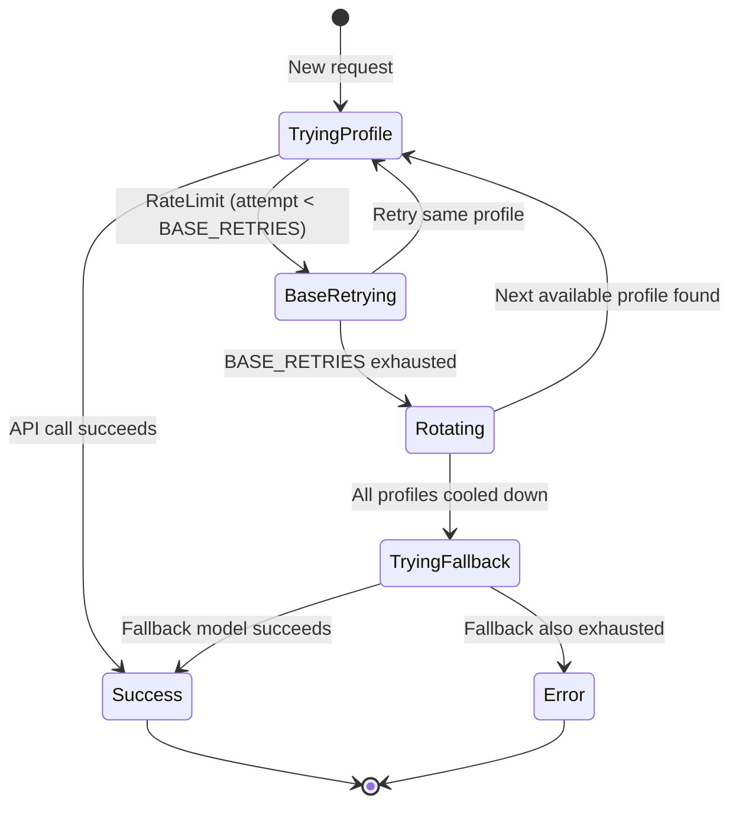
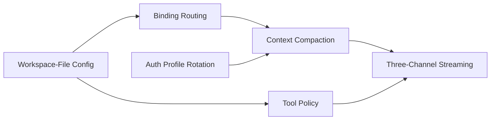

# Agent Patterns Extracted from OpenClaw

**Level**: 🔴 Advanced
**Reading Time**: 25 minutes

> A pattern is a solution that has been found in at least one real system and named so it can be found in the next one. These six patterns were found in OpenClaw. Each one solves a problem that every non-trivial agent system eventually hits.

## Overview

The [Architecture Deep Dive](./openclaw-architecture) explains how OpenClaw is built as a complete system. This article extracts the six most portable patterns from that system — patterns you can apply independently, in your own stack, without adopting OpenClaw itself.

| Pattern | Problem Solved |
|---------|---------------|
| [1. Workspace-File Agent Configuration](#pattern-1-workspace-file-agent-configuration) | Agent config without a database or schema |
| [2. Three-Tier Context Compaction](#pattern-2-three-tier-context-compaction) | Long conversations exceeding context limits |
| [3. Auth Profile Rotation with Cooldowns](#pattern-3-auth-profile-rotation-with-cooldowns) | API rate limits breaking agent loops |
| [4. Tool Policy Enforcement](#pattern-4-tool-policy-enforcement) | Controlling what each agent can do |
| [5. Binding-Based Message Routing](#pattern-5-binding-based-message-routing) | Routing messages to the right agent |
| [6. Streaming Three-Channel Event Architecture](#pattern-6-streaming-three-channel-event-architecture) | Providing streaming UX without coupling consumers |

---

## Pattern 1: Workspace-File Agent Configuration

### Problem

You need to configure agent behavior — personality, permissions, routing rules, user context — across potentially hundreds of agents. A database schema creates migration overhead. Hardcoded values can't be changed without a deploy. Environment variables don't handle per-agent configuration.

### When to Use

- Multiple agents with distinct identities and permissions
- Configuration that humans need to read and edit directly
- Systems where git-based configuration management is desirable
- Self-hosted deployments where a database server is not available or desirable

### Implementation

Each agent gets an isolated directory. Configuration is stored as markdown files that both humans and the LLM can read:

```
agents/
  <agentId>/
    SOUL.md       ← system prompt: personality, tone, behavioral guidelines
    TOOLS.md      ← allow/deny list for tools this agent can use
    IDENTITY.md   ← name, avatar URL, short bio
    AGENTS.md     ← routing rules for delegating to other agents
    USER.md       ← user preferences, background, timezone
    sessions/
      <sessionId>.jsonl
```

**Agent initialization pseudocode**:

```
function loadAgent(agentId):
  basePath = "~/.openclaw/agents/" + agentId

  soul     = readFile(basePath + "/SOUL.md")
  tools    = parseToolPolicy(readFile(basePath + "/TOOLS.md"))
  identity = parseYamlFrontmatter(readFile(basePath + "/IDENTITY.md"))
  agentMap = parseBindingRules(readFile(basePath + "/AGENTS.md"))
  userCtx  = readFile(basePath + "/USER.md")

  return Agent {
    id:       agentId,
    systemPrompt: buildSystemPrompt(soul, identity, userCtx),
    toolPolicy:   tools,
    bindings:     agentMap
  }

function buildSystemPrompt(soul, identity, userCtx):
  return """
  # Identity
  {identity.name}: {identity.bio}

  # Personality and Instructions
  {soul}

  # User Context
  {userCtx}
  """
```

**Why the LLM can read its own config**: Because `SOUL.md` is plain markdown, an agent tool can expose it as context. This enables meta-reasoning ("What are my current instructions?") and introspection tools.

### Trade-offs

| Benefit | Cost |
|---------|------|
| No schema, no migrations | No atomic multi-field updates |
| Human-readable and editable | No query capabilities |
| Git-versionable | File system must be writable at runtime |
| No database server required | Manual consistency checking |
| LLM can read its own config | Config errors are text parse errors, not type errors |

### OpenClaw Reference

`~/.openclaw/agents/<agentId>/` — the agent workspace directory structure.
`openclaw agents add <name>` — command that creates this workspace with template files.

---

## Pattern 2: Three-Tier Context Compaction

### Problem

Conversations grow. Models have fixed context windows (8K, 128K, even 1M tokens — they all have limits). Naively appending every turn eventually crashes the agent with a context overflow error. You need a recovery strategy that degrades gracefully rather than failing abruptly.

### When to Use

- Any agent that handles long-running or persistent conversations
- Systems where conversations span multiple sessions (days or weeks)
- Agents that use tool-heavy workflows (tool results consume many tokens)
- Any production agent system where "session too long" is an expected state

### Implementation

The compaction cascade fires in sequence, trying the cheapest fix first:

```
function assembleContext(session, tokenBudget):
  messages = loadTranscript(session.id)
  assembled = selectMessages(messages, tokenBudget)

  if fits(assembled, tokenBudget):
    return assembled

  // Tier 1: In-attempt compression
  // Trim least-important messages without modifying stored transcript
  diagnosticId = newDiagnosticId()
  log("compaction.tier1.start", { sessionId: session.id, diagnosticId })
  assembled = compressInMemory(assembled, tokenBudget)

  if fits(assembled, tokenBudget):
    log("compaction.tier1.success", { diagnosticId })
    return assembled

  // Tier 2: Explicit session compaction (permanent)
  log("compaction.tier2.start", { diagnosticId })
  summaryBlock = callModel(buildSummarizationPrompt(assembled.oldMessages))
  rewriteTranscript(session.id, assembled.oldMessages, summaryBlock)
  assembled = reassemble(session.id, tokenBudget)

  if fits(assembled, tokenBudget):
    log("compaction.tier2.success", { diagnosticId })
    return assembled

  // Tier 3: Tool-result truncation (permanent)
  log("compaction.tier3.start", { diagnosticId })
  assembled = truncateToolResults(assembled, tokenBudget)

  if fits(assembled, tokenBudget):
    log("compaction.tier3.success", { diagnosticId })
    return assembled

  // All tiers exhausted
  log("compaction.exhausted", { diagnosticId, sessionId: session.id })
  throw SessionExhaustedError("Session " + session.id + " exceeds compaction capacity")
```

**The three tiers in detail**:

```
// Tier 1: In-memory compression (reversible)
function compressInMemory(messages, budget):
  // Score each message by recency, role, and content type
  // Trim or abbreviate low-scoring messages
  // Never touch the stored JSONL file
  return trimmedMessages

// Tier 2: Summarization (permanent rewrite)
function summarizeOldHistory(messages):
  prompt = """
  Summarize the following conversation history into a dense, factual summary.
  Preserve: key decisions, facts mentioned, commitments made, user preferences stated.
  Omit: greetings, filler, redundant exchanges.

  Conversation:
  {messages}

  Summary:
  """
  return callModel(prompt)

// Tier 3: Tool result truncation (permanent rewrite)
function truncateToolResults(messages, budget):
  for message in messages where message.role == "tool":
    if tokenCount(message.content) > TOOL_RESULT_TRUNCATION_THRESHOLD:
      message.content = message.content[:MAX_TOOL_RESULT_TOKENS] + "\n[truncated]"
  return messages
```

**Why the 3-attempt limit matters**: Without a limit, compaction can loop (compacting, reassembling, finding it still doesn't fit, compacting again). The limit forces the system to surface a real error instead of burning tokens on futile compaction.

**Diagnostic IDs are not optional**: When a user reports "the agent seems confused", you need to know if compaction fired, which tier, and on which turn. Without diagnostic IDs in your logs, you cannot reconstruct what happened.

### Trade-offs

| Benefit | Cost |
|---------|------|
| Conversations can run indefinitely | Tier 2+ permanently modifies session |
| Graceful degradation (not hard crash) | Summarization adds model call cost |
| Cheapest fix tried first | Old detail is lost after tier 2 |
| Auditable via diagnostic IDs | Tier 3 may break tool-result chains |

### OpenClaw Reference

Context engine `compact` hook — called when `assemble` returns a context that exceeds the token budget.
Session JSONL rewriting — applied in tier 2 when old history is summarized.

---

## Pattern 3: Auth Profile Rotation with Cooldowns

### Problem

A single API key has rate limits. In production, a multi-user agent system will hit these limits under normal load. Naive retry (sleep and retry the same key) causes user-visible latency spikes. Failing immediately abandons requests that could succeed with a different credential.

### When to Use

- Any production agent system with more than a handful of concurrent users
- Systems using pay-as-you-go APIs with per-key rate limits
- Multi-region deployments where different credentials have different quotas
- Any system that must remain available when one API key is rate-limited

### Implementation

```
// State per agent
type AuthProfile = {
  credentials: APICredentials
  cooldownUntil: Timestamp | null
  retryCount: number
}

function callWithRotation(model, request, profiles, fallbackModel):
  availableProfiles = profiles.filter(p => !isCooledDown(p))

  if availableProfiles.isEmpty():
    if fallbackModel != null:
      // All profiles exhausted — try fallback model
      return callWithRotation(fallbackModel, request, profiles, null)
    else:
      throw AllProfilesExhaustedError()

  currentProfile = availableProfiles[0]

  for attempt in 1..(BASE_RETRIES + RETRIES_PER_PROFILE):
    try:
      return callModel(model, request, currentProfile.credentials)
    catch RateLimitError:
      if attempt < BASE_RETRIES:
        // Still in base retry window — retry same profile
        sleep(backoff(attempt))
        continue
      else:
        // Base retries exhausted — rotate profile
        markCooldown(currentProfile, cooldownDuration=5 * 60)  // 5 min cooldown
        return callWithRotation(model, request, profiles, fallbackModel)
    catch AuthError:
      // Hard auth failure — remove profile entirely, don't rotate back
      removeProfile(currentProfile)
      return callWithRotation(model, request, profiles, fallbackModel)
```

**The rotation state machine**:



**Retry math**:
- BASE_RETRIES = 24 (before any rotation)
- RETRIES_PER_PROFILE = 8 (after rotating to a new profile)
- 3 profiles: 24 + (8 × 3) = 48 total attempts
- With fallback model + 3 more profiles: up to 96 total attempts

### Trade-offs

| Benefit | Cost |
|---------|------|
| Survives rate limits transparently | More complex than simple retry |
| Graceful degradation to fallback model | Requires multiple API credentials |
| Cooldowns prevent thrashing | Cooldown state must survive restarts |
| Auditable via per-profile retry counts | Harder to attribute costs to profiles |

### OpenClaw Reference

Auth retry configuration — `BASE_RETRIES = 24`, `RETRIES_PER_PROFILE = 8`.
Profile cooldown tracking — timestamp stored per profile after rotation.
Fallback model configuration — specified per agent workspace.

---

## Pattern 4: Tool Policy Enforcement

### Problem

Not every agent should have access to every tool. An agent handling customer support should not have access to the filesystem. An agent running in a sandboxed environment should not be able to spawn subprocesses. A user-facing agent should not be able to call internal admin APIs. You need per-agent tool permission enforcement that cannot be bypassed by the LLM.

### When to Use

- Multi-agent systems where different agents have different trust levels
- Any system where tool misuse has real-world consequences (file deletion, API calls with side effects, external communications)
- Systems where compliance or auditing requires documented tool permissions
- Public-facing agents where you cannot trust that the LLM will only request appropriate tools

### Implementation

The critical design decision: **evaluate policy at call time, not at definition time**. Tools are defined globally in the registry. Each agent has a policy document. When the LLM requests a tool call, the policy is evaluated before the tool executes.

```
// Tool policy document (TOOLS.md content, parsed)
type ToolPolicy = {
  allowGroups: string[]     // e.g., ["web", "sessions"]
  denyGroups:  string[]     // e.g., ["filesystem", "runtime"]
  allowTools:  string[]     // specific tool overrides
  denyTools:   string[]     // specific tool overrides
  requiresElevation: string[] // tools needing explicit user approval
}

// Tool group definitions (in registry)
TOOL_GROUPS = {
  filesystem: ["read_file", "write_file", "delete_file", "list_dir"],
  runtime:    ["exec_command", "run_script", "spawn_process"],
  web:        ["web_fetch", "web_search", "web_cite"],
  sessions:   ["spawn_subagent", "list_agents", "send_agent_message"],
  automation: ["set_cron", "set_webhook", "store_memory"],
  ui:         ["take_screenshot", "use_camera", "send_notification"]
}

function evaluateToolPolicy(toolName, policy):
  // Specific deny overrides group allow
  if toolName in policy.denyTools:
    return DENIED

  // Specific allow overrides group deny
  if toolName in policy.allowTools:
    if toolName in policy.requiresElevation:
      return REQUIRES_ELEVATION
    return ALLOWED

  // Check group membership
  for group, tools in TOOL_GROUPS:
    if toolName in tools:
      if group in policy.denyGroups:
        return DENIED
      if group in policy.allowGroups:
        return ALLOWED

  // Default: deny unknown tools
  return DENIED

function executeTool(toolName, toolArgs, policy, session):
  decision = evaluateToolPolicy(toolName, policy)

  if decision == DENIED:
    return ToolError("Tool '" + toolName + "' is not permitted for this agent")

  if decision == REQUIRES_ELEVATION:
    approved = requestUserApproval(toolName, toolArgs, session)
    if not approved:
      return ToolError("User did not approve elevated tool: " + toolName)

  return TOOL_REGISTRY[toolName].execute(toolArgs)
```

**Example TOOLS.md**:

```markdown
# Tool Permissions

## Allowed Groups
- web (fetch, search, citations)
- sessions (spawn subagents, list agents)

## Denied Groups
- filesystem
- runtime
- ui

## Specific Overrides
Allow: store_memory (from automation group, otherwise denied)
Deny: web_fetch (override: no raw fetch, only search)

## Elevation Required
- spawn_subagent (requires user confirmation each time)
```

### Trade-offs

| Benefit | Cost |
|---------|------|
| LLM cannot bypass policy | Policy must be loaded for every tool call |
| Human-readable permission docs | No runtime policy updates without agent restart |
| Specific overrides for fine-grained control | Policy conflicts need resolution rules |
| Elevation flow for sensitive tools | Elevation adds round-trip latency |

### OpenClaw Reference

`TOOLS.md` — the per-agent tool permission file.
Tool registry with group definitions — 82+ tools organized into categories.
Tool policy evaluator — runs before every tool execution in the agent loop.

---

## Pattern 5: Binding-Based Message Routing

### Problem

A single gateway receives messages from many channels and many users. You need to route each message to the correct agent. The routing must be deterministic (same input always goes to same agent), must support fine-grained targeting (specific sender gets specific agent), and must prevent cross-user contamination.

### When to Use

- Multi-agent systems where different agents serve different channels or user segments
- Systems that aggregate multiple messaging platforms into one gateway
- Any system where per-user session isolation is a correctness requirement
- Systems that need to change routing configuration without code changes

### Implementation

Bindings are ordered rules. The first matching rule wins:

```
type Binding = {
  channel:   string | null   // "whatsapp", "telegram", "discord", null = any
  accountId: string | null   // which account on that channel, null = any
  peerId:    string | null   // specific sender, null = any
  guildId:   string | null   // Discord server / Slack workspace, null = any
  role:      string | null   // user role (admin, member), null = any
  targetAgent: string        // which agent to route to
  dmScope:   "per-channel-peer" | "per-channel" | "shared"
}

function routeMessage(message, bindings):
  for binding in bindings:  // ordered: most specific first
    if matches(message, binding):
      session = resolveSession(message, binding)
      return { agent: binding.targetAgent, session }

  throw NoBindingMatchError("No binding matched for: " + message)

function matches(message, binding):
  if binding.channel   != null and binding.channel   != message.channel:   return false
  if binding.accountId != null and binding.accountId != message.accountId: return false
  if binding.peerId    != null and binding.peerId    != message.peerId:     return false
  if binding.guildId   != null and binding.guildId   != message.guildId:   return false
  if binding.role      != null and binding.role      != message.senderRole: return false
  return true

function resolveSession(message, binding):
  match binding.dmScope:
    "per-channel-peer":
      // Full isolation: unique session per (channel, accountId, peerId)
      sessionKey = hash(message.channel, message.accountId, message.peerId)
    "per-channel":
      // Shared per channel account: all senders share one session
      sessionKey = hash(message.channel, message.accountId)
    "shared":
      // All messages share one session (use with care)
      sessionKey = "global"

  return getOrCreateSession(binding.targetAgent, sessionKey)
```

**Binding priority example**:

```
// Most specific first in the binding list:
bindings = [
  // 1. Exact peer match (highest priority)
  { channel: "whatsapp", accountId: "+1555000001", peerId: "+1555999888",
    targetAgent: "vip-assistant", dmScope: "per-channel-peer" },

  // 2. Guild match
  { channel: "discord", guildId: "123456789",
    targetAgent: "community-bot", dmScope: "per-channel-peer" },

  // 3. Channel default
  { channel: "telegram", accountId: "my_handle",
    targetAgent: "general-assistant", dmScope: "per-channel-peer" },

  // 4. Catch-all (lowest priority)
  { channel: null, accountId: null, peerId: null,
    targetAgent: "default-agent", dmScope: "per-channel-peer" }
]
```

### Trade-offs

| Benefit | Cost |
|---------|------|
| Deterministic routing | Binding order matters — easy to create shadowed rules |
| No central routing table to maintain | Full rule scan for every message (fast enough for <1K rules) |
| dmScope controls isolation granularity | "shared" dmScope risks cross-user contamination |
| Config-driven — no code changes to update routing | No runtime validation of binding conflicts |

### OpenClaw Reference

`AGENTS.md` — the per-agent binding rules file.
`dmScope: "per-channel-peer"` — the isolation mode that prevents context leakage between users.
Binding priority evaluation — first match wins, bindings ordered most-specific to least-specific.

---

## Pattern 6: Streaming Three-Channel Event Architecture

### Problem

A streaming agent response has multiple kinds of events that different consumers care about independently:

- **UI**: needs token deltas to render streaming text, but also needs to know when a tool is running so it can show a spinner
- **Monitoring**: needs lifecycle events (agent started, finished, errored) but doesn't want to parse the token stream
- **Tool activity panel**: needs tool call/result events but not the text tokens

A single multiplexed stream forces every consumer to parse everything and filter out what they don't care about. Separate channels let consumers subscribe to exactly what they need.

### When to Use

- Any agent system with a real-time UI that shows tool activity
- Systems where multiple consumers (UI, monitoring, logging) need agent events
- WebSocket-based gateways where you control the channel protocol
- Any system where you want to add new event consumers without changing existing ones

### Implementation

Three named WebSocket sub-channels (or equivalent in your streaming protocol):

```
// Channel definitions
LIFECYCLE_CHANNEL = "agent.lifecycle"
TOKENS_CHANNEL    = "agent.tokens"
TOOLS_CHANNEL     = "agent.tools"

// Events published to each channel

// agent.lifecycle events:
{ type: "agent.started",   agentId, sessionId, timestamp }
{ type: "agent.thinking",  agentId, sessionId, timestamp }
{ type: "agent.finished",  agentId, sessionId, totalTokens, timestamp }
{ type: "agent.error",     agentId, sessionId, error, timestamp }

// agent.tokens events:
{ type: "token.delta",     agentId, sessionId, delta: "Hello" }
{ type: "token.delta",     agentId, sessionId, delta: " world" }
{ type: "token.end",       agentId, sessionId }

// agent.tools events:
{ type: "tool.calling",    agentId, sessionId, toolName, toolArgs }
{ type: "tool.result",     agentId, sessionId, toolName, result, durationMs }
{ type: "tool.error",      agentId, sessionId, toolName, error }
```

**Gateway event publisher**:

```
function runAgentLoop(session, userMessage, gateway):
  gateway.publish(LIFECYCLE_CHANNEL, { type: "agent.started", ...meta })

  context = contextEngine.assemble(session)

  loop:
    gateway.publish(LIFECYCLE_CHANNEL, { type: "agent.thinking", ...meta })

    response = streamingModelCall(context,
      onToken: (delta) -> gateway.publish(TOKENS_CHANNEL, { type: "token.delta", delta })
    )

    gateway.publish(TOKENS_CHANNEL, { type: "token.end", ...meta })

    if response.hasToolCalls:
      for toolCall in response.toolCalls:
        gateway.publish(TOOLS_CHANNEL, { type: "tool.calling",
          toolName: toolCall.name, toolArgs: toolCall.args })

        result = toolRuntime.execute(toolCall)

        gateway.publish(TOOLS_CHANNEL, { type: "tool.result",
          toolName: toolCall.name, result, durationMs: result.elapsed })

        context.appendToolResult(toolCall.id, result)
      continue  // loop again with tool results in context

    else:
      break  // final answer

  contextEngine.persist(session)
  gateway.publish(LIFECYCLE_CHANNEL, { type: "agent.finished", ...meta })
```

**Client subscription example**:

```
// UI: subscribe to tokens + tools for rendering
gateway.subscribe(TOKENS_CHANNEL,    (e) -> renderTokenDelta(e.delta))
gateway.subscribe(TOOLS_CHANNEL,     (e) -> updateToolActivityPanel(e))

// Monitoring: subscribe to lifecycle only
gateway.subscribe(LIFECYCLE_CHANNEL, (e) -> metrics.record(e))

// Debug view: subscribe to all three
gateway.subscribe(LIFECYCLE_CHANNEL, (e) -> debugLog(e))
gateway.subscribe(TOKENS_CHANNEL,    (e) -> debugLog(e))
gateway.subscribe(TOOLS_CHANNEL,     (e) -> debugLog(e))
```

### Trade-offs

| Benefit | Cost |
|---------|------|
| Consumers subscribe to only what they need | More complex channel management |
| New consumer types don't affect existing ones | Event schema must be stable (breaking change if you rename event types) |
| Monitoring doesn't parse token stream | Three channels vs one means more connection overhead |
| Tool activity visible without parsing tokens | Ordering across channels is not guaranteed |

### OpenClaw Reference

WebSocket gateway — 3-way auth handshake establishes operator and node connections.
Three streaming channels — lifecycle events, assistant token deltas, tool update events.
Streaming architecture — token deltas streamed to user before persistence completes.

---

## Combining the Patterns

These six patterns are designed to work together, but they are independently applicable:



**Minimum viable combination** for a new production agent system:
- Pattern 1 (workspace config) + Pattern 4 (tool policy) + Pattern 3 (auth rotation)

These three together give you configurable agents that respect tool permissions and survive rate limits — the three most common production failures in agent systems.

**Full combination** for a multi-channel, multi-user system:
- All six patterns, implemented in the order listed. Pattern 5 (routing) depends on Pattern 1 (workspace) being in place. Pattern 2 (compaction) depends on Pattern 6 (streaming) for delivering results while compaction runs in the background.

## Key Takeaways

- **Workspace-file config** replaces schema-heavy databases for agent configuration; files are human-readable, git-versionable, and the LLM can read them directly
- **Three-tier compaction** handles context overflow without hard failure — compress first, summarize second, truncate tool results last
- **Auth profile rotation** is mandatory for production systems; single-key retry causes user-visible failures under normal load
- **Tool policy enforcement** must happen at call time in the execution layer, not at definition time — the LLM cannot be trusted to self-enforce permissions
- **Binding-based routing** with `per-channel-peer` isolation is the correct default; shared sessions cause context contamination bugs that are hard to diagnose
- **Three-channel streaming** decouples UI, monitoring, and tool visibility concerns without any consumer needing to parse another consumer's event stream
