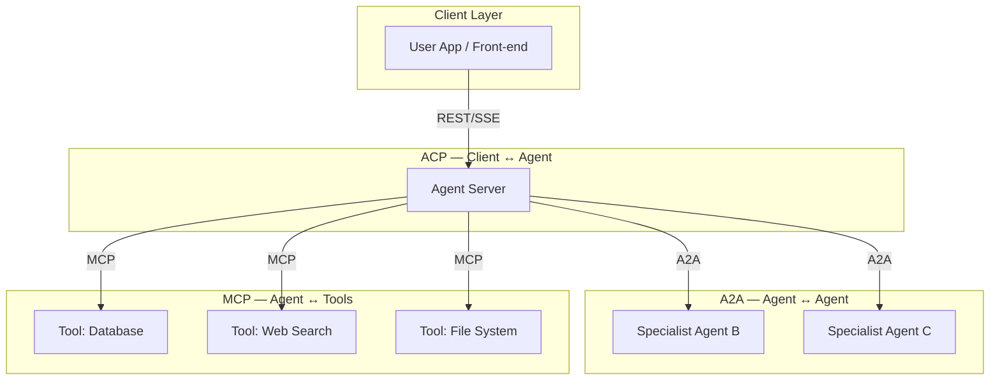
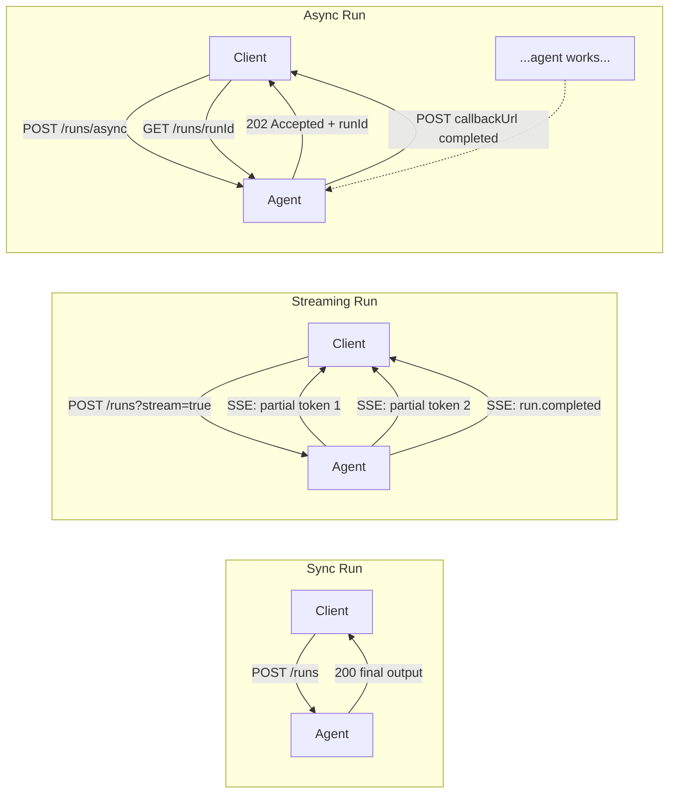

# Agent Client Protocol (ACP)

**Level**: 🔴 Advanced
**Reading Time**: 11 minutes

> MCP is the tool layer. A2A is the agent-to-agent layer. ACP is the client layer — the standard interface between end-user applications and the agents that serve them.

## The Problem

When a user-facing application (a web app, CLI, IDE, mobile app) wants to communicate with an AI agent, there is no standard way to do it. Every agent framework ships its own client SDK with its own API shape:

- LangChain agents have a custom invoke API
- OpenAI Assistants have their own thread/message model
- LlamaIndex agents have their own chat interface
- In-house custom agents are all one-offs

This means front-end developers must learn a different integration pattern for every agent they connect to. The **Agent Communication Protocol (ACP)**, developed by IBM and the BeeAI project in 2025, defines a REST-native standard for client-to-agent communication.

## Where ACP Fits in the Protocol Stack

Three protocols form the modern agent interoperability stack:



| Protocol | Who Talks | Direction | Focus |
|----------|-----------|-----------|-------|
| ACP | Client app → Agent | Downward | User runs, streaming, discovery |
| A2A | Agent → Agent | Lateral | Task delegation between agents |
| MCP | Agent → Tool/Resource | Downward | Tool calls, data access |

## Three Run Modes

ACP unifies three communication patterns under one API surface:



## Run API

The core of ACP is the `/runs` endpoint. A **run** represents one invocation of an agent:

```
// Synchronous run — wait for full output
function runSync(agentUrl, agentName, messages, config={}):
  response = HTTP.post(
    url = agentUrl + "/runs",
    headers = { "Authorization": "Bearer " + token },
    body = {
      "agent_name": agentName,
      "input": messages,         // Array of message objects
      "config": config           // Optional agent-specific config
    }
  )
  // Returns when agent is done
  return response.body  // RunOutput { run_id, status, output }

// Streaming run — receive tokens/chunks as they're generated
function runStreaming(agentUrl, agentName, messages, onChunk, onDone):
  stream = HTTP.postSSE(
    url = agentUrl + "/runs",
    params = { "stream": true },
    body = { "agent_name": agentName, "input": messages }
  )

  for event in stream:
    if event.type == "message.output.chunk":
      onChunk(event.data.chunk)
    elif event.type == "run.completed":
      onDone(event.data.output)
      stream.close()
    elif event.type == "run.failed":
      raise AgentError(event.data.error)

// Async run — fire and forget, result delivered via webhook
function runAsync(agentUrl, agentName, messages, callbackUrl):
  response = HTTP.post(
    url = agentUrl + "/runs/async",
    body = {
      "agent_name": agentName,
      "input": messages,
      "webhook": {
        "url": callbackUrl,
        "events": ["run.completed", "run.failed"]
      }
    }
  )
  return response.body.run_id  // 202 Accepted
```

## Multipart Messages

ACP messages support multiple content types in a single turn, enabling rich agent interactions:

```
// Multipart message structure
ACPMessage = {
  "role": "user",
  "parts": [
    {
      "type": "text",
      "content": "Analyze this chart and give me the key trends"
    },
    {
      "type": "image_url",
      "image_url": {
        "url": "https://storage.mycompany.com/chart-q4.png"
      }
    },
    {
      "type": "file",
      "file": {
        "name": "raw-data.csv",
        "mime_type": "text/csv",
        "content": "base64encodedContent..."
      }
    }
  ]
}

// Agent response is also multipart
ACPAgentMessage = {
  "role": "agent",
  "parts": [
    {
      "type": "text",
      "content": "The chart shows three key trends..."
    },
    {
      "type": "json",
      "content": {
        "trends": ["Revenue up 23%", "Churn down 5%", "Q4 spike in enterprise"],
        "confidence": 0.92
      }
    }
  ]
}
```

## Agent Discovery Manifest

Each ACP-compatible agent server publishes a discovery endpoint at `GET /agents`:

```
// GET /agents — returns list of agents on this server
AgentManifest = {
  "agents": [
    {
      "name": "research-agent",
      "description": "Researches topics and synthesizes comprehensive reports",
      "version": "2.1.0",
      "capabilities": {
        "streaming": true,
        "async": true,
        "multipart_input": true
      },
      "input_content_types": ["text/plain", "application/pdf", "image/png"],
      "output_content_types": ["text/plain", "application/json"],
      "config_schema": {
        "type": "object",
        "properties": {
          "search_depth": {
            "type": "string",
            "enum": ["shallow", "deep"],
            "default": "deep"
          },
          "max_sources": { "type": "integer", "default": 10 }
        }
      }
    },
    {
      "name": "code-review-agent",
      "description": "Reviews code diffs and provides security and quality feedback",
      "version": "1.0.0",
      "capabilities": {
        "streaming": true,
        "async": false,
        "multipart_input": true
      },
      "input_content_types": ["text/plain", "text/x-diff"],
      "output_content_types": ["text/plain", "application/json"]
    }
  ]
}
```

## Run Status and History

```
// Check status of an async run
function getRun(agentUrl, runId):
  response = HTTP.get(agentUrl + "/runs/" + runId)
  return response.body
  // { run_id, agent_name, status, created_at, completed_at, output }

// List recent runs (for history / audit trail)
function listRuns(agentUrl, agentName, limit=20):
  response = HTTP.get(
    url = agentUrl + "/runs",
    params = { "agent_name": agentName, "limit": limit }
  )
  return response.body.runs

// Cancel a running task
function cancelRun(agentUrl, runId):
  HTTP.post(agentUrl + "/runs/" + runId + "/cancel")
```

## Implementing an ACP-Compatible Agent Server

```
// Minimal ACP server implementation
ACPServer = {
  agents: dict[agentName, AgentHandler],

  // GET /agents
  handleDiscovery: function():
    return {
      agents: this.agents.map(a => a.manifest)
    }

  // POST /runs
  handleRun: function(request):
    agent = this.agents[request.body.agent_name]
    if agent is null:
      return HTTP.error(404, "Agent not found")

    streaming = request.query.stream == "true"

    if streaming:
      return HTTP.sseStream(function(emit):
        agent.run(
          input = request.body.input,
          config = request.body.config,
          onChunk = function(chunk):
            emit({ type: "message.output.chunk", data: { chunk: chunk } })
          onDone = function(output):
            runId = storeRun(output)
            emit({ type: "run.completed", data: { run_id: runId, output: output } })
        )
    else:
      output = agent.runSync(request.body.input, request.body.config)
      return HTTP.ok({ run_id: storeRun(output), status: "completed", output: output })

  // POST /runs/async
  handleAsyncRun: function(request):
    runId = generateRunId()
    storeRunPending(runId, request.body)

    // Background execution
    runInBackground(function():
      agent = this.agents[request.body.agent_name]
      output = agent.runSync(request.body.input, request.body.config)
      storeRunCompleted(runId, output)
      if request.body.webhook:
        HTTP.post(request.body.webhook.url, { run_id: runId, status: "completed", output: output })
    )

    return HTTP.accepted({ run_id: runId })  // 202
}
```

## Choosing a Run Mode

| Scenario | Use Mode | Reason |
|----------|----------|--------|
| Short task < 5s, simple client | Sync | Simple request/response |
| Chat UI, code generation | Streaming | Show tokens as they arrive, better UX |
| Long research or analysis task | Async + webhook | Don't block the client for minutes |
| Batch job pipeline | Async + polling | Fire many tasks, check results later |

## Common Pitfalls

1. **Timeout mismatches**: Sync runs over HTTP will hit proxy or load balancer timeouts (often 30-60s). For anything longer, use async mode.
2. **SSE reconnection**: SSE connections drop. Clients must handle reconnection using the `Last-Event-ID` header to resume from where they left off — not restart from the beginning.
3. **Missing discovery endpoint**: Clients use `GET /agents` to discover capabilities before calling. Without it, clients must hardcode agent names and capabilities.
4. **Webhook security**: The agent posts results to your callback URL. Verify the request with a shared secret or signature — don't accept results from any caller.
5. **Config schema drift**: The agent's `config_schema` in the manifest must stay in sync with what the agent actually accepts. Mismatches cause silent failures or ignored config.

## Key Takeaways

- ACP is IBM/BeeAI's 2025 REST-native protocol for client-to-agent communication — the user-facing layer of the agent interop stack
- Three run modes: synchronous (simple), streaming via SSE (real-time UX), async with webhooks (long-running tasks)
- Multipart messages allow mixing text, images, and files in a single agent turn
- Agent discovery at `GET /agents` — clients should always call this first to understand capabilities before running
- ACP + A2A + MCP form the complete agent interop stack: client→agent (ACP), agent→agent (A2A), agent→tools (MCP)
- For production use: sync for short tasks, streaming for interactive UX, async + webhook for tasks over 30 seconds
