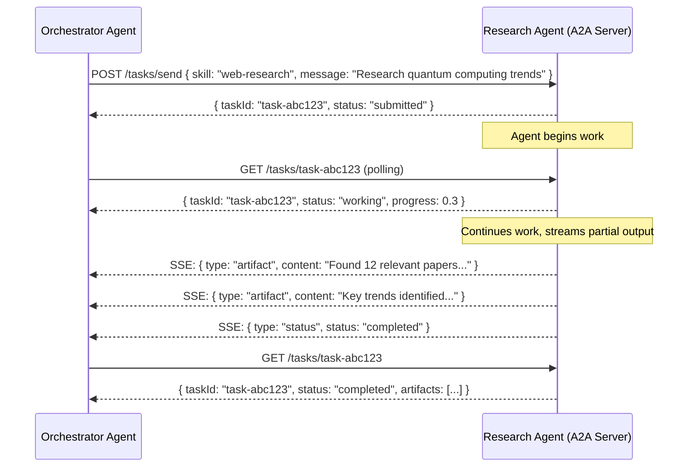

# Agent-to-Agent Protocol (A2A)

**Level**: 🔴 Advanced
**Reading Time**: 12 minutes

> MCP connects agents to tools. A2A connects agents to other agents — turning isolated specialists into a coordinated workforce.

## The Problem

Modern AI applications involve multiple specialized agents: a research agent, a coding agent, a scheduling agent, a communication agent. Each is built by a different team or vendor, running on different infrastructure.

How does a orchestrating agent call a specialist agent? Before A2A:
- Every integration was custom — proprietary JSON payloads, bespoke HTTP endpoints
- No standard way to discover what an agent can do
- No agreed lifecycle for long-running tasks (submit → work → result)
- No standard for streaming partial results or pushing notifications

This is the same problem MCP solved for tools. **Agent-to-Agent Protocol (A2A)**, introduced by Google in 2025, standardizes how agents discover, call, and receive results from other agents.

## A2A vs MCP: Two Complementary Standards

These protocols solve different layers of the agent interop stack:

| Protocol | Direction | Connects | Focus |
|----------|-----------|----------|-------|
| MCP | Agent → Tool | Agent to data/functions | Tool invocation, resource access |
| A2A | Agent → Agent | Agent to agent | Task delegation, long-running ops |

MCP is the plumbing for tools. A2A is the protocol for inter-agent collaboration. A complex agent system will use both.

## The AgentCard: Discovery Manifest

Every A2A-compatible agent publishes an **AgentCard** — a JSON document describing its identity, capabilities, and how to reach it. Clients fetch it from `/.well-known/agent.json`.

```
// AgentCard JSON structure
AgentCard = {
  "name": "ResearchAgent",
  "description": "Searches the web, reads documents, and synthesizes research reports",
  "version": "1.0.0",
  "url": "https://research-agent.mycompany.com",
  "provider": {
    "organization": "MyCompany",
    "contact": "team@mycompany.com"
  },
  "capabilities": {
    "streaming": true,            // Can stream partial results
    "pushNotifications": true,    // Can push status updates to a webhook
    "stateTransitionHistory": true
  },
  "authentication": {
    "schemes": ["Bearer"]
  },
  "defaultInputModes": ["text/plain", "application/json"],
  "defaultOutputModes": ["text/plain", "application/json"],
  "skills": [
    {
      "id": "web-research",
      "name": "Web Research",
      "description": "Search the web and synthesize information on a topic",
      "tags": ["research", "web", "synthesis"],
      "examples": [
        "Research the latest developments in quantum computing",
        "Find and summarize recent papers on transformer architectures"
      ],
      "inputModes": ["text/plain"],
      "outputModes": ["text/plain", "application/json"]
    },
    {
      "id": "document-analysis",
      "name": "Document Analysis",
      "description": "Analyze and extract structured data from uploaded documents",
      "tags": ["documents", "extraction", "pdf"],
      "inputModes": ["application/pdf", "text/plain"],
      "outputModes": ["application/json"]
    }
  ]
}
```

An orchestrator agent loads multiple AgentCards at startup, building a registry of specialists it can delegate to.

## Task Lifecycle

A2A models agent work as **tasks** with a defined lifecycle:



Task states:
- `submitted` — task received, queued
- `working` — agent is actively processing
- `input-required` — agent needs clarification from the caller
- `completed` — task finished successfully, artifacts available
- `failed` — task failed, error in response
- `cancelled` — task was cancelled by the caller

## Task Submission

```
// Submit a task to a remote agent
function sendTask(agentUrl, skill, message, attachments=[]):
  response = HTTP.post(
    url = agentUrl + "/tasks/send",
    headers = { "Authorization": "Bearer " + agentToken },
    body = {
      "id": generateTaskId(),
      "message": {
        "role": "user",
        "parts": [
          { "type": "text", "text": message },
          ...attachments.map(a => ({ "type": "file", "file": a }))
        ]
      },
      "skill": skill,
      "metadata": {
        "callbackUrl": "https://my-agent.com/callbacks/task-results"
      }
    }
  )
  return response.body.id  // taskId
```

## Polling vs Streaming vs Push Notifications

A2A supports three result delivery modes depending on task duration:

```
// Mode 1: Polling (short tasks, simple clients)
function pollTask(agentUrl, taskId):
  while true:
    response = HTTP.get(agentUrl + "/tasks/" + taskId)
    task = response.body
    if task.status in ["completed", "failed", "cancelled"]:
      return task
    sleep(2000)

// Mode 2: Streaming (long tasks, real-time feedback)
function streamTask(agentUrl, taskId, onEvent):
  stream = HTTP.getSSE(agentUrl + "/tasks/" + taskId + "/subscribe")
  for event in stream:
    if event.type == "artifact":
      onEvent("artifact", event.data)
    elif event.type == "status":
      if event.data.status in ["completed", "failed"]:
        stream.close()
        return event.data

// Mode 3: Push notifications (very long tasks, fire-and-forget)
function submitWithPushback(agentUrl, skill, message, callbackUrl):
  sendTask(agentUrl, skill, message, metadata={ callbackUrl: callbackUrl })
  // Agent will POST results to callbackUrl when done
  // Caller handles incoming POST in its own webhook endpoint
```

## Multi-Agent Orchestration with A2A

```
// Orchestrator agent using A2A to delegate to specialists
function orchestrate(userRequest):
  // Discover agents (load from registry or hardcoded)
  researchAgent = loadAgentCard("https://research-agent.mycompany.com/.well-known/agent.json")
  writingAgent = loadAgentCard("https://writing-agent.mycompany.com/.well-known/agent.json")
  codeAgent = loadAgentCard("https://code-agent.mycompany.com/.well-known/agent.json")

  // Decide which specialist to use (via LLM or rule-based routing)
  plan = LLM.plan(userRequest, agents=[researchAgent, writingAgent, codeAgent])

  results = {}

  // Step 1: Research
  if plan.needsResearch:
    researchTaskId = sendTask(
      researchAgent.url,
      skill = "web-research",
      message = plan.researchQuery
    )
    results.research = pollTask(researchAgent.url, researchTaskId)

  // Step 2: Write report using research results
  if plan.needsReport:
    reportTaskId = sendTask(
      writingAgent.url,
      skill = "report-writing",
      message = "Write a report based on this research: " + results.research.artifacts[0].content
    )
    results.report = pollTask(writingAgent.url, reportTaskId)

  return results.report.artifacts[0].content
```

## AgentCard Discovery at Scale

For large deployments with many agents, a centralized **Agent Registry** stores AgentCards:

```
// Agent Registry pattern
AgentRegistry = {
  agents: dict[agentId, AgentCard],

  register: function(agentCard):
    this.agents[agentCard.name] = agentCard
    searchIndex.index(agentCard)  // Index skills/tags for search

  findBySkill: function(skillDescription):
    // Semantic search over skill descriptions
    queryEmbedding = embed(skillDescription)
    return searchIndex.nearest(queryEmbedding, topK=5)

  findByTag: function(tag):
    return this.agents.filter(a => a.skills.some(s => s.tags.includes(tag)))
}
```

## Common Pitfalls

1. **Not handling `input-required` state**: Some tasks pause and ask for clarification. If your orchestrator treats `input-required` as `failed`, it kills tasks that just need more info.
2. **Polling too aggressively**: Tight polling loops waste resources. Use SSE streaming for long-running tasks; fall back to polling with exponential backoff.
3. **No task timeout**: A task stuck in `working` forever blocks the orchestrator. Always set a maximum wait time and cancel if exceeded.
4. **Ignoring AgentCard versioning**: Agents evolve. Pin to specific AgentCard versions or handle schema drift gracefully when skill definitions change.
5. **Sending sensitive data without auth**: A2A tasks often cross organizational boundaries. Verify the `authentication.schemes` in the AgentCard and always use tokens — never unauthenticated A2A calls.

## Key Takeaways

- A2A is Google's 2025 open standard for agent-to-agent communication — the missing protocol for multi-agent architectures
- AgentCard (at `/.well-known/agent.json`) is the discovery manifest: it describes what an agent can do, how to authenticate, and which input/output formats it supports
- Tasks go through a defined lifecycle: `submitted → working → completed/failed`
- Three delivery modes: polling (simple), SSE streaming (real-time), push notifications (async webhooks)
- A2A complements MCP — MCP connects agents to tools, A2A connects agents to agents
- Use an Agent Registry for large deployments to enable semantic skill discovery
