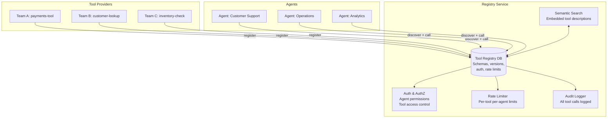

# Agent Tool Registry

**Level**: ⚫ Expert
**Reading Time**: 13 minutes

> When you have 5 tools, hardcode them. When you have 500, you need a registry — dynamic discovery, semantic search, versioning, auth, rate limiting, and audit logs all in one place.

## The Problem

A simple agent is built with a hardcoded list of 5-10 tools. This works fine at small scale. But as your platform grows:

- You have 50 teams, each building their own tools
- An agent needs to call tools from multiple teams
- Tools get updated — agents need the right version
- Some tools are sensitive — only certain agents should call them
- You need to know which agent called which tool, when, and with what arguments
- An agent should be able to discover new tools it wasn't programmed to know about

This is not a tools problem anymore — it's an infrastructure problem. You need a **Tool Registry**: a service that manages the lifecycle of tools and lets agents discover and call them dynamically.

## Tool Registry Architecture



## Tool Registration

Tool providers register their tools with the registry. A registration includes everything needed for an agent to discover and call the tool:

```
// Tool registration payload
ToolRegistration = {
  // Identity
  toolId: "payments.charge_card",
  name: "charge_card",
  namespace: "payments",
  version: "2.1.0",
  owner: "payments-team",

  // For LLM tool selection
  description: """
    Charge a credit card for a purchase.
    Use this tool when a customer confirms they want to complete a purchase.
    Do NOT use for refunds (use payments.refund instead).
    Do NOT use for verifying card validity (use payments.validate_card).
  """,
  tags: ["payments", "transactions", "purchase"],

  // Parameter schema (JSON Schema)
  inputSchema: {
    type: "object",
    properties: {
      cardToken: { type: "string", description: "Tokenized card from vault" },
      amount: { type: "number", description: "Amount in cents" },
      currency: { type: "string", enum: ["USD", "EUR", "GBP"], default: "USD" },
      orderId: { type: "string", description: "Associated order ID" }
    },
    required: ["cardToken", "amount", "orderId"]
  },

  // Endpoint
  endpoint: {
    type: "HTTP",
    url: "https://payments.internal/api/charge",
    method: "POST",
    timeout: 5000
  },

  // Access control
  accessControl: {
    visibility: "INTERNAL",     // INTERNAL | EXTERNAL | PUBLIC
    allowedAgents: ["*"],        // or specific agent IDs
    allowedRoles: ["agent", "admin"],
    requiresApproval: false
  },

  // Rate limits
  rateLimits: {
    perAgentPerMinute: 10,
    perAgentPerHour: 100,
    globalPerMinute: 1000
  },

  // Metadata for registry management
  deprecatedAt: null,
  replacedBy: null,
  healthCheckUrl: "https://payments.internal/health"
}

// Registry stores and indexes this
function registerTool(registration):
  // Validate schema
  validateSchema(registration.inputSchema)

  // Embed description for semantic search
  embedding = EmbeddingModel.encode(
    registration.name + ": " + registration.description
  )

  // Store in registry DB
  RegistryDB.upsert(registration.toolId, registration)

  // Update semantic search index
  SemanticIndex.upsert(registration.toolId, embedding, registration.tags)

  return { registered: true, toolId: registration.toolId }
```

## Tool Discovery

Agents discover tools dynamically using semantic search — they describe what they need, and the registry finds the best-matching tools.

```
// Discovery request from agent
DiscoveryRequest = {
  agentId: "customer-support-agent",
  query: "charge a customer's credit card",  // Natural language intent
  tags: ["payments"],                        // Optional tag filter
  maxResults: 5,
  filterByAgentPermissions: true
}

// Registry handles discovery
function discoverTools(request):
  // 1. Semantic search on tool descriptions
  queryEmbedding = EmbeddingModel.encode(request.query)
  candidateTools = SemanticIndex.search(
    queryEmbedding,
    filter = { tags: request.tags },
    limit = request.maxResults * 3  // Get more, then filter
  )

  // 2. Filter by agent permissions
  if request.filterByAgentPermissions:
    agentPermissions = AuthService.getAgentPermissions(request.agentId)
    candidateTools = candidateTools.filter(tool =>
      isToolAccessible(tool, request.agentId, agentPermissions)
    )

  // 3. Filter out deprecated tools
  candidateTools = candidateTools.filter(tool =>
    tool.deprecatedAt is null or tool.replacedBy is null
  )

  // 4. Return top results with schemas
  return candidateTools[:request.maxResults].map(tool => ToolSearchResult(
    toolId = tool.toolId,
    name = tool.name,
    description = tool.description,
    inputSchema = tool.inputSchema,
    similarityScore = tool.score,
    version = tool.version
  ))
```

## Dynamic Tool Injection

An agent that uses dynamic discovery doesn't hardcode any tools. It queries the registry at runtime:

```
function dynamicAgent(query, agentId):
  // Step 1: Discover relevant tools for this query
  discoveredTools = registry.discoverTools(DiscoveryRequest(
    agentId = agentId,
    query = query,
    maxResults = 10
  ))

  // Convert to LLM tool format
  llmTools = discoveredTools.map(convertToLLMFormat)

  // Step 2: Run agent with dynamically loaded tools
  messages = [SystemMessage(buildDynamicSystemPrompt(llmTools)), HumanMessage(query)]

  while true:
    response = LLM.generate(messages, tools=llmTools)

    if response.type == FINAL_ANSWER:
      return response.text

    for toolCall in response.toolCalls:
      result = registryDispatch(toolCall, agentId, registry)
      messages.append(ToolResult(toolCall.id, result))

// Registry-mediated tool dispatch
function registryDispatch(toolCall, agentId, registry):
  // 1. Resolve tool from registry
  toolRegistration = registry.getTool(toolCall.toolName)
  if toolRegistration is null:
    return ToolError("Tool not found: " + toolCall.toolName)

  // 2. Check auth
  if not registry.checkAccess(toolCall.toolName, agentId):
    return ToolError("Access denied to tool: " + toolCall.toolName)

  // 3. Check rate limit
  rateLimitResult = registry.checkRateLimit(toolCall.toolName, agentId)
  if rateLimitResult.exceeded:
    return ToolError("Rate limit exceeded. Retry after: " + rateLimitResult.retryAfter)

  // 4. Validate args against schema
  validationErrors = validateArgs(toolCall.args, toolRegistration.inputSchema)
  if validationErrors:
    return ToolError("Invalid args: " + validationErrors)

  // 5. Execute via registered endpoint
  result = callToolEndpoint(toolRegistration.endpoint, toolCall.args)

  // 6. Audit log
  registry.audit(AuditEntry(
    toolId = toolCall.toolName,
    agentId = agentId,
    args = toolCall.args,
    result = summarize(result),
    timestamp = now(),
    latencyMs = result.latencyMs
  ))

  return result
```

## Tool Versioning

Tools change over time. Agents need to declare which version they expect:

```
ToolVersion = {
  // Semantic versioning: major.minor.patch
  // major: breaking change (agents must update)
  // minor: new optional parameters (backward compatible)
  // patch: bug fix, no schema change

  resolveBestVersion: function(toolId, agentRequest):
    availableVersions = registry.getVersions(toolId)

    if agentRequest.version == "latest":
      return max(availableVersions)

    if agentRequest.version == "stable":
      return maxNonPrerelease(availableVersions)

    // Exact version or semver range
    return semver.maxSatisfying(availableVersions, agentRequest.version)
}

// Multi-version deployment
function deployNewVersion(toolId, newRegistration):
  // Keep old version running during transition
  oldVersion = registry.getLatest(toolId)
  registry.register(newRegistration)  // Adds new version alongside old

  // Mark old as deprecated with migration path
  if isMajorVersionBump(oldVersion, newRegistration.version):
    registry.deprecate(
      toolId = toolId,
      version = oldVersion.version,
      message = "Upgrade to v" + newRegistration.version + ". Migration guide: ...",
      deprecatedAt = now(),
      replacedBy = newRegistration.toolId + "@" + newRegistration.version
    )
```

## Rate Limiting Per Tool

Without rate limits, one runaway agent can overwhelm a tool's backend:

```
RateLimiter = {
  limits: dict,  // { "toolId:agentId": TokenBucket }

  check: function(toolId, agentId):
    key = toolId + ":" + agentId
    bucket = this.limits.getOrCreate(
      key,
      TokenBucket(
        capacity = registry.getRateLimit(toolId, agentId).perMinute,
        refillRate = "per_minute"
      )
    )

    if bucket.hasTokens():
      bucket.consume()
      return RateLimitAllow()
    else:
      return RateLimitDeny(
        retryAfter = bucket.nextTokenAvailableAt()
      )
}
```

## Audit Logging

Every tool call is logged for security, debugging, and compliance:

```
AuditLog = {
  // Required fields
  eventId: uuid,
  timestamp: datetime,
  toolId: string,
  toolVersion: string,
  agentId: string,
  userId: string,  // If agent is acting on behalf of user

  // Call details
  inputArgs: dict,  // WARNING: may contain PII — scrub before logging
  outputSummary: string,  // Don't log full output if it contains sensitive data
  status: SUCCESS | ERROR | RATE_LIMITED | ACCESS_DENIED,
  latencyMs: int,

  // Context
  sessionId: string,
  runId: string,
  requestId: string  // For request tracing
}

// Querying audit logs
function getToolCallHistory(toolId, timeRange):
  return AuditDB.query("""
    SELECT agentId, COUNT(*) as callCount, AVG(latencyMs) as avgLatency
    FROM audit_log
    WHERE toolId = ? AND timestamp BETWEEN ? AND ?
    GROUP BY agentId
    ORDER BY callCount DESC
  """, [toolId, timeRange.start, timeRange.end])
```

## Real-World Analogy: Stripe's API as a Tool Registry

Stripe's REST API is effectively a tool registry in production:

- Each API endpoint is a "tool" (`POST /v1/charges`, `POST /v1/refunds`)
- The API reference is the tool description (LLMs can read it)
- API versioning (`Stripe-Version: 2024-06-20`) maps to tool versioning
- API keys map to agent authentication
- Rate limits are enforced per key
- All API calls are logged in the Stripe Dashboard (audit log)
- Webhook events are async tool results

The key difference: Stripe's tools were designed for human developers. An agent tool registry is designed to be called programmatically by LLMs — descriptions optimized for semantic search, schemas optimized for structured generation, audit logs optimized for agent debugging.

## Common Pitfalls

1. **No semantic indexing**: If tools are only discoverable by exact name, agents can't find tools they don't already know about. Embed all descriptions for semantic search.
2. **Description quality varies by team**: If team A writes "handles payment stuff" and team B writes a detailed description, team B's tool will always be preferred by semantic search. Enforce description quality standards.
3. **Stale tools never deprecated**: As tools evolve, old versions accumulate. Without active deprecation, agents call outdated endpoints. Set deprecation policies and enforce them.
4. **Audit logs with full PII**: Tool call arguments may contain credit card numbers, social security numbers, passwords. Scrub or tokenize sensitive fields before writing to audit logs.
5. **Registry as a single point of failure**: If all agents go through the registry for every call, it's a critical path component. Run it with high availability, rate limit the registry itself, and add local caching of tool schemas.

## Key Takeaways

- A tool registry is the central service for tool lifecycle management: registration, discovery, auth, rate limiting, and auditing
- Dynamic discovery via semantic search on tool descriptions lets agents find tools they weren't programmed to know about
- Tool versioning enables backward compatibility — agents pin to a version while providers update
- Rate limiting per tool per agent prevents one runaway agent from overwhelming tool backends
- Audit logs make every tool call traceable: who called what, when, with what arguments, and what came back
- Stripe's API is the real-world template: descriptions, versioning, auth, rate limits, and audit — all as infrastructure, not an afterthought
