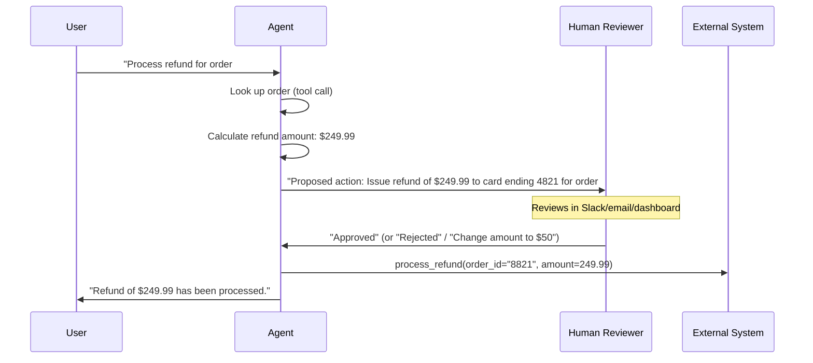
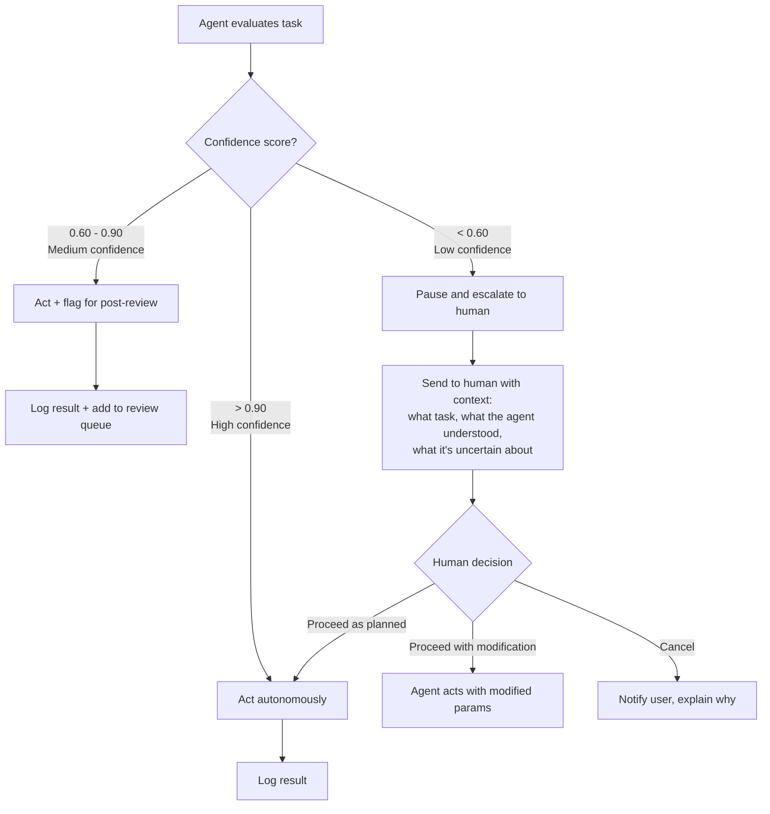

# Human-in-the-Loop Workflows

**Level**: 🟡 Intermediate
**Reading Time**: 13 minutes

> Full automation is the goal for repetitive low-risk tasks. For everything else, knowing when to pause and ask a human is the difference between a useful agent and a dangerous one.

## The Problem

Agents can act at machine speed — which means they can make mistakes at machine speed too. An agent that sends 1,000 emails, deletes 500 records, or processes $50,000 in refunds before a human notices the error is far worse than one that pauses and asks.

Human-in-the-loop (HITL) is the design pattern for injecting human review, approval, or correction at the right points in an agent workflow — without making the agent so interrupt-prone it stops being useful.

The challenge is: **where** do you require human review, and **how** do you implement it without blocking indefinitely?

---

## When to Require Human Approval

The decision matrix for requiring human involvement:

| Trigger | Reason | Example |
|---------|--------|---------|
| **Irreversible action** | Cannot undo after the fact | Send email, delete data, execute payment, deploy to production |
| **High-stakes threshold** | Cost of error is too high | Transactions > $X, medical advice, legal documentation |
| **Low-confidence situation** | Agent uncertainty is above acceptable threshold | Confidence score < 0.7, ambiguous user request with multiple valid interpretations |
| **First-time action** | No precedent in this context | First time agent touches a new customer record, new type of API call |
| **Regulatory requirement** | Non-negotiable compliance | HIPAA (patient data), SOX (financial records), GDPR (data deletion), PCI-DSS (payment data) |
| **Scope expansion** | Task grew beyond original request | Agent realizes completing the task requires touching systems it wasn't initially asked to touch |

**The key heuristic**: If you would be uncomfortable if the agent did this wrong 10 times before anyone noticed, require human approval.

---

## Three HITL Patterns

### Pattern 1: Pre-Approval

The agent pauses before a critical action, sends a proposed action to a human, and waits for approve / reject / modify.



**Best for**: High-stakes irreversible actions (payments, deletions, sends), regulatory compliance steps, first-time actions on important data.

**Timeout handling**: If the human doesn't respond in N hours:
- Option A: Automatically reject (conservative) — good for time-sensitive data operations
- Option B: Escalate to next reviewer in chain
- Option C: Cancel and notify user that human review is pending

### Pattern 2: Post-Review

The agent acts immediately but logs everything. A human reviews the log asynchronously and can reverse actions if needed.

```
Agent workflow:
  1. Act immediately (no blocking)
  2. Log all actions to audit trail with: timestamp, action taken, input params, result, confidence score
  3. Generate daily/hourly review digest for human
  4. Human reviews flagged items and reverses if needed

Flag conditions for review:
  - Action confidence < threshold
  - Action on new/unusual data
  - Action amount > soft limit (below hard limit that requires pre-approval)
  - Action that matched an unusual pattern
```

**Best for**: High-volume, low-risk actions where real-time review is impractical (e.g., auto-tagging 1,000 support tickets, auto-routing 500 emails, auto-applying discount codes to abandoned carts).

**The review interface matters**: If the audit log is a raw database table, humans won't review it. Build a simple UI that shows: action taken, inputs, outputs, a confidence score, and a one-click "reverse this" button.

### Pattern 3: Confidence Threshold

The agent acts autonomously above a confidence threshold, escalates below it.



**Best for**: Repetitive tasks with clear success criteria where you can measure confidence (e.g., intent classification, data extraction, routing decisions).

**How to calculate confidence**:
- For classification tasks: probability score from the model's output
- For retrieval tasks: similarity score / top-k distance
- For generation tasks: self-consistency across multiple runs, or a separate "judge" model call
- Heuristic proxy: if the agent calls a tool more than 3 times without making progress, confidence is low

---

## Implementation: Pause-and-Wait

Different frameworks implement pre-approval differently:

**LangGraph (interrupt)**:
```
// LangGraph's interrupt() pauses the graph and serializes state
// Human reviews, then the graph resumes from the same node

from langgraph.types import interrupt

def review_action_node(state):
    proposed = state["proposed_action"]
    # This pauses execution and returns control to the caller
    human_decision = interrupt({
        "proposed_action": proposed,
        "context": state["context"],
        "message": f"Please review: {proposed['description']}"
    })
    if human_decision["approved"]:
        return {"approved": True, "modifications": human_decision.get("modifications")}
    else:
        return {"approved": False, "reason": human_decision["reason"]}
```

**Webhook approach (framework-agnostic)**:
```
function agentPauseAndWait(proposedAction, timeoutHours=24):
  // Persist agent state to database
  reviewId = db.saveReviewRequest({
    agentRunId: currentRunId,
    proposedAction: proposedAction,
    state: serializeAgentState(),
    expiresAt: now() + timeoutHours * 3600
  })

  // Notify human via preferred channel
  notifier.send({
    channel: "slack",  // or email, pagerduty, etc.
    message: formatReviewRequest(proposedAction),
    approveUrl: webhookBase + "/approve/" + reviewId,
    rejectUrl: webhookBase + "/reject/" + reviewId
  })

  // Pause — resume when webhook is hit
  // (agent process sleeps or is triggered by webhook callback)
  decision = waitForWebhook(reviewId, timeoutHours)

  if decision.timedOut:
    return handleTimeout(reviewId)  // reject or escalate

  return decision  // {approved: true/false, modifications: {...}}
```

**Partial approval (approve with modifications)**:

One underused HITL feature: letting the human approve the action but modify the parameters. A reviewer might approve "send email to all inactive users" but change the email copy, or approve "process refund" but change the amount.

```
// Review response format that allows modification:
{
  decision: "approved_with_modifications",
  modifications: {
    amount: 50.00,  // changed from agent's proposed 249.99
    reason: "Policy: refund capped at $50 for >90 day purchases"
  }
}

// Agent applies modifications before executing:
finalParams = merge(proposedAction.params, decision.modifications)
execute(finalParams)
```

---

## Escalation Chains

Not all human review is equal. Design tiered escalation so the right person sees the right issue.

| Tier | Trigger | Handler | SLA |
|------|---------|---------|-----|
| Tier 0 (auto) | Confidence > 0.9, routine action | Agent acts autonomously | Immediate |
| Tier 1 (soft escalation) | Confidence 0.6–0.9, moderate-value action | Agent supervisor (another agent) reviews | < 5 min |
| Tier 2 (human review queue) | Confidence < 0.6, high-value action, first-time action | Human operator via dashboard | < 2 hours |
| Tier 3 (urgent page) | Irreversible action > threshold, regulatory requirement | Senior operator via PagerDuty | < 15 min |

**Preventing alert fatigue**:
- Tier 3 pages should be rare. If Tier 3 fires more than 5x/day, the threshold is wrong.
- Batch Tier 2 reviews into a digest rather than individual notifications.
- Show reviewers context, not just the raw action: why did the agent propose this? What data did it see?

**The "supervisor agent" pattern at Tier 1**: Instead of always routing to a human, use a second LLM with a different system prompt to review the first agent's proposed action. This works well for catching obvious errors (wrong format, out-of-range values) without human cost.

---

## Feedback Loop: Improving from Human Decisions

Every human decision is training data. Capture it.

**From approved decisions**: Extract the action + context as a positive few-shot example. Add to the agent's system prompt or fine-tuning dataset.

**From rejected decisions**: Capture what the agent proposed and why the human rejected it. Add the rejection reason as a negative example or a new rule in the system prompt.

**From modifications**: These are the most valuable signals — the agent was on the right track but got parameters wrong. Use them to improve parameter extraction.

```
// Feedback capture schema:
{
  reviewId: "rev_8821",
  agentRunId: "run_4412",
  proposedAction: { tool: "process_refund", params: { amount: 249.99 } },
  decision: "approved_with_modifications",
  finalAction: { tool: "process_refund", params: { amount: 50.00 } },
  humanReason: "Policy: refunds capped at $50 for purchases over 90 days old",
  timestamp: "2025-03-15T14:22:00Z"
}

// Over time, this dataset tells you:
// - Which actions the agent consistently gets wrong
// - What policy knowledge is missing from the system prompt
// - Which parameter boundaries to hard-code as rules
```

---

## Common Pitfalls

1. **Pre-approving everything**: If every action requires approval, the agent provides no time savings. Calibrate carefully — only irreversible or high-stakes actions need pre-approval.
2. **No timeout handling**: If a human doesn't respond, the agent hangs forever. Always set a timeout with a defined default behavior.
3. **Notifying in the wrong channel**: A Slack message in a high-traffic channel will be missed. Route urgent reviews to dedicated low-noise channels or direct messages.
4. **Not capturing feedback**: Human decisions are the best signal you have for improving agent behavior. If you're not logging them, you're leaving improvement on the table.
5. **Alert fatigue from over-escalation**: Too many Tier 3 pages and humans start ignoring them. Tune thresholds carefully and review escalation rates weekly.
6. **No modification path**: Binary approve/reject is often too coarse. Always design the review interface to allow parameter modification.

---

## Key Takeaways

- HITL is not about distrusting agents — it's about placing human judgment where the cost of error is highest
- Require pre-approval for irreversible, high-stakes, or regulatory actions; use post-review for high-volume low-risk operations
- Confidence thresholds let the agent act autonomously for clear cases and escalate only when genuinely uncertain
- Always implement timeout handling — a hanging agent is worse than a rejected action
- Tiered escalation prevents alert fatigue: not every review needs a human page
- Every human decision is training signal — capture it and use it to reduce future escalations
