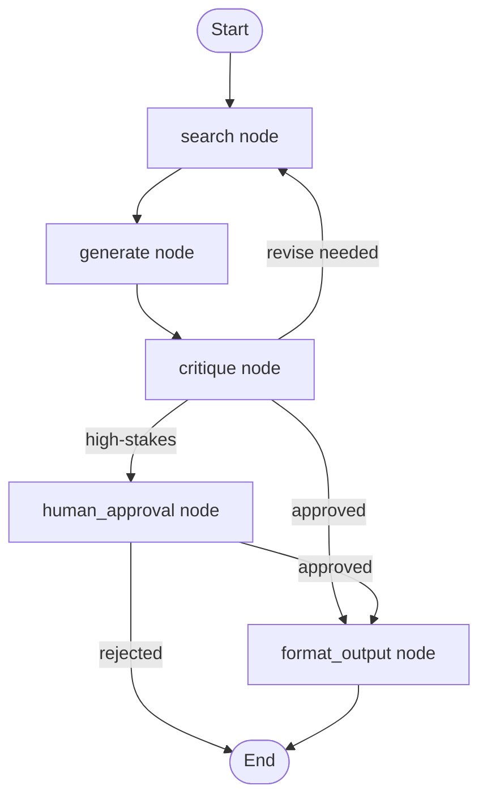

# LangGraph Stateful Agents

**Level**: ⚫ Expert
**Reading Time**: 14 minutes

> LangGraph turns agent workflows into explicit, inspectable graphs — instead of a chain of function calls you pray works, you get a directed graph where every node, edge, and state transition is visible and testable.

## The Problem

As agent workflows grow more complex — conditional routing, loops, human interrupts, parallel branches — a simple while loop becomes unmanageable:

```
// What complex agents look like without a framework:
while not done:
  response = llm.generate(...)
  if response is tool_call:
    if response.toolName == "search":
      if search_failed:
        if retry_count < 3:
          retry
        else:
          try_alternative_search
      else:
        handle_search_result
    elif response.toolName == "calculator":
      ...
    elif response.toolName == "file_write" and needs_approval:
      pause_for_human()
      ...
  elif response is final_answer:
    if confidence < 0.8:
      self_critique()
    else:
      return response
```

This is unmaintainable. LangGraph solves this by making the control flow explicit as a directed graph.

## Core Concepts

LangGraph has three building blocks:

1. **State**: A typed dictionary shared across all nodes in the graph
2. **Nodes**: Functions that receive state and return state updates
3. **Edges**: Connections between nodes — regular (unconditional) or conditional (based on state)

```
// LangGraph conceptual model

State = TypedDict({
  messages: list[Message],        // Conversation history
  currentTask: string,
  toolResults: list[ToolResult],
  humanFeedback: string,
  retryCount: int,
  finalAnswer: string,
  nextNode: string                // Used by conditional edges
})

Node = function(state: State) -> StateUpdate

Edge = {
  from: NodeName,
  to: NodeName | ConditionalRouter
}
```

## Building a Research Agent in LangGraph Style

Let's build a research agent step by step using LangGraph's patterns as pseudocode.

### Step 1: Define the State Schema

```
ResearchAgentState = {
  // Input
  query: string,
  userId: string,

  // Accumulated work
  messages: list[Message],        // Full conversation
  searchResults: list[SearchResult],
  draftAnswer: string,
  critiqueFeedback: string,

  // Control flow
  searchAttempts: int,
  requiresHumanApproval: bool,
  humanApprovalDecision: "approve" | "reject" | null,
  iterationCount: int,

  // Output
  finalAnswer: string,
  sources: list[string],
  status: "running" | "awaiting_human" | "complete" | "failed"
}
```

### Step 2: Define Nodes

Each node is a pure function: takes state, returns partial state updates.

```
// Node 1: Search the web
function searchNode(state):
  searchQuery = buildSearchQuery(state.query, state.messages)
  results = webSearch(searchQuery, maxResults=5)

  return {
    searchResults: state.searchResults + results,
    messages: state.messages + [ToolResult("web_search", results)],
    searchAttempts: state.searchAttempts + 1
  }

// Node 2: Generate draft answer
function generateNode(state):
  prompt = buildPrompt(state.query, state.searchResults)
  response = LLM.generate(state.messages + [HumanMessage(prompt)])

  return {
    draftAnswer: response.text,
    requiresHumanApproval: assessesIfHighStakes(response),
    messages: state.messages + [AIMessage(response.text)]
  }

// Node 3: Self-critique the draft
function critiqueNode(state):
  critiquePrompt = """
  Review this answer for the query: """ + state.query + """

  Answer: """ + state.draftAnswer + """

  Check:
  1. Does it fully answer the question?
  2. Are all claims supported by search results?
  3. Is anything missing?

  Output: { score: 0-10, feedback: string, shouldRevise: bool }
  """
  critique = LLM.generate(critiquePrompt)
  parsed = JSON.parse(critique.text)

  return {
    critiqueFeedback: parsed.feedback,
    iterationCount: state.iterationCount + 1,
    // nextNode hint set by conditional edge logic
    _revise: parsed.shouldRevise and state.iterationCount < 3
  }

// Node 4: Human approval gate
function humanApprovalNode(state):
  // This node pauses the graph until a human responds
  // LangGraph handles this via interrupt mechanism
  return {
    status: "awaiting_human"
    // Graph pauses here — resumed when human calls graph.update_state(approval)
  }

// Node 5: Format final answer
function formatOutputNode(state):
  sources = extractSources(state.searchResults)
  formatted = formatAnswer(state.draftAnswer, sources)

  return {
    finalAnswer: formatted,
    sources: sources,
    status: "complete"
  }
```

### Step 3: Define Edges and Conditional Routing

```
// Build the graph
ResearchGraph = {
  nodes: {
    "search": searchNode,
    "generate": generateNode,
    "critique": critiqueNode,
    "human_approval": humanApprovalNode,
    "format_output": formatOutputNode
  },

  edges: [
    // Unconditional edges
    { from: "search", to: "generate" },
    { from: "generate", to: "critique" },
    { from: "format_output", to: END }
  ],

  conditionalEdges: [
    // After critique: revise (search again) or approve
    {
      from: "critique",
      router: function(state):
        if state._revise:
          return "search"  // Loop back for more research
        elif state.requiresHumanApproval:
          return "human_approval"
        else:
          return "format_output"
    },

    // After human approval: continue or abort
    {
      from: "human_approval",
      router: function(state):
        if state.humanApprovalDecision == "approve":
          return "format_output"
        elif state.humanApprovalDecision == "reject":
          return END  // User rejected, return partial
        else:
          return "human_approval"  // Still waiting
    }
  ],

  entryPoint: "search"
}
```

### The Resulting Graph



The control flow is explicit and visible. You can look at this diagram and understand the entire agent's behavior.

## State Persistence and Checkpointing

LangGraph has built-in checkpointing. Every state transition is persisted, enabling:
- Resume after crash
- Human-in-loop (pause/resume)
- Time-travel debugging (replay from any checkpoint)

```
// Checkpoint configuration
CheckpointConfig = {
  checkpointer: PostgresCheckpointer(connectionString="..."),
  // or: InMemoryCheckpointer() for testing
  // or: RedisCheckpointer(url="redis://...")
}

// Running the graph with checkpointing
function runResearchAgent(query, userId, threadId):
  config = {
    configurable: {
      thread_id: threadId,  // Unique ID for this conversation/run
      checkpoint_id: null   // null = start new, or set to resume
    }
  }

  initialState = ResearchAgentState(
    query = query,
    userId = userId,
    messages = [SystemMessage(systemPrompt)],
    searchAttempts = 0,
    iterationCount = 0,
    status = "running"
  )

  // Execute — each node transition is checkpointed automatically
  result = ResearchGraph.execute(initialState, config)
  return result

// Resume after human approval
function resumeAfterApproval(threadId, approval):
  // Load state from checkpoint
  state = ResearchGraph.getState(config={ thread_id: threadId })

  // Update state with human decision
  ResearchGraph.updateState(
    config = { thread_id: threadId },
    updates = { humanApprovalDecision: approval }
  )

  // Resume execution from where it paused
  result = ResearchGraph.execute(state, config={ thread_id: threadId })
  return result
```

## Parallel Nodes (Map-Reduce)

LangGraph supports parallel execution — multiple nodes running simultaneously:

```
// Fan-out: spawn parallel research tasks
function fanOutNode(state):
  topics = state.researchTopics
  return {
    parallelTasks: topics.map(t => { topicId: t.id, query: t.query })
  }

// Each parallel node processes one topic
function parallelResearchNode(state, taskIndex):
  task = state.parallelTasks[taskIndex]
  result = webSearch(task.query)
  return {
    topicResults: { [task.topicId]: result }
  }

// Fan-in: collect all parallel results
function fanInNode(state):
  allResults = state.topicResults
  synthesis = LLM.generate(buildSynthesisPrompt(allResults))
  return { finalSynthesis: synthesis.text }

// Graph with parallel nodes
ResearchGraph.addNode("fan_out", fanOutNode)
ResearchGraph.addMapReduceNodes(
  mapNode = "parallel_research",
  reduceNode = "fan_in",
  mapFn = function(state): state.parallelTasks  // Returns items to parallelize over
)
```

## Multi-Agent with LangGraph

Each agent becomes a node. The graph controls which agent runs when:

```
// Supervisor (orchestrator) node
function supervisorNode(state):
  // Orchestrator decides which worker agent to call next
  decision = LLM.generate(buildSupervisionPrompt(state))
  return { nextWorker: decision.worker }

// Worker nodes
function researchWorkerNode(state): ...
function analysisWorkerNode(state): ...
function writingWorkerNode(state): ...

// Multi-agent graph
MultiAgentGraph = {
  nodes: {
    "supervisor": supervisorNode,
    "research_worker": researchWorkerNode,
    "analysis_worker": analysisWorkerNode,
    "writing_worker": writingWorkerNode
  },
  conditionalEdges: [
    {
      from: "supervisor",
      router: function(state):
        if state.nextWorker == "research":
          return "research_worker"
        elif state.nextWorker == "analysis":
          return "analysis_worker"
        elif state.nextWorker == "writing":
          return "writing_worker"
        elif state.nextWorker == "done":
          return END
    },
    // Workers always return to supervisor
    { from: "research_worker", to: "supervisor" },
    { from: "analysis_worker", to: "supervisor" },
    { from: "writing_worker", to: "supervisor" }
  ],
  entryPoint: "supervisor"
}
```

## When to Use LangGraph

Use LangGraph when:
- Your agent has conditional routing (different paths based on state)
- You need human-in-loop interrupts
- You need persistent state / resume after crash
- You're building multi-agent systems with complex coordination
- You want time-travel debugging (replay any past state)

Use a simpler approach (plain while loop) when:
- The agent is linear (no branching)
- No human approvals needed
- Short-running (no need for persistence)
- You want minimal dependencies

## Common Pitfalls

1. **State schema grows unboundedly**: As you add features, the shared state dict accumulates fields. Audit state fields regularly. Fields that are only used by one node may belong in local variables, not global state.
2. **Nodes with side effects are not idempotent**: If a node crashes midway and is retried, it might send the email twice. Make all nodes with side effects idempotent (check-before-act).
3. **Circular graph without termination condition**: A loop that can't terminate causes infinite execution. Every loop must have a maximum iteration count in the state.
4. **Missing conditional edge cases**: If your router returns a node name that doesn't exist in the graph, execution fails with a cryptic error. Test all code paths in your router functions.
5. **Thread ID collisions**: Each user/session needs a unique thread ID for checkpointing. Reusing thread IDs loads someone else's state.

## Key Takeaways

- LangGraph models agents as directed graphs: nodes (functions) + edges (control flow) + state (typed dict)
- State is shared across all nodes — each node reads what it needs and returns updates
- Conditional edges let you route based on state: loop, branch, or terminate
- Built-in checkpointing enables resume after crash, human-in-loop, and time-travel debugging
- Multi-agent systems map cleanly: each agent is a node, the supervisor routes between them
- Use LangGraph when you have conditional control flow, human interrupts, or need to inspect/debug complex agent behavior
