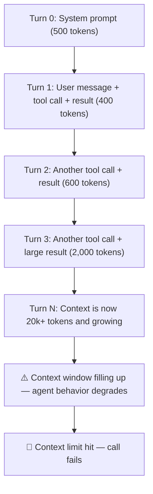
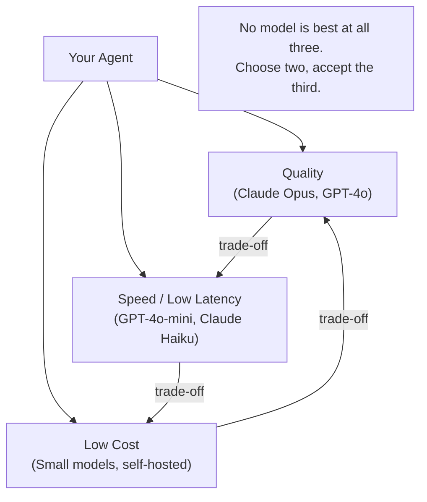

# LLM Fundamentals for Agent Builders

**Level**: 🟢 Beginner
**Reading Time**: 12 minutes

> Before you write a single line of agent code, you need to understand how LLMs actually work — because every design decision you make will depend on it.

## The Problem

Most developers jump into building agents using a framework before they understand the underlying model. Then they hit mysterious failures: the agent runs out of context halfway through a task, costs 10x more than expected, gives inconsistent results, or calls tools with garbled arguments. Almost all of these problems trace back to misunderstanding how LLMs work at a fundamental level.

This article covers everything you need to know before writing your first agent.

---

## Tokens, Not Words

LLMs don't read words — they read **tokens**. A token is a chunk of text, roughly:

- **1 token ≈ 0.75 English words ≈ 4 characters** (for GPT-4o and similar models)
- Pricing is expressed per 1,000 or 1,000,000 tokens

Concrete examples:

| Text | Tokens |
|------|--------|
| `"Hello world"` | 2 tokens |
| `"The quick brown fox"` | 4 tokens |
| `function calculateInterestRate(principal, rate, years)` | ~10 tokens |
| A full page of prose (500 words) | ~666 tokens |
| A typical agent system prompt | 300–800 tokens |

**Why this matters for agents:**

1. **Cost**: Every agent turn sends the full conversation history to the model. After 20 turns with tool results, you might be sending 8,000 tokens per call — without realizing it.

2. **Tokenization is not uniform**: Code and non-English text are more token-dense than English prose. A Python function that looks like 5 words might be 15 tokens. Chinese or Arabic text can be 2–3x the tokens of equivalent English.

3. **Token limits are hard limits**: If your agent's accumulated context exceeds the model's context window, the call fails. You need to know how fast context grows.

**Tokenization gotchas:**
- Camel case identifiers (`calculateInterestRate`) tokenize more efficiently than snake case (`calculate_interest_rate`) in some models
- Special characters (`{`, `}`, `[`, `]`) each consume a token
- Numbers tokenize per digit cluster, so `12345` might be 1 token but `1,234,567,890` might be 5

---

## Context Window = Working Memory

The **context window** is how much text the model can "see" at once — its working memory. Everything outside the context window simply does not exist to the model.

Current limits (as of 2025):

| Model | Context Window |
|-------|---------------|
| GPT-4o | 128k tokens |
| Claude 3.5 Sonnet / Claude 4 | 200k tokens |
| Gemini 1.5 Pro | 1M tokens |
| Llama 3.1 70B | 128k tokens |

**128k tokens sounds huge — why does it run out?**

For agents specifically, context fills fast because every turn appends to the history:



After 10 tool calls that return large results (database rows, web pages, file contents), you can easily hit 50k–100k tokens. This is why **context management** is one of the core skills in agent engineering.

**"Bigger isn't always better"** — three reasons:

1. **Cost**: Sending 200k tokens per call costs significantly more than 10k tokens
2. **Latency**: Time-to-first-token scales with prompt length
3. **Lost in the middle**: Research shows LLMs recall information from the beginning and end of the context reliably, but performance degrades for information buried in the middle of a very long context

**The practical rule**: Design your agent to stay well under half the context window during normal operation. Reserve the rest as buffer.

---

## Temperature and Sampling

**Temperature** controls how random the model's output is.

| Temperature | Behavior | Use case |
|-------------|----------|----------|
| 0.0 | Fully deterministic — same input → same output | Tool call parsing, structured output, data extraction |
| 0.1–0.3 | Mostly consistent, minor variation | Classification, routing decisions |
| 0.7–1.0 | Creative and varied | Writing, brainstorming, creative tasks |
| > 1.0 | Chaotic — often incoherent | Rarely useful |

**For agents specifically:**

- Use **temperature 0** for any step where the model outputs structured data (tool calls, JSON, SQL). Inconsistency here causes parse failures.
- Use **temperature 0.7** for the final response generation if you want natural-sounding text.
- Some frameworks let you set temperature per step — use this when your agent does both.

**top_p (nucleus sampling)**: An alternative to temperature. Instead of scaling all token probabilities, it cuts off the long tail — only sampling from the top tokens whose cumulative probability reaches p. `top_p=0.9` and `temperature=0.7` give similar levels of creativity. Most practitioners use one or the other, not both.

---

## Model Comparison

Choosing the right model is the first architecture decision in any agent project.

| Model | Context | Strength | Cost tier | Best for agents when... |
|-------|---------|----------|-----------|------------------------|
| Claude Opus 4 | 200k | Complex reasoning, long documents, nuanced judgment | $$$ | Task requires deep multi-step reasoning or long doc analysis |
| Claude Sonnet 3.5 / 4 | 200k | Balanced speed + quality, strong tool use | $$ | General agent workloads — the safe default |
| GPT-4o | 128k | Strong code generation, multimodal (vision) | $$ | Code agents, tasks involving images or screenshots |
| GPT-4o-mini | 128k | Fast, very cheap | $ | Routing, intent classification, summarization of tool results |
| Gemini 1.5 Pro | 1M | Extremely long context, entire codebases | $$ | Analyzing large codebases, processing entire document libraries |
| Llama 3.1 70B | 128k | Self-hosted, no data leaves your infra | $ (infra) | On-premise deployments, privacy-sensitive workloads |

**The latency / quality / cost triangle** — every model choice is a trade-off:



In practice, most production agents use **model routing**: a cheap small model handles simple tasks (routing, classification, summarization), and the expensive model handles only the steps that need it. This can reduce costs by 40–70%.

---

## System Prompt, User Message, Assistant Message

Every LLM call is a sequence of messages in one of three roles:

```
System message:
  "You are a helpful assistant that manages calendar events.
   You have access to the following tools: [tool list]"

User message:
  "Schedule a meeting with Sarah next Tuesday at 2pm"

Assistant message:
  [tool call: calendar_search(date="next Tuesday")]

Tool result:
  [result: "Tuesday 2025-04-15, slots available: 9am, 2pm, 4pm"]

Assistant message:
  [tool call: calendar_create(date="2025-04-15", time="14:00", attendees=["sarah@co.com"])]

Tool result:
  [result: "Event created. ID: cal_8821"]

Assistant message (final):
  "Done! I've scheduled a meeting with Sarah on Tuesday, April 15th at 2pm."
```

**Key insight: the model has no memory beyond this array.** Every call to the LLM is stateless from its perspective. The "memory" of an agent is literally the messages array you pass in. This is why context management matters so much — you are responsible for what the model sees.

**Why the system prompt is special:**
- It is prepended to every LLM call in the conversation
- It sets the permanent context: tools, rules, identity, output format
- It consumes tokens on every single call — keep it concise

**How conversation history works:**

```
messages = [
  SystemMessage(content="You are..."),
  HumanMessage(content="First user question"),
  AIMessage(content="First answer"),
  HumanMessage(content="Second question"),
  AIMessage(content="...with tool call..."),
  ToolResultMessage(content="...tool result..."),
  AIMessage(content="Final answer based on tool result")
]

// This entire array is sent to the model on every call.
// The model generates the NEXT message in the sequence.
```

The model doesn't "remember" previous conversations — you reconstruct its memory by including past messages in each call.

---

## What This Means for Agent Architecture

| LLM property | Implication for agent design |
|--------------|------------------------------|
| Priced per token | Minimize context growth; summarize tool results; prune old turns |
| Context window is finite | Implement a context management strategy before you need it |
| Temperature 0 for structured output | Set low temperature for tool call steps |
| No memory beyond context | Implement external memory (vector DB, conversation summaries) for long-running agents |
| Cost/latency/quality triangle | Use model routing — cheap model for routing, expensive for reasoning |
| System prompt always included | Keep system prompts tight; every token costs money |

---

## Common Pitfalls

1. **Ignoring token counts until the bill arrives**: Profile token usage from day one. Log input and output tokens per call.
2. **Using temperature 0.7 for tool calls**: Inconsistent tool call JSON causes parse errors. Use temperature 0 for structured output steps.
3. **Dumping raw tool results into context**: A web search result might be 5,000 tokens. Summarize or truncate before adding to context.
4. **Choosing the most capable model by default**: GPT-4o and Claude Opus are expensive. Start with a mid-tier model and upgrade only when quality is insufficient.
5. **Forgetting the "lost in the middle" problem**: If you're relying on information buried deep in a 100k-token context, the model may miss it. Structure contexts so critical info is near the beginning or end.

---

## Key Takeaways

- **Tokens** are the unit of LLM work — they drive cost, context limits, and latency
- **Context window** is the model's only memory; agents fill it across turns — manage it actively
- **Temperature 0** for structured output and tool calls; higher for creative generation
- **No single model is best** — use model routing to match task complexity to model capability
- **Message history is the agent's memory** — you control what gets included; the model has no state beyond what you pass in
- **System prompts cost tokens on every call** — write them carefully
