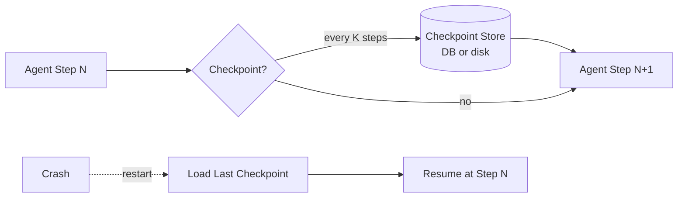
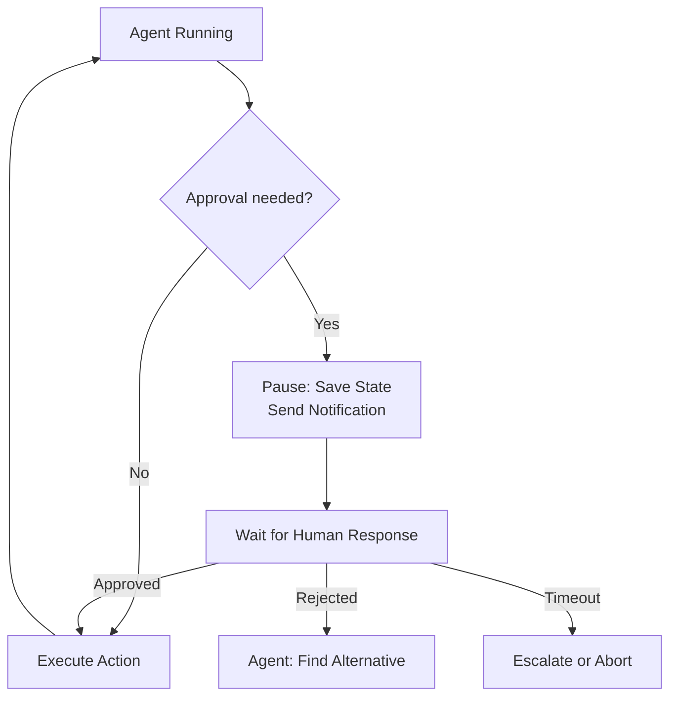
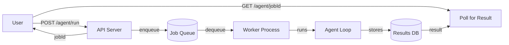

# Long-Running Agents

**Level**: 🔴 Advanced
**Reading Time**: 12 minutes

> Most agent tutorials show you a 5-step demo. Production agents run for minutes, hours, or days — and need to survive crashes, wait for humans, and resume where they left off.

## The Problem

Short agents are simple: run a loop, get an answer, done. Long-running agents face a different set of problems:

1. **Context overflow**: An agent running 100 steps accumulates context that eventually fills the LLM's window.
2. **Crashes lose progress**: If an agent that's been running for 10 minutes crashes at step 47, you lose all 47 steps unless you've been checkpointing.
3. **Human approvals are needed**: Some actions (sending an email, committing code, spending money) need a human to review before proceeding.
4. **Async execution**: The user doesn't want to hold an HTTP connection open for 5 minutes waiting for results.
5. **Partial results**: The user may want to see progress before the agent is done.

## Pattern 1: Checkpointing

Serialize the agent's state to persistent storage periodically. On restart, load the last checkpoint and continue from there.



```
// Checkpointing agent loop
function checkpointedAgent(task, config):
  // Attempt to load existing checkpoint
  checkpoint = CheckpointStore.load(task.id)

  if checkpoint is not null:
    state = checkpoint.state
    log.info("Resuming from step " + checkpoint.stepNumber)
  else:
    state = AgentState(
      messages = [SystemMessage(config.systemPrompt), HumanMessage(task.query)],
      stepNumber = 0,
      taskId = task.id,
      startedAt = now()
    )

  while state.stepNumber < config.maxSteps:
    state.stepNumber += 1

    response = LLM.generate(state.messages)

    if response.type == FINAL_ANSWER:
      CheckpointStore.delete(task.id)  // Clean up on success
      return AgentResult(SUCCESS, response.text)

    // Handle tool calls
    state.messages.append(AIMessage(response))
    for toolCall in response.toolCalls:
      result = dispatchTool(toolCall)
      state.messages.append(ToolResult(toolCall.id, result))

    // Checkpoint every K steps
    if state.stepNumber % config.checkpointInterval == 0:
      CheckpointStore.save(task.id, state)
      log.debug("Checkpointed at step " + state.stepNumber)

  return AgentResult(MAX_STEPS, partial=summarize(state))

// Checkpoint serialization
CheckpointStore = {
  save: function(taskId, state):
    serialized = JSON.serialize(state)
    DB.upsert(
      key = "checkpoint:" + taskId,
      value = serialized,
      ttl = 24 * 3600  // 24 hour TTL — don't keep stale checkpoints forever
    )

  load: function(taskId):
    serialized = DB.get("checkpoint:" + taskId)
    if serialized is null:
      return null
    return JSON.deserialize(serialized)

  delete: function(taskId):
    DB.delete("checkpoint:" + taskId)
}
```

**What to checkpoint**: The full message history + step count + metadata. If your agent accumulates external state (files written, API calls made), include those too.

## Pattern 2: Human-in-the-Loop

Some agent actions are irreversible or high-stakes. The agent pauses before these actions and waits for human approval.



```
// Actions that require human approval
APPROVAL_REQUIRED_TOOLS = [
  "send_email",
  "deploy_to_production",
  "delete_records",
  "process_payment",
  "commit_to_main"
]

// Modified tool dispatcher with approval gate
function dispatchWithApproval(toolCall, state, approvalSystem):
  if toolCall.toolName in APPROVAL_REQUIRED_TOOLS:
    // Pause the agent
    approvalRequest = ApprovalRequest(
      taskId = state.taskId,
      toolName = toolCall.toolName,
      toolArgs = toolCall.args,
      agentRationale = extractRationale(state.messages[-3:]),
      requestedAt = now(),
      timeoutAt = now() + 30 * 60  // 30 minute timeout
    )

    // Persist state and create approval request
    CheckpointStore.save(state.taskId, state)
    approvalSystem.request(approvalRequest)

    // Return a special result that signals the agent to pause
    return ApprovalPending(approvalRequest.id)

  // Regular tool dispatch
  return tools[toolCall.toolName].execute(toolCall.args)

// When human responds, resume the agent
function resumeAfterApproval(taskId, approvalId, decision):
  state = CheckpointStore.load(taskId)
  approvalRequest = ApprovalStore.get(approvalId)

  if decision == APPROVED:
    result = tools[approvalRequest.toolName].execute(approvalRequest.toolArgs)
    toolResult = ToolResult(approvalRequest.toolCallId, result)
  else:
    toolResult = ToolResult(
      approvalRequest.toolCallId,
      "Action rejected by human. Reason: " + decision.reason
    )

  state.messages.append(toolResult)
  return checkpointedAgent(state)  // Continue the agent
```

## Pattern 3: Async Job Runner

The user kicks off an agent and gets a job ID back immediately. They poll for results or receive a callback.



```
// API endpoint
POST /agent/run:
  request = { query: string, userId: string, config: AgentConfig }

  // Validate and create job
  jobId = generateId()
  job = AgentJob(
    id = jobId,
    query = request.query,
    userId = request.userId,
    status = QUEUED,
    createdAt = now()
  )
  JobStore.save(job)
  JobQueue.enqueue(jobId)

  return { jobId: jobId, statusUrl: "/agent/" + jobId }

// Worker process
function agentWorker():
  while true:
    jobId = JobQueue.dequeue(waitTimeout=30)
    if jobId is null:
      continue

    job = JobStore.get(jobId)
    job.status = IN_PROGRESS
    job.startedAt = now()
    JobStore.save(job)

    try:
      result = checkpointedAgent(job)
      job.status = COMPLETE
      job.result = result
      job.completedAt = now()
    catch error:
      job.status = FAILED
      job.error = error.message

    JobStore.save(job)
    notifyUser(job.userId, job)  // Webhook or email

// Status polling endpoint
GET /agent/{jobId}:
  job = JobStore.get(jobId)
  return {
    jobId: job.id,
    status: job.status,           // QUEUED | IN_PROGRESS | COMPLETE | FAILED
    progress: job.stepCount,
    result: job.result,           // null until COMPLETE
    error: job.error,             // null unless FAILED
    createdAt: job.createdAt,
    completedAt: job.completedAt
  }
```

## Handling Context Overflow in Long Runs

Long-running agents inevitably fill the context. The solution: progressive summarization.

```
function manageContextWindow(state, maxTokens):
  currentTokens = countTokens(state.messages)

  if currentTokens < maxTokens * 0.8:
    return state  // Still have room

  // Keep: system prompt + last N messages
  systemPrompt = state.messages[0]
  recentMessages = state.messages[-20:]
  oldMessages = state.messages[1:-20]

  // Summarize old messages
  summary = LLM.generate(
    messages = [SystemMessage("Summarize the following agent work concisely:"),
                HumanMessage(formatMessages(oldMessages))],
    maxTokens = 500
  )

  // Build compressed state
  compressionNote = SystemMessage(
    "Context was compressed. Summary of earlier work:\n" + summary.text
  )

  state.messages = [systemPrompt, compressionNote] + recentMessages
  state.compressionCount += 1
  log.info("Compressed context. Compression #" + state.compressionCount)

  return state
```

## Real-World Usage

**GitHub Actions + AI agents**: When an AI agent kicks off a CI/CD pipeline, it waits for the build to complete (potentially 20 minutes) before proceeding. This is an async long-running pattern with checkpointing between steps.

**Claude Projects**: Long research projects save conversation state server-side and allow the user to return hours later. Episodic memory checkpoints are what make this possible.

**Devin**: Each coding task can take 10-30 minutes. Devin checkpoints its state (current file edits, terminal state, running tests) and allows users to watch progress asynchronously via a live session view.

**AWS Step Functions with AI steps**: Enterprise systems use Step Functions to orchestrate long-running AI workflows. Each Lambda function is an agent step; Step Functions handles checkpointing, retries, and human approval steps natively.

## Common Pitfalls

1. **No checkpoint TTL**: Stale checkpoints accumulate in your storage. A job that was abandoned 6 months ago still has its checkpoint. Set a TTL based on expected max runtime + buffer.
2. **Checkpointing too infrequently**: Checkpoint every step for high-value, slow tasks. For fast tasks, every 10 steps is fine. The cost of redoing work > cost of more frequent checkpoints.
3. **Human approvals with no timeout**: If the human never responds, the agent waits forever. Set a timeout and define what happens on timeout (escalate, abort, or auto-approve).
4. **Not handling partial results**: If an agent ran for 5 minutes and got 80% done before failing, the user wants those partial results. Always surface partial state on failure.
5. **Workers not idempotent**: If a step runs twice due to retry logic, it should produce the same result (or detect it already ran). Non-idempotent steps cause double-sends, double-commits, etc.

## Key Takeaways

- Long-running agents need three mechanisms: checkpointing (survive crashes), human-in-loop (pause for approvals), and async job queues (don't block users)
- Checkpoint serializes full agent state to persistent storage at regular intervals
- Human-in-loop gates pause the agent, notify a human, and resume from the checkpoint after approval or rejection
- Async job runners return a job ID immediately and let users poll for results
- Context overflow is inevitable in long runs — implement progressive summarization to compress old context
- Set TTLs on checkpoints, timeouts on human approvals, and handle all partial-failure states
