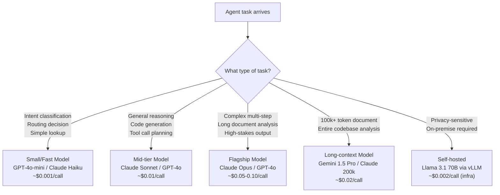
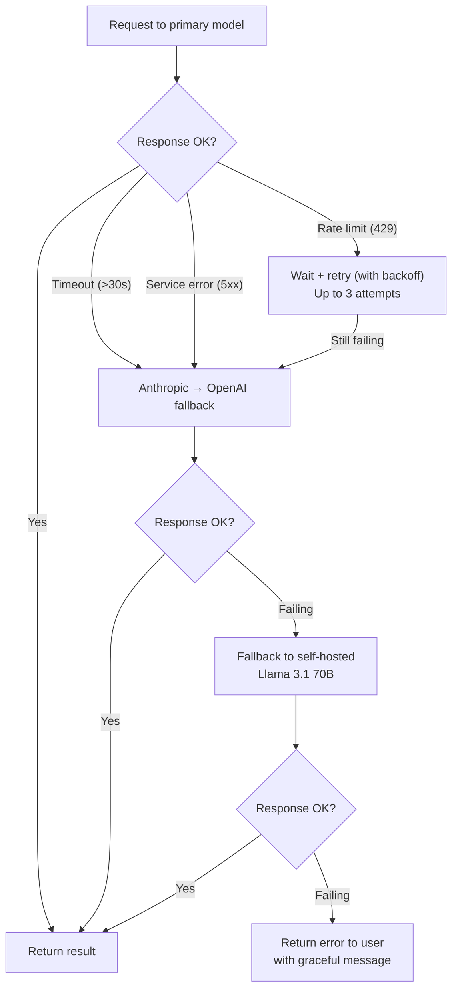

# Multi-Model Routing & Fallback

**Level**: 🔴 Advanced
**Reading Time**: 15 minutes

> No single model is best at everything. A well-routed pipeline uses GPT-4o-mini to classify, Claude Sonnet to reason, and Gemini for 300-page documents — at 60% of the cost of using the flagship model for everything.

## The Problem

Most teams start by routing every request to their best model (GPT-4o, Claude Opus). Then the bill arrives.

The flagship models are overkill for most agent tasks. Routing a single-step lookup to Claude Opus costs 15–20x more than routing it to Claude Haiku. At scale, this is the difference between $10K/month and $150K/month for the same workload.

But the opposite problem is also real: routing a complex multi-step reasoning task to a cheap model produces garbage output, which the agent then builds on, compounding the error across subsequent steps.

Multi-model routing is the practice of matching each task in an agent pipeline to the cheapest model that meets the quality bar for that task — with automatic fallback when that model fails.

---

## Why Use Multiple Models

| What you need | Best option | Why others fall short |
|---------------|-------------|----------------------|
| Classify user intent into 1 of 20 buckets | GPT-4o-mini, Claude Haiku | Flagship models cost 10–20x more and add latency with no quality gain |
| Generate code for a complex feature | GPT-4o, Claude Sonnet | Code-specialized models significantly outperform smaller models here |
| Analyze a 200-page legal document | Claude Sonnet/Opus (200k context) | GPT-4o truncates at 128k; Gemini 1.5 Pro at 1M context is ideal |
| Multi-step reasoning across many facts | Claude Opus, GPT-4o | Small models lose track of reasoning chains in complex scenarios |
| Self-hosted private data | Llama 3.1 70B (via Ollama/vLLM) | API providers receive all data; on-premise eliminates this |
| Vision: analyzing screenshots or images | GPT-4o, Gemini 1.5 Pro | Most small models lack vision capability |

**Rough cost ratios (2025 approximate):**

| Model | Relative cost (vs Haiku = 1x) |
|-------|-------------------------------|
| Claude Haiku 3.5 | 1x |
| GPT-4o-mini | 1.5x |
| Claude Sonnet 3.5 | 10x |
| GPT-4o | 12x |
| Claude Opus 4 | 25x |
| Gemini 1.5 Pro | 8x |
| Llama 3.1 70B (hosted) | 2x |

A pipeline that uses the right model for each step can be **40–70% cheaper** than an all-flagship approach with equivalent quality.

---

## Routing Strategies

### 1. Task-Based Routing

Route by the type of task being performed. The simplest and most reliable routing strategy.



**Task type taxonomy:**

```
ROUTING_TABLE = {
  "intent_classification": "gpt-4o-mini",
  "entity_extraction": "gpt-4o-mini",
  "summarization": "claude-haiku-3-5",
  "code_generation": "gpt-4o",
  "code_review": "claude-sonnet-3-5",
  "complex_reasoning": "claude-opus-4",
  "long_document_qa": "gemini-1.5-pro",
  "final_response_generation": "claude-sonnet-3-5",  // default
  "tool_call_planning": "claude-sonnet-3-5"
}
```

### 2. Cost-Based Routing

Start with the cheapest model. If the output quality check fails, retry with a better model.

```
function costBasedRoute(task, maxRetries=2):
  modelTier = ["gpt-4o-mini", "claude-sonnet-3-5", "claude-opus-4"]

  for i in 0..maxRetries:
    model = modelTier[i]
    result = callModel(model, task)

    if qualityCheck(result, task.requiredQuality):
      return result  // success at this tier

    // Log: escalated from tier i to tier i+1
    log.warn("Quality check failed on " + model + ", escalating")

  return result  // return best attempt even if quality check failed
```

**Defining quality checks:**
- For structured output: does the JSON parse and match the schema?
- For classification: does the result fall within the valid label set?
- For code: does it pass a syntax check or test suite?
- For open-ended generation: use a judge model (see below)

### 3. Latency-Based Routing

Route based on response time requirements. SLA-sensitive paths get the fastest model; background/async tasks get the best model.

```
function latencyBasedRoute(task):
  if task.slaMs <= 500:
    // Real-time response required (e.g., streaming chat UI)
    return route_to("gpt-4o-mini")  // p99 ~300ms

  if task.slaMs <= 2000:
    // Near-real-time (most interactive agent use cases)
    return route_to("claude-sonnet-3-5")  // p99 ~1.5s

  if task.isAsync:
    // Background job — latency doesn't matter, maximize quality
    return route_to("claude-opus-4")  // p99 ~5-10s

  // Default
  return route_to("claude-sonnet-3-5")
```

**Latency benchmark (2025 approximate, time-to-first-token for ~500 token prompts):**

| Model | p50 TTFT | p99 TTFT |
|-------|----------|----------|
| GPT-4o-mini | ~150ms | ~400ms |
| Claude Haiku 3.5 | ~200ms | ~500ms |
| GPT-4o | ~400ms | ~1.2s |
| Claude Sonnet 3.5 | ~500ms | ~1.5s |
| Claude Opus 4 | ~1.5s | ~5s |
| Gemini 1.5 Pro | ~600ms | ~2s |

### 4. Capability-Based Routing

Route based on specific model capabilities:

```
function capabilityRoute(task):
  if task.hasImages or task.hasScreenshots:
    return route_to("gpt-4o")  // strong vision

  if task.documentTokens > 100_000:
    return route_to("gemini-1.5-pro")  // 1M context window

  if task.requiresPrivacy or task.isOnPremise:
    return route_to("llama-3.1-70b")  // self-hosted

  if task.isFunctionCalling and task.toolCount > 10:
    return route_to("claude-sonnet-3-5")  // strong tool use

  return route_to(DEFAULT_MODEL)
```

---

## Fallback Chains

A fallback chain handles the case where your primary model is unavailable or fails.



**Failure conditions to handle:**

| Error type | Action |
|------------|--------|
| HTTP 429 (rate limit) | Exponential backoff, retry up to 3x, then fallback |
| HTTP 500/503 (provider error) | Immediate fallback to next provider |
| Timeout (no response in >30s) | Cancel, fallback to faster model |
| JSON parse error (malformed tool call) | Retry once (with temperature 0), then fallback |
| Quality check failure | Route to better model (cost-based routing) |
| Context length exceeded | Switch to longer-context model |

**Provider health checks:**

```
class ProviderHealthChecker:
  health = {
    "anthropic": { status: "healthy", p99_latency_ms: 1500, error_rate: 0.01 },
    "openai": { status: "healthy", p99_latency_ms: 800, error_rate: 0.005 },
    "self_hosted": { status: "healthy", p99_latency_ms: 2000, error_rate: 0.001 }
  }

  // Update every 60 seconds from metrics
  function isHealthy(provider):
    h = health[provider]
    return h.status == "healthy"
      and h.error_rate < 0.05      // <5% error rate
      and h.p99_latency_ms < 5000  // <5s p99

  function getBestProvider(taskType):
    candidates = ROUTING_TABLE[taskType]
    return candidates.find(c => isHealthy(c))
```

---

## Output Quality Gates

Quality gates programmatically check if a model's output is good enough before proceeding.

**Level 1: Schema validation** (cheap, always do this)
```
function schemaValidate(output, schema):
  try:
    parsed = JSON.parse(output)
    validate(parsed, schema)  // JSON Schema validation
    return { valid: true, parsed }
  catch:
    return { valid: false, error: "JSON parse or schema mismatch" }
```

**Level 2: Constraint checking** (cheap, task-specific)
```
function constraintCheck(output, task):
  checks = [
    output.confidence >= task.minConfidence,
    output.label in task.validLabels,    // for classification
    output.code.startsWith("def "),       // for Python code
    !output.contains("I don't know")     // for extraction tasks
  ]
  return checks.every(c => c == true)
```

**Level 3: Judge model** (moderate cost, use for high-stakes output)

The judge model pattern: use a small cheap model to evaluate the output of a larger model.

```
function judgeModelEval(output, task, judgeModel="gpt-4o-mini"):
  prompt = """
    Evaluate this output on a scale of 1-5 for the following task.
    Task: {task.description}
    Output: {output}

    Respond with JSON: { score: <1-5>, reason: "<one sentence>" }
    Score 4+ means the output is acceptable.
  """
  result = callModel(judgeModel, prompt, temperature=0)
  parsed = JSON.parse(result)
  return {
    acceptable: parsed.score >= 4,
    score: parsed.score,
    reason: parsed.reason
  }
```

The judge model doesn't need to be as capable as the model being evaluated — it just needs to assess correctness. This makes it cheap (use GPT-4o-mini to judge GPT-4o output).

---

## Rate Limit and Auth Profile Management

At scale, you hit per-API-key rate limits before you hit model capacity limits. The solution is multiple API keys ("auth profiles") with automatic rotation.

This is essentially multi-account rate limit management:

```
class AuthProfileManager:
  profiles = [
    { provider: "anthropic", apiKey: key1, requestsPerMin: 100, currentUsage: 0 },
    { provider: "anthropic", apiKey: key2, requestsPerMin: 100, currentUsage: 0 },
    { provider: "openai",    apiKey: key3, requestsPerMin: 200, currentUsage: 0 }
  ]

  function getAvailableProfile(provider):
    available = profiles
      .filter(p => p.provider == provider)
      .filter(p => p.currentUsage < p.requestsPerMin * 0.9)  // 90% of limit
      .sortBy(p => p.currentUsage / p.requestsPerMin)  // least loaded first

    if available.isEmpty():
      throw RateLimitExhaustedException(provider)

    return available[0]

  function callWithRotation(provider, request, maxRetries=24):
    for attempt in 1..maxRetries:
      profile = getAvailableProfile(provider)
      try:
        result = callAPI(profile.apiKey, request)
        profile.currentUsage += 1
        return result
      catch RateLimitError:
        profile.markRateLimited()
        if attempt == maxRetries:
          throw
```

This pattern (multiple profiles + rotation) allows N× the throughput of a single API key, where N is the number of profiles. Combined with cross-provider fallback, it provides high availability under load.

---

## Provider Comparison (2025)

| Provider | Rate limits | Pricing model | Latency | Notes |
|----------|------------|---------------|---------|-------|
| Anthropic (Claude) | Tier-based (usage grows limits) | Per-token (input + output) | Medium | Best long-context, strong tool use |
| OpenAI | Tier-based | Per-token | Fast | Best code, multimodal, widest ecosystem |
| Google (Gemini) | Per-minute request limits | Per-token + per-image | Medium | Best raw context window (1M) |
| AWS Bedrock | Account-level quotas | Per-token + API call | Medium | Multi-model API, no data leaves AWS |
| Azure OpenAI | Deployment-level TPM | Per-token | Fast | Enterprise compliance (SOC2, HIPAA BAA) |
| Self-hosted (Ollama/vLLM) | Hardware-limited | Infra cost only | Varies | Full data control, no API dependency |

**When to use AWS Bedrock or Azure OpenAI** (instead of direct provider APIs):
- SOC2, HIPAA BAA, or FedRAMP compliance requirements
- Data residency requirements (data must not leave a specific region)
- Prefer single cloud bill, IAM integration, no new vendor relationships

---

## Cost Savings from Smart Routing

Illustrative example: a customer support agent handling 100,000 requests/day.

```
Without routing (all Claude Opus):
  100,000 requests × avg 2,000 tokens × $0.015/1k = $3,000/day = $90K/month

With smart routing:
  60% intent classification   → GPT-4o-mini: 60k × 500 tokens × $0.00015/1k = $4.50/day
  30% general responses       → Claude Sonnet: 30k × 2,000 tokens × $0.003/1k = $180/day
  10% complex reasoning       → Claude Opus: 10k × 3,000 tokens × $0.015/1k = $450/day
  Total: ~$635/day = ~$19K/month

Savings: ~79% cost reduction for equivalent quality
```

The exact numbers vary by use case, but **40–70% cost reduction** is typical for production agents that implement proper routing.

---

## Common Pitfalls

1. **Routing all tasks to the best model "to be safe"**: The most expensive models are not always better for simple tasks. A small model will correctly classify intent thousands of times for the cost of one Opus call.
2. **No fallback chain**: A single-provider, single-model agent has zero resilience. Any API outage takes the whole system down.
3. **Not measuring quality per model tier**: You need to know your quality metrics before routing decisions make sense. Don't route without an eval set.
4. **Over-engineering routing logic**: Start simple (task-based routing) before adding cost-based or latency-based complexity. Premature optimization creates maintenance burden.
5. **Ignoring context window differences**: Routing to GPT-4o for a 150k-token document will fail — the context window is only 128k. Check context length before routing.
6. **No observability on routing decisions**: Log which model handled which request and what the outcome was. Without this data, you can't improve your routing policy.

---

## Key Takeaways

- No single model is best at everything — use the cheapest model that meets the quality bar for each task
- Task-based routing is the simplest strategy: classify tasks by type and route to the appropriate model tier
- Fallback chains provide resilience: primary provider → fallback provider → self-hosted, with automatic failover on rate limits or errors
- Output quality gates (schema validation → constraint checking → judge model) programmatically verify output before proceeding
- Auth profile rotation multiplies your effective rate limit ceiling — essential at high throughput
- Smart routing typically yields 40–70% cost savings vs. single-model approaches with equivalent quality
- Observe routing decisions — log which model handled what, at what cost, with what quality outcome
