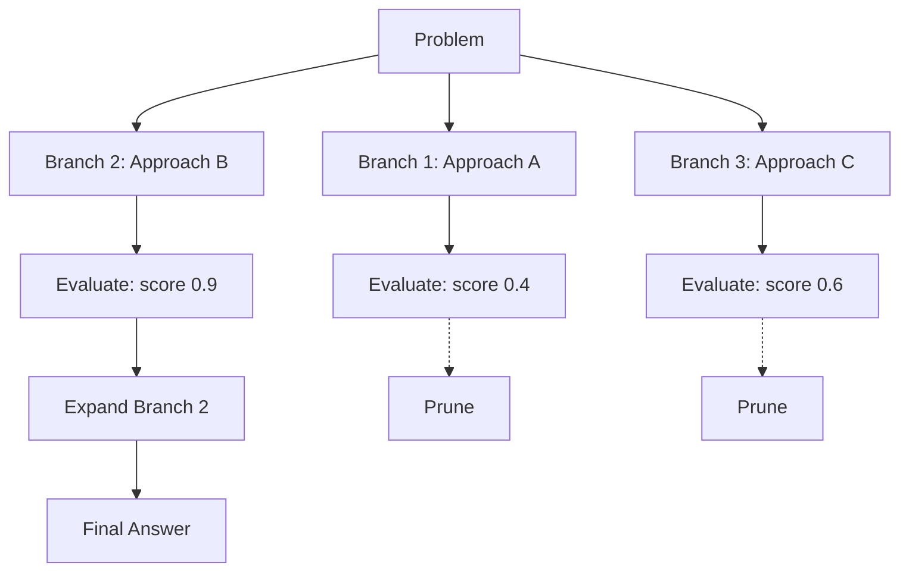
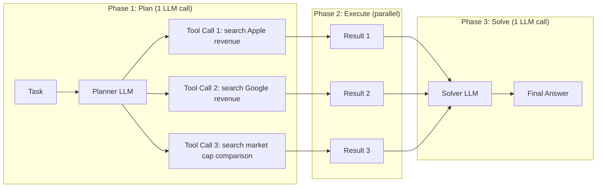

# Agent Planning Patterns

**Level**: 🔴 Advanced
**Reading Time**: 13 minutes

> Execution without planning is thrashing. Planning without feedback is wishful thinking. The best agents do both.

## The Problem

The basic agent loop (sense → act → observe → repeat) works for simple tasks. It fails for complex multi-step tasks because:

1. **No upfront plan**: The agent discovers it needs a tool mid-task, after already wasting steps
2. **Serial tool execution**: Each step waits for the previous one, even when tools could run in parallel
3. **No self-correction**: The agent commits to a bad direction and keeps going down the wrong path
4. **Token waste**: Re-reading long context windows at each step is expensive

Different planning patterns address these failures in different ways. Choosing the right pattern for your task determines whether your agent is efficient or expensive, reliable or fragile.

## Pattern 1: Chain-of-Thought (CoT)

The simplest planning pattern. The agent reasons step-by-step before acting. No special structure — just thinking before doing.

```
// Chain-of-Thought: think before acting
function cotAgent(task, tools):
  messages = [
    SystemMessage("""
      Think step by step before using any tools.
      First, outline what you need to do.
      Then execute each step.
    """),
    HumanMessage(task)
  ]

  while true:
    response = LLM.generate(messages, tools=tools)

    if response.type == FINAL_ANSWER:
      return response.text

    if response.type == TOOL_CALL:
      result = executeToolCall(response.toolCall)
      messages.append(AIMessage(response))
      messages.append(ToolResult(response.toolCall.id, result))
```

Example CoT trace for "Compare the revenue of Apple and Google in Q4 2024":
```
Step 1: I need Apple's Q4 2024 revenue. Let me search for that.
→ Tool: search("Apple Q4 2024 revenue")
→ Result: $124.3 billion

Step 2: I need Google's Q4 2024 revenue. Let me search for that.
→ Tool: search("Google Alphabet Q4 2024 revenue")
→ Result: $96.5 billion

Step 3: I have both numbers. Apple is $124.3B, Google is $96.5B.
Apple is $27.8B (28.8%) higher.
→ Final Answer: Apple Q4 2024 revenue was $124.3B vs Google's $96.5B...
```

Cost: 2 LLM calls + 2 tool calls. Sequential — each step waits for the previous.

## Pattern 2: Tree-of-Thought (ToT)

For complex problems with multiple viable approaches, ToT explores several solution paths in parallel and picks the best one:



```
// Tree-of-Thought: branch, evaluate, prune
function totAgent(task, tools, branchFactor=3, maxDepth=3):
  // Generate initial branches
  branches = generateBranches(task, branchFactor)

  for depth in 1..maxDepth:
    // Score each branch
    scoredBranches = []
    for branch in branches:
      score = evaluateBranch(task, branch)
      scoredBranches.append({ branch: branch, score: score })

    // Prune low-scoring branches
    scoredBranches.sortByScore(descending=True)
    topBranches = scoredBranches[:branchFactor]

    // Check if best branch is complete
    bestBranch = topBranches[0]
    if bestBranch.branch.isComplete():
      return bestBranch.branch.answer

    // Expand best branches
    newBranches = []
    for item in topBranches:
      expanded = expandBranch(item.branch, tools, branchFactor=2)
      newBranches.extend(expanded)
    branches = newBranches

  // Return best available answer
  return topBranches[0].branch.bestAnswer()

function generateBranches(task, count):
  response = LLM.generate(
    messages = [
      SystemMessage("Generate " + count + " different approaches to solve this task. Output as numbered list."),
      HumanMessage(task)
    ]
  )
  return parseBranches(response.text)

function evaluateBranch(task, branch):
  response = LLM.generate(
    messages = [
      SystemMessage("Rate the quality of this approach on a scale from 0.0 to 1.0. Output only the number."),
      HumanMessage("Task: " + task + "\n\nApproach:\n" + branch.description)
    ]
  )
  return parseFloat(response.text)
```

Cost: `branchFactor * depth` LLM calls for evaluation + execution calls. ToT is expensive — use it only when solution quality justifies the cost.

**When to use ToT**: Creative writing, strategy problems, ambiguous requirements where multiple valid approaches exist. Not for factual retrieval or well-defined procedures.

## Pattern 3: ReWOO (Reasoning WithOut Observation)

Standard CoT waits for each tool result before deciding the next step. ReWOO plans all tool calls upfront, executes them in parallel, then synthesizes results in a final pass:



```
// ReWOO: plan once, execute in parallel, solve once
function rewooAgent(task, tools):
  // Phase 1: Generate the full plan in a single LLM call
  planPrompt = """
  You are a planning agent. Given the task, output a structured plan listing
  ALL the tool calls you need to make. Do not execute them — just plan.
  Format each step as:
  [Step N] Tool: <tool_name>, Input: <input>

  Important: You can reference previous step results using #E1, #E2, etc.
  in later steps' inputs.
  """

  planResponse = LLM.generate(
    messages = [SystemMessage(planPrompt), HumanMessage(task)],
    tools = tools
  )
  plan = parsePlan(planResponse.text)

  // Phase 2: Execute all tool calls (parallelize where possible)
  results = {}
  for batch in topologicallySortedBatches(plan):
    // Steps in the same batch have no dependencies on each other
    batchResults = parallel.map(batch, step =>
      tool = tools.find(step.toolName)
      input = substituteReferences(step.input, results)  // Replace #E1, #E2...
      result = tool.execute(input)
      return { stepId: step.id, result: result }
    )
    for r in batchResults:
      results[r.stepId] = r.result

  // Phase 3: Synthesize results into final answer
  evidenceBlock = results.map((id, r) => "#E" + id + ": " + r).join("\n")

  finalResponse = LLM.generate(
    messages = [
      SystemMessage("Using the evidence gathered, answer the original task."),
      HumanMessage("Task: " + task + "\n\nEvidence:\n" + evidenceBlock)
    ]
  )

  return finalResponse.text
```

Cost comparison for a 5-tool-call task:
- CoT: 5 sequential LLM calls + 5 sequential tool calls = ~5× latency
- ReWOO: 1 planner call + parallel tools + 1 solver call = ~2× latency

ReWOO is ideal when tools are I/O-bound (API calls, database queries) and can run in parallel.

## Pattern 4: Reflexion (Self-Critique Loop)

The agent generates an answer, critiques its own output, then revises. Multiple passes of generate → critique → revise until quality is acceptable or iteration limit is hit:

```
// Reflexion: generate → critique → revise
function reflexionAgent(task, tools, maxIterations=3, qualityThreshold=0.8):
  // Generate initial response
  draft = cotAgent(task, tools)

  for iteration in 1..maxIterations:
    // Self-critique: evaluate the draft
    critique = LLM.generate(
      messages = [
        SystemMessage("""
          You are a critical reviewer. Evaluate this response for:
          1. Factual accuracy (are the claims correct?)
          2. Completeness (does it fully answer the task?)
          3. Logical consistency (are there contradictions?)

          Output:
          SCORE: <0.0-1.0>
          ISSUES: <list of specific issues>
          SUGGESTIONS: <specific improvements>
        """),
        HumanMessage("Task: " + task + "\n\nResponse:\n" + draft)
      ]
    )

    critiqueParsed = parseCritique(critique.text)

    // If quality is good enough, stop iterating
    if critiqueParsed.score >= qualityThreshold:
      return draft

    // Revise based on critique
    draft = LLM.generate(
      messages = [
        SystemMessage("Revise the response to address the identified issues."),
        HumanMessage(
          "Original task: " + task +
          "\n\nCurrent response:\n" + draft +
          "\n\nCritique:\n" + critiqueParsed.issues +
          "\n\nSuggestions:\n" + critiqueParsed.suggestions +
          "\n\nWrite an improved response:"
        )
      ],
      tools = tools  // Allow additional tool calls during revision
    )

  return draft  // Return best after max iterations
```

Reflexion is powerful for: code generation (generate → test → fix loop), writing quality (generate → edit → polish), and factual accuracy (generate → verify → correct).

## Comparing the Four Patterns

| Pattern | LLM Calls | Parallelism | Quality | Cost | Best For |
|---------|-----------|-------------|---------|------|----------|
| CoT | 1 per step | None | Good | Low | Simple tasks, fast response |
| ToT | `branches × depth` | Branch-level | Best | Very High | Ambiguous, creative problems |
| ReWOO | 2 (plan + solve) | Full tool parallelism | Good | Low-Medium | Many independent tool calls |
| Reflexion | 2-6+ (per iteration) | None | Very High | Medium-High | Quality-critical outputs |

## Combining Patterns

Production agents often combine patterns:

```
// Combined: ReWOO for data gathering + Reflexion for quality
function highQualityResearchAgent(task, tools):
  // Use ReWOO to gather all data efficiently (parallel tools)
  rawData = rewooAgent(task, tools)

  // Use Reflexion to ensure quality of final synthesis
  return reflexionAgent(
    task = task + "\n\nUse this gathered data:\n" + rawData,
    tools = [],  // No more tool calls in reflexion phase — only synthesis
    maxIterations = 2,
    qualityThreshold = 0.85
  )
```

## Common Pitfalls

1. **Using ToT when CoT is sufficient**: ToT generates many LLM calls. For factual retrieval tasks with a clear answer, CoT gives the same result at 10× lower cost. Reserve ToT for genuinely ambiguous problems.
2. **ReWOO failing on dependent steps**: If step 3 depends on step 2's result, ReWOO must execute them sequentially, not in parallel. Topologically sort the plan before parallel execution.
3. **Reflexion loop without convergence check**: Without a quality threshold or max iteration limit, Reflexion can loop indefinitely, changing the answer on each pass without actual improvement.
4. **Too many Reflexion iterations**: Two iterations capture most of the quality gain. Three or more iterations have diminishing returns and often introduce regressions (the model "fixes" things that weren't broken).
5. **Planning without execution feedback**: ReWOO plans upfront but if a tool call fails mid-execution, the plan can't adapt. Add error handling: if a planned tool call fails, fall back to CoT for the remaining steps.

## Key Takeaways

- CoT: think step-by-step before acting — simple, cheap, good for well-defined tasks
- ToT: branch into multiple approaches, evaluate, prune — best quality but expensive; use for ambiguous problems only
- ReWOO: plan all tool calls upfront, execute in parallel, synthesize once — optimal for I/O-bound multi-tool tasks
- Reflexion: generate, self-critique, revise — best for quality-sensitive outputs (code, reports, analysis)
- Combine patterns: ReWOO for efficient data gathering + Reflexion for quality synthesis
- CoT and ReWOO are the default choice for most production agents; ToT and Reflexion are opt-in quality upgrades
