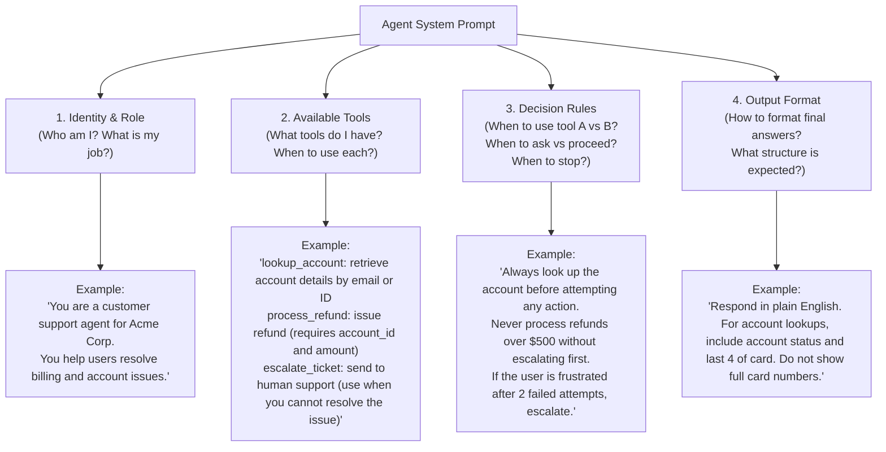

# Prompt Engineering for Agents

**Level**: 🟡 Intermediate
**Reading Time**: 14 minutes

> A chatbot prompt sets tone. An agent prompt defines behavior across dozens of tool calls, error states, and edge cases — and bad prompts cause real production failures.

## The Problem

Prompt engineering for chatbots is relatively forgiving — if the model gives a slightly off-toned response, you iterate. Prompt engineering for agents is high-stakes: a bad system prompt causes the agent to call the wrong tool, enter an infinite loop, produce unparseable JSON, or make destructive API calls in the wrong order.

The difference is that an agent prompt controls **behavior across many automated steps**. Every ambiguity you leave in gets amplified.

---

## System Prompt Anatomy for Agents

Every agent system prompt needs exactly four sections. Skip any one and you will have reliability problems.



**Why each section is non-negotiable:**

- **Identity & role**: Without this, the model doesn't know what it's doing or what to prioritize when goals conflict.
- **Available tools**: The model reads tool descriptions to decide which to call. If the system prompt also summarizes tools contextually, performance improves.
- **Decision rules**: This is the most skipped section and the source of most agent failures. Without explicit rules, the model improvises — and improvisation at scale is unreliable.
- **Output format**: Without format instructions, the model produces inconsistently structured output that downstream code can't parse.

---

## Writing Effective Tool Descriptions

This is where most agent failures start. The model uses your tool description to decide **when** to call a tool and **how** to format the arguments.

**The bad → good transformation:**

```
# Bad — tells the model almost nothing
name: "search"
description: "Search for things"

# Good — gives the model everything it needs
name: "web_search"
description: "Search the internet for current information. Use when the user
              asks about recent events, live data, prices, news, or anything
              that may have changed since your training cutoff (early 2024).
              Returns top 5 results with title, URL, and a text snippet.
              NOT for retrieving a specific known URL — use fetch_url for that.
              NOT for querying internal databases — use db_query for that."
```

**What a good tool description includes:**

| Element | Purpose | Example |
|---------|---------|---------|
| Verb phrase name | Makes intent clear | `web_search`, `create_ticket`, `fetch_user_by_email` |
| What it does | One sentence | "Searches the internet for current information" |
| When to use it | Explicit trigger conditions | "Use when the user asks about recent events..." |
| What it returns | So the model knows what to expect | "Returns top 5 results with title, URL, snippet" |
| When NOT to use it | Disambiguates similar tools | "NOT for querying internal databases — use db_query" |

**Parameter descriptions are equally important:**

```
# Bad — model will guess
parameters:
  - name: "limit"
    type: "integer"

# Good — model knows the valid range and default
parameters:
  - name: "limit"
    type: "integer"
    description: "Maximum number of results to return. Default: 10. Max: 50.
                  Use lower values when you only need a quick lookup,
                  higher values when scanning for a specific record."
    default: 10
```

---

## Few-Shot Examples in Agent Prompts

Few-shot examples show the model the exact behavior you want. For agents, this means showing example tool call sequences — not just example inputs/outputs.

**When to include few-shot examples:**
- When the agent needs to follow a non-obvious multi-step sequence
- When you need to demonstrate how to handle a specific error condition
- When the output format is complex or unusual

**Format for agent few-shot examples:**

```
# Example in system prompt:

--- EXAMPLE ---
User: "Refund the last charge for customer john@example.com"

Thought: I need to look up the customer account first, then find their last charge.
Tool call: lookup_account(email="john@example.com")
Result: {account_id: "acc_882", name: "John Smith", last_charge: {id: "ch_991", amount: 49.99, date: "2025-03-10"}}

Thought: I have the account and charge. Now I can process the refund.
Tool call: process_refund(account_id="acc_882", charge_id="ch_991", amount=49.99)
Result: {status: "success", refund_id: "ref_112"}

Response: "Done! I've issued a full refund of $49.99 for John Smith's charge from March 10th. Refund ID: ref_112."
--- END EXAMPLE ---
```

**Token cost warning**: Each example consumes 200–500 tokens that are sent on every call. Include only the 2–3 most important behavioral patterns. If you have 10 examples, you're burning 3,000–5,000 tokens per call on examples alone.

**What makes a good few-shot example:**
- Shows the exact sequence (not just input and final output)
- Demonstrates a non-obvious decision point
- Is representative of frequent real cases, not edge cases

---

## Chain-of-Thought Forcing

Chain-of-thought prompting forces the model to reason before acting. For agents, this means the model thinks before picking a tool.

**How to implement it:**

```
# Add to system prompt:
"Before taking any action, briefly describe your plan in <thinking> tags.
 Then proceed with the first step.
 Example:
 <thinking>
 The user wants to reschedule a meeting. I need to:
 1. Find the existing meeting (calendar_search)
 2. Delete the old event (calendar_delete)
 3. Create a new one at the requested time (calendar_create)
 </thinking>
 [tool call follows]"
```

**When chain-of-thought helps:**

| Scenario | CoT benefit |
|----------|-------------|
| Multi-step tasks with dependencies | High — prevents skipping steps |
| Ambiguous user intent | High — forces explicit interpretation before acting |
| Tasks with irreversible actions | High — forces planning before destructive operations |
| Simple single-tool lookups | Low — wastes tokens |
| High-volume cheap tasks (routing/classification) | Negative — unnecessary latency and cost |

**The `<thinking>` tag pattern** (used by Claude natively in extended thinking mode) is particularly useful because it creates a clear boundary between reasoning and action, and you can log or ignore the thinking section in your output parsing.

---

## Reliability Patterns

These are the prompting techniques that prevent the most common agent failures:

**1. Instruction injection**
Force the model to verify results before responding:
```
"Always verify the result of a write operation by reading back the record
 before telling the user the operation succeeded."
```

**2. Negative instructions**
The model needs to know what NOT to do:
```
"Never make up file paths or URLs — only use paths returned by the list_files tool."
"Never call delete_record without first calling list_records and confirming the target record exists."
"Never ask the user for their password, credit card number, or social security number."
```

**3. Fallback instructions**
What to do when the task can't be completed:
```
"If you cannot complete the task with the available tools, say so clearly:
 'I'm unable to [X] because [reason]. Here's what I can do instead: [alternative].'
 Do not guess or fabricate information."
```

**4. Disambiguation instructions**
When to ask vs when to proceed:
```
"If the user's request is ambiguous about which account to modify (e.g., they have
 multiple accounts), ask for clarification before taking action.
 If the request is clear, proceed without asking."
```

**5. Scope limiting**
Prevents scope creep:
```
"Only perform the specific action requested. Do not proactively make additional
 changes 'while you're at it' unless the user explicitly asks."
```

---

## Testing Your Prompts

Agent prompts are hard to test because behavior varies across runs. A disciplined testing approach catches problems before they reach production.

**The 3-run consistency test:**

Run the same task 3 times (temperature 0 should be identical; temperature > 0 should be consistent in the key decision path). Check:
- Does it call the same tools in the same order?
- Does it handle tool errors the same way?
- Does the final response format match your spec?

**Edge cases to always test:**

| Scenario | What to check |
|----------|---------------|
| Tool returns empty results | Agent says "no results found" vs. hallucinates data |
| Tool returns an error | Agent retries intelligently vs. crashes or loops |
| Ambiguous user input | Agent asks for clarification vs. picks the wrong interpretation |
| User asks for something outside scope | Agent refuses gracefully vs. attempts and fails |
| Very long tool results | Agent summarizes correctly vs. gets lost |

**Prompt regression testing**: When you change a system prompt, re-run your test suite against the previous version too. Compare outputs. Prompt changes that seem minor can have large behavioral effects.

**Eval-driven iteration**: Build a small eval set of 20–50 representative tasks with expected outcomes before you start writing prompts. Use this as your ground truth. This is the difference between "it feels better" and "it is measurably better."

---

## Common Pitfalls

1. **Vague tool descriptions**: "search for things" leads to wrong tool selection. Write descriptions as if explaining to a smart new hire who has never seen your system.
2. **No decision rules**: Without explicit rules for which tool to use when, the model improvises — inconsistently.
3. **Too many few-shot examples**: More than 3–4 examples wastes significant tokens and can confuse the model with conflicting patterns.
4. **Forgetting negative instructions**: The model will do things you didn't think to prohibit. Test for undesirable behaviors and add explicit prohibitions.
5. **No fallback instructions**: Without fallback guidance, a stuck agent either hallucinates an answer or loops trying different tools forever.
6. **Treating the system prompt as a chatbot prompt**: A 2-sentence tone-setting prompt is not sufficient for an agent. You need all four sections.

---

## Key Takeaways

- Agent system prompts need four sections: identity, tools, decision rules, and output format — skip any one and expect reliability problems
- Tool descriptions are a first-class engineering artifact — they directly drive model behavior
- Few-shot examples show exact tool call sequences, not just input/output pairs — but limit to 2–3 to control token cost
- Chain-of-thought (`<thinking>` tags) helps for complex multi-step tasks; skip it for simple lookups
- Negative instructions are as important as positive ones — test for behaviors you don't want and prohibit them explicitly
- Build an eval set before writing prompts — measure improvement, don't just feel it
