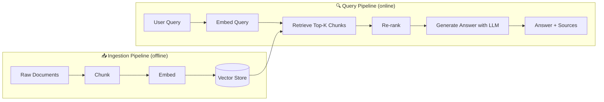

# RAG Deep Dive

**Level**: 🟡 Intermediate
**Reading Time**: 14 minutes

> Without RAG, LLMs answer questions about your documents by hallucinating. With RAG, they answer from the actual document — and cite their sources.

## The Problem

An LLM trained up to some date doesn't know about:
- Your company's internal documents
- Events after its training cutoff
- Your product's latest specifications
- Any private or proprietary information

You could fine-tune a model, but that's expensive, doesn't update in real time, and still hallucinates details. The cheaper, more reliable solution is RAG: at query time, retrieve the relevant documents from your store and inject them into the LLM's context.

**RAG = Retrieval-Augmented Generation**

## The Two Pipelines

RAG has two distinct phases with completely different operations:



Ingestion happens offline (when documents are added/updated). Query happens online (each user request).

## Ingestion Pipeline

### Step 1: Load Documents

```
function loadDocuments(sources):
  documents = []

  for source in sources:
    if source.type == PDF:
      docs = PDFParser.extract(source.path)
    elif source.type == WEBPAGE:
      docs = WebScraper.fetch(source.url)
    elif source.type == DATABASE:
      docs = DB.query(source.sql)
    elif source.type == MARKDOWN:
      docs = FileSystem.read(source.path)

    documents.append(Document(
      content = docs.text,
      metadata = {
        source: source.identifier,
        title: docs.title,
        createdAt: docs.date,
        type: source.type
      }
    ))

  return documents
```

### Step 2: Chunk

Chunking splits documents into pieces that fit the LLM context. The chunk size is a critical parameter:

```
ChunkingStrategies:

// 1. Fixed-size with overlap (simplest)
function fixedChunk(document, chunkSize=512, overlap=64):
  tokens = tokenize(document.content)
  chunks = []
  for i in range(0, len(tokens), chunkSize - overlap):
    chunkTokens = tokens[i : i + chunkSize]
    chunks.append(Chunk(
      content = detokenize(chunkTokens),
      metadata = document.metadata + { chunkIndex: len(chunks) }
    ))
  return chunks

// 2. Sentence-aware chunking (preserves meaning)
function sentenceChunk(document, maxTokens=512):
  sentences = splitBySentences(document.content)
  chunks = []
  current = []
  currentTokens = 0
  for sentence in sentences:
    sentTokens = countTokens(sentence)
    if currentTokens + sentTokens > maxTokens:
      chunks.append(Chunk(content=join(current), metadata=document.metadata))
      current = [sentence]
      currentTokens = sentTokens
    else:
      current.append(sentence)
      currentTokens += sentTokens
  if current:
    chunks.append(Chunk(content=join(current), metadata=document.metadata))
  return chunks

// 3. Hierarchical chunking (best for retrieval precision + recall)
function hierarchicalChunk(document):
  docSummary = LLM.summarize(document.content, maxTokens=200)
  sections = splitBySections(document.content)  // headers, paragraphs
  chunks = []
  for section in sections:
    sectionSummary = LLM.summarize(section.content, maxTokens=100)
    paragraphs = fixedChunk(section, chunkSize=256)
    for para in paragraphs:
      para.metadata.sectionSummary = sectionSummary
      para.metadata.docSummary = docSummary
    chunks.extend(paragraphs)
  return chunks
```

### Step 3: Embed and Store

```
function embedAndStore(chunks, vectorDB, embeddingModel):
  batchSize = 100  // Process in batches for efficiency
  for batch in chunksOf(chunks, batchSize):
    embeddings = embeddingModel.encode([c.content for c in batch])
    for chunk, embedding in zip(batch, embeddings):
      // Deduplication check
      hash = sha256(chunk.content)
      if not vectorDB.exists(hash):
        vectorDB.insert(
          id = generateId(),
          vector = embedding,
          content = chunk.content,
          metadata = chunk.metadata,
          contentHash = hash
        )
```

## Query Pipeline

### Step 1: Embed the Query

```
function embedQuery(query, embeddingModel):
  // Use the SAME embedding model as ingestion — dimensions must match
  return embeddingModel.encode(query)
```

### Step 2: Retrieve Top-K

```
RetrievalStrategies:

// Pure vector search
function vectorSearch(queryEmbedding, vectorDB, topK=10):
  return vectorDB.similaritySearch(
    vector = queryEmbedding,
    limit = topK,
    metric = "cosine"  // or "dot_product", "euclidean"
  )

// BM25 (keyword search)
function bm25Search(query, bm25Index, topK=10):
  return bm25Index.search(query, limit=topK)

// Hybrid search (best of both)
function hybridSearch(query, queryEmbedding, vectorDB, bm25Index, topK=10):
  vectorResults = vectorSearch(queryEmbedding, vectorDB, topK=topK*2)
  bm25Results = bm25Search(query, bm25Index, topK=topK*2)

  // Reciprocal Rank Fusion
  combined = reciprocalRankFusion([vectorResults, bm25Results])
  return combined[:topK]

function reciprocalRankFusion(resultLists, k=60):
  scores = {}
  for resultList in resultLists:
    for rank, result in enumerate(resultList):
      scores[result.id] = scores.get(result.id, 0) + 1 / (k + rank + 1)
  return sortedByScore(scores)
```

### Step 3: Re-rank

Re-ranking is optional but dramatically improves precision. A cross-encoder reads the full (query, chunk) pair and scores relevance — much more accurate than embedding similarity alone.

```
function rerank(query, retrievedChunks, crossEncoder, finalTopK=5):
  // Cross-encoder computes a relevance score for each (query, chunk) pair
  scoredChunks = []
  for chunk in retrievedChunks:
    score = crossEncoder.score(query=query, document=chunk.content)
    scoredChunks.append((chunk, score))

  // Sort by re-rank score, not original retrieval score
  sortedChunks = sortByScore(scoredChunks, descending=True)
  return sortedChunks[:finalTopK]
```

Re-ranking trades latency for precision. For user-facing queries, it's almost always worth it.

### Step 4: Generate with Context

```
function generateAnswer(query, rankedChunks):
  contextBlock = formatChunksForContext(rankedChunks)

  prompt = """
  Answer the question based ONLY on the provided context.
  If the context doesn't contain enough information, say so.
  Always cite which source (document + section) your answer comes from.

  Context:
  """ + contextBlock + """

  Question: """ + query + """

  Answer:"""

  response = LLM.generate(prompt)
  return RAGResult(
    answer = response.text,
    sources = extractedSources(rankedChunks),
    retrievedChunks = rankedChunks
  )
```

## Full RAG Pipeline Together

```
// Ingestion (run once when documents are added/updated)
function ingestDocuments(documentSources):
  documents = loadDocuments(documentSources)
  allChunks = []
  for doc in documents:
    chunks = hierarchicalChunk(doc)
    allChunks.extend(chunks)
  embedAndStore(allChunks, vectorDB, embeddingModel)
  bm25Index.rebuild(allChunks)

// Query (run for every user request)
function ragQuery(userQuery):
  queryEmbedding = embedQuery(userQuery, embeddingModel)
  rawResults = hybridSearch(userQuery, queryEmbedding, vectorDB, bm25Index, topK=20)
  rankedResults = rerank(userQuery, rawResults, crossEncoder, finalTopK=5)
  return generateAnswer(userQuery, rankedResults)
```

## RAG Evaluation Metrics

| Metric | What It Measures | How to Compute |
|--------|-----------------|----------------|
| Recall@K | Were relevant docs in top K? | Retrieved relevant / All relevant |
| Precision@K | Of top K, how many were relevant? | Relevant retrieved / K |
| Faithfulness | Does the answer match the chunks? | LLM-as-judge scoring |
| Answer Relevance | Does the answer address the question? | Semantic similarity |
| Context Precision | Are retrieved chunks actually used? | Trace which chunks appear in answer |

```
function evaluateRAG(testSet, ragPipeline):
  metrics = { recall: [], precision: [], faithfulness: [] }

  for testCase in testSet:
    result = ragPipeline.query(testCase.question)

    // Retrieval metrics
    retrievedIds = result.retrievedChunks.map(c => c.id)
    relevantIds = testCase.relevantChunkIds
    recall = intersection(retrievedIds, relevantIds).size / relevantIds.size
    precision = intersection(retrievedIds, relevantIds).size / retrievedIds.size

    // Faithfulness: does the answer come from the chunks?
    faithfulness = LLMJudge.score(
      question = testCase.question,
      answer = result.answer,
      context = result.retrievedChunks,
      rubric = "Does the answer only use information from the context? 0-1"
    )

    metrics.recall.append(recall)
    metrics.precision.append(precision)
    metrics.faithfulness.append(faithfulness)

  return { averageRecall: avg(metrics.recall), ... }
```

## Common Pitfalls

1. **Chunks too small**: 64-token chunks lose surrounding context. The retrieval finds the right chunk, but the LLM can't understand it without context. Use at least 256 tokens with overlap.
2. **Chunks too large**: 2,000-token chunks dilute the signal. The relevant sentence is buried in filler. Stay under 512 tokens for most use cases.
3. **Not re-ranking**: Vector similarity is fast but imprecise. Top 20 raw results → re-rank to top 5 gives dramatically better context quality.
4. **Embedding model mismatch**: Using one model for ingestion and a different one for queries means vectors are in different spaces. Always use the same model.
5. **No metadata filtering**: Without metadata (document type, date, author), you can't filter retrieved chunks. Store rich metadata at ingestion time.
6. **Injecting too many chunks**: Retrieving 20 chunks and putting all into context adds noise and cost. Use re-ranking to cut to 5.

## Key Takeaways

- RAG = offline ingestion (chunk → embed → store) + online query (retrieve → rerank → generate)
- Chunking strategy is the most impactful engineering decision: too small loses context, too large loses precision
- Hybrid search (vector + BM25) outperforms either alone for most production use cases
- Re-ranking with a cross-encoder dramatically improves precision at small latency cost
- Evaluate with recall@K (did we find the right docs?), faithfulness (did the answer come from docs?), and answer relevance
- Always cite sources — it lets users verify answers and builds trust
