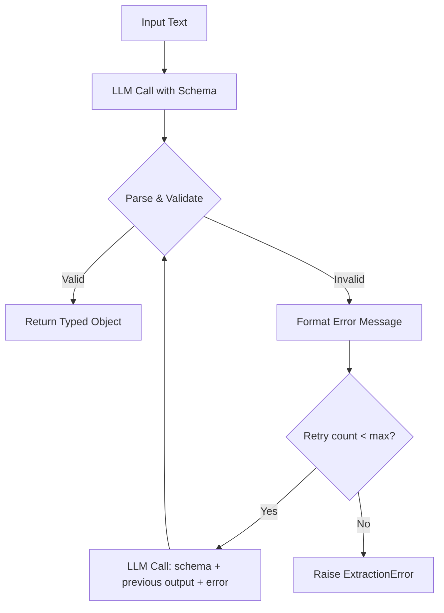

# Structured Output & JSON Mode

**Level**: 🟡 Intermediate
**Reading Time**: 10 minutes

> Free-form LLM text is flexible but unpredictable. Structured output turns LLM responses into data your code can actually use.

## The Problem

An LLM generates text. Your application needs data. Bridging the gap between natural language output and typed data structures is one of the most common pain points in production LLM systems.

The naive approach is to ask the model to "respond in JSON" and hope for the best. In practice this breaks:
- The model sometimes wraps JSON in markdown code blocks
- Keys go missing on complex schemas
- Nested structures get flattened or mangled
- Types are wrong (`"true"` as string instead of boolean)
- The model adds prose before/after the JSON ("Sure, here is the JSON you requested: ...")

Production systems need reliable, validated structured output. There are three progressively more robust techniques.

## Three Techniques

### Technique 1: JSON Mode (Prompt-Based)

The simplest approach — tell the model to output JSON and parse it:

```
// Basic JSON mode — fragile, not recommended for production
function extractBasicJson(text, schema):
  response = LLM.generate(
    messages = [
      SystemMessage("You are a data extraction assistant. Always respond with valid JSON only. No markdown, no prose."),
      HumanMessage("Extract the following from the text:\n" + JSON.stringify(schema) + "\n\nText: " + text)
    ]
  )
  try:
    return JSON.parse(response.text)
  catch ParseError:
    return null  // Silent failure — bad for production
```

Problems: The model still sometimes adds prose, wraps in backticks, or produces invalid JSON. Use only for simple schemas in non-critical paths.

### Technique 2: Tool-Call Trick

A more reliable approach: define the desired structure as a tool, then force the model to call it. Tool arguments are always structured and schema-validated by the model:

```
// Tool-call trick — much more reliable
function extractViaToolCall(text, extractionSchema):
  // Define the desired output as a "tool"
  extractionTool = {
    name: "extract_data",
    description: "Extract structured data from the input",
    parameters: extractionSchema  // Your JSON schema goes here
  }

  response = LLM.generate(
    messages = [
      SystemMessage("Extract the requested information from the text."),
      HumanMessage(text)
    ],
    tools = [extractionTool],
    tool_choice = { type: "function", function: { name: "extract_data" } }  // Force this tool
  )

  if response.toolCalls[0].name == "extract_data":
    return response.toolCalls[0].args  // Already validated against schema
  else:
    raise ExtractionError("Model did not call extraction tool")
```

This works because tool call arguments go through schema validation before the model outputs them — the model knows the output must match the schema.

### Technique 3: Grammar-Constrained Sampling

The most reliable technique: constrain the model's token sampling to only produce valid JSON at the logit level. The model literally cannot output invalid JSON because invalid tokens are masked:

```
// Grammar-constrained sampling (available in llama.cpp, Outlines, Guidance, vLLM)
function extractConstrained(text, pydanticSchema):
  jsonSchema = pydanticSchema.model_json_schema()

  response = LLM.generate(
    messages = [HumanMessage(text)],
    response_format = {
      type: "json_schema",
      json_schema: {
        name: pydanticSchema.__name__,
        schema: jsonSchema,
        strict: true  // Grammar-constrained sampling
      }
    }
  )

  return pydanticSchema.model_validate_json(response.text)
```

Available in:
- OpenAI: `response_format = { type: "json_schema", json_schema: ..., strict: true }`
- Anthropic: via tool calling with `tool_choice` forced
- Local models: Outlines, Guidance, llama.cpp with grammar files, vLLM with guided decoding

## Defining Schemas with Pydantic

Pydantic models provide a clean way to define extraction schemas with validation:

```
// Pydantic-style schema definition (Python pseudocode)
class ContactInfo:
  name: str
  email: str
  phone: Optional[str] = None
  company: Optional[str] = None

class JobPosting:
  title: str
  company: str
  location: str
  salary_range: Optional[str] = None
  required_skills: list[str]
  experience_years: Optional[int] = None
  remote: bool
  posted_date: str  // ISO 8601 format

class ExtractionResult:
  jobs: list[JobPosting]
  total_found: int
  extraction_confidence: float  // 0.0 - 1.0

// Using the schema
function extractJobPostings(rawHtml):
  result = extractConstrained(rawHtml, ExtractionResult)
  // result is a validated ExtractionResult object
  // result.jobs is typed list[JobPosting]
  return result
```

Key design rules for reliable extraction schemas:
- Use `Optional[T]` for fields that might not be present — never assume a field exists
- Use enums for categorical values: `Literal["full-time", "part-time", "contract"]`
- Avoid deeply nested schemas (more than 3 levels) — models struggle with them
- Keep lists bounded when possible: `list[str]` with a description like "max 5 items"
- Use `str` for dates/times unless you need computed values — models format `datetime` objects poorly

## Retry Loop with Error Feedback

Even with the tool-call trick or grammar constraints, extraction occasionally fails. A retry loop that feeds parse errors back to the model recovers most failures:



```
// Retry loop with error feedback
function extractWithRetry(text, schema, maxRetries=3):
  messages = [
    SystemMessage("Extract data according to the schema. Return only valid JSON matching the schema exactly."),
    HumanMessage(text)
  ]

  for attempt in 1..maxRetries:
    response = LLM.generate(messages, responseFormat=schema)

    try:
      parsed = schema.parse(response.text)
      return parsed  // Success

    catch ValidationError as e:
      if attempt == maxRetries:
        raise ExtractionError("Failed after " + maxRetries + " attempts: " + str(e))

      // Feed the error back to the model
      messages.append(AIMessage(response.text))
      messages.append(HumanMessage(
        "That output had validation errors:\n" + formatErrors(e) +
        "\n\nPlease fix these issues and return corrected JSON."
      ))

  // Should not reach here
  raise ExtractionError("Unexpected state")
```

Feeding errors back to the model works because the model can understand the error message and correct its output. For schema validation errors, include the full Pydantic/JSON Schema error with field paths.

## Nested Schema Gotchas

```
// Problematic: deeply nested + all fields required
class OrderItem:
  product: Product        // Nested
    name: str
    sku: str              // Often missing in casual text
    category: Category    // Nested again
      name: str
      code: str

// Better: flatten what you can, make optional what might be absent
class OrderItem:
  product_name: str
  product_sku: Optional[str] = None
  product_category: Optional[str] = None
  quantity: int
  unit_price: float
```

Additional gotchas:
- **Long lists in schemas**: A `list[LineItem]` with 50 items often gets truncated. Process long documents in chunks, extract per-chunk, then merge.
- **Mutual exclusion**: JSON Schema doesn't express "either A or B but not both" cleanly. Use a `type` discriminator field instead.
- **Numbers from text**: "twenty-five thousand dollars" → model might output `"25000"` (string) or `25000` (int) or `25,000` (invalid). Always use `Optional[float]` with post-processing.

## Choosing the Right Technique

| Technique | Reliability | Latency | Cost | Use When |
|-----------|-------------|---------|------|----------|
| JSON mode (prompt) | Low | Baseline | Baseline | Prototyping only |
| Tool-call trick | High | +5-10% | +5-10% | Most production cases |
| Grammar-constrained | Near 100% | +10-20% | Same | Critical paths, large schemas |
| Retry loop | High with fallback | +latency on retry | +cost on retry | Any of the above + retry recovery |

## Common Pitfalls

1. **Not validating after parsing**: `JSON.parse` succeeds even if the structure is wrong. Always validate against your schema after parsing — a field being present doesn't mean it's the right type.
2. **Too many required fields**: Every required field that's absent in the source text causes a failure. Use `Optional` liberally and post-process to handle missing data.
3. **Schema too large for the model**: Schemas over 50 fields with deep nesting exceed the model's reliable comprehension. Break into multiple smaller extractions.
4. **Mixing extraction and reasoning in one prompt**: "Extract the data AND also tell me if the email is suspicious" produces worse results than separate calls. One extraction, one reasoning task.
5. **Not logging parse failures**: Silent failures where you return `null` or `{}` corrupt downstream data. Always log extraction failures with the raw model output.

## Key Takeaways

- Three techniques by reliability: prompt-based JSON (low) < tool-call trick (high) < grammar-constrained sampling (near 100%)
- Use Pydantic or JSON Schema to define extraction targets — never parse ad-hoc with string matching
- Retry with error feedback recovers most failures — feed validation errors back to the model with the original output
- Make schema fields `Optional` aggressively — assume any field might be absent from real-world text
- Avoid deeply nested schemas (max 3 levels) and very long lists — both cause reliable degradation
- For OpenAI: use `response_format = { type: "json_schema", strict: true }` for grammar-constrained output
