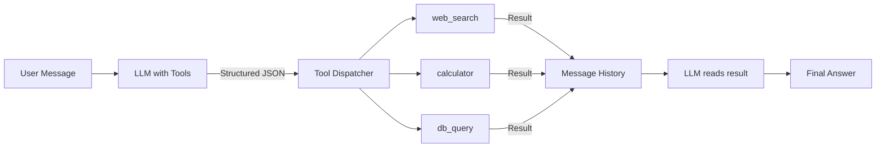

# Tool Use & Function Calling

**Level**: 🟢 Beginner
**Reading Time**: 10 minutes

> Tools are how agents escape the prison of training data — they can search, compute, read files, and call APIs instead of guessing.

## The Problem

LLMs are frozen in time. They know what was in their training data, but they can't:
- Look up current stock prices
- Run a calculation with certainty
- Read a file on your server
- Send an email
- Query your database

Function calling solves this by giving the LLM a formal way to request that your code runs a function and returns the result. The LLM outputs structured JSON; your code runs the actual function; the result goes back to the LLM.

## What Is a Tool?

A tool is any function the LLM can call. Examples:

| Tool Name | What It Does | Example Args |
|-----------|-------------|--------------|
| `web_search` | Searches the internet | `{query: "rainfall in Tokyo 2024"}` |
| `calculator` | Evaluates math | `{expression: "sqrt(144) + 7"}` |
| `read_file` | Reads a file from disk | `{path: "/data/report.csv"}` |
| `send_email` | Sends an email | `{to: "...", subject: "...", body: "..."}` |
| `db_query` | Runs a SQL query | `{sql: "SELECT * FROM users LIMIT 10"}` |
| `get_weather` | Returns weather data | `{city: "London", unit: "celsius"}` |

## Tool Schema: The Contract

Every tool needs a schema the LLM can read. The schema tells the LLM:
- What the tool is called
- What it does (plain English — this is critical for good tool selection)
- What parameters it takes, with types and descriptions

```
Tool Schema Format:

tool = {
  name: "web_search",
  description: "Search the internet for current information.
                Use this when you need up-to-date facts, recent events,
                or information not in your training data.",
  parameters: {
    type: "object",
    properties: {
      query: {
        type: "string",
        description: "The search query. Be specific for better results."
      },
      max_results: {
        type: "integer",
        description: "Number of results to return. Default: 5, max: 20.",
        default: 5
      }
    },
    required: ["query"]
  }
}
```

## How Function Calling Works End-to-End



The flow step by step:

```
1. User sends message: "What is the square root of the number of days in 2024?"

2. LLM receives: [system prompt with tools, user message]
   LLM decides to call: calculator(expression="sqrt(366)")
   LLM outputs:
     {
       type: "tool_call",
       tool_call_id: "call_abc123",
       tool_name: "calculator",
       tool_args: { expression: "sqrt(366)" }
     }

3. Your code runs: calculator.execute({expression: "sqrt(366)"})
   Returns: "19.13..."

4. You append to message history:
   AIMessage(tool_call: {id: "call_abc123", name: "calculator", args: {...}})
   ToolResult(tool_call_id: "call_abc123", content: "19.13...")

5. LLM generates again with updated history
   LLM now sees the result and can answer:
   "The square root of 366 (days in 2024, a leap year) is approximately 19.13."
```

## Pseudocode: Tool Registration and Dispatch

```
// Define tools
tools = {
  "web_search": {
    schema: {
      name: "web_search",
      description: "Search the internet for current info",
      parameters: { query: string, max_results: int = 5 }
    },
    execute: function(args):
      return searchEngine.search(args.query, limit=args.max_results)
  },

  "calculator": {
    schema: {
      name: "calculator",
      description: "Evaluate a math expression safely",
      parameters: { expression: string }
    },
    execute: function(args):
      return safeEval(args.expression)
  }
}

// Build tool schemas list for LLM
toolSchemas = [tool.schema for tool in tools.values()]

// Main dispatch loop
function dispatchToolCall(toolCall):
  tool = tools.get(toolCall.toolName)
  if tool is null:
    return ToolError("Unknown tool: " + toolCall.toolName)

  try:
    result = tool.execute(toolCall.args)
    return ToolResult(toolCall.id, content=result)
  catch error:
    return ToolError(toolCall.id, error=error.message)

// Agent loop with tool dispatch
function agentWithTools(query):
  messages = [
    SystemMessage(toolSchemas=toolSchemas),
    HumanMessage(query)
  ]

  while true:
    response = LLM.generate(messages, tools=toolSchemas)

    if response.type == FINAL_ANSWER:
      return response.text

    // Handle parallel tool calls (LLM may call multiple tools at once)
    for toolCall in response.toolCalls:
      result = dispatchToolCall(toolCall)
      messages.append(result)

    messages.append(AIMessage(response))
```

## Parallel Tool Calls

Modern LLMs (GPT-4o, Claude 3.5+) can request multiple tool calls in a single turn. This is important for performance:

```
// Sequential (slow):
// Step 1: search("Tokyo population")
// Step 2: search("Tokyo area in km2")
// Step 3: calculate("population / area")

// Parallel (fast):
// Step 1: [search("Tokyo population"), search("Tokyo area in km2")] simultaneously
// Step 2: calculate("population / area")

function handleParallelToolCalls(response, tools):
  if response.toolCalls is empty:
    return

  // Run all tool calls in parallel
  results = parallel_map(response.toolCalls, dispatchToolCall)
  return results
```

## Tool Design Best Practices

**Write descriptions as if for a smart person who has never seen your codebase.** The LLM reads tool descriptions to decide when and how to call them. Vague descriptions lead to wrong tool selection.

Bad:
```
name: "search"
description: "Search for stuff"
```

Good:
```
name: "web_search"
description: "Search the internet for up-to-date information.
              Use when you need: current events, recent statistics,
              product prices, weather, or anything time-sensitive.
              Do NOT use for math calculations or code execution."
```

**Type parameters precisely.** The LLM uses parameter types to format arguments correctly.

```
// Bad — LLM might pass "5" (string) instead of 5 (int)
max_results: { type: "any" }

// Good
max_results: {
  type: "integer",
  minimum: 1,
  maximum: 20,
  description: "How many results to return"
}
```

**Return structured output when possible.** Raw HTML or blob text is hard for the LLM to parse.

```
// Bad tool result:
"<!DOCTYPE html><html><head>... [10,000 characters of HTML]"

// Good tool result:
{
  results: [
    { title: "Tokyo Population 2024", snippet: "13.96 million", url: "..." },
    { title: "Greater Tokyo Area", snippet: "37.4 million", url: "..." }
  ]
}
```

## Common Pitfalls

1. **No description on parameters**: LLMs use parameter descriptions to format inputs correctly. Missing descriptions lead to malformed calls.
2. **Tools that are too broad**: A `do_anything(code: string)` tool that runs arbitrary code is dangerous. Scope tools narrowly.
3. **Ignoring tool errors**: When a tool fails, the error result must go back to the LLM so it can retry or adjust. Silently dropping errors causes infinite loops.
4. **No rate limiting on tools**: An agent can call `web_search` 50 times in one run. Add rate limits per tool per agent run.
5. **Mutable tools without confirmation**: Tools that write to a database or send emails should require a confirmation step before execution in production.

## Key Takeaways

- Tools are functions the LLM calls by outputting structured JSON
- Every tool needs a name, a plain-English description, and a parameter schema
- Your code runs the function and feeds results back into the message history
- The LLM sees the result and decides whether to call another tool or give a final answer
- Modern LLMs can call multiple tools in parallel — design your dispatcher to handle this
- Tool descriptions are as important as the tool implementation — write them carefully
