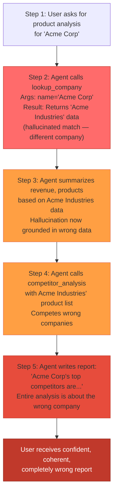

# Hallucination in Agent Decisions

**Level**: 🔴 Advanced
**Reading Time**: 20 minutes

> A chatbot that hallucinates gives you a wrong answer. An agent that hallucinates takes wrong actions — and each action compounds the mistake.

---

## The Problem Class `[Agent Correctness — Severity: Critical]`

Hallucination in LLMs — generating confident, plausible-sounding but factually incorrect content — is well understood in chat contexts. But agents amplify hallucination risk in three ways that make it qualitatively different:

1. **Multi-step compounding**: A hallucinated fact in step 2 is passed as input to step 3, which builds on it, which is passed to step 4. Each step takes the hallucination further from reality while becoming more confident about it.
2. **Tool call fabrication**: Agents can invent tool names that don't exist, pass arguments in the wrong format, or construct API URLs they've never seen — and the agent loop will execute these calls, producing errors or calling real but unintended endpoints.
3. **Silent failure**: Downstream steps often can't tell that their input was hallucinated. The agent proceeds, the final answer looks coherent, but it's built on fabricated intermediate results.

---

## How It Manifests

### Fabricated Tool Names

```
Agent reasoning: "I'll use the search_product_catalog tool to find matching items."
Tool list: [search_web, query_database, send_email]

Error: Tool 'search_product_catalog' not found.
```

The LLM invented a tool name that sounds plausible but doesn't exist. Without validation, some frameworks silently skip unknown tool calls, leading the agent to proceed with a missing result.

### Fabricated API Parameters

```
Agent calls: get_weather(city="New York", country="US", units="kelvin", format="json")
Actual schema: get_weather(location: string, unit: "celsius" | "fahrenheit")

Error: Invalid parameter 'country'. Invalid value for 'units'.
```

The LLM has seen many APIs and confidently generates parameters based on what "feels right" for a weather API — even when those parameters don't match the actual tool signature.

### Hallucinated URLs and Resource Names

```
Agent reasoning: "I'll fetch the documentation from https://docs.anthropic.com/api/v2/models"
Actual URL: https://docs.anthropic.com/en/api/getting-started

Result: 404 Not Found
Agent reasoning: "The documentation confirms that Claude supports up to 500 tools per call."
(This was never in any documentation — it was fabricated from the 404 page)
```

### Compound Propagation

The worst case is when the hallucination doesn't cause an error — it silently returns plausible but wrong data that flows downstream:



Each step increases confidence. The final output looks polished and authoritative. There's no error message — only a wrong answer.

---

## Detection Strategy

### 1. Schema validation on every tool call

Before executing any tool call, validate the arguments against the registered tool schema:

```javascript
function validateToolCall(toolName, args, toolRegistry) {
  const tool = toolRegistry.get(toolName);

  // Catch fabricated tool names
  if (!tool) {
    return {
      valid: false,
      error: `Unknown tool: "${toolName}". Available tools: ${[...toolRegistry.keys()].join(', ')}`
    };
  }

  // Validate args against schema (using zod, ajv, etc.)
  const result = tool.schema.safeParse(args);
  if (!result.success) {
    return {
      valid: false,
      error: `Invalid args for ${toolName}: ${result.error.message}\nExpected schema: ${JSON.stringify(tool.schema.shape)}`
    };
  }

  return { valid: true };
}
```

Injecting the error message and the actual schema back into context gives the LLM the information to self-correct.

### 2. Output validation before passing downstream

For tool results that will be used in subsequent steps, validate the output semantics:

```javascript
// Is the returned company actually the one we asked about?
function validateCompanyResult(result, requestedName) {
  const similarity = stringSimilarity(result.name, requestedName);
  if (similarity < 0.8) {
    return {
      warning: `Returned company "${result.name}" may not match requested "${requestedName}". Confidence: ${(similarity * 100).toFixed(0)}%`
    };
  }
  return { valid: true };
}
```

### 3. Critic agent pattern

A separate LLM call reviews the primary agent's output before it's used:

```javascript
async function criticCheck(agentOutput, originalGoal) {
  const review = await llm.generate({
    system: "You are a fact-checker. Identify any claims in the following agent output that are not supported by the cited sources or tool results. Be specific about what is unverified.",
    user: `Goal: ${originalGoal}\nAgent output: ${agentOutput}`
  });

  if (review.includes('unverified') || review.includes('not supported')) {
    return { passed: false, issues: review };
  }
  return { passed: true };
}
```

This is expensive — it doubles LLM calls — but appropriate for high-stakes outputs (financial analysis, medical information, legal summaries).

### 4. Confidence scoring via structured output

Ask the model to rate its own confidence on critical facts:

```javascript
const result = await llm.generate({
  response_format: {
    type: "json_schema",
    schema: {
      answer: "string",
      confidence: { type: "number", minimum: 0, maximum: 1 },
      sources: { type: "array", items: "string" },
      uncertain_claims: { type: "array", items: "string" }
    }
  }
});

if (result.confidence < 0.7 || result.uncertain_claims.length > 0) {
  triggerHumanReview(result);
}
```

---

## Mitigation & Fix

### 1. RAG grounding — anchor claims to retrieved documents

The most effective mitigation is grounding. Before making any factual claim, retrieve relevant documents and inject them into context:

```javascript
async function groundedAgentStep(query, vectorStore) {
  // Retrieve relevant documents first
  const docs = await vectorStore.search(query, { topK: 5 });

  // Inject as context before LLM reasoning
  const groundedPrompt = `
    Use only the following documents to answer. Do not use information not present in these documents.
    If the answer is not in the documents, say "I don't have information about this."

    Documents:
    ${docs.map(d => `[${d.source}]: ${d.content}`).join('\n\n')}

    Question: ${query}
  `;

  return llm.generate(groundedPrompt);
}
```

### 2. Tool schema enforcement via structured outputs

Use the model's native structured output / function calling mode with strict validation:

```javascript
// OpenAI: use strict mode function calling
const toolDef = {
  type: "function",
  function: {
    name: "search_products",
    strict: true,          // Enforces exact schema compliance
    parameters: {
      type: "object",
      properties: {
        query: { type: "string" },
        category: { type: "string", enum: ["electronics", "clothing", "food"] },
        max_price: { type: "number" }
      },
      required: ["query"],
      additionalProperties: false  // Prevents extra hallucinated fields
    }
  }
};
```

With `strict: true` and `additionalProperties: false`, the model cannot fabricate extra parameters.

### 3. Human-in-the-loop for high-stakes decisions

For actions that can't be undone (sending emails, making payments, deleting records), require human confirmation before execution:

```javascript
async function executeHighStakesTool(toolName, args, metadata) {
  const isHighStakes = ['send_email', 'make_payment', 'delete_record', 'publish_content'].includes(toolName);

  if (isHighStakes) {
    const approval = await requestHumanApproval({
      action: `${toolName}(${JSON.stringify(args)})`,
      context: metadata.agentReasoning,
      timeout: 300_000 // 5 minutes
    });

    if (!approval.granted) {
      return { error: 'Action rejected by human reviewer', reason: approval.reason };
    }
  }

  return executeTool(toolName, args);
}
```

### 4. Explicit "I don't know" training

System prompt configuration that reduces hallucination:

```
System: When using tools, you must only use tool names and parameter names from the provided tool list.
If a tool you need doesn't exist in the list, say "I need a [description] tool but it's not available"
rather than calling a non-existent tool.

If you are not certain about a factual claim, say "I'm not certain" rather than stating it as fact.
Uncertainty is always better than a confident wrong answer.
```

---

## Real Example: Agent Hallucinating API Versions

A production incident at a financial data company: an agent was tasked with fetching market data. The LLM had been trained on documentation for API v1 but the production endpoint was v2. The agent:

1. Called the v1 endpoint (hallucinated URL) — got redirected, returned stale data
2. Interpreted the stale data as current — "confirmed" prices from 2 years prior
3. Used those prices to calculate position P&L
4. Reported the P&L to the analyst as current

The analyst caught it because the numbers were implausible. Without domain expertise, the hallucination would have gone undetected.

**Fix applied**: Added a URL allowlist to the HTTP tool — only pre-approved base URLs could be called. Any URL not on the allowlist returned an error prompting the agent to use the correct endpoint.

---

## Prevention Checklist

- [ ] All tool calls validated against registered schema before execution
- [ ] `additionalProperties: false` set on all tool schemas to prevent parameter fabrication
- [ ] Tool names validated before any call (unknown tool = inject error + available tools)
- [ ] RAG grounding used for any factual claims the agent needs to make
- [ ] High-stakes irreversible actions gated behind human approval
- [ ] Critic agent pattern applied for outputs that go to end-users or downstream systems
- [ ] Confidence scoring in structured output for claims with uncertainty threshold
- [ ] System prompt explicitly instructs "say I don't know rather than guess"
- [ ] URL and resource name allowlisting for external HTTP tool calls
- [ ] Agent outputs tagged with sources — unsourced claims flagged for review

---

## Related Failures

- [Prompt Injection in Agents](./prompt-injection-agents) — External content hijacks agent instructions, causing intentional "hallucination"
- [Infinite Loops & Cycles](./infinite-loops) — Agents looping trying to verify a hallucinated fact they can't find
- [Tool Call Failures](./tool-call-failures) — Fabricated tool names and parameters are a form of hallucination
