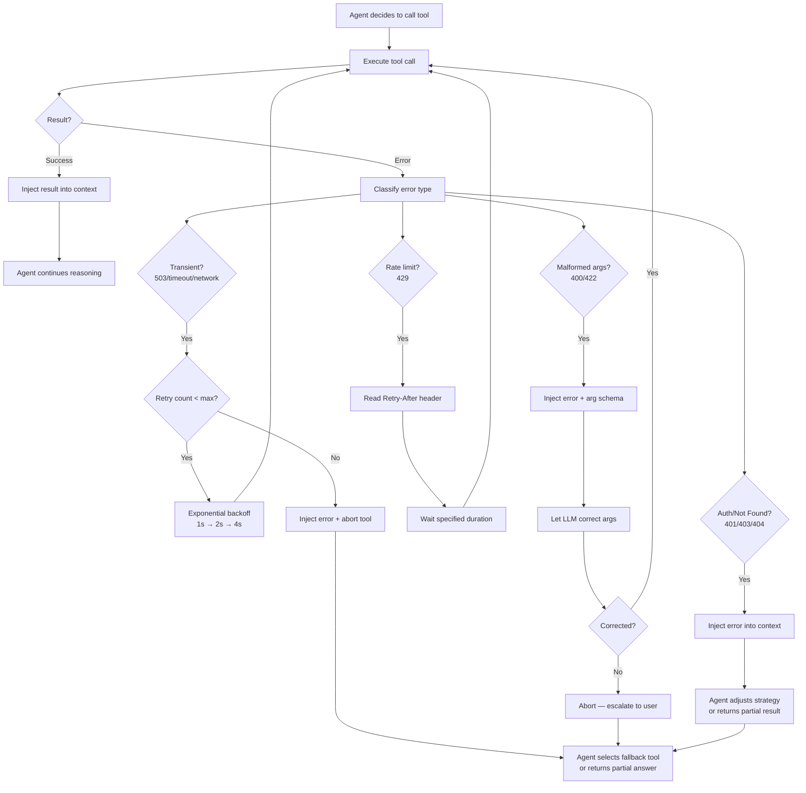

# Tool Call Failures & Retry Strategies

**Level**: 🟡 Intermediate
**Reading Time**: 16 minutes

> The most common way an agent fails is not a reasoning error — it's a tool call that silently loops until the step budget is gone.

---

## The Problem Class `[Agent Reliability — Severity: High]`

Tool calls are how agents interact with the world: querying databases, calling APIs, reading files, running code. Every one of those external interactions can fail — and in an agent loop, a failed tool call isn't just a single error. It becomes a decision point that can send the agent spiraling into useless retries, wasting budget, and eventually returning a confusing non-answer.

The core problem: **agents retry blindly**. Without explicit error classification, an agent will re-issue the same malformed request a dozen times before giving up — each retry burning tokens and time.

---

## How It Manifests

Tool call failures fall into five categories, and each requires a different response:

| Error Type | Example | Correct Response |
|-----------|---------|-----------------|
| **Transient** | 503, network timeout | Exponential backoff + retry |
| **Rate limit** | 429 Too Many Requests | Wait for `Retry-After` header, then retry |
| **Malformed args** | Missing required field, wrong type | Do NOT retry — fix the args or abort |
| **Not found** | 404, resource doesn't exist | Do NOT retry — adjust strategy |
| **Auth/permission** | 401, 403 | Do NOT retry — escalate or abort |

An agent without error classification treats all of these as "retry". A malformed request will return the same 400 error every time — retrying it 10 times wastes 10× the tokens and still fails.

### The Spiral Pattern

```
Step 4: Agent calls search_tool(query="", limit=-1)     ← malformed args
Step 5: Tool returns Error 400: "query must be non-empty"
Step 6: Agent retries search_tool(query="", limit=-1)    ← same call, same error
Step 7: Tool returns Error 400: "query must be non-empty"
Step 8: Agent retries search_tool(query="", limit=-1)    ← again
...
Step 20: MaxStepsExceeded — agent returns "I was unable to complete the task"
```

The agent spent 16 steps learning nothing new, burning the entire step budget on an error it could never resolve through repetition.

---

## Architecture: Tool Call Error Flow



---

## Detection Strategy

**Symptom 1 — Repeated identical tool calls**: If the same tool is called with identical arguments in consecutive steps, the agent is in a retry spiral. Log a warning when this happens.

**Symptom 2 — Step count near max with no progress**: Monitor the ratio of `successful tool calls / total tool calls`. If it drops below 30% and steps are running out, intervene.

**Symptom 3 — Token spend without result tokens**: A high input token count (long context from accumulated errors) with minimal output tokens (no final answer) indicates a failed loop.

```javascript
// Monitoring hook: detect retry spiral
function detectRetrySpiral(actionHistory) {
  const last3 = actionHistory.slice(-3);
  const identical = last3.every(a =>
    a.toolName === last3[0].toolName &&
    JSON.stringify(a.args) === JSON.stringify(last3[0].args)
  );
  if (identical && last3.length === 3) {
    alert('WARN: Agent retry spiral detected on tool: ' + last3[0].toolName);
  }
}
```

---

## Mitigation & Fix

### 1. Classify errors before retrying

```javascript
function classifyError(error) {
  const status = error.statusCode || error.code;

  if ([503, 502, 504].includes(status) || status === 'ECONNRESET') {
    return 'TRANSIENT';       // Safe to retry with backoff
  }
  if (status === 429) {
    return 'RATE_LIMIT';      // Retry after waiting
  }
  if ([400, 422].includes(status)) {
    return 'MALFORMED_ARGS';  // Don't retry — fix args or abort
  }
  if ([401, 403].includes(status)) {
    return 'AUTH_ERROR';      // Don't retry — escalate
  }
  if (status === 404) {
    return 'NOT_FOUND';       // Don't retry — adjust strategy
  }
  return 'UNKNOWN';
}
```

### 2. Exponential backoff with jitter for transient errors

```javascript
async function retryWithBackoff(toolFn, args, maxRetries = 3) {
  for (let attempt = 0; attempt < maxRetries; attempt++) {
    try {
      return await toolFn(args);
    } catch (err) {
      const type = classifyError(err);

      if (type === 'TRANSIENT') {
        const delay = Math.pow(2, attempt) * 1000 + Math.random() * 500;
        await sleep(delay); // 1s, 2s, 4s with jitter
        continue;
      }

      if (type === 'RATE_LIMIT') {
        const retryAfter = err.headers?.['retry-after'] || 5;
        await sleep(retryAfter * 1000);
        continue;
      }

      // Non-retryable: throw immediately
      throw err;
    }
  }
  throw new Error('Max retries exceeded');
}
```

### 3. Inject error context for LLM self-correction

When a tool call fails with malformed args, inject both the error message and the tool's argument schema back into context. This gives the LLM the information it needs to fix the call:

```
ToolResult(error): 400 Bad Request — "query" field is required and must be a non-empty string.
Tool schema: search_web({ query: string (required), max_results: number (optional, default 5) })
```

With this context, the LLM can see what went wrong and correct the argument on the next attempt.

### 4. Max retry cap per tool per run

```javascript
const TOOL_RETRY_LIMITS = {
  'search_web': 3,
  'execute_code': 2,
  'send_email': 1,     // Side-effectful — never retry automatically
  'write_file': 1,
};
```

Side-effectful tools (write, send, delete) should have a max retry of 1 or require human confirmation before retrying.

### 5. Fallback tools

Register alternatives for critical tools:

```javascript
const toolFallbacks = {
  'search_web': ['search_bing', 'search_duckduckgo'],
  'get_stock_price': ['get_stock_price_backup'],
};

async function callWithFallback(toolName, args, context) {
  try {
    return await callTool(toolName, args);
  } catch (err) {
    const fallbacks = toolFallbacks[toolName] || [];
    for (const fallbackName of fallbacks) {
      try {
        const result = await callTool(fallbackName, args);
        context.log(`Primary tool ${toolName} failed. Used fallback: ${fallbackName}`);
        return result;
      } catch (_) { continue; }
    }
    throw new Error(`All tools failed for: ${toolName}`);
  }
}
```

---

## Real Example: OpenAI Function Calling Failures

When building with OpenAI's function calling API, a common production failure is the model generating a function call with incorrect JSON that fails schema validation. Without intervention, the agent loop retries the same malformed call repeatedly.

The OpenAI cookbook recommendation: always include the JSON validation error in the next `tool` message so the model can see exactly what it got wrong. Models correct malformed calls ~90% of the time when given the schema error alongside their original output.

**Production pattern from Claude SDK**: The Anthropic Claude SDK surfaces tool use errors as `tool_result` blocks with `is_error: true`. The agent's system prompt should explicitly instruct it: "If a tool call returns an error, analyze the error type. Do not retry the exact same call — either fix the arguments or choose a different approach."

---

## Prevention Checklist

- [ ] Every tool call wrapped in an error classifier before any retry logic
- [ ] Transient errors use exponential backoff with jitter and a max retry cap
- [ ] Rate limit errors respect the `Retry-After` header
- [ ] 400/422 errors inject the error message and tool schema back into context
- [ ] Side-effectful tools (write, send, delete) have retry cap of 1 or require confirmation
- [ ] Agent has a fallback registered for every critical tool
- [ ] Retry spiral detection monitors for 3 consecutive identical tool calls
- [ ] Total per-tool retry count tracked and capped per agent run
- [ ] Tool errors surface as structured objects, not bare exception strings

---

## Related Failures

- [Infinite Loops & Cycles](./infinite-loops) — Retry spirals are a specialized form of loop
- [Cost Runaway](./cost-runaway) — Unbounded retries are a primary cause of token budget exhaustion
- [Context Window Overflow](./context-overflow) — Accumulated error messages fill the context window
