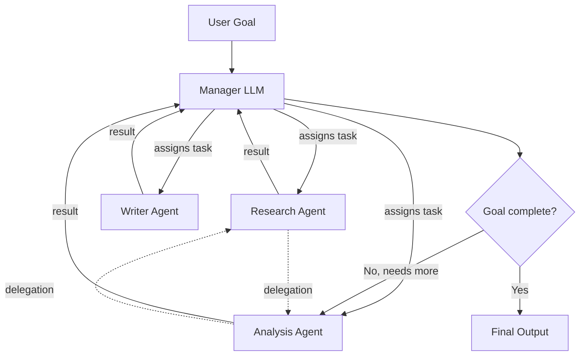

# CrewAI — Role-Based Multi-Agent Teams

**Level**: 🟡 Intermediate
**Reading Time**: 10 minutes

> CrewAI makes multi-agent systems feel like hiring a team: you write job descriptions, assign work, and let the crew figure out who does what.

## The Problem

When a task needs multiple specialized perspectives — research, analysis, writing, fact-checking — you can either stuff all the instructions into one mega-prompt (context gets noisy, performance degrades) or manually orchestrate a sequence of LLM calls (rigid, hard to extend). CrewAI's answer is to model agents as team members: each has a role, a goal, and a backstory, and a crew coordinator assigns tasks and handles inter-agent communication.

## The Mental Model

CrewAI has four core concepts:

1. **Agent** — an LLM-backed entity with a `role`, `goal`, and `backstory`. The backstory is used as the system prompt; it shapes how the agent reasons and responds.
2. **Task** — a unit of work with a `description`, an `expected_output`, and an assigned `agent`.
3. **Crew** — the team: a list of agents + a list of tasks + a `process` (sequential or hierarchical).
4. **Tools** — functions an agent can call (same tool interface as LangChain tools).

```
Agent = {
  role: "Senior Research Analyst",
  goal: "Find accurate, up-to-date information on any topic",
  backstory: "You are an experienced researcher with a talent for finding
              credible sources and summarizing complex topics clearly.",
  tools: [web_search, read_url],
  llm: ChatOpenAI(model="gpt-4o")
}
```

## Process Types

**Sequential** (default): Tasks run in order. Each task's output is passed as context to the next.

```
Task 1 (research) → Task 2 (analysis) → Task 3 (writing) → Done
```

**Hierarchical**: A manager LLM dynamically assigns tasks to agents, can delegate, and decides when the overall goal is complete. Agents can ask each other for help via built-in delegation.



## Code: Three-Agent Crew

```python
from crewai import Agent, Task, Crew, Process
from crewai_tools import SerperDevTool, ScrapeWebsiteTool

# Tools
search_tool = SerperDevTool()      # Google search via Serper API
scrape_tool = ScrapeWebsiteTool()  # Reads a URL's content

# --- Agent 1: Researcher ---
researcher = Agent(
    role="Senior Research Analyst",
    goal="Find comprehensive, accurate information on the given topic",
    backstory="""You work at a leading think tank. Your strength is finding
    credible primary sources and distilling complex topics into clear facts.
    You never speculate — you cite sources.""",
    tools=[search_tool, scrape_tool],
    verbose=True,
    max_iter=10,
)

# --- Agent 2: Data Analyst ---
analyst = Agent(
    role="Data Analyst",
    goal="Analyze findings and extract key insights with supporting data",
    backstory="""You are a quantitative analyst who spots patterns in data.
    You always back claims with numbers and flag any gaps in the evidence.""",
    tools=[],  # no tools — works from provided context
    verbose=True,
)

# --- Agent 3: Content Writer ---
writer = Agent(
    role="Technical Content Writer",
    goal="Write a clear, engaging article for a developer audience",
    backstory="""You write for engineers who value precision and examples.
    You avoid fluff, prefer bullet points, and always include a TL;DR.""",
    tools=[],
    verbose=True,
)

# --- Tasks ---
research_task = Task(
    description="""Research the current state of vector databases.
    Cover: top vendors, performance benchmarks, use cases, pricing.
    Output a structured report with sources.""",
    expected_output="A structured research report with citations (500-800 words)",
    agent=researcher,
)

analysis_task = Task(
    description="""Using the research report provided, analyze:
    - Which vector DB is best for each use case
    - Cost/performance tradeoffs
    - Hidden risks or gaps in the research
    Output your analysis with a recommendation matrix.""",
    expected_output="An analysis with a comparison table and recommendations",
    agent=analyst,
    context=[research_task],  # receives researcher's output as context
)

writing_task = Task(
    description="""Write a 600-word developer-focused article based on
    the research and analysis. Include: intro, comparison table,
    recommendations, TL;DR. Tone: technical but approachable.""",
    expected_output="A polished article ready for publication (600 words)",
    agent=writer,
    context=[research_task, analysis_task],
)

# --- Crew ---
crew = Crew(
    agents=[researcher, analyst, writer],
    tasks=[research_task, analysis_task, writing_task],
    process=Process.sequential,  # or Process.hierarchical
    verbose=True,
)

result = crew.kickoff()
print(result.raw)
```

## Built-In Delegation

In hierarchical process (or when `allow_delegation=True` on agents), an agent can ask another agent for help mid-task:

```python
# Agent with delegation enabled
analyst = Agent(
    role="Data Analyst",
    goal="...",
    backstory="...",
    allow_delegation=True,  # can ask other agents for help
)

# The analyst might internally call:
# "Ask Research Analyst: Can you find the 2024 benchmark results for Pinecone?"
# CrewAI routes this to the researcher agent automatically
```

This is the key differentiator vs. a simple LangChain sequential chain: agents can dynamically request help rather than just consuming static outputs.

## Comparison: CrewAI vs AutoGen

| Dimension | CrewAI | AutoGen |
|-----------|--------|---------|
| Mental model | Role-based team | Conversational agents |
| Orchestration | Sequential / hierarchical process | GroupChat + ConversableAgent |
| Agent definition | Role + goal + backstory | System message + capabilities |
| Human-in-loop | Via HumanInputTool | Native UserProxyAgent |
| State management | Task context passing | Message history |
| Code execution | Via tools | Native code executor |
| Delegation | Built-in | Via conversation |
| Best for | Content pipelines, research | Code gen, complex reasoning |
| Framework maturity | Newer (2024) | Established (Microsoft) |
| Learning curve | Low (intuitive) | Medium |

## Strengths

- **Intuitive mental model**: Role/goal/backstory maps to how humans think about team structures
- **Great for content pipelines**: Research → analysis → writing is the canonical use case and works exceptionally well
- **Built-in delegation**: Agents can request help from peers without explicit orchestration code
- **Low boilerplate**: A working 3-agent crew is ~50 lines; equivalent from scratch is 300+
- **Growing tool ecosystem**: CrewAI Tools package adds 20+ pre-built tools (web search, file read/write, code execution)

## Weaknesses

- **Opinionated structure**: If your workflow doesn't fit "agents have roles and tasks are assigned", the framework fights you
- **Limited state control**: You can't checkpoint mid-execution or resume a paused crew (LangGraph handles this better)
- **Non-deterministic**: The LLM decides delegation and subtask breakdown — hard to guarantee exact execution paths
- **Newer framework**: Less production battle-testing than LangChain or AutoGen; API has changed between major versions
- **Hierarchical process is expensive**: The manager LLM calls add latency and token cost

## Pricing and Self-Hosting

| Component | Cost |
|-----------|------|
| CrewAI library | Free (MIT open source) |
| CrewAI Enterprise / Cloud | Contact for pricing |
| LLM API calls | Per-token (OpenAI, Anthropic, any LiteLLM-supported model) |
| CrewAI Tools (Serper, etc.) | Free library; tools may have own API costs |

Self-hosting: install `crewai` as a Python package, run your crew as any Python application. No infrastructure required beyond your LLM provider. For production, wrap in FastAPI and deploy as a container.

```bash
pip install crewai crewai-tools
# Run locally — no server component needed
python your_crew.py
```

## Common Pitfalls

1. **Backstory too generic**: Vague backstories produce generic agent behavior. Write backstories that encode specific reasoning patterns and constraints.
2. **No `max_iter` on agents**: Without a limit, an agent stuck on a hard task will loop until token budget is exhausted. Set `max_iter=10` as a safe default.
3. **Over-delegating in hierarchical mode**: Each delegation is a new LLM call. A crew that constantly delegates can cost 10x more than sequential execution.
4. **Context window overflow**: Tasks in sequential process receive all prior task outputs as context. Long chains accumulate context fast. Summarize intermediate outputs for long pipelines.
5. **Using CrewAI for single-agent tasks**: If you have one agent and one task, use LangChain or the raw API. CrewAI's value only shows with genuine multi-agent coordination.

## Key Takeaways

- CrewAI models multi-agent work as a team: agents have roles/goals/backstories, tasks are assigned work units, crews coordinate execution
- Sequential process runs tasks in order; hierarchical uses a manager LLM to orchestrate dynamically with delegation
- Best fit: content creation pipelines (research → analysis → writing), any workflow where specialization helps
- Built-in delegation lets agents ask each other for help without explicit orchestration code
- When you need state persistence, checkpointing, or complex conditional routing: LangGraph is the right tool
