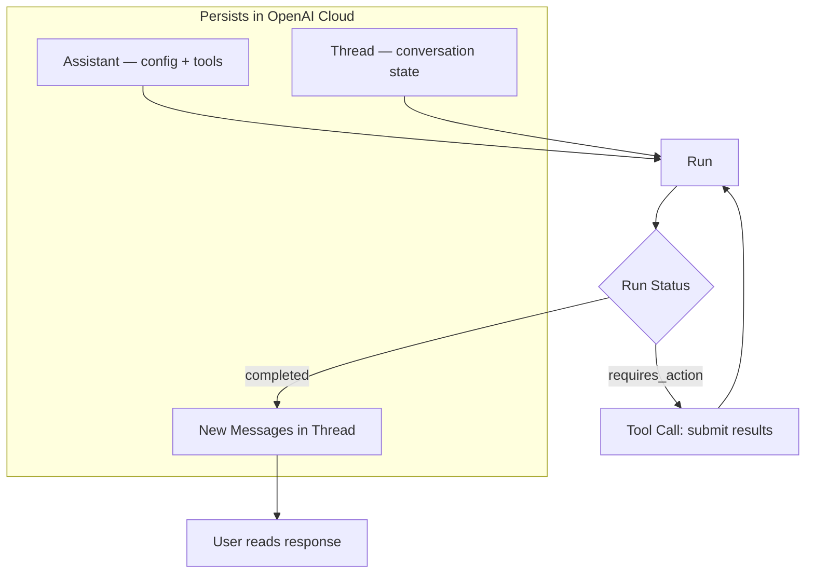

# OpenAI Assistants API — Stateful Agent Runtime

**Level**: 🟡 Intermediate
**Reading Time**: 10 minutes

> The Assistants API is the difference between calling GPT-4 and deploying GPT-4: it adds durable state, built-in RAG, sandboxed code execution, and a managed run lifecycle — all without you writing the agent loop.

## The Problem

The Chat Completions API is stateless — every call starts fresh. Building a stateful assistant means you manage conversation history, implement your own RAG pipeline, run code execution safely, handle retries, and stitch the tool call loop together. The Assistants API packages all of this as a managed service: you configure an assistant, OpenAI stores the state, and you just send messages.

## The Four Core Objects

The Assistants API is built around four persistent objects in OpenAI's cloud:

### 1. Assistant
Configuration entity. Stores the model, system instructions, and which tools are enabled. Created once, reused across many conversations.

### 2. Thread
A conversation session. Stores the full message history. Created per user/conversation. Threads persist indefinitely — you can retrieve them later.

### 3. Run
An execution: "apply this Assistant to this Thread". A Run transitions through states: `queued → in_progress → requires_action → completed`.

### 4. Message
An individual message in a Thread — from the user or the assistant. Messages can contain text, file citations (from file_search), or image output (from code_interpreter).



## Built-In Tools

| Tool | What it does | Cost trigger |
|------|-------------|-------------|
| `file_search` | Semantic RAG over uploaded files. OpenAI handles chunking, embedding, indexing. | Per GB of vector storage/day |
| `code_interpreter` | Sandboxed Python execution. Can generate charts, process CSVs, run calculations. | $0.03 per session |
| `function` | Your own tools — same as Chat Completions function calling. You host the code. | Your cost (Lambda, API) |

## Full Run Loop in Python

```python
from openai import OpenAI
import time

client = OpenAI()  # reads OPENAI_API_KEY from env

# --- Step 1: Create Assistant (do this once, save the ID) ---
assistant = client.beta.assistants.create(
    name="Data Analysis Assistant",
    instructions="""You are a data analyst. When given a CSV file, analyze it
    and provide insights. Use code_interpreter to run calculations.
    Always explain your methodology.""",
    model="gpt-4o",
    tools=[
        {"type": "code_interpreter"},
        {"type": "file_search"},
    ],
)
print(f"Assistant ID: {assistant.id}")  # store this: asst_abc123

# --- Step 2: Upload a file (optional, for file_search or code_interpreter) ---
with open("sales_data.csv", "rb") as f:
    uploaded_file = client.files.create(file=f, purpose="assistants")

# --- Step 3: Create a Thread per user/conversation ---
thread = client.beta.threads.create()
print(f"Thread ID: {thread.id}")  # store per user: thread_xyz789

# --- Step 4: Add user message to thread ---
client.beta.threads.messages.create(
    thread_id=thread.id,
    role="user",
    content="Analyze the sales data and tell me the top 3 products by revenue.",
    attachments=[
        {"file_id": uploaded_file.id, "tools": [{"type": "code_interpreter"}]}
    ],
)

# --- Step 5: Create a Run ---
run = client.beta.threads.runs.create(
    thread_id=thread.id,
    assistant_id=assistant.id,
)

# --- Step 6: Poll until complete (or use streaming) ---
def wait_for_run(thread_id: str, run_id: str, timeout_seconds: int = 120) -> str:
    start = time.time()
    while time.time() - start < timeout_seconds:
        run = client.beta.threads.runs.retrieve(
            thread_id=thread_id,
            run_id=run_id,
        )

        if run.status == "completed":
            return run.status

        elif run.status == "requires_action":
            # Handle function tool calls
            tool_calls = run.required_action.submit_tool_outputs.tool_calls
            tool_outputs = []
            for tc in tool_calls:
                result = call_your_function(tc.function.name, tc.function.arguments)
                tool_outputs.append({"tool_call_id": tc.id, "output": result})

            client.beta.threads.runs.submit_tool_outputs(
                thread_id=thread_id,
                run_id=run_id,
                tool_outputs=tool_outputs,
            )

        elif run.status in ("failed", "cancelled", "expired"):
            raise RuntimeError(f"Run failed with status: {run.status}")

        time.sleep(1)

    raise TimeoutError("Run did not complete in time")

wait_for_run(thread.id, run.id)

# --- Step 7: Read the assistant's response ---
messages = client.beta.threads.messages.list(thread_id=thread.id, order="asc")
for msg in messages.data:
    if msg.role == "assistant":
        for block in msg.content:
            if block.type == "text":
                print(block.text.value)
                # Check for file citations from file_search
                for annotation in block.text.annotations:
                    if annotation.type == "file_citation":
                        print(f"  Source: {annotation.file_citation.file_id}")
```

## Streaming Runs

Polling is simple but adds latency. Use streaming for real-time output:

```python
with client.beta.threads.runs.stream(
    thread_id=thread.id,
    assistant_id=assistant.id,
) as stream:
    for event in stream:
        if event.event == "thread.message.delta":
            for delta in event.data.delta.content:
                if delta.type == "text":
                    print(delta.text.value, end="", flush=True)
        elif event.event == "thread.run.requires_action":
            # handle tool calls inline
            pass
        elif event.event == "thread.run.completed":
            break
```

## file_search: Managed RAG

Upload documents, create a vector store, attach to an assistant — OpenAI handles embedding, chunking, and retrieval:

```python
# Upload documents
files = []
for path in ["doc1.pdf", "doc2.txt", "faq.md"]:
    with open(path, "rb") as f:
        files.append(client.files.create(file=f, purpose="assistants"))

# Create vector store
vector_store = client.beta.vector_stores.create(
    name="Product Documentation",
    file_ids=[f.id for f in files],
)

# Attach to assistant
client.beta.assistants.update(
    assistant.id,
    tool_resources={
        "file_search": {"vector_store_ids": [vector_store.id]}
    },
)

# Now any run on this assistant automatically searches the vector store
# when the question requires document grounding
```

## Multi-Turn Conversation

Because Threads persist all messages, multi-turn is automatic — just add new user messages and create new Runs:

```python
# Turn 1
client.beta.threads.messages.create(thread.id, role="user", content="What's the total revenue?")
run1 = client.beta.threads.runs.create(thread.id, assistant_id=assistant.id)
wait_for_run(thread.id, run1.id)

# Turn 2 — assistant remembers the file and previous answer
client.beta.threads.messages.create(thread.id, role="user", content="Which region performed worst?")
run2 = client.beta.threads.runs.create(thread.id, assistant_id=assistant.id)
wait_for_run(thread.id, run2.id)
```

## Strengths

- **Managed state**: Threads live in OpenAI's cloud. No session storage, no conversation history management in your code.
- **Built-in RAG**: `file_search` handles the entire RAG pipeline — chunking, embedding, storage, retrieval. Replaces a vector DB for many use cases.
- **Sandboxed code execution**: `code_interpreter` runs Python safely on OpenAI's infrastructure. No Docker setup, no security configuration.
- **Streaming**: Native streaming for real-time responses without polling overhead.
- **No agent loop code**: OpenAI manages the run lifecycle, tool call dispatch, and retries.

## Weaknesses

- **OpenAI lock-in**: Assistants, Threads, and Runs are OpenAI-proprietary. Switching to Anthropic or open-source models means rewriting the agent layer.
- **Cost**: `code_interpreter` at $0.03/session and vector store storage at $0.10/GB/day add up quickly for high-volume apps.
- **Less flexible than open frameworks**: You can't implement custom reasoning loops, conditional branching (LangGraph), or multi-agent topologies (AutoGen/CrewAI).
- **Polling latency**: Polling-based run completion adds 1-2 seconds of overhead vs. streaming. Streaming mitigates this but is more complex.
- **Limited observability**: You get run steps as a trace, but no structured reasoning trace like Bedrock Agents' `orchestrationTrace`.
- **Vendor availability**: Service outages or API changes affect your production system.

## Comparison: Assistants API vs Self-Hosted Frameworks

| Dimension | OpenAI Assistants | LangChain (self-built) | Bedrock Agents |
|-----------|------------------|----------------------|----------------|
| State management | Managed (Threads) | You manage | Managed (Sessions) |
| RAG | Managed (file_search) | You build | Managed (Knowledge Bases) |
| Code execution | Managed (sandbox) | You host (Docker) | Not native |
| Model support | OpenAI only | Any LLM | Claude / Llama / Titan |
| Lock-in | OpenAI | None | AWS |
| Customization | Low | High | Low |
| Cost | Pay-per-use + storage | LLM cost only | LLM + OpenSearch |
| Best for | OpenAI-first teams | Max control | AWS-first teams |

## Pricing (US East 2025)

| Component | Cost |
|-----------|------|
| GPT-4o inference | $2.50/M input tokens, $10/M output tokens |
| code_interpreter | $0.03 per session opened |
| file_search vector storage | $0.10/GB/day |
| Function calling | No extra cost beyond tokens |
| Thread/message storage | Free (messages stored indefinitely) |

For a high-traffic app running 10k code_interpreter sessions/day: ~$300/day in tool costs alone, separate from token costs.

## When to Choose Assistants API

Choose Assistants API when:
- You are **already committed to OpenAI** and want a managed agent runtime
- You need **built-in RAG** without operating a vector database
- **Code execution** is a core feature (data analysis, code generation + run)
- You want to minimize infrastructure and **move fast**
- The use case doesn't require complex multi-agent topologies

Avoid when:
- You need **model flexibility** (Anthropic, open-source, on-premise)
- **Cost control** is critical at high volume
- You need **complex control flow** (conditional branching, multi-agent orchestration)
- **Vendor lock-in** is unacceptable (regulated industries, portability requirements)

## Common Pitfalls

1. **Not storing Thread IDs**: Threads persist in OpenAI's cloud forever — but you need to store the `thread_id` in your own database to retrieve them. Losing it means you can't recover the conversation.
2. **Creating a new Assistant per request**: Assistants are configuration objects; create them once and reuse the ID. Creating per-request wastes API calls and risks hitting rate limits.
3. **Polling without exponential backoff**: Fast polling wastes API calls. Use `time.sleep(1)` minimum; increase for longer-running tasks.
4. **Not handling `requires_action` status**: If your assistant has function tools and you ignore `requires_action`, the run expires after 10 minutes with no result.
5. **vector store cost surprise**: A 1GB vector store costs ~$3/month. 100GB costs ~$300/month. Audit and delete stale vector stores regularly.

## Key Takeaways

- Assistants API = four persistent objects: Assistant (config), Thread (state), Run (execution), Message (content)
- Built-in tools: `file_search` (managed RAG), `code_interpreter` (sandboxed Python), `function` (your tools)
- Threads store conversation history automatically — multi-turn is free with no code on your side
- Streaming runs are the production pattern; polling is simpler but adds latency
- The trade-off vs. open frameworks: less control, less flexibility, but dramatically less code to write and infrastructure to run
- Primary lock-in risk: Threads and Runs are OpenAI-only; plan for portability if OpenAI dependency is a concern
