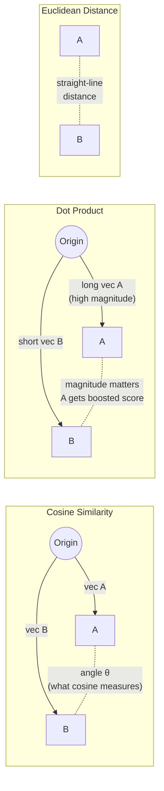
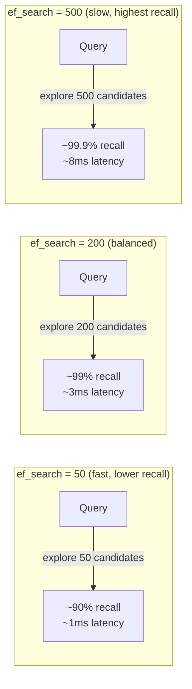

# Similarity Search — Distance Metrics & ANN

**Level**: 🟡 Intermediate
**Reading Time**: 12 minutes

> Choosing the wrong distance metric is one of the most common errors in production vector systems. Cosine similarity, dot product, and Euclidean distance look similar but behave very differently — and the wrong choice silently degrades retrieval quality.

## The Problem

You have a query vector and a collection of stored vectors. You want the K vectors most "similar" to the query. But what does "similar" mean geometrically? The answer depends on your choice of **distance metric**, and the right choice depends on how your embeddings were trained.

Additionally, computing exact similarity with all N vectors becomes prohibitively slow at large scale. **Approximate Nearest Neighbor (ANN)** algorithms trade a small amount of accuracy for enormous speed improvements.

## The Three Distance Metrics

### Cosine Similarity

Measures the **angle** between two vectors, ignoring their magnitudes.

```
cosine_similarity(A, B) = (A · B) / (|A| × |B|)
```

Range: -1 (opposite) to 1 (identical direction).

```python
import math

def cosine_similarity(a, b):
    dot = sum(x * y for x, y in zip(a, b))
    mag_a = math.sqrt(sum(x**2 for x in a))
    mag_b = math.sqrt(sum(x**2 for x in b))
    if mag_a == 0 or mag_b == 0:
        return 0.0
    return dot / (mag_a * mag_b)

# Two semantically similar sentences
v1 = [0.8, 0.3, 0.1, -0.2]
v2 = [0.75, 0.35, 0.08, -0.25]
v3 = [-0.5, 0.9, -0.3, 0.7]

print(cosine_similarity(v1, v2))  # ~0.999 — very similar
print(cosine_similarity(v1, v3))  # ~0.01  — dissimilar
```

**Use cosine similarity when**: vectors are normalized (or when magnitude should not matter). This is the default for most text embedding models — two documents about the same topic should score high regardless of document length.

### Dot Product (Inner Product)

Measures **both** the angle and the magnitude.

```
dot_product(A, B) = sum(A[i] * B[i])  =  |A| × |B| × cos(θ)
```

**Use dot product when**: your embedding model was trained with dot product as the training objective (e.g., OpenAI's text-embedding-3 models with Matryoshka training, or ColBERT-style models). Some models encode "importance" in the magnitude — more relevant documents have larger-magnitude vectors. In these cases, dot product beats cosine.

**Warning**: If vectors are not normalized, high-magnitude noise vectors can dominate dot product scores. Test both on your dataset.

### Euclidean Distance (L2)

Measures the straight-line **distance** between two points in space.

```
euclidean(A, B) = sqrt(sum((A[i] - B[i])^2))
```

Range: 0 (identical) to ∞.

**Use Euclidean distance when**: working with image embeddings or any embedding where spatial distance (not just direction) carries meaning. CLIP image embeddings and some audio embeddings work better with L2.

### Visual Comparison



## Decision Guide: Which Metric to Use

```
How was your embedding model trained?
├── Contrastive/cosine objective (most sentence-transformers, nomic-embed)
│   → Use COSINE
├── Dot product / Matryoshka objective (OpenAI text-embedding-3, ColBERT)
│   → Use DOT PRODUCT
├── Image/audio embeddings (CLIP, Wav2Vec)
│   → Try both COSINE and L2, benchmark on your data
└── Unsure
    → Default to COSINE (most forgiving, ignores magnitude artifacts)
```

### Normalization

If you L2-normalize your vectors (divide each by its magnitude), **cosine similarity and dot product give identical results** — because all normalized vectors have magnitude 1, so `|A| × |B| = 1`.

Most vector DBs normalize on ingest if you specify cosine metric. If your DB uses raw dot product, normalize yourself:

```python
import numpy as np

def l2_normalize(v):
    norm = np.linalg.norm(v)
    if norm == 0:
        return v
    return v / norm

# Normalize before inserting or querying
query_normalized = l2_normalize(query_embedding)
```

## Exact KNN vs Approximate Nearest Neighbor (ANN)

### Exact KNN

Computes the true closest K vectors — guaranteed to find the actual nearest neighbors.

```
function exactKNN(query, vectors, k):
  scores = [(cosine(query, v), i) for i, v in enumerate(vectors)]
  return topK(scores, k)
  // O(N·D) per query — 10M vectors × 1536 dims = 15.4B operations
```

At 10M vectors: ~5 seconds per query on a single CPU. Unusable at scale.

### Approximate Nearest Neighbor (ANN)

Returns the **approximate** top-K — may miss some of the true nearest neighbors, but is orders of magnitude faster.

```
// With HNSW index (see vector-index.md for details)
function annSearch(query, index, k, ef_search=200):
  // O(log N · D) — ~10ms for 10M vectors
  return index.search(query, k, ef_search=ef_search)
```

The trade-off: **recall@K** — the fraction of the true top-K that the ANN algorithm actually returns.

## Recall@K: The Primary Correctness Metric

**Recall@K** = (true top-K retrieved by ANN) / K

```python
def recall_at_k(true_neighbors, ann_neighbors, k):
    """
    true_neighbors: list of true nearest neighbor IDs (from exact KNN)
    ann_neighbors: list of IDs returned by ANN
    k: number of neighbors
    """
    true_set = set(true_neighbors[:k])
    ann_set = set(ann_neighbors[:k])
    return len(true_set & ann_set) / k

# Example
true_top10 = [7, 42, 15, 3, 91, 28, 56, 12, 77, 34]
ann_top10  = [7, 42, 15, 3, 91, 28, 56, 12, 99, 34]  # missed 77, found 99 instead
print(recall_at_k(true_top10, ann_top10, 10))  # 0.9 — 9 of 10 true neighbors found
```

**Target recall for production systems**:
- RAG/semantic search: recall@10 ≥ 0.95 (missing 1 in 20 relevant docs is acceptable)
- Recommendation: recall@10 ≥ 0.90 (approximation is fine, list is long)
- Deduplication: recall@1 ≥ 0.99 (near-exact match required)

## Tuning ef_search for Recall vs Latency

The `ef_search` parameter in HNSW controls the beam width of the search — how many candidate vectors are examined before returning results.



| ef_search | Recall@10 (1M vectors) | p50 Latency | p99 Latency |
|-----------|----------------------|-------------|-------------|
| 50 | ~90% | 0.8ms | 2ms |
| 100 | ~95% | 1.5ms | 4ms |
| 200 | ~99% | 3ms | 8ms |
| 500 | ~99.9% | 8ms | 20ms |

**Recommendation**: Start at ef_search=200 for production. If latency is tight, benchmark at ef_search=100 with your actual query distribution and verify recall@10 ≥ 0.95.

## Putting It Together: A Complete Similarity Search

```python
import faiss
import numpy as np

# Setup: 1M vectors of 1536 dimensions
dimension = 1536
n_vectors = 1_000_000

# Build HNSW index
index = faiss.IndexHNSWFlat(dimension, 16)  # M=16
index.hnsw.efConstruction = 200

# Index all vectors (offline, once)
vectors = np.random.rand(n_vectors, dimension).astype('float32')
# L2 normalize for cosine similarity via dot product
faiss.normalize_L2(vectors)
index.add(vectors)

# Search (online, per query)
index.hnsw.efSearch = 200  # recall vs latency tuning knob

query = np.random.rand(1, dimension).astype('float32')
faiss.normalize_L2(query)

k = 10
distances, indices = index.search(query, k)
# distances: cosine similarities (after normalization)
# indices: vector IDs of top-K nearest neighbors
```

## Common Pitfalls

1. **Using Euclidean distance for text**: L2 distance on text embeddings often produces worse results than cosine because text embeddings are not calibrated for Euclidean distance. Always use cosine for text.
2. **Not measuring recall@K**: Teams set ef_search=50 for speed and never realize they have 88% recall. Benchmark recall on 100 representative queries against exact KNN ground truth.
3. **Comparing scores across different queries**: Cosine similarity of 0.85 on one query and 0.85 on another query doesn't mean the results are equally good — the distribution of scores varies by query. Use recall@K, not similarity thresholds.
4. **Threshold filtering on similarity score**: "Only return results with cosine similarity > 0.7" sounds good but produces inconsistent results. Use top-K instead; the similarity score is not calibrated across queries.
5. **Not normalizing before dot product search**: If using dot product metric in your vector DB, vectors must be L2-normalized first. Skipping this means longer vectors dominate results regardless of semantic meaning.

## Key Takeaways

- Cosine similarity measures angle (direction only) — use for most text embeddings
- Dot product measures angle × magnitude — use when the embedding model was trained with a dot product objective
- Euclidean distance measures spatial distance — use for image/audio embeddings
- ANN (approximate nearest neighbor) trades recall for speed — HNSW is 100-1000× faster than exact KNN
- Recall@K is the key correctness metric: what fraction of true top-K did ANN actually find?
- ef_search is the main recall/latency knob for HNSW — tune it; default ef_search=50 often gives only 90% recall
