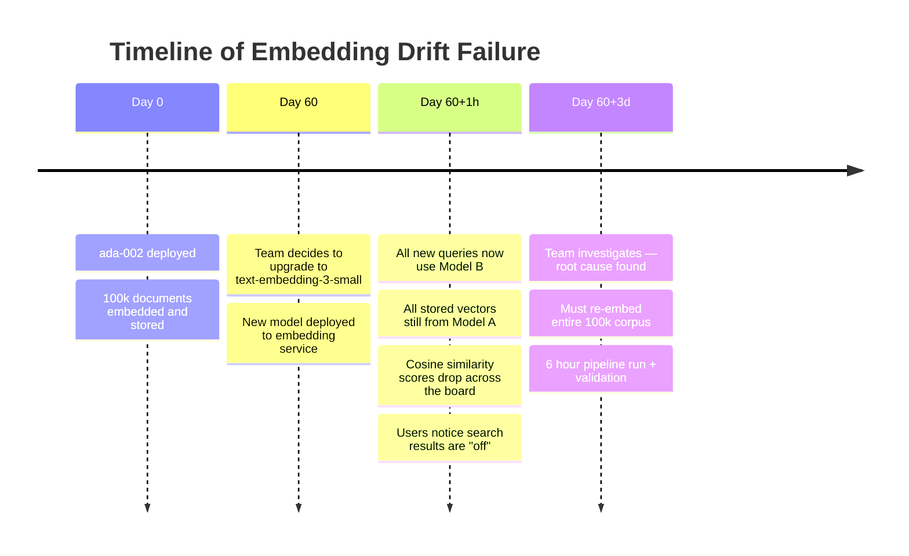

# Embedding Model Drift

**Level**: 🔴 Advanced
**Reading Time**: 8 minutes

> You upgrade your embedding model to improve quality. The next day, search results are garbage — but no error was thrown. This is embedding model drift.

## The Problem

Every embedding model maps text to a different vector space. Vectors from `text-embedding-ada-002` and vectors from `text-embedding-3-small` live in completely different geometries. There is no linear transformation that maps one to the other with useful accuracy.

When you change models:
- New queries are embedded in Model B's space
- Stored vectors are in Model A's space
- The dot product between them is meaningless
- Cosine similarity scores look plausible (0.4–0.7) but the rankings are wrong

The system returns results. They're just wrong. No exception, no 5xx, no alert fires.

## How It Happens in Practice



The partial migration window (Day 60 to Day 60+3d) is the most dangerous. Some queries work well (where the two models happened to agree), others are broken. The inconsistency makes it hard to identify the root cause.

## Detection: Score Distribution Monitoring

The most reliable early warning: monitor the distribution of top-1 cosine similarity scores across a representative query sample.

```python
# monitor_embedding_quality.py
import numpy as np
from typing import List

def score_distribution_check(
    query_vectors: np.ndarray,  # recent queries embedded by current model
    doc_vectors: np.ndarray,    # stored documents
    percentiles: List[int] = [10, 25, 50, 75, 90]
) -> dict:
    """
    Compute top-1 cosine similarity distribution across a query set.
    A sudden shift in this distribution = likely model mismatch.
    """
    top1_scores = []
    for qv in query_vectors:
        scores = doc_vectors @ qv  # assumes unit vectors
        top1_scores.append(float(scores.max()))

    stats = {
        "mean": float(np.mean(top1_scores)),
        "std": float(np.std(top1_scores)),
    }
    for p in percentiles:
        stats[f"p{p}"] = float(np.percentile(top1_scores, p))
    return stats

# BASELINE (healthy, same model):
# {"mean": 0.78, "p50": 0.81, "p10": 0.62}

# AFTER MODEL SWITCH (broken, mismatched models):
# {"mean": 0.41, "p50": 0.38, "p10": 0.21}

# Alert rule: if p50 drops more than 0.15 from baseline → investigate
```

## Detection: Golden Query Set Regression

Maintain 20–50 hand-labeled (query, expected_doc_ids) pairs. Run recall@K on every deployment:

```python
# golden_queries.py
GOLDEN_QUERIES = [
    {"query": "how does rate limiting work", "relevant_ids": ["doc-042", "doc-107"]},
    {"query": "kubernetes pod crashloopbackoff fix", "relevant_ids": ["doc-015"]},
    # ... 48 more
]

def recall_at_k(results: List[str], relevant: set, k: int = 5) -> float:
    return len(set(results[:k]) & relevant) / len(relevant)

def run_golden_eval(search_fn, golden_queries, k=5) -> float:
    scores = []
    for item in golden_queries:
        results = search_fn(item["query"], top_k=k)
        scores.append(recall_at_k(results, set(item["relevant_ids"]), k))
    return sum(scores) / len(scores)

# Gate deployments: if recall@5 < 0.70, block deployment
```

## Migration Strategy

```mermaid
flowchart TD
    A[Decision: upgrade to new model] --> B[Phase 1: Dual-Write\nNew docs → both models\nOld docs still served from Model A]
    B --> C[Phase 2: Background re-embed\nBatch re-embed old docs with Model B\nStore in separate collection/table]
    C --> D{Recall@5 on golden set\nModel B collection ≥ threshold?}
    D -- No --> E[Investigate — check chunking,\nmodel version, index params]
    D -- Yes --> F[Phase 3: Traffic switch\nQuery with Model B vectors\nKeep Model A as fallback for 48h]
    F --> G[Phase 4: Cleanup\nDelete Model A vectors\nRemove dual-write logic]
```

### Phase 1: Dual-Write (Day 0)

```python
# dual_embed.py — embed new docs with both models during transition
async def embed_new_document(doc: Document, model_a, model_b, store_a, store_b):
    vec_a, vec_b = await asyncio.gather(
        model_a.embed(doc.content),
        model_b.embed(doc.content)
    )
    await store_a.upsert(doc.id, vec_a)
    await store_b.upsert(doc.id, vec_b)

# Cost: 2× embedding API cost during transition period
# Duration: as long as it takes to re-embed the full existing corpus
```

### Phase 2: Background Re-embed (Day 0 → Day N)

```python
# re_embed_corpus.py
async def migrate_corpus(old_store, new_store, model_b, batch_size=512):
    """
    Re-embed all documents from the old store using the new model.
    Progress is checkpointed — safe to restart on failure.
    """
    cursor = None
    while True:
        batch, cursor = await old_store.scroll(cursor=cursor, limit=batch_size)
        if not batch:
            break

        contents = [point.payload["content"] for point in batch]
        new_vectors = await model_b.embed_batch(contents)
        await new_store.upsert_batch(
            [(point.id, vec, point.payload) for point, vec in zip(batch, new_vectors)]
        )
        print(f"Re-embedded {len(batch)} docs (cursor: {cursor})")
```

### Cost of Migration

| Corpus Size | text-embedding-3-small | ada-002 | Local model |
|-------------|----------------------|---------|-------------|
| 10k docs | ~$0.004 | ~$0.01 | $0 |
| 100k docs | ~$0.04 | ~$0.10 | $0 |
| 1M docs | ~$0.40 | ~$1.00 | $0 |
| 10M docs | ~$4.00 | ~$10.00 | $0 |

*At 200 avg tokens/doc. Actual cost scales with document length.*

## Model Compatibility Matrix

| Scenario | Compatible? | Notes |
|----------|-------------|-------|
| Same model, different dimensions (e.g., `text-embedding-3-small` at 1536 vs 512) | No | Dimension reduction uses a different subspace |
| Same model family, different version | No | Treat any model update as a full migration |
| Fine-tuned version of same base model | No | Fine-tuning changes the embedding space |
| Different providers, same architecture claim | No | Implementation differences matter |

**The rule**: one collection = one model version. Period.

## Preventing Drift: Metadata Tagging

Tag every vector with the model that produced it. Enforce at query time:

```python
# Store model metadata with every vector
await store.upsert(
    id=doc_id,
    vector=embedding,
    payload={
        "content": doc.content,
        "embedding_model": "text-embedding-3-small",
        "embedding_model_version": "2024-02-15",
        "embedded_at": datetime.utcnow().isoformat(),
    }
)

# Query-time validation
def search(query: str, expected_model: str):
    query_vec = current_model.embed(query)
    results = store.search(query_vec)

    # Spot-check: if top result's model tag doesn't match, alert
    for result in results[:5]:
        if result.payload.get("embedding_model") != expected_model:
            alert("Model mismatch detected in query results!")
```

## Common Pitfalls

1. **Partial migration without dual-write**: Switch embedding service before re-embedding corpus. Guaranteed silent failure.
2. **Testing with synthetic queries**: If your golden set only covers common cases, drift may go undetected for rare-but-important queries (e.g., specific error codes or product names).
3. **Assuming same model = same vectors**: Even the same model can produce slightly different vectors after a library update (numerical precision differences). Always re-run golden eval after any dependency upgrade.
4. **Skipping the 48h fallback window**: Users often don't notice problems immediately. Keep the old model available for at least 48h after switching.

## Key Takeaways

- Switching embedding models invalidates all stored vectors — they are incompatible by design
- The failure is silent: the system returns results, they're just wrong
- Detect it: monitor top-K score distributions + golden query recall@K
- Migrate safely: dual-write → re-embed corpus → eval gate → traffic switch → cleanup
- Prevent it: tag every vector with its embedding model version; enforce at query time

## Related

- [Embedding Ingestion Pipeline](../hands-on/embedding-pipeline) — how to re-embed a large corpus efficiently
- [Silent Retrieval Quality Degradation](./retrieval-quality-degradation) — monitoring when results degrade for other reasons
- [Index Staleness](./index-staleness) — separate issue: index graph degradation over time
