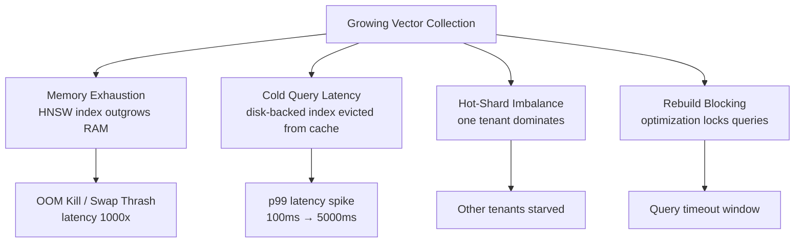
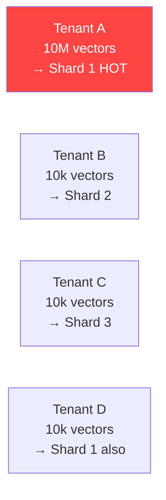

# Vector DB Scaling Failures

**Level**: 🔴 Advanced
**Reading Time**: 12 minutes

> HNSW gives you sub-millisecond search — until your index grows past available RAM and everything grinds to a halt.

## The Problem

Vector databases hide a dangerous scaling cliff. Small collections (< 100k vectors) behave beautifully: fast inserts, fast queries, low memory. Scale past a few million vectors and you start hitting failures that are hard to predict in development:

- Memory exhaustion from RAM-resident indexes
- Cold query latency spikes when indexes are evicted to disk
- Hot-shard imbalance in multi-tenant deployments
- Index rebuild operations blocking all queries

These failures don't appear until production load, and they appear suddenly — not gradually.

## Failure Modes



## Failure 1: Memory Exhaustion

### Why HNSW is RAM-hungry

HNSW (Hierarchical Navigable Small World) stores the entire graph in RAM for fast traversal. The memory formula:

```
RAM (bytes) = num_vectors × dimensions × bytes_per_float + graph_overhead

# Example: 1M vectors, 1536 dimensions, float32
raw_vectors   = 1,000,000 × 1536 × 4  = 6.1 GB
hnsw_graph    ≈ num_vectors × M × 10 bytes  (M=16 default)
              = 1,000,000 × 16 × 10  = 160 MB
total ≈ 6.3 GB minimum — plus OS, app, connection overhead
```

**Key numbers to memorize:**

| Vectors | 1536d float32 | With HNSW graph (M=16) |
|---------|--------------|------------------------|
| 100k    | 0.6 GB       | ~0.7 GB                |
| 1M      | 6.1 GB       | ~6.3 GB                |
| 10M     | 61 GB        | ~62 GB                 |
| 100M    | 610 GB       | Need sharding or quantization |

### Mitigation: Quantization

Reduce memory by compressing float32 to smaller types:

```
# Product Quantization (PQ): 32x compression, ~5% recall loss
float32 1536d → uint8 48d  = 48 bytes vs 6144 bytes

# Scalar Quantization (SQ8): 4x compression, ~1% recall loss
float32 → int8  = 1536 bytes vs 6144 bytes

# Binary Quantization: 32x, ~10% recall loss — works best with matryoshka embeddings
float32 → 1 bit = 192 bytes
```

```python
# Qdrant: enable scalar quantization at collection creation
from qdrant_client.models import ScalarQuantization, ScalarQuantizationConfig, ScalarType

client.create_collection(
    collection_name="docs",
    vectors_config=VectorParams(size=1536, distance=Distance.COSINE),
    quantization_config=ScalarQuantization(
        scalar=ScalarQuantizationConfig(
            type=ScalarType.INT8,
            quantile=0.99,
            always_ram=True,  # keep quantized vectors in RAM, full on disk
        )
    )
)
```

### Mitigation: DiskANN / On-Disk Indexes

For collections too large for RAM, use disk-aware indexes:

```
DiskANN: Microsoft's disk-optimized ANN algorithm
- Stores graph on SSD (NVMe required)
- RAM footprint: ~1/10th of HNSW
- Latency: 1-5ms vs <1ms for HNSW
- Supported: Azure AI Search, Weaviate (experimental)

pgvector diskann (experimental, PG 16+):
- Uses SSD for index pages
- Trade-off: 5-10x latency increase
```

**Decision**: If total memory < 50% of available RAM → HNSW. Otherwise → quantization + HNSW, or DiskANN.

## Failure 2: Cold Query Latency

### What happens

When the OS evicts HNSW pages from RAM to swap/disk (under memory pressure), the first queries after eviction must page-fault the index back in. A query that normally takes 1ms can take 5,000ms.

**Symptoms**: p99 latency fine in benchmarks, spikes 100x in production after overnight traffic drop (index evicted during quiet period).

### Detection

```python
# Monitor page fault rate alongside query latency
# Linux: track /proc/<pid>/status VmRSS over time
# Alert when: p99 query latency > 10x p50 (indicates cache miss spike)
```

### Mitigation

```bash
# Linux: pin index in RAM with mlock
# Qdrant: set in config
storage:
  on_disk_payload: true  # payloads to disk
  # vectors stay in RAM by default

# For OS-level pinning (requires CAP_IPC_LOCK):
ulimit -l unlimited
```

## Failure 3: Hot-Shard Imbalance

### What happens in multi-tenant deployments

If you store all tenants in one collection and shard by consistent hash, a tenant with 10M vectors lands entirely on one shard while 1000 tenants with 10k vectors each are distributed across all shards. The large tenant's shard is permanently hot.



### Mitigation: Tenant Isolation Strategy

```
Small tenants (<100k vectors):  shared collection, filter by tenant_id metadata
Medium tenants (100k-5M):       dedicated collection per tenant
Large tenants (>5M):            dedicated collection + multiple shards
```

```python
# Small tenant: shared collection with filter
results = client.search(
    collection_name="shared",
    query_vector=query_embedding,
    query_filter=Filter(must=[
        FieldCondition(key="tenant_id", match=MatchValue(value="acme"))
    ]),
    limit=10
)

# Large tenant: dedicated collection
results = client.search(
    collection_name="acme_vectors",  # tenant-specific collection
    query_vector=query_embedding,
    limit=10
)
```

## Failure 4: Index Rebuild Blocking Queries

### What happens

Vector DBs periodically optimize/compact their indexes (merge segments, rebuild HNSW graph after many deletes). Qdrant calls this "optimization", Pinecone triggers it on pod replacement. During rebuild:

- Qdrant: queries fall back to slower brute-force on the being-rebuilt segment
- Weaviate: index temporarily unavailable for affected shard
- pgvector: `CREATE INDEX` blocks concurrent writes (use `CREATE INDEX CONCURRENTLY`)

### Detection and Prevention

```python
# Qdrant: check optimization status before high-traffic period
info = client.get_collection("docs")
status = info.optimizer_status  # "ok" | "optimizing" | "error"

# Trigger optimization during low-traffic window
client.update_collection(
    "docs",
    optimizer_config=OptimizersConfigDiff(
        indexing_threshold=20000,  # delay indexing until 20k unindexed vectors
    )
)
```

```sql
-- pgvector: always use CONCURRENTLY for large tables
CREATE INDEX CONCURRENTLY idx_embedding
ON documents USING hnsw (embedding vector_cosine_ops)
WITH (m = 16, ef_construction = 64);
-- This takes longer but doesn't block reads or writes
```

## Common Pitfalls

1. **Benchmarking on cold cache** — Test with the index fully loaded in RAM; production warmup period is a separate concern.
2. **Ignoring the HNSW graph overhead** — Always add 10-15% to raw vector memory for graph pointers and metadata.
3. **Single collection for all tenants** — Works at 100 tenants, falls apart at 10,000 tenants with variable sizes.
4. **No memory headroom** — Running with < 20% free RAM causes the OS to start evicting pages aggressively under any traffic spike.
5. **Triggering optimization during peak hours** — Schedule index compaction for low-traffic windows.

## Key Takeaways

- **HNSW memory formula**: `num_vectors × dimensions × 4 bytes` + ~10% for graph overhead
- **Quantization**: INT8 gives 4x memory reduction with ~1% recall loss — use it at >1M vectors
- **Multi-tenancy**: separate collections for tenants > 100k vectors; shared collection + metadata filter for smaller ones
- **DiskANN**: the right choice when RAM cost > 2x the performance trade-off
- **Index rebuild**: always use `CONCURRENTLY` in pgvector; monitor optimizer status in Qdrant; schedule during off-peak hours
