# Knowledge Graph

> Auto-generated by `/sync-graph` on 2026-03-17T02:24:38.615Z
> **226 nodes** | **1352 edges**

---

## Stats

| Layer | Count |
|-------|-------|
| concept | 51 |
| solution | 3 |
| problem | 24 |
| poc | 101 |
| interview-q | 33 |
| case-study | 14 |

## Diagram 1: Concepts & Solutions

## Diagram 2: Problems

```mermaid
graph TD
  problems_at_scale_scalability_memory_leak_long_running["memory-leak-long-running"]
  problems_at_scale_scalability_hot_partition["hot-partition"]
  problems_at_scale_scalability_database_hotspots["database-hotspots"]
  problems_at_scale_performance_thread_pool_exhaustion["thread-pool-exhaustion"]
  problems_at_scale_performance_n_plus_one_query["n-plus-one-query"]
  problems_at_scale_performance_connection_pool_starvation["connection-pool-starvation"]
  problems_at_scale_data_integrity_orphaned_records["orphaned-records"]
  problems_at_scale_data_integrity_duplicate_event_processing["duplicate-event-processing"]
  problems_at_scale_cost_optimization_storage_bloat["storage-bloat"]
  problems_at_scale_consistency_stale_read_after_write["stale-read-after-write"]
  problems_at_scale_consistency_message_out_of_order["message-out-of-order"]
  problems_at_scale_consistency_cache_invalidation_race["cache-invalidation-race"]
  problems_at_scale_concurrency_stock_order_matching_race["stock-order-matching-race"]
  problems_at_scale_concurrency_race_condition_inventory["race-condition-inventory"]
  problems_at_scale_concurrency_duplicate_orders["duplicate-orders"]
  problems_at_scale_concurrency_double_charge_payment["double-charge-payment"]
  problems_at_scale_concurrency_double_booking["double-booking"]
  problems_at_scale_concurrency_counter_race["counter-race"]
  problems_at_scale_availability_timeout_domino_effect["timeout-domino-effect"]
  problems_at_scale_availability_thundering_herd["thundering-herd"]
  problems_at_scale_availability_split_brain["split-brain"]
  problems_at_scale_availability_retry_storm["retry-storm"]
  problems_at_scale_availability_circuit_breaker_failure["circuit-breaker-failure"]
  problems_at_scale_availability_cascading_failures["cascading-failures"]
  problems_at_scale_scalability_memory_leak_long_running -->|related| problems_at_scale_performance_connection_pool_starvation
  problems_at_scale_scalability_memory_leak_long_running -->|related| problems_at_scale_performance_thread_pool_exhaustion
  problems_at_scale_scalability_memory_leak_long_running -->|related| problems_at_scale_availability_cascading_failures
  problems_at_scale_scalability_hot_partition -->|related| problems_at_scale_scalability_database_hotspots
  problems_at_scale_scalability_hot_partition -->|related| problems_at_scale_availability_thundering_herd
  problems_at_scale_scalability_database_hotspots -->|related| problems_at_scale_scalability_hot_partition
  problems_at_scale_scalability_database_hotspots -->|related| problems_at_scale_concurrency_counter_race
  problems_at_scale_scalability_database_hotspots -->|related| problems_at_scale_performance_connection_pool_starvation
  problems_at_scale_performance_thread_pool_exhaustion -->|related| problems_at_scale_performance_connection_pool_starvation
  problems_at_scale_performance_thread_pool_exhaustion -->|related| problems_at_scale_availability_cascading_failures
  problems_at_scale_performance_thread_pool_exhaustion -->|related| problems_at_scale_availability_timeout_domino_effect
  problems_at_scale_performance_n_plus_one_query -->|related| problems_at_scale_performance_connection_pool_starvation
  problems_at_scale_performance_n_plus_one_query -->|related| problems_at_scale_scalability_database_hotspots
  problems_at_scale_performance_connection_pool_starvation -->|related| problems_at_scale_performance_thread_pool_exhaustion
  problems_at_scale_performance_connection_pool_starvation -->|related| problems_at_scale_availability_cascading_failures
  problems_at_scale_performance_connection_pool_starvation -->|related| problems_at_scale_availability_timeout_domino_effect
  problems_at_scale_data_integrity_orphaned_records -->|related| problems_at_scale_data_integrity_duplicate_event_processing
  problems_at_scale_data_integrity_orphaned_records -->|related| problems_at_scale_cost_optimization_storage_bloat
  problems_at_scale_data_integrity_duplicate_event_processing -->|related| problems_at_scale_concurrency_duplicate_orders
  problems_at_scale_data_integrity_duplicate_event_processing -->|related| problems_at_scale_concurrency_double_charge_payment
  problems_at_scale_data_integrity_duplicate_event_processing -->|related| problems_at_scale_consistency_message_out_of_order
  problems_at_scale_cost_optimization_storage_bloat -->|related| problems_at_scale_data_integrity_orphaned_records
  problems_at_scale_consistency_stale_read_after_write -->|related| problems_at_scale_consistency_cache_invalidation_race
  problems_at_scale_consistency_stale_read_after_write -->|related| problems_at_scale_availability_split_brain
  problems_at_scale_consistency_message_out_of_order -->|related| problems_at_scale_data_integrity_duplicate_event_processing
  problems_at_scale_consistency_message_out_of_order -->|related| problems_at_scale_consistency_stale_read_after_write
  problems_at_scale_consistency_cache_invalidation_race -->|related| problems_at_scale_consistency_stale_read_after_write
  problems_at_scale_consistency_cache_invalidation_race -->|related| problems_at_scale_availability_thundering_herd
  problems_at_scale_concurrency_stock_order_matching_race -->|related| problems_at_scale_concurrency_race_condition_inventory
  problems_at_scale_concurrency_stock_order_matching_race -->|related| problems_at_scale_concurrency_double_charge_payment
  problems_at_scale_concurrency_stock_order_matching_race -->|related| problems_at_scale_scalability_hot_partition
  problems_at_scale_concurrency_race_condition_inventory -->|related| problems_at_scale_concurrency_double_charge_payment
  problems_at_scale_concurrency_race_condition_inventory -->|related| problems_at_scale_concurrency_duplicate_orders
  problems_at_scale_concurrency_race_condition_inventory -->|related| problems_at_scale_concurrency_double_booking
  problems_at_scale_concurrency_duplicate_orders -->|related| problems_at_scale_concurrency_double_charge_payment
  problems_at_scale_concurrency_duplicate_orders -->|related| problems_at_scale_concurrency_race_condition_inventory
  problems_at_scale_concurrency_duplicate_orders -->|related| problems_at_scale_data_integrity_duplicate_event_processing
  problems_at_scale_concurrency_double_charge_payment -->|related| problems_at_scale_concurrency_duplicate_orders
  problems_at_scale_concurrency_double_charge_payment -->|related| problems_at_scale_concurrency_race_condition_inventory
  problems_at_scale_concurrency_double_charge_payment -->|related| problems_at_scale_data_integrity_duplicate_event_processing
  problems_at_scale_concurrency_double_booking -->|related| problems_at_scale_concurrency_race_condition_inventory
  problems_at_scale_concurrency_double_booking -->|related| problems_at_scale_concurrency_duplicate_orders
  problems_at_scale_concurrency_counter_race -->|related| problems_at_scale_consistency_stale_read_after_write
  problems_at_scale_concurrency_counter_race -->|related| problems_at_scale_scalability_database_hotspots
  problems_at_scale_availability_timeout_domino_effect -->|related| problems_at_scale_availability_cascading_failures
  problems_at_scale_availability_timeout_domino_effect -->|related| problems_at_scale_performance_thread_pool_exhaustion
  problems_at_scale_availability_timeout_domino_effect -->|related| problems_at_scale_performance_connection_pool_starvation
  problems_at_scale_availability_thundering_herd -->|related| problems_at_scale_availability_cascading_failures
  problems_at_scale_availability_thundering_herd -->|related| problems_at_scale_availability_retry_storm
  problems_at_scale_availability_thundering_herd -->|related| problems_at_scale_consistency_cache_invalidation_race
  problems_at_scale_availability_split_brain -->|related| problems_at_scale_consistency_stale_read_after_write
  problems_at_scale_availability_split_brain -->|related| problems_at_scale_availability_cascading_failures
  problems_at_scale_availability_retry_storm -->|related| problems_at_scale_availability_cascading_failures
  problems_at_scale_availability_retry_storm -->|related| problems_at_scale_availability_thundering_herd
  problems_at_scale_availability_retry_storm -->|related| problems_at_scale_availability_circuit_breaker_failure
  problems_at_scale_availability_circuit_breaker_failure -->|related| problems_at_scale_availability_cascading_failures
  problems_at_scale_availability_circuit_breaker_failure -->|related| problems_at_scale_availability_retry_storm
  problems_at_scale_availability_cascading_failures -->|related| problems_at_scale_availability_retry_storm
  problems_at_scale_availability_cascading_failures -->|related| problems_at_scale_availability_timeout_domino_effect
  problems_at_scale_availability_cascading_failures -->|related| problems_at_scale_performance_thread_pool_exhaustion
```

## Diagram 3: POCs & Interview Questions

## Diagram 4: Case Studies

## Navigation Index

### All Nodes by Layer

#### concept
| File | Tags |
|------|------|
| interview-prep/aws-cloud/auto-scaling | aws, auto-scaling, asg, ec2, scaling, cloud, high-availability |
| interview-prep/aws-cloud/cloudwatch-monitoring | aws, cloudwatch, monitoring, observability, alarms, metrics, logging |
| interview-prep/aws-cloud/lambda-serverless | aws, lambda, serverless, cold-start, event-driven, faas, cloud |
| interview-prep/aws-cloud/load-balancer | aws, load-balancing, alb, nlb, elb, availability, scalability |
| interview-prep/aws-cloud/s3-tps-limits | aws, s3, storage, tps, throughput, partitioning, scalability |
| interview-prep/caching-cdn/api-metrics | api, metrics, p95, p99, sla, slo, latency, performance, observability |
| interview-prep/caching-cdn/cache-strategies | caching, cache-aside, write-through, write-behind, read-through, redis, strategies |
| interview-prep/caching-cdn/cdn-usage | cdn, content-delivery, edge-computing, caching, cloudfront, performance, latency |
| interview-prep/caching-cdn/performance-bottlenecks | performance, bottlenecks, profiling, debugging, latency, throughput, optimization |
| interview-prep/caching-cdn/redis-fundamentals | redis, caching, eviction, ttl, data-structures, in-memory, fundamentals |
| interview-prep/database-storage/connection-pooling | database, connection-pooling, performance, pgbouncer, scalability |
| interview-prep/database-storage/database-replication | database, replication, master-slave, multi-master, high-availability, consistency |
| interview-prep/database-storage/indexing-strategies | database, indexing, b-tree, hash, gin, gist, query-optimization |
| interview-prep/database-storage/query-optimization | database, query-optimization, explain-analyze, n-plus-one, performance, sql |
| interview-prep/database-storage/scaling-strategies | database, scaling, sharding, read-replicas, horizontal-scaling, partitioning |
| interview-prep/database-storage/sql-vs-nosql | database, sql, nosql, postgresql, mongodb, redis, data-modeling |
| interview-prep/security-encryption/hashing-vs-encryption | security, hashing, encryption, bcrypt, sha256, passwords |
| interview-prep/security-encryption/jwt-vs-session | security, authentication, jwt, sessions, oauth, stateless |
| interview-prep/security-encryption/mitm-prevention | security, mitm, tls, https, hsts, certificate-pinning, mtls |
| interview-prep/security-encryption/rsa-vs-aes | security, encryption, rsa, aes, cryptography, tls |
| interview-prep/security-encryption/sha-comparison | security, hashing, sha256, sha1, cryptography, integrity |
| system-design/api-design/idempotency | idempotency, payments, retry, distributed-systems, consistency |
| system-design/api-design/rate-limiting | rate-limiting, api-protection, ddos, token-bucket, sliding-window |
| system-design/api-design/rest-graphql-grpc | rest, graphql, grpc, api-design, protocol, microservices |
| system-design/caching/caching-fundamentals | caching, redis, performance, availability |
| system-design/caching/caching-strategies | caching, redis, cdn, performance, cache-invalidation |
| system-design/consistency/distributed-consensus | consensus, raft, paxos, distributed-systems, consistency, split-brain |
| system-design/databases/data-archival-strategies | databases, archival, data-lifecycle, partitioning, cold-storage |
| system-design/databases/indexing-deep-dive | databases, indexes, btree, performance, query-optimization, postgresql |
| system-design/databases/indexing-strategies | databases, indexes, performance, postgresql, query-optimization |
| system-design/databases/read-replicas | databases, replication, read-replicas, scalability, postgresql |
| system-design/databases/replication-basics | databases, replication, availability, postgresql, mysql |
| system-design/databases/sharding-strategies | databases, sharding, horizontal-scaling, distributed-systems |
| system-design/load-balancing/load-balancing-strategies | load-balancing, nginx, consistent-hashing, round-robin, traffic-distribution |
| system-design/monitoring/observability-slos | observability, slo, sli, monitoring, prometheus, alerting |
| system-design/performance/connection-pool-management | connection-pooling, databases, performance, postgresql, pgbouncer |
| system-design/queues/kafka-vs-rabbitmq | kafka, rabbitmq, queues, messaging, event-streaming |
| system-design/queues/message-queue-basics | queues, messaging, async, kafka, rabbitmq |
| system-design/scalability/async-processing | async, message-queues, kafka, background-jobs, scalability |
| system-design/scalability/auto-scaling | auto-scaling, cloud, kubernetes, capacity-planning, devops |
| system-design/scalability/backpressure | backpressure, flow-control, queues, resilience, load-shedding |
| system-design/scalability/cdn-edge-computing | cdn, edge-computing, caching, latency, global-distribution |
| system-design/scalability/chaos-engineering | chaos-engineering, resilience, fault-tolerance, netflix, testing |
| system-design/scalability/cqrs | cqrs, event-sourcing, scalability, read-write-separation, databases |
| system-design/scalability/event-driven-architecture | event-driven, kafka, event-sourcing, microservices, loose-coupling |
| system-design/scalability/high-availability | high-availability, uptime, sla, fault-tolerance, redundancy |
| system-design/scalability/microservices-architecture | microservices, architecture, distributed-systems, service-mesh |
| system-design/scalability/multi-region | multi-region, global-distribution, disaster-recovery, geo-redundancy |
| system-design/scalability/scaling-basics | scalability, horizontal-scaling, vertical-scaling, load-balancing |
| system-design/scalability/stateless-architecture | stateless, sessions, jwt, horizontal-scaling, cloud |
| system-design/security/authentication-at-scale | authentication, jwt, oauth, sessions, security, authorization |

#### solution
| File | Tags |
|------|------|
| system-design/patterns/circuit-breaker | resilience, microservices, availability, fault-tolerance |
| system-design/patterns/microservices-communication | microservices, grpc, rest, async, event-driven, communication |
| system-design/patterns/timeouts-backpressure | timeouts, backpressure, resilience, flow-control, microservices |

#### problem
| File | Tags |
|------|------|
| problems-at-scale/availability/cascading-failures | availability, cascading-failure, circuit-breaker, fault-isolation, microservices, backpressure |
| problems-at-scale/availability/circuit-breaker-failure | availability, circuit-breaker, resilience, half-open, microservices |
| problems-at-scale/availability/retry-storm | availability, retry, backoff, jitter, circuit-breaker, rate-limiting, backpressure |
| problems-at-scale/availability/split-brain | availability, split-brain, consensus, quorum, raft, network-partition, distributed-systems |
| problems-at-scale/availability/thundering-herd | availability, caching, thundering-herd, cache-stampede, redis, database |
| problems-at-scale/availability/timeout-domino-effect | availability, timeout, microservices, thread-pool, cascading, performance |
| problems-at-scale/concurrency/counter-race | concurrency, counters, atomic-operations, redis, social-media, eventual-consistency |
| problems-at-scale/concurrency/double-booking | concurrency, locking, transactions, redis, booking, ticketing |
| problems-at-scale/concurrency/double-charge-payment | concurrency, payments, idempotency, distributed-locks, fintech, compliance |
| problems-at-scale/concurrency/duplicate-orders | concurrency, deduplication, idempotency, orders, e-commerce |
| problems-at-scale/concurrency/race-condition-inventory | concurrency, inventory, race-condition, redis, atomic-operations, e-commerce |
| problems-at-scale/concurrency/stock-order-matching-race | concurrency, trading, hft, atomic-operations, lock-free, financial |
| problems-at-scale/consistency/cache-invalidation-race | consistency, caching, cache-invalidation, race-condition, stale-data, redis |
| problems-at-scale/consistency/message-out-of-order | consistency, kafka, message-ordering, event-driven, sequence |
| problems-at-scale/consistency/stale-read-after-write | consistency, read-replicas, replication-lag, caching, eventual-consistency |
| problems-at-scale/cost-optimization/storage-bloat | cost-optimization, storage, soft-delete, compression, data-retention, postgresql, archival |
| problems-at-scale/data-integrity/duplicate-event-processing | data-integrity, idempotency, kafka, at-least-once, deduplication, event-driven |
| problems-at-scale/data-integrity/orphaned-records | data-integrity, orphaned-records, cascade-delete, foreign-keys, gdpr, referential-integrity |
| problems-at-scale/performance/connection-pool-starvation | performance, connection-pool, database, thread-pool, starvation, microservices |
| problems-at-scale/performance/n-plus-one-query | performance, n-plus-one, orm, database, query-optimization, eager-loading |
| problems-at-scale/performance/thread-pool-exhaustion | performance, thread-pool, exhaustion, timeout, microservices, concurrency |
| problems-at-scale/scalability/database-hotspots | scalability, sharding, hot-partition, database, celebrity-problem, load-balancing |
| problems-at-scale/scalability/hot-partition | scalability, partitioning, hot-partition, sharding, dynamodb, load-skew |
| problems-at-scale/scalability/memory-leak-long-running | scalability, memory-leak, oom, performance, garbage-collection, long-running-services |

#### poc
| File | Tags |
|------|------|
| interview-prep/practice-pocs/api-gateway-rate-limiting | api-gateway, rate-limiting, token-bucket, security, infrastructure |
| interview-prep/practice-pocs/api-key-management | api-keys, security, authentication, hashing, rate-limiting |
| interview-prep/practice-pocs/api-versioning-strategies | api-versioning, backwards-compatibility, url-versioning, header-versioning |
| interview-prep/practice-pocs/backpressure-queues | backpressure, queues, flow-control, rate-limiting, async |
| interview-prep/practice-pocs/blue-green-deployment | deployment, blue-green, zero-downtime, load-balancing, releases |
| interview-prep/practice-pocs/cache-aside-pattern | caching, cache-aside, lazy-loading, redis, database |
| interview-prep/practice-pocs/cache-invalidation-strategies | caching, invalidation, ttl, event-driven, consistency |
| interview-prep/practice-pocs/canary-releases | deployment, canary, gradual-rollout, risk-reduction, monitoring |
| interview-prep/practice-pocs/chaos-engineering | chaos-engineering, resilience, fault-injection, availability, testing |
| interview-prep/practice-pocs/circuit-breaker | resilience, circuit-breaker, availability, microservices, failure-handling |
| interview-prep/practice-pocs/connection-leak-detection | connection-pooling, leak-detection, debugging, postgresql, monitoring |
| interview-prep/practice-pocs/connection-pool-sizing | connection-pooling, postgresql, performance, configuration, sizing |
| interview-prep/practice-pocs/contract-testing | contract-testing, microservices, pact, consumer-driven, api-compatibility |
| interview-prep/practice-pocs/cqrs-pattern | cqrs, command-query, read-write-separation, scalability, event-sourcing |
| interview-prep/practice-pocs/database-archival-strategies | postgresql, archival, data-lifecycle, storage, partitioning |
| interview-prep/practice-pocs/database-check-constraints | postgresql, check-constraints, validation, data-integrity, sql |
| interview-prep/practice-pocs/database-connection-pooling | postgresql, connection-pooling, pgbouncer, performance, scaling |
| interview-prep/practice-pocs/database-crud | postgresql, crud, database, sql, api |
| interview-prep/practice-pocs/database-ctes | postgresql, ctes, sql, query-readability, recursive |
| interview-prep/practice-pocs/database-explain | postgresql, explain, query-plans, optimization, performance |
| interview-prep/practice-pocs/database-foreign-keys | postgresql, foreign-keys, referential-integrity, constraints, data-integrity |
| interview-prep/practice-pocs/database-full-text-search | postgresql, full-text-search, tsvector, tsquery, search |
| interview-prep/practice-pocs/database-indexes | postgresql, indexes, performance, query-optimization, btree |
| interview-prep/practice-pocs/database-jsonb | postgresql, jsonb, flexible-schema, nosql, indexing |
| interview-prep/practice-pocs/database-materialized-views | postgresql, materialized-views, caching, analytics, performance |
| interview-prep/practice-pocs/database-n-plus-one | postgresql, n-plus-one, query-optimization, orm, joins |
| interview-prep/practice-pocs/database-partitioning | postgresql, partitioning, performance, range-partition, list-partition |
| interview-prep/practice-pocs/database-read-replicas | postgresql, read-replicas, replication, scaling, load-balancing |
| interview-prep/practice-pocs/database-sequences | postgresql, sequences, unique-ids, serial, identity |
| interview-prep/practice-pocs/database-sharding | postgresql, sharding, horizontal-scaling, partitioning, distributed |
| interview-prep/practice-pocs/database-testing | postgresql, testing, fixtures, test-isolation, migrations |
| interview-prep/practice-pocs/database-transactions | databases, transactions, acid, postgresql, isolation-levels |
| interview-prep/practice-pocs/database-triggers | postgresql, triggers, automation, audit-log, data-integrity |
| interview-prep/practice-pocs/database-vacuum | postgresql, vacuum, maintenance, bloat, autovacuum |
| interview-prep/practice-pocs/database-views | postgresql, views, sql, query-reuse, abstraction |
| interview-prep/practice-pocs/database-window-functions | postgresql, window-functions, analytics, ranking, sql |
| interview-prep/practice-pocs/distributed-tracing | distributed-tracing, opentelemetry, jaeger, observability, microservices |
| interview-prep/practice-pocs/event-sourcing-basics | event-sourcing, events, immutable-log, audit-trail, domain-events |
| interview-prep/practice-pocs/event-store-implementation | event-store, event-sourcing, postgresql, projections, append-only |
| interview-prep/practice-pocs/feature-flags | feature-flags, configuration, a-b-testing, rollouts, toggles |
| interview-prep/practice-pocs/graceful-degradation | resilience, graceful-degradation, fallback, availability, user-experience |
| interview-prep/practice-pocs/graphql-server-implementation | graphql, api, resolvers, schema, n-plus-one |
| interview-prep/practice-pocs/grpc-protocol-buffers | grpc, protocol-buffers, microservices, streaming, performance |
| interview-prep/practice-pocs/health-check-patterns | health-checks, kubernetes, liveness, readiness, load-balancing |
| interview-prep/practice-pocs/http-caching-headers | http, caching, etags, cache-control, browser-cache |
| interview-prep/practice-pocs/idempotency-keys | idempotency, payment, api-design, redis, safety |
| interview-prep/practice-pocs/integration-testing | integration-testing, docker, testcontainers, api-testing, end-to-end |
| interview-prep/practice-pocs/jwt-authentication | jwt, authentication, security, tokens, stateless |
| interview-prep/practice-pocs/kafka-basics-producer-consumer | kafka, producers, consumers, topics, messaging |
| interview-prep/practice-pocs/kafka-consumer-groups-load-balancing | kafka, consumer-groups, load-balancing, partitions, scaling |
| interview-prep/practice-pocs/kafka-exactly-once-semantics | kafka, exactly-once, idempotency, transactions, delivery-guarantees |
| interview-prep/practice-pocs/kafka-performance-tuning-monitoring | kafka, performance, monitoring, tuning, throughput, latency |
| interview-prep/practice-pocs/kafka-streams-real-time-processing | kafka, streams, real-time, stream-processing, aggregation |
| interview-prep/practice-pocs/load-balancer-consistent-hashing | load-balancing, consistent-hashing, distribution, sharding, cache-affinity |
| interview-prep/practice-pocs/load-balancer-least-connections | load-balancing, least-connections, distribution, availability |
| interview-prep/practice-pocs/load-balancer-round-robin | load-balancing, round-robin, distribution, availability |
| interview-prep/practice-pocs/load-testing-k6 | load-testing, k6, performance, scalability, benchmarking |
| interview-prep/practice-pocs/nginx-load-balancer | nginx, load-balancing, configuration, reverse-proxy, upstream |
| interview-prep/practice-pocs/oauth-flows | oauth, authentication, authorization, security, flows |
| interview-prep/practice-pocs/outbox-pattern | outbox-pattern, event-publishing, reliability, postgresql, microservices |
| interview-prep/practice-pocs/postgresql-btree-hash-indexes | postgresql, btree, hash-index, index-types, query-performance |
| interview-prep/practice-pocs/postgresql-composite-covering-indexes | postgresql, composite-indexes, covering-indexes, performance, index-only-scan |
| interview-prep/practice-pocs/postgresql-connection-pooling-replication | postgresql, connection-pooling, replication, pgbouncer, read-replicas |
| interview-prep/practice-pocs/postgresql-explain-analyze-optimization | postgresql, explain-analyze, query-plans, optimization, debugging |
| interview-prep/practice-pocs/postgresql-partitioning-strategies | postgresql, partitioning, range-partitioning, hash-partitioning, performance |
| interview-prep/practice-pocs/rate-limiting-algorithms | rate-limiting, token-bucket, leaky-bucket, sliding-window, algorithms |
| interview-prep/practice-pocs/rbac-implementation | rbac, authorization, security, roles, permissions |
| interview-prep/practice-pocs/redis-atomic-inventory | redis, transactions, multi-exec, inventory, concurrency |
| interview-prep/practice-pocs/redis-banking-transfers | redis, transactions, banking, multi-exec, watch, atomicity |
| interview-prep/practice-pocs/redis-cluster-caching | redis, cluster, distributed-caching, high-availability |
| interview-prep/practice-pocs/redis-cluster-sharding | redis, cluster, sharding, high-availability, distributed |
| interview-prep/practice-pocs/redis-counter | redis, counter, incr, analytics, metrics |
| interview-prep/practice-pocs/redis-deduplication | redis, deduplication, idempotency, sets |
| interview-prep/practice-pocs/redis-distributed-lock | redis, distributed-lock, concurrency, setnx |
| interview-prep/practice-pocs/redis-hyperloglog | redis, hyperloglog, unique-counting, cardinality, analytics |
| interview-prep/practice-pocs/redis-job-queue | redis, job-queue, background-processing, lists, async |
| interview-prep/practice-pocs/redis-key-value-cache | redis, caching, key-value, performance |
| interview-prep/practice-pocs/redis-leaderboard | redis, leaderboard, sorted-sets, gaming, rankings |
| interview-prep/practice-pocs/redis-lua-leaderboards | redis, lua, leaderboard, sorted-sets, atomicity |
| interview-prep/practice-pocs/redis-lua-performance-benchmarks | redis, lua, performance, benchmarking, latency, throughput |
| interview-prep/practice-pocs/redis-lua-rate-limiting | redis, lua, rate-limiting, api-protection, eval |
| interview-prep/practice-pocs/redis-lua-scripting-basics | redis, lua, scripting, atomicity, eval, evalsha |
| interview-prep/practice-pocs/redis-lua-workflows | redis, lua, workflows, business-logic, atomicity |
| interview-prep/practice-pocs/redis-monitoring-performance | redis, monitoring, performance-tuning, observability, metrics |
| interview-prep/practice-pocs/redis-persistence-strategies | redis, persistence, rdb, aof, durability, recovery |
| interview-prep/practice-pocs/redis-pubsub | redis, pubsub, real-time, notifications, messaging |
| interview-prep/practice-pocs/redis-pubsub-patterns | redis, pubsub, real-time, messaging, patterns |
| interview-prep/practice-pocs/redis-rate-limiting | redis, rate-limiting, sliding-window, sorted-sets |
| interview-prep/practice-pocs/redis-session-management | redis, sessions, stateless, hash, authentication |
| interview-prep/practice-pocs/redis-streams | redis, streams, event-sourcing, messaging |
| interview-prep/practice-pocs/redis-streams-event-sourcing | redis, streams, event-sourcing, persistence, consumer-groups |
| interview-prep/practice-pocs/redis-transaction-rollback | redis, transactions, rollback, error-handling, recovery |
| interview-prep/practice-pocs/redis-transactions-multi-exec | redis, transactions, multi-exec, atomicity, concurrency |
| interview-prep/practice-pocs/redis-watch-optimistic-locking | redis, watch, optimistic-locking, transactions, concurrency |
| interview-prep/practice-pocs/rest-api-best-practices | rest, api-design, http, best-practices, pagination |
| interview-prep/practice-pocs/retry-backoff | resilience, retry, exponential-backoff, jitter, network-errors |
| interview-prep/practice-pocs/saga-pattern | saga, distributed-transactions, microservices, compensation, choreography |
| interview-prep/practice-pocs/service-discovery | service-discovery, microservices, consul, dns, health-check |
| interview-prep/practice-pocs/slo-dashboard | slo, sla, error-budget, observability, metrics, prometheus |
| interview-prep/practice-pocs/timeout-configuration | resilience, timeouts, configuration, http, availability |
| interview-prep/practice-pocs/write-through-caching | caching, write-through, write-behind, consistency, database |

#### interview-q
| File | Tags |
|------|------|
| interview-prep/system-design/api-design-rest-graphql-grpc | api-design, rest, graphql, grpc, microservices, protocol-buffers |
| interview-prep/system-design/api-gateway-pattern | api-gateway, microservices, rate-limiting, authentication, routing, netflix-zuul |
| interview-prep/system-design/audio-streaming-spotify | audio-streaming, cdn, spotify, p2p, adaptive-bitrate, media-delivery |
| interview-prep/system-design/caching-strategies | caching, redis, memcached, cdn, cache-invalidation, performance |
| interview-prep/system-design/cdn-edge-computing-media | cdn, edge-computing, netflix, video-streaming, media-delivery, latency |
| interview-prep/system-design/circuit-breaker-pattern | circuit-breaker, resilience, distributed-systems, netflix, hystrix, fault-tolerance |
| interview-prep/system-design/cms-design | cms, content-management, caching, cdn, versioning, publishing |
| interview-prep/system-design/collaborative-editing-google-docs | collaborative-editing, crdt, operational-transformation, websocket, real-time, google-docs |
| interview-prep/system-design/cqrs-pattern | cqrs, event-sourcing, read-write-separation, distributed-systems, scalability |
| interview-prep/system-design/database-indexing-deep-dive | database, indexing, postgresql, query-optimization, b-tree, performance |
| interview-prep/system-design/database-replication | database, replication, read-replicas, high-availability, master-slave, postgresql |
| interview-prep/system-design/database-sharding | database, sharding, horizontal-scaling, cassandra, mysql, distributed-systems |
| interview-prep/system-design/distributed-tracing | distributed-tracing, observability, jaeger, opentelemetry, microservices, debugging |
| interview-prep/system-design/event-driven-architecture | event-driven, kafka, pub-sub, microservices, async, distributed-systems |
| interview-prep/system-design/flash-sales | flash-sales, high-traffic, concurrency, inventory, redis, e-commerce |
| interview-prep/system-design/high-concurrency-api | high-concurrency, api-design, connection-pooling, load-balancing, async, performance |
| interview-prep/system-design/kubernetes-basics | kubernetes, container-orchestration, docker, auto-scaling, devops, deployment |
| interview-prep/system-design/live-streaming-twitch | live-streaming, twitch, cdn, hls, websocket, adaptive-bitrate, real-time |
| interview-prep/system-design/load-balancing-strategies | load-balancing, round-robin, consistent-hashing, nginx, haproxy, high-availability |
| interview-prep/system-design/message-queues-kafka-rabbitmq | kafka, rabbitmq, message-queue, pub-sub, event-streaming, uber, distributed-systems |
| interview-prep/system-design/monolith-to-microservices | microservices, monolith-migration, strangler-fig, ddd, netflix, uber, amazon |
| interview-prep/system-design/observability-monitoring | observability, monitoring, metrics, logs, traces, prometheus, grafana, alerting |
| interview-prep/system-design/online-gaming-backend | gaming, real-time, state-synchronization, websocket, lag-compensation, fortnite |
| interview-prep/system-design/pdf-converter | file-conversion, async-processing, job-queue, s3, worker-pool, scalability |
| interview-prep/system-design/rate-limiting | rate-limiting, token-bucket, sliding-window, redis, api-design, throttling |
| interview-prep/system-design/saga-pattern | saga, distributed-transactions, compensating-transactions, microservices, choreography, orchestration |
| interview-prep/system-design/search-engine-architecture | search-engine, elasticsearch, inverted-index, tf-idf, bm25, sharding, full-text-search |
| interview-prep/system-design/service-discovery | service-discovery, microservices, kubernetes, consul, eureka, dns-based-discovery |
| interview-prep/system-design/social-media-feed | social-media, news-feed, fan-out, twitter, instagram, timeline, scalability |
| interview-prep/system-design/ticket-booking-system | ticket-booking, concurrency, distributed-locks, inventory, high-traffic, seat-reservation |
| interview-prep/system-design/video-conferencing | video-conferencing, webrtc, zoom, google-meet, real-time, media-server, sfu |
| interview-prep/system-design/video-streaming-platform | video-streaming, cdn, distributed-systems, netflix, youtube, adaptive-bitrate |
| interview-prep/system-design/websocket-architecture | websocket, real-time, slack, discord, chat, connection-management, pub-sub |

#### case-study
| File | Tags |
|------|------|
| system-design/case-studies/chat-system | chat, websockets, real-time, messaging, whatsapp, slack |
| system-design/case-studies/google-drive | google-drive, file-storage, sync, object-storage, conflict-resolution, versioning |
| system-design/case-studies/netflix | netflix, video-streaming, cdn, microservices, chaos-engineering, open-connect |
| system-design/case-studies/news-feed | news-feed, instagram, twitter, fan-out, social-graph, timeline |
| system-design/case-studies/notification-system | notifications, push, email, sms, async, messaging |
| system-design/case-studies/pastebin | pastebin, object-storage, cdn, text-sharing, hashing |
| system-design/case-studies/payment-system | payments, stripe, idempotency, distributed-transactions, financial-systems, compliance |
| system-design/case-studies/rate-limiter | rate-limiting, token-bucket, sliding-window, leaky-bucket, api |
| system-design/case-studies/spotify | spotify, music-streaming, cdn, recommendations, personalization, drm |
| system-design/case-studies/ticket-booking | ticket-booking, concurrency, distributed-locks, seat-reservation, ticketmaster |
| system-design/case-studies/uber-backend | uber, ride-hailing, geospatial, real-time, location, microservices |
| system-design/case-studies/unique-id-generator | distributed-systems, unique-id, snowflake, twitter, uuid, sharding |
| system-design/case-studies/url-shortener | url-shortener, hashing, caching, read-heavy, high-traffic |
| system-design/case-studies/youtube | youtube, video-streaming, cdn, transcoding, adaptive-bitrate, distributed-storage |

## Orphan Report

No orphaned nodes.
