# Database Replication: Master-Slave & Multi-Master

## Overview

Database replication is the process of copying data from one database server to one or more other servers. This is critical for:
- **High availability** (failover if primary fails)
- **Read scalability** (distribute read load)
- **Geographic distribution** (data closer to users)
- **Disaster recovery** (backup in different region)

## Real-World Examples
- **Instagram**: Master-slave PostgreSQL with 12+ read replicas per region
- **Netflix**: Cassandra multi-master across 3+ AWS regions
- **Airbnb**: MySQL master with 8 read replicas for search/analytics
- **GitHub**: MySQL master-master (active-passive) for high availability

---

## Replication Patterns


---

## Master-Slave Replication (Most Common)

### How It Works


**Key Characteristics:**
- **Master**: Handles all writes (INSERT, UPDATE, DELETE)
- **Slaves**: Handle reads (SELECT queries)
- **Asynchronous**: Slaves lag behind master by ~10-100ms
- **Use case**: 95% of web applications (read-heavy workloads)

---

### Production PostgreSQL Master-Slave Setup

**Master Configuration (`postgresql.conf`):**
```ini
# Enable WAL (Write-Ahead Log) replication
wal_level = replica
max_wal_senders = 10           # Max 10 slaves
wal_keep_size = 1GB            # Keep 1GB of WAL files

# Archive WAL files to S3 (for disaster recovery)
archive_mode = on
archive_command = 'aws s3 cp %p s3://my-bucket/wal-archive/%f'

# Streaming replication
hot_standby = on               # Slaves can serve read queries
synchronous_commit = off       # Async replication (faster writes)
```

**Slave Configuration (`postgresql.conf`):**
```ini
# Indicate this is a standby server
hot_standby = on               # Allow read queries

# Connect to master
primary_conninfo = 'host=master-db.example.com port=5432 user=replicator password=secret'
primary_slot_name = 'slave_1'  # Replication slot

# Delay replication (for disaster recovery testing)
# recovery_min_apply_delay = 0  # No delay (default)
```

**Create Replication User on Master:**
```sql
-- Create replication user
CREATE USER replicator WITH REPLICATION ENCRYPTED PASSWORD 'secret';

-- Grant permissions
GRANT USAGE ON SCHEMA public TO replicator;

-- Create replication slot
SELECT * FROM pg_create_physical_replication_slot('slave_1');
```

---

### Application Code with Read Replicas

```javascript
// db-connection.js
const { Pool } = require('pg');

class DatabaseConnection {
  constructor() {
    // Master connection (writes)
    this.masterPool = new Pool({
      host: process.env.DB_MASTER_HOST,
      port: 5432,
      user: 'app_user',
      password: process.env.DB_PASSWORD,
      database: 'production',
      max: 20,  // 20 connections
      idleTimeoutMillis: 30000
    });

    // Slave connections (reads)
    this.slaveHosts = [
      process.env.DB_SLAVE_1_HOST,
      process.env.DB_SLAVE_2_HOST,
      process.env.DB_SLAVE_3_HOST
    ];

    this.slavePools = this.slaveHosts.map(host => new Pool({
      host,
      port: 5432,
      user: 'app_user',
      password: process.env.DB_PASSWORD,
      database: 'production',
      max: 50,  // More connections (read-heavy)
      idleTimeoutMillis: 30000
    }));

    this.currentSlaveIndex = 0;
  }

  // Write queries go to master
  async write(query, params) {
    try {
      const result = await this.masterPool.query(query, params);
      console.log(`✅ Write to master: ${query}`);
      return result;
    } catch (error) {
      console.error('Master write failed:', error);
      throw error;
    }
  }

  // Read queries load-balanced across slaves
  async read(query, params) {
    // Round-robin load balancing
    const slavePool = this.slavePools[this.currentSlaveIndex];
    this.currentSlaveIndex = (this.currentSlaveIndex + 1) % this.slavePools.length;

    try {
      const result = await slavePool.query(query, params);
      console.log(`✅ Read from slave ${this.currentSlaveIndex}: ${query}`);
      return result;
    } catch (error) {
      console.error('Slave read failed, falling back to master:', error);
      // Fallback to master if slave fails
      return await this.masterPool.query(query, params);
    }
  }

  // Read from master (for strong consistency)
  async readFromMaster(query, params) {
    const result = await this.masterPool.query(query, params);
    console.log(`✅ Read from master: ${query}`);
    return result;
  }

  async close() {
    await this.masterPool.end();
    await Promise.all(this.slavePools.map(pool => pool.end()));
  }
}

module.exports = new DatabaseConnection();
```

**Usage Example:**
```javascript
const db = require('./db-connection');

// Create a user (write to master)
await db.write(
  'INSERT INTO users (name, email) VALUES ($1, $2) RETURNING id',
  ['Alice', 'alice@example.com']
);

// Fetch user profile (read from slave)
const user = await db.read(
  'SELECT * FROM users WHERE id = $1',
  [123]
);

// Fetch user's own data (read from master for consistency)
const currentUser = await db.readFromMaster(
  'SELECT * FROM users WHERE id = $1',
  [req.user.id]
);
```

---

## Replication Lag Problem

### The Challenge

```mermaid
sequenceDiagram
    participant User
    participant App
    participant Master
    participant Slave

    User->>App: POST /profile (update name to 'Bob')
    App->>Master: UPDATE users SET name='Bob' WHERE id=1
    Master-->>App: ✅ Updated

    Master->>Slave: Replicate (takes 50ms)

    Note over User,App: User immediately requests updated profile

    User->>App: GET /profile
    App->>Slave: SELECT * FROM users WHERE id=1

    Note over Slave: Replication not yet applied!

    Slave-->>App: {name: 'Alice'}  ❌ Stale data!
    App-->>User: Shows old name 'Alice'

    Note over User: User confused: "I just changed it!"

    Note over Slave: 50ms later...
    Slave->>Slave: Apply replication (name='Bob')
```



### Solutions to Replication Lag

#### 1. **Read Your Own Writes** (Sticky Routing)

```javascript
class StickyReadRouter {
  constructor() {
    this.userLastWrite = new Map(); // userId -> timestamp
    this.REPLICATION_LAG = 100; // 100ms assumed lag
  }

  async write(userId, query, params) {
    // Write to master
    const result = await db.write(query, params);

    // Track when this user last wrote
    this.userLastWrite.set(userId, Date.now());

    return result;
  }

  async read(userId, query, params) {
    const lastWrite = this.userLastWrite.get(userId);

    // If user wrote recently, read from master (strong consistency)
    if (lastWrite && (Date.now() - lastWrite) < this.REPLICATION_LAG) {
      console.log(`🔒 Reading from master (user wrote ${Date.now() - lastWrite}ms ago)`);
      return await db.readFromMaster(query, params);
    }

    // Otherwise, read from slave (eventual consistency)
    return await db.read(query, params);
  }
}
```

#### 2. **Session-Based Routing** (Cookie)

```javascript
app.post('/profile', async (req, res) => {
  // User updates profile
  await db.write('UPDATE users SET name = $1 WHERE id = $2', [req.body.name, req.user.id]);

  // Set cookie to force master reads for next 200ms
  res.cookie('read_master_until', Date.now() + 200, { httpOnly: true });

  res.json({ success: true });
});

app.get('/profile', async (req, res) => {
  const readMasterUntil = req.cookies.read_master_until;

  let user;
  if (readMasterUntil && Date.now() < readMasterUntil) {
    // Read from master (fresh data)
    user = await db.readFromMaster('SELECT * FROM users WHERE id = $1', [req.user.id]);
  } else {
    // Read from slave (eventually consistent)
    user = await db.read('SELECT * FROM users WHERE id = $1', [req.user.id]);
  }

  res.json(user);
});
```

#### 3. **Synchronous Replication** (Trade-off: Slower Writes)

```ini
# postgresql.conf
synchronous_commit = on                # Wait for slave confirmation
synchronous_standby_names = 'slave_1'  # Must replicate to slave_1
```

**Result:**
- ✅ **Zero replication lag** (slave is always up-to-date)
- ❌ **Slower writes** (50-100ms latency added)
- ⚠️ **If slave down**, writes fail or timeout

---

## Master-Master Replication (Multi-Master)

### How It Works


**Benefits:**
- ✅ **Low write latency** (users write to local master)
- ✅ **High availability** (if one master fails, other takes over)
- ✅ **Geographic distribution** (data in multiple regions)

**Challenges:**
- ❌ **Write conflicts** (two regions update same row simultaneously)
- ❌ **Complex conflict resolution**
- ❌ **Data inconsistency** (eventual consistency model)

---

### Conflict Resolution Strategies

#### Conflict Scenario


#### Strategy 1: **Last Write Wins (LWW)**

```sql
-- Add timestamp to every row
ALTER TABLE accounts ADD COLUMN updated_at TIMESTAMP DEFAULT NOW();

-- On conflict, use the latest timestamp
CREATE OR REPLACE FUNCTION resolve_conflict()
RETURNS TRIGGER AS $$
BEGIN
  -- If incoming change is newer, apply it
  IF NEW.updated_at > OLD.updated_at THEN
    RETURN NEW;
  ELSE
    -- Keep old value (ignore this update)
    RETURN OLD;
  END IF;
END;
$$ LANGUAGE plpgsql;

CREATE TRIGGER conflict_resolution
  BEFORE UPDATE ON accounts
  FOR EACH ROW
  EXECUTE FUNCTION resolve_conflict();
```

**Problem**: Data loss! One of the purchases gets lost.

#### Strategy 2: **Application-Level Merge** (CRDTs)

```javascript
// Conflict-free Replicated Data Type (CRDT)
class BankAccount {
  constructor() {
    this.operations = []; // Log all operations
  }

  withdraw(amount, timestamp, region) {
    this.operations.push({
      type: 'withdraw',
      amount,
      timestamp,
      region
    });
  }

  getBalance(initialBalance = 100) {
    // Replay all operations in timestamp order
    const sorted = this.operations.sort((a, b) => a.timestamp - b.timestamp);

    let balance = initialBalance;
    for (const op of sorted) {
      if (op.type === 'withdraw') {
        balance -= op.amount;
      }
    }

    return balance;
  }
}

// Usage:
const account = new BankAccount();
account.withdraw(50, 1000, 'US');  // US: -$50 at time 1000
account.withdraw(30, 1001, 'EU');  // EU: -$30 at time 1001

console.log(account.getBalance(100)); // $20 (both withdrawals applied)
```

#### Strategy 3: **Avoid Conflicts** (Geographic Partitioning)

```javascript
// Route writes to "home" region only
class GeographicRouter {
  getUserRegion(userId) {
    // Hash user ID to determine home region
    const hash = userId % 2;
    return hash === 0 ? 'US' : 'EU';
  }

  async write(userId, query, params) {
    const homeRegion = this.getUserRegion(userId);

    // Always write to home region master
    if (process.env.CURRENT_REGION === homeRegion) {
      // Write to local master
      return await db.write(query, params);
    } else {
      // Forward write to remote master
      return await remoteDB.write(query, params);
    }
  }
}
```

**Result**: Each user's data lives in ONE region (no conflicts).

---

## Change Data Capture (CDC) & Database Sinks

### What is CDC?

**Change Data Capture** captures database changes (INSERT, UPDATE, DELETE) and streams them to other systems in real-time.


### Production CDC Setup (Debezium + Kafka)

**1. Enable PostgreSQL Logical Replication:**
```ini
# postgresql.conf
wal_level = logical
max_replication_slots = 10
```

**2. Deploy Debezium Connector:**
```json
{
  "name": "postgres-cdc-connector",
  "config": {
    "connector.class": "io.debezium.connector.postgresql.PostgresConnector",
    "database.hostname": "postgres-master.example.com",
    "database.port": "5432",
    "database.user": "debezium_user",
    "database.password": "secret",
    "database.dbname": "production",
    "database.server.name": "prod_db",
    "table.include.list": "public.users,public.orders",
    "plugin.name": "pgoutput"
  }
}
```

**3. Consume CDC Events:**
```javascript
// cdc-consumer.js
const { Kafka } = require('kafkajs');
const Redis = require('ioredis');
const { Client } = require('@elastic/elasticsearch');

const kafka = new Kafka({
  clientId: 'cdc-consumer',
  brokers: ['kafka1:9092', 'kafka2:9092']
});

const redis = new Redis();
const es = new Client({ node: 'http://elasticsearch:9200' });

const consumer = kafka.consumer({ groupId: 'cdc-processors' });

async function processCDCEvents() {
  await consumer.connect();
  await consumer.subscribe({ topic: 'prod_db.public.users' });

  await consumer.run({
    eachMessage: async ({ topic, partition, message }) => {
      const event = JSON.parse(message.value.toString());

      const { op, before, after } = event.payload;

      if (op === 'c') {
        // CREATE (INSERT)
        console.log('New user created:', after);

        // 1. Index in Elasticsearch
        await es.index({
          index: 'users',
          id: after.id,
          body: after
        });

        // 2. Cache in Redis
        await redis.setex(`user:${after.id}`, 3600, JSON.stringify(after));

      } else if (op === 'u') {
        // UPDATE
        console.log('User updated:', before, '->', after);

        // 1. Update Elasticsearch
        await es.update({
          index: 'users',
          id: after.id,
          body: { doc: after }
        });

        // 2. Invalidate cache
        await redis.del(`user:${after.id}`);

      } else if (op === 'd') {
        // DELETE
        console.log('User deleted:', before);

        // 1. Delete from Elasticsearch
        await es.delete({
          index: 'users',
          id: before.id
        });

        // 2. Delete from cache
        await redis.del(`user:${before.id}`);
      }
    }
  });
}

processCDCEvents();
```

---

## Performance Benchmarks

### Replication Lag by Configuration

| Configuration | Replication Lag (P95) | Write Throughput |
|---------------|----------------------|------------------|
| Async replication (default) | 50-100ms | 10,000 writes/sec |
| Synchronous replication (1 slave) | 0ms | 5,000 writes/sec |
| Synchronous replication (2 slaves) | 0ms | 2,500 writes/sec |

### Read Scalability with Replicas

| # of Read Replicas | Total Read Throughput | Cost/month (RDS) |
|--------------------|----------------------|------------------|
| 0 (master only) | 5,000 reads/sec | $200 |
| 3 replicas | 20,000 reads/sec | $800 |
| 6 replicas | 35,000 reads/sec | $1,400 |
| 12 replicas | 65,000 reads/sec | $2,600 |

**Scaling pattern**: Each replica adds ~5K reads/sec capacity.

---

## Interview Tips

### Common Questions:

**Q: When would you use master-slave vs master-master replication?**

**Answer:**
- **Master-Slave**: 95% of use cases (read-heavy, simple consistency)
- **Master-Master**: Multi-region apps where users must write locally (low latency)

**Q: How do you handle replication lag?**

**Answer:**
1. **Read your own writes**: Route user to master for short window after write
2. **Session stickiness**: Cookie forces master reads for 100-200ms
3. **Synchronous replication**: Trade-off (slower writes, zero lag)
4. **App-level versioning**: Include timestamp, ignore stale data

**Q: What happens if master database fails?**

**Answer:**
1. **Automated failover**: Promote slave to master (RDS does this automatically)
2. **DNS update**: Point app to new master
3. **Downtime**: 30-60 seconds (detection + failover)
4. **Data loss**: 0-60 seconds of writes (depending on sync replication)

### Red Flags to Avoid:

- ❌ "Just add more RAM to the database" (doesn't solve read scalability)
- ❌ Not understanding replication lag and its impact
- ❌ Using master-master without conflict resolution strategy
- ❌ Reading from slaves without considering stale data

---

## Real-World Production Numbers (Instagram Scale)

- **Master database**: PostgreSQL with 12 read replicas per region
- **Replication lag**: P95 = 20ms (async), P99 = 80ms
- **Read throughput**: 100,000 queries/sec (distributed across replicas)
- **Write throughput**: 10,000 writes/sec (master)
- **Failover time**: 30 seconds (automated with RDS)
- **Monthly cost**: ~$50,000 (1 master + 12 replicas per region, 3 regions)

---

## Hands-On Practice

Want to test database replication locally? Check out:
- [PostgreSQL Replication Setup POC](/interview-prep/practice-pocs/postgres-replication) - Set up master-slave locally
- [Database Failover Testing](/interview-prep/practice-pocs/db-failover) - Simulate master failure
- [CDC with Debezium POC](/interview-prep/practice-pocs/debezium-cdc) - Stream changes to Kafka

---

## Related Articles

- [Database Scaling Strategies](/interview-prep/database-storage/scaling-strategies) - Sharding and horizontal scaling
- [Redis Replication](/interview-prep/caching-cdn/redis-replication) - Redis master-slave setup
- [Connection Pooling](/interview-prep/database-storage/connection-pooling) - Efficient connection management
- [Query Optimization](/interview-prep/database-storage/query-optimization) - Make replicas faster
- [High-Concurrency API Design](/interview-prep/system-design/high-concurrency-api) - Using read replicas

---

**Next**: [Redis Replication & Clustering](/interview-prep/caching-cdn/redis-replication)
