# Hashing vs Encryption - The Critical Difference

**Interview Question**: *"What is the difference between hashing and encryption? When would you use each?"*

**Difficulty**: 🟢 Beginner
**Asked by**: HDFC, All Tech Companies
**Time to Answer**: 2-3 minutes

---

## 🎯 Quick Answer (30 seconds)

**Hashing**:
- **One-way function** (cannot be reversed)
- **Same input → Always same output**
- **Use for**: Passwords, data integrity, checksums
- **Example**: bcrypt, SHA-256

**Encryption**:
- **Two-way function** (can be decrypted)
- **With key → Can recover original data**
- **Use for**: Protecting sensitive data in transit/storage
- **Example**: AES, RSA

**Key Difference**: Hashing is **irreversible**, encryption is **reversible**.

---

## 📚 Detailed Explanation

### Visual Comparison

```mermaid
graph TB
    subgraph "Hashing (One-Way)"
        H1[Password: 'secret123'] -->|Hash Function| H2[Hash: 'd2a84f4b8b...']
        H2 -.->|Cannot Reverse| H3[❌ Cannot get back<br/>'secret123']

        H4[Same Input<br/>'secret123'] -->|Hash Function| H5[Same Hash<br/>'d2a84f4b8b...']
    end

    subgraph "Encryption (Two-Way)"
        E1[Data: 'Sensitive Info'] -->|Encrypt with Key| E2[Encrypted: 'x9K2m...']
        E2 -->|Decrypt with Key| E3[✓ Original Data<br/>'Sensitive Info']

        E4[Different Key] -->|Encrypt| E5[Different Output]
    end

    style H2 fill:#ff6b6b
    style H3 fill:#ff6b6b
    style E2 fill:#4ecdc4
    style E3 fill:#95e1d3
```



---

## 💻 Implementation Examples

### Hashing (One-Way)

```javascript
const crypto = require('crypto');
const bcrypt = require('bcrypt');

class HashingExamples {
  // Example 1: Password Hashing with bcrypt
  async hashPassword(password) {
    // Generate salt (random data)
    const salt = await bcrypt.genSalt(10);

    // Hash password with salt
    const hash = await bcrypt.hash(password, salt);

    return hash;
    // Input:  "myPassword123"
    // Output: "$2b$10$N9qo8uLOickgx2ZMRZoMye..."
  }

  async verifyPassword(password, hash) {
    // Compare password with hash
    return await bcrypt.compare(password, hash);
    // Returns: true or false
  }

  // Example 2: SHA-256 for Data Integrity
  sha256Hash(data) {
    return crypto
      .createHash('sha256')
      .update(data)
      .digest('hex');

    // Input:  "Hello World"
    // Output: "a591a6d40bf420404a011733cfb7b190d62c65bf0bcda32b57b277d9ad9f146e"

    // Same input ALWAYS produces same output
    // Different input produces completely different output
  }

  // Example 3: File Integrity Check
  async verifyFileIntegrity(filePath, expectedHash) {
    const fileBuffer = await fs.readFile(filePath);
    const actualHash = this.sha256Hash(fileBuffer);

    return actualHash === expectedHash;
  }

  // Example 4: HMAC (Hash-based Message Authentication Code)
  hmacSign(message, secret) {
    return crypto
      .createHmac('sha256', secret)
      .update(message)
      .digest('hex');

    // Used for: API signatures, JWT tokens
  }
}

// Usage
const hasher = new HashingExamples();

// Password storage
const hash = await hasher.hashPassword('myPassword123');
await db.save({ email: 'user@example.com', passwordHash: hash });

// Password verification
const isValid = await hasher.verifyPassword('myPassword123', hash);
console.log(isValid); // true

// File integrity
const fileHash = hasher.sha256Hash(fileContent);
console.log(fileHash); // Always same for same file
```

### Encryption (Two-Way)

```javascript
const crypto = require('crypto');

class EncryptionExamples {
  constructor() {
    // AES-256 encryption
    this.algorithm = 'aes-256-cbc';
    this.key = crypto.randomBytes(32); // Must be kept secret!
    this.iv = crypto.randomBytes(16);
  }

  // Example 1: Encrypt sensitive data
  encrypt(text) {
    const cipher = crypto.createCipheriv(this.algorithm, this.key, this.iv);

    let encrypted = cipher.update(text, 'utf8', 'hex');
    encrypted += cipher.final('hex');

    return encrypted;
    // Input:  "Credit Card: 1234-5678-9012-3456"
    // Output: "8f7d3a9b2c5e1f4a6d8b9c3e5f7a1b2c..."

    // ✓ Can be decrypted back to original
  }

  // Example 2: Decrypt to recover original data
  decrypt(encrypted) {
    const decipher = crypto.createDecipheriv(this.algorithm, this.key, this.iv);

    let decrypted = decipher.update(encrypted, 'hex', 'utf8');
    decrypted += decipher.final('utf8');

    return decrypted;
    // Input:  "8f7d3a9b2c5e1f4a6d8b9c3e5f7a1b2c..."
    // Output: "Credit Card: 1234-5678-9012-3456"

    // ✓ Original data recovered!
  }

  // Example 3: Database column encryption
  async encryptUserData(userId, sensitiveData) {
    const encrypted = this.encrypt(JSON.stringify(sensitiveData));

    await db.query(
      'UPDATE users SET encrypted_data = $1 WHERE id = $2',
      [encrypted, userId]
    );
  }

  async decryptUserData(userId) {
    const result = await db.query(
      'SELECT encrypted_data FROM users WHERE id = $1',
      [userId]
    );

    const decrypted = this.decrypt(result.encrypted_data);
    return JSON.parse(decrypted);
  }
}

// Usage
const encryptor = new EncryptionExamples();

// Encrypt sensitive data
const encrypted = encryptor.encrypt('SSN: 123-45-6789');
await db.save({ userId: 1, encryptedSSN: encrypted });

// Decrypt when needed
const decrypted = encryptor.decrypt(encrypted);
console.log(decrypted); // "SSN: 123-45-6789"
```

---

## 📊 Detailed Comparison

| Feature | Hashing | Encryption |
|---------|---------|------------|
| **Direction** | One-way (irreversible) | Two-way (reversible) |
| **Output** | Fixed length (e.g., 256 bits) | Variable (same as input) |
| **Key Required** | No key needed | Key required |
| **Deterministic** | Yes (same input → same output) | No (different IV → different output) |
| **Purpose** | Integrity, passwords, fingerprints | Confidentiality, data protection |
| **Speed** | Fast | Moderate to slow |
| **Collision Risk** | Possible (but rare with modern algos) | Not applicable |
| **Examples** | SHA-256, bcrypt, MD5 | AES, RSA, 3DES |

---

## 🎯 When to Use Each

### Use Hashing When:

```javascript
// 1. Password Storage
class UserAuthentication {
  async register(email, password) {
    // ✓ CORRECT: Hash password (one-way)
    const hash = await bcrypt.hash(password, 10);
    await db.insert({ email, passwordHash: hash });

    // ❌ WRONG: Encrypt password (can be decrypted!)
    const encrypted = aes.encrypt(password); // Don't do this!
  }

  async login(email, password) {
    const user = await db.findByEmail(email);

    // Compare hash (cannot reverse hash to get password)
    return await bcrypt.compare(password, user.passwordHash);
  }
}

// 2. Data Integrity / Checksums
class FileUpload {
  async uploadFile(file) {
    // Calculate hash of file
    const hash = crypto.createHash('sha256')
      .update(file.buffer)
      .digest('hex');

    await storage.save(file);
    await db.save({ filename: file.name, sha256: hash });

    return hash;
  }

  async verifyFile(filename) {
    const storedHash = await db.getHash(filename);
    const file = await storage.get(filename);
    const actualHash = crypto.createHash('sha256')
      .update(file)
      .digest('hex');

    return storedHash === actualHash; // Verify integrity
  }
}

// 3. API Request Signatures
class APISignature {
  sign(request, secretKey) {
    const message = `${request.method}${request.path}${request.body}`;

    return crypto.createHmac('sha256', secretKey)
      .update(message)
      .digest('hex');
  }

  verify(request, signature, secretKey) {
    const expectedSignature = this.sign(request, secretKey);
    return signature === expectedSignature;
  }
}

// 4. Cache Keys
class CacheService {
  getCacheKey(params) {
    // Hash parameters to create cache key
    return crypto.createHash('md5')
      .update(JSON.stringify(params))
      .digest('hex');

    // Same params → Same cache key
  }

  async getCachedData(params) {
    const cacheKey = this.getCacheKey(params);
    return await redis.get(cacheKey);
  }
}
```

### Use Encryption When:

```javascript
// 1. Storing Sensitive Data (PII)
class UserDataEncryption {
  async storeSSN(userId, ssn) {
    // ✓ CORRECT: Encrypt (can decrypt for display)
    const encrypted = aes.encrypt(ssn);
    await db.update({ userId, encryptedSSN: encrypted });

    // ❌ WRONG: Hash (cannot decrypt!)
    const hash = sha256(ssn); // Can't show user their SSN later!
  }

  async getSSN(userId) {
    const user = await db.findById(userId);

    // Decrypt to show user
    return aes.decrypt(user.encryptedSSN);
  }
}

// 2. API Tokens / Session Data
class SessionEncryption {
  createSession(userId, data) {
    const sessionData = JSON.stringify({ userId, data, exp: Date.now() + 3600000 });

    // Encrypt session data
    return aes.encrypt(sessionData);
  }

  decryptSession(encryptedSession) {
    const decrypted = aes.decrypt(encryptedSession);
    return JSON.parse(decrypted);
  }
}

// 3. Database Column Encryption
class SensitiveFieldEncryption {
  async saveCreditCard(userId, cardNumber) {
    // Encrypt before storing
    const encrypted = aes.encrypt(cardNumber);

    await db.query(
      'INSERT INTO payment_methods (user_id, encrypted_card) VALUES ($1, $2)',
      [userId, encrypted]
    );
  }

  async getCreditCard(userId) {
    const result = await db.query(
      'SELECT encrypted_card FROM payment_methods WHERE user_id = $1',
      [userId]
    );

    // Decrypt to process payment
    return aes.decrypt(result.encrypted_card);
  }
}

// 4. File Encryption
class FileEncryption {
  async encryptFile(filePath) {
    const data = await fs.readFile(filePath);
    const encrypted = aes.encrypt(data);

    await fs.writeFile(`${filePath}.enc`, encrypted);
  }

  async decryptFile(encryptedPath) {
    const encrypted = await fs.readFile(encryptedPath);
    return aes.decrypt(encrypted);
  }
}
```

---

## ⚠️ Common Mistakes

### Mistake 1: Encrypting Passwords

```javascript
// ❌ WRONG: Passwords encrypted (can be decrypted!)
async function registerUser(email, password) {
  const encrypted = aes.encrypt(password);
  await db.save({ email, encryptedPassword: encrypted });

  // Problem: If encryption key is leaked, ALL passwords compromised!
}

// ✓ CORRECT: Passwords hashed (one-way)
async function registerUser(email, password) {
  const hash = await bcrypt.hash(password, 10);
  await db.save({ email, passwordHash: hash });

  // Even if database leaked, passwords are safe!
}
```

### Mistake 2: Hashing Recoverable Data

```javascript
// ❌ WRONG: SSN hashed (cannot recover)
async function storeSSN(userId, ssn) {
  const hash = sha256(ssn);
  await db.save({ userId, ssnHash: hash });

  // Problem: Cannot show user their SSN later!
}

// ✓ CORRECT: SSN encrypted (can decrypt)
async function storeSSN(userId, ssn) {
  const encrypted = aes.encrypt(ssn);
  await db.save({ userId, encryptedSSN: encrypted });

  // Can decrypt to display or process
}
```

### Mistake 3: Using MD5/SHA1 for Passwords

```javascript
// ❌ WRONG: MD5 too fast (vulnerable to brute force)
const hash = crypto.createHash('md5').update(password).digest('hex');

// ✓ CORRECT: bcrypt with salt (slow = good for passwords)
const hash = await bcrypt.hash(password, 10); // 10 rounds
```

---

## 🏢 Real-World Examples

### Example 1: User Authentication System

```javascript
class AuthenticationSystem {
  // Registration
  async register(email, password) {
    // 1. Hash password (one-way)
    const passwordHash = await bcrypt.hash(password, 10);

    // 2. Encrypt email (optional, for PII protection)
    const encryptedEmail = aes.encrypt(email);

    await db.insert({
      encryptedEmail,
      passwordHash,  // Cannot be decrypted
      createdAt: new Date()
    });
  }

  // Login
  async login(email, password) {
    // 1. Encrypt email to search
    const encryptedEmail = aes.encrypt(email);

    const user = await db.findOne({ encryptedEmail });
    if (!user) return null;

    // 2. Compare password hash
    const isValid = await bcrypt.compare(password, user.passwordHash);

    if (isValid) {
      // 3. Create session token (encrypted)
      return this.createSessionToken(user.id);
    }

    return null;
  }

  createSessionToken(userId) {
    const sessionData = { userId, exp: Date.now() + 86400000 };

    // Encrypt session data
    return aes.encrypt(JSON.stringify(sessionData));
  }
}
```

### Example 2: File Upload with Integrity Check

```javascript
class SecureFileUpload {
  async upload(file) {
    // 1. Calculate hash for integrity
    const hash = crypto.createHash('sha256')
      .update(file.buffer)
      .digest('hex');

    // 2. Encrypt file content
    const encrypted = aes.encrypt(file.buffer);

    // 3. Store encrypted file
    await s3.upload({
      Key: file.name,
      Body: encrypted
    });

    // 4. Store metadata
    await db.insert({
      filename: file.name,
      sha256Hash: hash,  // For integrity verification
      size: file.size,
      uploadedAt: new Date()
    });

    return { filename: file.name, hash };
  }

  async download(filename) {
    // 1. Get file metadata
    const metadata = await db.findOne({ filename });

    // 2. Download encrypted file
    const encrypted = await s3.download(filename);

    // 3. Decrypt file
    const decrypted = aes.decrypt(encrypted);

    // 4. Verify integrity
    const actualHash = crypto.createHash('sha256')
      .update(decrypted)
      .digest('hex');

    if (actualHash !== metadata.sha256Hash) {
      throw new Error('File integrity compromised!');
    }

    return decrypted;
  }
}
```

---

## 🎓 Key Takeaways

1. ✅ **Hashing = One-way** - Use for passwords, integrity, fingerprints
2. ✅ **Encryption = Two-way** - Use for data you need to recover
3. ✅ **Never encrypt passwords** - Always hash with bcrypt/argon2
4. ✅ **Use SHA-256 for integrity** - File checksums, data fingerprints
5. ✅ **Use AES for sensitive data** - SSN, credit cards, PII
6. ✅ **Salt your hashes** - Prevents rainbow table attacks

---

## 🔗 Related Questions

- [RSA vs AES](/interview-prep/security-encryption/rsa-vs-aes)
- [PDF Converter System Design](/interview-prep/system-design/pdf-converter)

---

## 📚 Further Reading

- bcrypt: https://www.npmjs.com/package/bcrypt
- OWASP Password Storage: https://cheatsheetseries.owasp.org/cheatsheets/Password_Storage_Cheat_Sheet.html
- SHA-256: https://en.wikipedia.org/wiki/SHA-2
