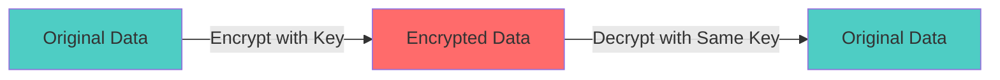
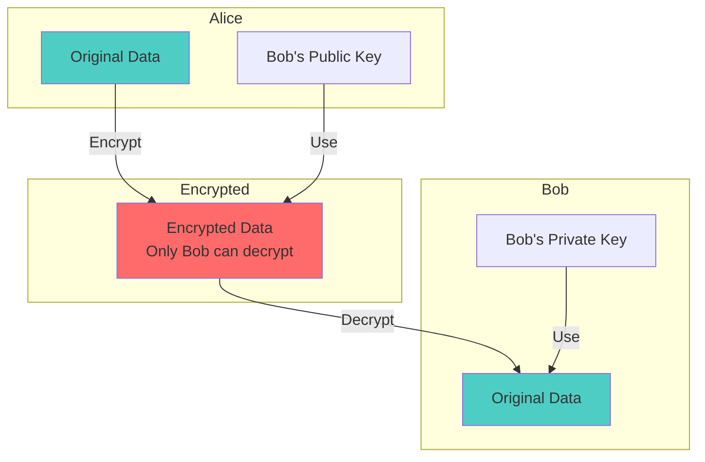
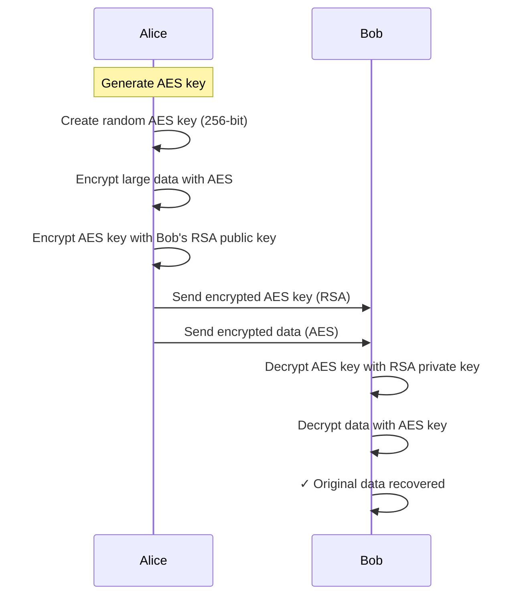

# RSA vs AES - Encryption Comparison

**Interview Question**: *"What is the difference between RSA and AES encryption? When would you use each?"*

**Difficulty**: 🟡 Intermediate
**Asked by**: HDFC, Amazon, Most Tech Companies
**Time to Answer**: 3-5 minutes

---

## 🎯 Quick Answer (30 seconds)

**AES (Advanced Encryption Standard)**:
- **Type**: Symmetric encryption (same key for encrypt/decrypt)
- **Speed**: Very fast
- **Use for**: Encrypting large data (files, databases, network traffic)
- **Key size**: 128, 192, or 256 bits

**RSA (Rivest-Shamir-Adleman)**:
- **Type**: Asymmetric encryption (public/private key pair)
- **Speed**: Slower (100-1000× slower than AES)
- **Use for**: Encrypting small data (keys, signatures, certificates)
- **Key size**: 2048, 3072, or 4096 bits

**Common Pattern**: Use RSA to exchange AES key, then use AES for data encryption.

---

## 📚 Detailed Explanation

### Symmetric Encryption (AES)



**How AES Works**:
```javascript
// AES Encryption/Decryption (symmetric)
const crypto = require('crypto');

class AESEncryption {
  constructor() {
    // Same key for both encryption and decryption
    this.algorithm = 'aes-256-cbc';
    this.key = crypto.randomBytes(32); // 256-bit key
    this.iv = crypto.randomBytes(16);  // Initialization vector
  }

  encrypt(text) {
    const cipher = crypto.createCipheriv(this.algorithm, this.key, this.iv);
    let encrypted = cipher.update(text, 'utf8', 'hex');
    encrypted += cipher.final('hex');
    return encrypted;
  }

  decrypt(encrypted) {
    const decipher = crypto.createDecipheriv(this.algorithm, this.key, this.iv);
    let decrypted = decipher.update(encrypted, 'hex', 'utf8');
    decrypted += decipher.final('utf8');
    return decrypted;
  }
}

// Usage
const aes = new AESEncryption();
const encrypted = aes.encrypt('Sensitive data');
const decrypted = aes.decrypt(encrypted);
console.log(decrypted); // "Sensitive data"
```

**Characteristics**:
- ✅ **Fast**: Can encrypt GB of data in seconds
- ✅ **Efficient**: Low CPU usage
- ❌ **Key distribution problem**: How to securely share the key?
- ✅ **Best for**: Bulk data encryption

### Asymmetric Encryption (RSA)



**How RSA Works**:
```javascript
// RSA Encryption/Decryption (asymmetric)
const crypto = require('crypto');

class RSAEncryption {
  constructor() {
    // Generate key pair
    const { publicKey, privateKey } = crypto.generateKeyPairSync('rsa', {
      modulusLength: 2048,
      publicKeyEncoding: {
        type: 'spki',
        format: 'pem'
      },
      privateKeyEncoding: {
        type: 'pkcs8',
        format: 'pem'
      }
    });

    this.publicKey = publicKey;
    this.privateKey = privateKey;
  }

  encrypt(text) {
    // Encrypt with public key
    return crypto.publicEncrypt(
      {
        key: this.publicKey,
        padding: crypto.constants.RSA_PKCS1_OAEP_PADDING
      },
      Buffer.from(text)
    ).toString('base64');
  }

  decrypt(encrypted) {
    // Decrypt with private key
    return crypto.privateDecrypt(
      {
        key: this.privateKey,
        padding: crypto.constants.RSA_PKCS1_OAEP_PADDING
      },
      Buffer.from(encrypted, 'base64')
    ).toString('utf8');
  }

  sign(data) {
    // Sign with private key
    return crypto.sign('sha256', Buffer.from(data), this.privateKey);
  }

  verify(data, signature) {
    // Verify with public key
    return crypto.verify(
      'sha256',
      Buffer.from(data),
      this.publicKey,
      signature
    );
  }
}

// Usage
const rsa = new RSAEncryption();

// Encryption
const encrypted = rsa.encrypt('Small secret message');
const decrypted = rsa.decrypt(encrypted);
console.log(decrypted); // "Small secret message"

// Digital signature
const signature = rsa.sign('Important document');
const isValid = rsa.verify('Important document', signature);
console.log(isValid); // true
```

**Characteristics**:
- ✅ **No key distribution problem**: Public key can be shared openly
- ✅ **Digital signatures**: Verify authenticity
- ❌ **Slow**: 100-1000× slower than AES
- ❌ **Size limit**: Can only encrypt small data (< 245 bytes for 2048-bit key)
- ✅ **Best for**: Key exchange, signatures, certificates

---

## 🔄 Real-World: Hybrid Encryption (RSA + AES)



**Implementation**:
```javascript
class HybridEncryption {
  constructor() {
    this.aes = new AESEncryption();
    this.rsa = new RSAEncryption();
  }

  encryptLargeData(data, recipientPublicKey) {
    // 1. Encrypt data with AES (fast)
    const encryptedData = this.aes.encrypt(data);

    // 2. Encrypt AES key with RSA (secure key exchange)
    const aesKeyAndIV = JSON.stringify({
      key: this.aes.key.toString('base64'),
      iv: this.aes.iv.toString('base64')
    });

    const encryptedKey = crypto.publicEncrypt(
      recipientPublicKey,
      Buffer.from(aesKeyAndIV)
    ).toString('base64');

    return {
      encryptedData,    // Encrypted with AES (fast)
      encryptedKey      // AES key encrypted with RSA (secure)
    };
  }

  decryptLargeData(encryptedData, encryptedKey, privateKey) {
    // 1. Decrypt AES key with RSA private key
    const aesKeyAndIV = JSON.parse(
      crypto.privateDecrypt(
        privateKey,
        Buffer.from(encryptedKey, 'base64')
      ).toString('utf8')
    );

    // 2. Recreate AES instance with received key
    const aes = new AESEncryption();
    aes.key = Buffer.from(aesKeyAndIV.key, 'base64');
    aes.iv = Buffer.from(aesKeyAndIV.iv, 'base64');

    // 3. Decrypt data with AES
    return aes.decrypt(encryptedData);
  }
}

// Usage
const hybrid = new HybridEncryption();
const bobRSA = new RSAEncryption();

// Alice encrypts large file for Bob
const largeData = 'A'.repeat(1000000); // 1MB data
const encrypted = hybrid.encryptLargeData(largeData, bobRSA.publicKey);

// Bob decrypts
const decrypted = hybrid.decryptLargeData(
  encrypted.encryptedData,
  encrypted.encryptedKey,
  bobRSA.privateKey
);

console.log(decrypted === largeData); // true
```

---

## 📊 Comparison Table

| Feature | AES (Symmetric) | RSA (Asymmetric) |
|---------|----------------|------------------|
| **Key Type** | Single secret key | Public + Private key pair |
| **Speed** | Very fast (GB/sec) | Slow (KB/sec) |
| **Key Size** | 128/192/256 bits | 2048/3072/4096 bits |
| **Data Size** | Unlimited | Limited (~245 bytes for 2048-bit) |
| **Key Distribution** | Difficult (need secure channel) | Easy (public key can be shared) |
| **Use Cases** | Disk encryption, VPN, database | TLS handshake, signatures, certs |
| **CPU Usage** | Low | High |
| **Security** | Secure (if key kept secret) | Secure (based on math problem) |

---

## 🏢 Real-World Examples

### Example 1: HTTPS/TLS (Hybrid Encryption)

```javascript
// TLS Handshake (simplified)
class TLSHandshake {
  async establish(server) {
    // 1. Client requests server's certificate
    const serverCert = await server.getCertificate();

    // 2. Client verifies certificate (contains RSA public key)
    const isValid = verifyCertificate(serverCert);
    if (!isValid) throw new Error('Invalid certificate');

    // 3. Client generates random AES key
    const aesKey = crypto.randomBytes(32);

    // 4. Client encrypts AES key with server's RSA public key
    const encryptedKey = crypto.publicEncrypt(
      serverCert.publicKey,
      aesKey
    );

    // 5. Send encrypted AES key to server
    await server.send(encryptedKey);

    // 6. From now on, use AES for fast encryption
    return new AESEncryption(aesKey);
  }
}

// Server side
class TLSServer {
  constructor() {
    this.rsa = new RSAEncryption();
  }

  getCertificate() {
    return {
      publicKey: this.rsa.publicKey,
      issuer: 'Trusted CA',
      validUntil: '2026-01-01'
    };
  }

  receiveEncryptedKey(encryptedKey) {
    // Decrypt AES key with RSA private key
    const aesKey = crypto.privateDecrypt(
      this.rsa.privateKey,
      encryptedKey
    );

    // Use AES for fast communication
    return new AESEncryption(aesKey);
  }
}
```

### Example 2: AWS KMS (Key Management Service)

```javascript
class AWSKMSPattern {
  async encryptData(plaintext) {
    // 1. Generate data key from KMS (uses RSA internally)
    const { plaintextKey, encryptedKey } = await kms.generateDataKey({
      KeyId: 'master-key-id',
      KeySpec: 'AES_256'
    });

    // 2. Encrypt data with AES data key (fast)
    const aes = new AESEncryption();
    aes.key = plaintextKey;
    const encryptedData = aes.encrypt(plaintext);

    // 3. Delete plaintext key from memory
    plaintextKey.fill(0);

    // 4. Store encrypted data + encrypted key
    return {
      encryptedData,
      encryptedKey  // Encrypted by KMS master key (RSA)
    };
  }

  async decryptData(encryptedData, encryptedKey) {
    // 1. Decrypt data key using KMS
    const { plaintextKey } = await kms.decrypt({
      CiphertextBlob: encryptedKey
    });

    // 2. Decrypt data with AES
    const aes = new AESEncryption();
    aes.key = plaintextKey;
    const decrypted = aes.decrypt(encryptedData);

    // 3. Clean up
    plaintextKey.fill(0);

    return decrypted;
  }
}
```

### Example 3: Password Storage (Neither RSA nor AES!)

```javascript
// ❌ WRONG: Using encryption for passwords
const encryptedPassword = aes.encrypt(password); // Can be decrypted!

// ✅ CORRECT: Use hashing (one-way)
const bcrypt = require('bcrypt');

async function storePassword(password) {
  // Hash with bcrypt (cannot be reversed)
  const salt = await bcrypt.genSalt(10);
  const hash = await bcrypt.hash(password, salt);

  await db.save({ passwordHash: hash });
}

async function verifyPassword(password, storedHash) {
  return await bcrypt.compare(password, storedHash);
}
```

---

## 🎓 Interview Follow-up Questions

### Q: "Why is RSA slower than AES?"

**Answer**:
- **AES**: Simple mathematical operations (XOR, substitution, permutation) - thousands of operations
- **RSA**: Complex modular exponentiation with large numbers (2048+ bits) - millions of operations
- **Example**: Encrypting 1MB data - AES: ~10ms, RSA: would take minutes and fail (size limit)

### Q: "Why not use only RSA if it's more secure?"

**Answer**:
- RSA is NOT more secure, just different
- RSA security based on factoring large numbers (computationally hard)
- AES security based on key secrecy (mathematically proven if key length sufficient)
- RSA has size limits (~245 bytes for 2048-bit key)
- RSA is 100-1000× slower
- **Best practice**: Use both (hybrid encryption)

### Q: "What is the minimum recommended key size for each?"

**Answer**:
- **AES**: 256-bit (128-bit still secure but 256 recommended)
- **RSA**: 2048-bit minimum, 4096-bit for high security
- **Why different?**: Different algorithms, different attack vectors
- **RSA larger** because it must resist factorization attacks

---

## 💡 Key Takeaways

1. ✅ **AES = Fast, same key** - Use for bulk data encryption
2. ✅ **RSA = Slow, key pairs** - Use for key exchange and signatures
3. ✅ **Hybrid = Best of both** - RSA for key exchange, AES for data
4. ✅ **HTTPS uses hybrid** - TLS handshake (RSA) → Session (AES)
5. ✅ **Never encrypt passwords** - Use hashing (bcrypt, argon2)

---

## 🔗 Related Questions

- [Hashing vs Encryption](/interview-prep/security-encryption/hashing-vs-encryption)
- [PDF Converter System Design](/interview-prep/system-design/pdf-converter)

---

## 📚 Further Reading

- NIST AES Standard: https://csrc.nist.gov/publications/detail/fips/197/final
- RSA Algorithm: https://en.wikipedia.org/wiki/RSA_(cryptosystem)
- TLS 1.3 Spec: https://tools.ietf.org/html/rfc8446
- AWS KMS: https://docs.aws.amazon.com/kms/
