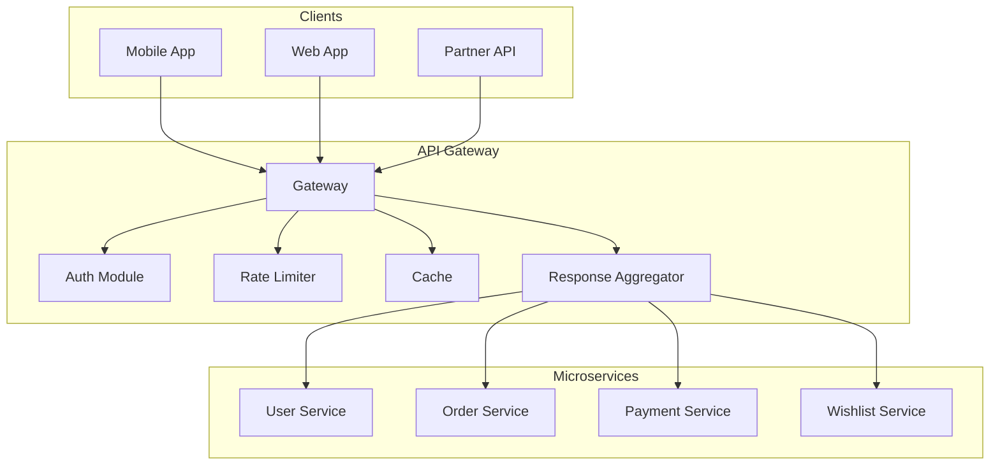

# API Gateway Pattern - Single Entry Point for Microservices

## What You'll Learn

Master the **API Gateway pattern** used by every major microservices architecture:
- **Request routing** - Direct traffic to correct services
- **Authentication & authorization** - Centralized security
- **Rate limiting & throttling** - Protect backend services
- **Response aggregation** - Combine multiple service calls

**Used by**: Netflix (Zuul), Amazon (AWS API Gateway), Kong, NGINX

**Time**: 30 minutes | **Difficulty**: Intermediate

---

## Why This Matters

### The Client Chaos Problem

**Scenario**: Mobile app needs to display user profile with data from 6 services.

**Without API Gateway**:
```javascript
// Mobile app makes 6 separate calls
const user = await fetch('http://user-service:3001/users/123');
const orders = await fetch('http://order-service:3002/orders?userId=123');
const payments = await fetch('http://payment-service:3003/payments?userId=123');
const wishlist = await fetch('http://wishlist-service:3004/wishlist/123');
const reviews = await fetch('http://review-service:3005/reviews?userId=123');
const recommendations = await fetch('http://recommendation-service:3006/recommend/123');

// Problems:
// 1. Client knows 6 service URLs (coupling)
// 2. 6 network calls (slow, 600ms+)
// 3. Authentication repeated 6 times
// 4. No rate limiting
// 5. Each service has CORS, SSL setup
// 6. Service addresses change = app update
```

**With API Gateway**:
```javascript
// Mobile app makes 1 call
const profile = await fetch('https://api.company.com/users/123/profile', {
  headers: { 'Authorization': 'Bearer token' }
});

// Gateway handles:
// - Single SSL termination
// - Authentication once
// - Parallel calls to 6 services
// - Response aggregation
// - Rate limiting
// - Caching

// Response time: 150ms (parallel calls)
```

**The impact**:
- Latency: 600ms → 150ms (4x faster)
- Mobile app code: 200 lines → 20 lines
- Security: Consistent across all services
- Coupling: 6 service URLs → 1 gateway URL

---

## The Problem: Direct Service Access

### Microservices Exposure

```
┌─────────────────────────────────────────────────────────────┐
│          WITHOUT API GATEWAY (Chaos)                         │
├─────────────────────────────────────────────────────────────┤
│                                                             │
│  Mobile App / Web Browser                                   │
│      │                                                      │
│      ├─▶ http://user-service:3001/users/123                │
│      │                                                      │
│      ├─▶ http://order-service:3002/orders?userId=123       │
│      │                                                      │
│      ├─▶ http://payment-service:3003/payments?userId=123   │
│      │                                                      │
│      ├─▶ http://wishlist-service:3004/wishlist/123         │
│      │                                                      │
│      └─▶ http://review-service:3005/reviews?userId=123     │
│                                                             │
│  Problems:                                                  │
│  - Multiple auth calls                                      │
│  - Service URLs exposed to clients                          │
│  - No centralized rate limiting                             │
│  - Chatty network (many round-trips)                        │
│  - Each service needs CORS, SSL                             │
│  - Version management nightmare                             │
└─────────────────────────────────────────────────────────────┘
```

---

## The Paradigm Shift: Single Entry Point

**Old thinking**: "Clients call services directly"

**New thinking**: "All traffic goes through gateway"

### API Gateway Architecture



---

## The Solution: Production API Gateway

### Implementation with Express

```javascript
// api-gateway/src/index.js
const express = require('express');
const httpProxy = require('http-proxy-middleware');
const jwt = require('jsonwebtoken');
const redis = require('redis');
const app = express();

const redisClient = redis.createClient({ url: 'redis://redis:6379' });
await redisClient.connect();

// Service registry
const services = {
  users: 'http://user-service:3001',
  orders: 'http://order-service:3002',
  payments: 'http://payment-service:3003',
  wishlist: 'http://wishlist-service:3004',
  reviews: 'http://review-service:3005'
};

// 1. Authentication Middleware
async function authenticate(req, res, next) {
  const token = req.headers.authorization?.replace('Bearer ', '');

  if (!token) {
    return res.status(401).json({ error: 'No token provided' });
  }

  try {
    // Verify JWT
    const decoded = jwt.verify(token, process.env.JWT_SECRET);

    // Check if token is blacklisted (logout)
    const blacklisted = await redisClient.get(`blacklist:${token}`);
    if (blacklisted) {
      return res.status(401).json({ error: 'Token revoked' });
    }

    // Attach user to request
    req.user = decoded;
    next();

  } catch (error) {
    return res.status(401).json({ error: 'Invalid token' });
  }
}

// 2. Rate Limiting (Sliding Window)
async function rateLimiter(req, res, next) {
  const userId = req.user?.id || req.ip;
  const key = `rate:${userId}`;
  const limit = 100; // requests per minute
  const window = 60; // seconds

  const now = Date.now();
  const windowStart = now - (window * 1000);

  // Remove old entries
  await redisClient.zRemRangeByScore(key, 0, windowStart);

  // Count requests in window
  const requestCount = await redisClient.zCard(key);

  if (requestCount >= limit) {
    return res.status(429).json({
      error: 'Rate limit exceeded',
      limit,
      reset: Math.ceil((await redisClient.zRange(key, 0, 0, { REV: false, WITHSCORES: true }))[1] / 1000 + window)
    });
  }

  // Add current request
  await redisClient.zAdd(key, { score: now, value: `${now}` });
  await redisClient.expire(key, window);

  res.setHeader('X-RateLimit-Limit', limit);
  res.setHeader('X-RateLimit-Remaining', limit - requestCount - 1);

  next();
}

// 3. Request Routing
app.use('/api/users', authenticate, rateLimiter, httpProxy.createProxyMiddleware({
  target: services.users,
  changeOrigin: true,
  pathRewrite: { '^/api/users': '' },
  onProxyReq: (proxyReq, req) => {
    // Forward user info to service
    proxyReq.setHeader('X-User-Id', req.user.id);
    proxyReq.setHeader('X-User-Role', req.user.role);
  }
}));

app.use('/api/orders', authenticate, rateLimiter, httpProxy.createProxyMiddleware({
  target: services.orders,
  changeOrigin: true,
  pathRewrite: { '^/api/orders': '' }
}));

// 4. Response Aggregation (BFF pattern)
app.get('/api/users/:userId/profile', authenticate, rateLimiter, async (req, res) => {
  const { userId } = req.params;

  // Check cache first
  const cacheKey = `profile:${userId}`;
  const cached = await redisClient.get(cacheKey);
  if (cached) {
    return res.json(JSON.parse(cached));
  }

  try {
    // Parallel calls to multiple services
    const [user, orders, wishlist, reviews] = await Promise.all([
      fetch(`${services.users}/users/${userId}`).then(r => r.json()),
      fetch(`${services.orders}/orders?userId=${userId}`).then(r => r.json()),
      fetch(`${services.wishlist}/wishlist/${userId}`).then(r => r.json()),
      fetch(`${services.reviews}/reviews?userId=${userId}`).then(r => r.json())
    ]);

    const profile = {
      user,
      orders: orders.slice(0, 5), // Last 5 orders
      wishlistCount: wishlist.length,
      reviewCount: reviews.length,
      averageRating: reviews.reduce((sum, r) => sum + r.rating, 0) / reviews.length
    };

    // Cache for 5 minutes
    await redisClient.setEx(cacheKey, 300, JSON.stringify(profile));

    res.json(profile);

  } catch (error) {
    res.status(500).json({ error: 'Failed to fetch profile' });
  }
});

// 5. Circuit Breaker per Service
const circuitBreakers = {};

function getCircuitBreaker(serviceName) {
  if (!circuitBreakers[serviceName]) {
    circuitBreakers[serviceName] = new CircuitBreaker({
      failureThreshold: 5,
      resetTimeout: 60000
    });
  }
  return circuitBreakers[serviceName];
}

app.use('/api/payments', authenticate, rateLimiter, async (req, res, next) => {
  const circuitBreaker = getCircuitBreaker('payments');

  if (circuitBreaker.state === 'OPEN') {
    return res.status(503).json({
      error: 'Payment service temporarily unavailable',
      retryAfter: 60
    });
  }

  // Proxy with circuit breaker
  const proxy = httpProxy.createProxyMiddleware({
    target: services.payments,
    changeOrigin: true,
    onError: (err) => {
      circuitBreaker.onFailure();
      res.status(503).json({ error: 'Service unavailable' });
    },
    onProxyRes: () => {
      circuitBreaker.onSuccess();
    }
  });

  proxy(req, res, next);
});

// 6. Request/Response Transformation
app.use('/api/v2/users', authenticate, async (req, res, next) => {
  // Transform v2 request to v1 format
  if (req.body.fullName) {
    const [firstName, lastName] = req.body.fullName.split(' ');
    req.body.firstName = firstName;
    req.body.lastName = lastName;
    delete req.body.fullName;
  }

  // Proxy to v1 service
  const proxy = httpProxy.createProxyMiddleware({
    target: services.users,
    changeOrigin: true,
    pathRewrite: { '^/api/v2/users': '' },
    onProxyRes: (proxyRes, req, res) => {
      // Transform v1 response to v2 format
      let body = '';
      proxyRes.on('data', chunk => { body += chunk; });
      proxyRes.on('end', () => {
        const data = JSON.parse(body);
        if (data.firstName && data.lastName) {
          data.fullName = `${data.firstName} ${data.lastName}`;
          delete data.firstName;
          delete data.lastName;
        }
        res.json(data);
      });
    }
  });

  proxy(req, res, next);
});

// 7. Logging & Monitoring
app.use((req, res, next) => {
  const start = Date.now();

  res.on('finish', () => {
    const duration = Date.now() - start;

    console.log({
      method: req.method,
      path: req.path,
      status: res.statusCode,
      duration,
      userId: req.user?.id,
      userAgent: req.headers['user-agent']
    });

    // Send metrics
    metrics.histogram('gateway.request.duration', duration, {
      path: req.path,
      method: req.method,
      status: res.statusCode
    });
  });

  next();
});

app.listen(3000, () => {
  console.log('API Gateway running on port 3000');
});
```

### Advanced: GraphQL Gateway

```javascript
// GraphQL as API Gateway (Apollo Federation)
const { ApolloServer } = require('apollo-server');
const { ApolloGateway, RemoteGraphQLDataSource } = require('@apollo/gateway');

class AuthenticatedDataSource extends RemoteGraphQLDataSource {
  willSendRequest({ request, context }) {
    // Forward auth to services
    request.http.headers.set('user-id', context.userId);
    request.http.headers.set('auth-token', context.token);
  }
}

const gateway = new ApolloGateway({
  serviceList: [
    { name: 'users', url: 'http://user-service:3001/graphql' },
    { name: 'orders', url: 'http://order-service:3002/graphql' },
    { name: 'products', url: 'http://product-service:3003/graphql' }
  ],
  buildService({ url }) {
    return new AuthenticatedDataSource({ url });
  }
});

const server = new ApolloServer({
  gateway,
  context: ({ req }) => {
    const token = req.headers.authorization || '';
    const user = decodeToken(token);
    return { userId: user.id, token };
  }
});

server.listen(4000);
```

---

## API Gateway Features

### Essential Features

| Feature | Purpose | Priority |
|---------|---------|----------|
| **Authentication** | Verify client identity | Critical |
| **Rate Limiting** | Prevent abuse | Critical |
| **Request Routing** | Direct to services | Critical |
| **SSL Termination** | HTTPS handling | Critical |
| **Load Balancing** | Distribute load | High |
| **Caching** | Reduce backend calls | High |
| **Response Aggregation** | Combine services | Medium |
| **Request Transformation** | Format conversion | Medium |
| **Circuit Breaking** | Handle failures | High |
| **Logging** | Observability | High |

---

## Real-World Validation

### Who Uses What?

| Company | Solution | Scale |
|---------|----------|-------|
| **Netflix** | Zuul | 50K+ req/sec |
| **Amazon** | AWS API Gateway | Millions req/sec |
| **Uber** | Custom Go gateway | 100K+ req/sec |
| **Kong** | Kong Gateway | Fortune 500 companies |

### Netflix Zuul

```
Architecture:
- Filters for auth, routing, monitoring
- Dynamic routing (no restarts)
- Circuit breakers per service
- Request/response transformation

Scale:
- 50,000+ requests/second
- Hundreds of services behind it
- Multi-region deployment
- 99.99% availability

Key learnings:
- Keep gateway stateless
- Use async non-blocking I/O
- Circuit breakers essential
- Monitor everything
```

---

## Interview Tips

### Common Questions

**Q: API Gateway vs Service Mesh - when to use which?**

**Answer:**
1. **API Gateway**:
   - External client → services (north-south traffic)
   - Authentication, rate limiting
   - Protocol translation (REST, GraphQL, gRPC)
2. **Service Mesh**:
   - Service → service (east-west traffic)
   - mTLS, observability, retries
   - Sidecar pattern (Envoy, Istio)

Use both: Gateway for external, mesh for internal

---

**Q: How do you handle gateway being a single point of failure?**

**Answer:**
1. **Multiple instances** behind load balancer
2. **Stateless** - no session state in gateway
3. **Health checks** - remove unhealthy instances
4. **Circuit breakers** - fail fast on service issues
5. **Caching** - serve stale data if backends down

---

**Q: What's the Backend-for-Frontend (BFF) pattern?**

**Answer:**
1. **Problem**: Mobile needs different data than web
2. **Solution**: Separate gateway per client type
   - Mobile BFF: Aggregates, smaller payloads
   - Web BFF: Different aggregations
   - Partner BFF: Different auth, rate limits
3. Each BFF optimized for its client

### Red Flags to Avoid

- ❌ **Business logic in gateway** (keep it thin)
- ❌ **Session state in gateway** (use Redis/JWT)
- ❌ **No rate limiting** (DDoS risk)
- ❌ **Synchronous service calls** (use async/parallel)
- ❌ **Single gateway instance** (SPOF)
- ❌ **No circuit breakers** (cascade failures)

---

## Key Takeaways

**What you learned**:
1. API Gateway is single entry point for clients
2. Handles auth, rate limiting, routing, aggregation
3. Reduces client complexity and network calls
4. Must be stateless and highly available
5. Use BFF pattern for different client types

**What you can do Monday**:
1. Deploy NGINX or Kong as API gateway
2. Implement JWT authentication
3. Add rate limiting with Redis
4. Set up SSL termination
5. Monitor gateway performance

---

## Related Articles

- [Service Discovery](/interview-prep/system-design/service-discovery) - Gateway finds services
- [Circuit Breaker](/interview-prep/system-design/circuit-breaker-pattern) - Gateway resilience
- [Rate Limiting](/interview-prep/system-design/rate-limiting) - Protect backend

---

**Production Examples**:
- **Netflix**: Zuul handles all external traffic
- **Amazon**: API Gateway for serverless
- **Uber**: Custom gateway for 4000+ services

**Remember**: The API Gateway is the **front door** to your microservices. Keep it thin (routing, auth, limits), not fat (business logic). It should fail fast, cache aggressively, and never be a bottleneck!
