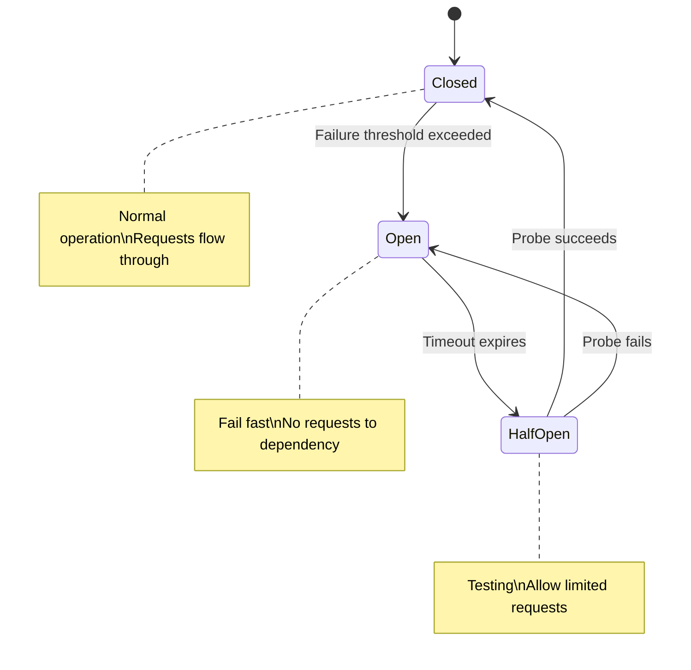

# Circuit Breaker Pattern - Building Resilient Distributed Systems

## What You'll Learn

Master the **Circuit Breaker pattern** used by Netflix, Amazon, and every resilient distributed system:
- **Failure detection** - Identify failing dependencies quickly
- **Graceful degradation** - Keep system running during outages
- **Self-healing** - Automatic recovery when dependencies recover
- **Implementation** - Build production-grade circuit breakers

**Used by**: Netflix (Hystrix), Amazon, Microsoft (Polly), Resilience4j

**Time**: 30 minutes | **Difficulty**: Intermediate

---

## Why This Matters

### The $4M Problem

**Scenario**: Your e-commerce checkout calls the payment service. Payment service goes down.

**Without circuit breaker**:
```
User clicks "Pay" → Request to Payment Service
                         ↓
                    30 second timeout
                         ↓
                    Retry 3 times
                         ↓
                    90 seconds later: "Payment failed"
                         ↓
                    User leaves
                         ↓
                    Thread pool exhausted
                         ↓
                    ENTIRE SITE DOWN

Impact:
- 10,000 concurrent users affected
- 90 seconds per user wasted
- Thread pools exhausted → cascade failure
- $4M revenue lost in 1 hour outage
```

**With circuit breaker**:
```
User clicks "Pay" → Circuit OPEN (payment known down)
                         ↓
                    Immediate fallback (10ms)
                         ↓
                    "Payment temporarily unavailable, try again"
                         ↓
                    User waits, tries again in 5 min
                         ↓
                    Circuit closed, payment works

Impact:
- Immediate response (10ms vs 90s)
- No cascade failure
- Site stays up
- $400K saved (users return)
```

---

## The Problem: Cascade Failures

### How Failures Propagate

```
┌─────────────────────────────────────────────────────────────┐
│                    CASCADE FAILURE                          │
├─────────────────────────────────────────────────────────────┤
│                                                             │
│    Service A            Service B           Service C       │
│    ┌──────┐            ┌──────┐            ┌──────┐        │
│    │ 100  │──Request──▶│ 100  │──Request──▶│  X   │        │
│    │reqs/s│            │reqs/s│            │ DEAD │        │
│    └──────┘            └──────┘            └──────┘        │
│        │                   │                    │           │
│        │                   │                    │           │
│    Waiting...          Waiting...           30s timeout    │
│        │                   │                    │           │
│        ▼                   ▼                    │           │
│    Threads              Threads               │           │
│    exhausted            exhausted              │           │
│        │                   │                    │           │
│        ▼                   ▼                    │           │
│    ┌──────┐            ┌──────┐                │           │
│    │  X   │            │  X   │                │           │
│    │ DEAD │            │ DEAD │                │           │
│    └──────┘            └──────┘                            │
│                                                             │
│    Result: One failing service brings down entire system    │
└─────────────────────────────────────────────────────────────┘
```

### The Thread Pool Problem

```javascript
// Without circuit breaker
async function checkout(orderId) {
  // Each request holds a thread while waiting
  const payment = await paymentService.charge(orderId); // 30s timeout
  const inventory = await inventoryService.reserve(orderId); // 30s timeout
  const shipping = await shippingService.schedule(orderId); // 30s timeout

  // If payment is down:
  // - 100 concurrent requests
  // - Each waits 30 seconds
  // - Thread pool: 100 threads exhausted in 1 second
  // - New requests: rejected
  // - System: DOWN
}
```

---

## The Paradigm Shift: Fail Fast

**Old thinking**: "Retry until it works"

**New thinking**: "Fail fast, provide fallback"

### Circuit Breaker States



**States explained**:
- **CLOSED**: Normal operation, requests pass through
- **OPEN**: Dependency is down, fail immediately
- **HALF-OPEN**: Testing if dependency recovered

---

## The Solution: Production Circuit Breaker

### Implementation

```javascript
class CircuitBreaker {
  constructor(options = {}) {
    this.state = 'CLOSED';
    this.failureCount = 0;
    this.successCount = 0;
    this.lastFailureTime = null;

    // Configuration
    this.failureThreshold = options.failureThreshold || 5;
    this.successThreshold = options.successThreshold || 3;
    this.timeout = options.timeout || 30000; // 30 seconds
    this.resetTimeout = options.resetTimeout || 60000; // 1 minute

    // Metrics
    this.metrics = {
      totalRequests: 0,
      successfulRequests: 0,
      failedRequests: 0,
      rejectedRequests: 0,
      stateChanges: []
    };
  }

  async execute(fn, fallback) {
    this.metrics.totalRequests++;

    // Check if circuit should transition from OPEN to HALF-OPEN
    if (this.state === 'OPEN') {
      if (Date.now() - this.lastFailureTime >= this.resetTimeout) {
        this.transitionTo('HALF_OPEN');
      } else {
        // Circuit is open - fail fast
        this.metrics.rejectedRequests++;
        if (fallback) {
          return await fallback();
        }
        throw new CircuitOpenError('Circuit breaker is OPEN');
      }
    }

    try {
      // Execute with timeout
      const result = await this.executeWithTimeout(fn);
      this.onSuccess();
      return result;
    } catch (error) {
      this.onFailure();

      if (fallback) {
        return await fallback();
      }
      throw error;
    }
  }

  async executeWithTimeout(fn) {
    return new Promise(async (resolve, reject) => {
      const timer = setTimeout(() => {
        reject(new TimeoutError(`Request timed out after ${this.timeout}ms`));
      }, this.timeout);

      try {
        const result = await fn();
        clearTimeout(timer);
        resolve(result);
      } catch (error) {
        clearTimeout(timer);
        reject(error);
      }
    });
  }

  onSuccess() {
    this.metrics.successfulRequests++;

    if (this.state === 'HALF_OPEN') {
      this.successCount++;
      if (this.successCount >= this.successThreshold) {
        this.transitionTo('CLOSED');
      }
    }

    if (this.state === 'CLOSED') {
      this.failureCount = 0; // Reset on success
    }
  }

  onFailure() {
    this.metrics.failedRequests++;
    this.failureCount++;
    this.lastFailureTime = Date.now();

    if (this.state === 'HALF_OPEN') {
      // Single failure in half-open trips back to open
      this.transitionTo('OPEN');
    } else if (this.state === 'CLOSED' && this.failureCount >= this.failureThreshold) {
      this.transitionTo('OPEN');
    }
  }

  transitionTo(newState) {
    const previousState = this.state;
    this.state = newState;

    if (newState === 'CLOSED') {
      this.failureCount = 0;
      this.successCount = 0;
    } else if (newState === 'HALF_OPEN') {
      this.successCount = 0;
    }

    this.metrics.stateChanges.push({
      from: previousState,
      to: newState,
      timestamp: new Date().toISOString()
    });

    console.log(`Circuit breaker: ${previousState} → ${newState}`);
  }

  getState() {
    return {
      state: this.state,
      failureCount: this.failureCount,
      successCount: this.successCount,
      metrics: this.metrics
    };
  }
}

class CircuitOpenError extends Error {
  constructor(message) {
    super(message);
    this.name = 'CircuitOpenError';
  }
}

class TimeoutError extends Error {
  constructor(message) {
    super(message);
    this.name = 'TimeoutError';
  }
}
```

### Usage with Fallbacks

```javascript
// Create circuit breakers for each dependency
const paymentCircuit = new CircuitBreaker({
  failureThreshold: 5,
  resetTimeout: 60000,
  timeout: 5000
});

const inventoryCircuit = new CircuitBreaker({
  failureThreshold: 3,
  resetTimeout: 30000,
  timeout: 3000
});

// Payment service with fallback
async function processPayment(order) {
  return await paymentCircuit.execute(
    // Primary: Call payment service
    async () => {
      const response = await fetch('http://payment-service/charge', {
        method: 'POST',
        body: JSON.stringify({ orderId: order.id, amount: order.total })
      });

      if (!response.ok) {
        throw new Error('Payment failed');
      }

      return await response.json();
    },
    // Fallback: Queue for later processing
    async () => {
      await messageQueue.publish('payment-retry', {
        orderId: order.id,
        amount: order.total,
        retryAt: Date.now() + 300000 // 5 minutes
      });

      return {
        status: 'PENDING',
        message: 'Payment queued for processing',
        estimatedCompletion: '5 minutes'
      };
    }
  );
}

// Inventory with cache fallback
async function checkInventory(productId) {
  return await inventoryCircuit.execute(
    async () => {
      const response = await fetch(`http://inventory-service/stock/${productId}`);
      const stock = await response.json();

      // Update cache on success
      await cache.set(`inventory:${productId}`, stock, 60);

      return stock;
    },
    async () => {
      // Fallback: Use cached value (may be stale)
      const cached = await cache.get(`inventory:${productId}`);

      if (cached) {
        return { ...cached, fromCache: true, warning: 'Stock may be outdated' };
      }

      // Last resort: Optimistic response
      return { available: true, quantity: 'unknown', warning: 'Inventory unavailable' };
    }
  );
}
```

### Complete Service Example

```javascript
const express = require('express');
const app = express();

// Circuit breakers for all external dependencies
const circuits = {
  payment: new CircuitBreaker({ failureThreshold: 5, resetTimeout: 60000 }),
  inventory: new CircuitBreaker({ failureThreshold: 3, resetTimeout: 30000 }),
  shipping: new CircuitBreaker({ failureThreshold: 3, resetTimeout: 30000 }),
  notification: new CircuitBreaker({ failureThreshold: 10, resetTimeout: 120000 })
};

// Health endpoint exposing circuit states
app.get('/health', (req, res) => {
  const circuitStates = {};
  for (const [name, circuit] of Object.entries(circuits)) {
    circuitStates[name] = circuit.getState();
  }

  const allHealthy = Object.values(circuits).every(c => c.state !== 'OPEN');

  res.status(allHealthy ? 200 : 503).json({
    status: allHealthy ? 'healthy' : 'degraded',
    circuits: circuitStates
  });
});

// Checkout endpoint with resilience
app.post('/checkout', async (req, res) => {
  const { orderId } = req.body;
  const results = { orderId, steps: {} };

  try {
    // Step 1: Check inventory (with fallback to cache)
    results.steps.inventory = await circuits.inventory.execute(
      () => inventoryService.reserve(orderId),
      () => ({ reserved: true, warning: 'Unverified - inventory service down' })
    );

    // Step 2: Process payment (with fallback to queue)
    results.steps.payment = await circuits.payment.execute(
      () => paymentService.charge(orderId),
      async () => {
        await retryQueue.add('payment', { orderId });
        return { status: 'QUEUED', message: 'Payment will be processed shortly' };
      }
    );

    // Step 3: Schedule shipping (with fallback)
    results.steps.shipping = await circuits.shipping.execute(
      () => shippingService.schedule(orderId),
      () => ({ scheduled: false, message: 'Will be scheduled when available' })
    );

    // Step 4: Send notification (fire and forget)
    circuits.notification.execute(
      () => notificationService.sendOrderConfirmation(orderId),
      () => console.log('Notification skipped - service down')
    ).catch(() => {}); // Don't block checkout

    res.json({
      success: true,
      order: results,
      warnings: collectWarnings(results)
    });

  } catch (error) {
    res.status(500).json({
      success: false,
      error: error.message,
      circuitStates: Object.fromEntries(
        Object.entries(circuits).map(([k, v]) => [k, v.state])
      )
    });
  }
});

function collectWarnings(results) {
  const warnings = [];
  for (const [step, result] of Object.entries(results.steps)) {
    if (result.warning) {
      warnings.push(`${step}: ${result.warning}`);
    }
  }
  return warnings;
}
```

### Sliding Window Implementation (Production)

```javascript
class SlidingWindowCircuitBreaker {
  constructor(options = {}) {
    this.state = 'CLOSED';
    this.windowSize = options.windowSize || 10; // Last N requests
    this.failureRateThreshold = options.failureRateThreshold || 0.5; // 50%
    this.slowCallThreshold = options.slowCallThreshold || 0.5; // 50%
    this.slowCallDuration = options.slowCallDuration || 3000; // 3s = slow
    this.minimumCalls = options.minimumCalls || 5;
    this.waitDuration = options.waitDuration || 60000;
    this.permittedCallsInHalfOpen = options.permittedCallsInHalfOpen || 3;

    this.ringBuffer = [];
    this.halfOpenCalls = 0;
    this.lastOpenTime = null;
  }

  async execute(fn, fallback) {
    // Check state transition
    if (this.state === 'OPEN' && Date.now() - this.lastOpenTime >= this.waitDuration) {
      this.state = 'HALF_OPEN';
      this.halfOpenCalls = 0;
    }

    if (this.state === 'OPEN') {
      if (fallback) return await fallback();
      throw new CircuitOpenError('Circuit is OPEN');
    }

    if (this.state === 'HALF_OPEN' && this.halfOpenCalls >= this.permittedCallsInHalfOpen) {
      if (fallback) return await fallback();
      throw new CircuitOpenError('Half-open call limit reached');
    }

    const startTime = Date.now();
    let success = false;
    let slow = false;

    try {
      const result = await fn();
      success = true;
      slow = Date.now() - startTime > this.slowCallDuration;
      return result;
    } catch (error) {
      if (fallback) return await fallback();
      throw error;
    } finally {
      this.recordCall(success, slow);
      this.evaluateState();
    }
  }

  recordCall(success, slow) {
    // Add to ring buffer
    this.ringBuffer.push({ success, slow, timestamp: Date.now() });

    // Keep only last windowSize calls
    if (this.ringBuffer.length > this.windowSize) {
      this.ringBuffer.shift();
    }

    if (this.state === 'HALF_OPEN') {
      this.halfOpenCalls++;
    }
  }

  evaluateState() {
    if (this.ringBuffer.length < this.minimumCalls) {
      return; // Not enough data
    }

    const failureRate = this.ringBuffer.filter(c => !c.success).length / this.ringBuffer.length;
    const slowRate = this.ringBuffer.filter(c => c.slow).length / this.ringBuffer.length;

    if (this.state === 'CLOSED') {
      if (failureRate >= this.failureRateThreshold || slowRate >= this.slowCallThreshold) {
        this.state = 'OPEN';
        this.lastOpenTime = Date.now();
        console.log(`Circuit OPENED: failureRate=${failureRate}, slowRate=${slowRate}`);
      }
    } else if (this.state === 'HALF_OPEN') {
      // Evaluate half-open calls only
      const recentCalls = this.ringBuffer.slice(-this.permittedCallsInHalfOpen);
      const recentFailures = recentCalls.filter(c => !c.success).length;

      if (recentFailures === 0) {
        this.state = 'CLOSED';
        this.ringBuffer = []; // Reset
        console.log('Circuit CLOSED: Dependency recovered');
      } else {
        this.state = 'OPEN';
        this.lastOpenTime = Date.now();
        console.log('Circuit re-OPENED: Dependency still failing');
      }
    }
  }

  getMetrics() {
    const total = this.ringBuffer.length;
    const failures = this.ringBuffer.filter(c => !c.success).length;
    const slow = this.ringBuffer.filter(c => c.slow).length;

    return {
      state: this.state,
      totalCalls: total,
      failureRate: total > 0 ? (failures / total).toFixed(2) : 0,
      slowCallRate: total > 0 ? (slow / total).toFixed(2) : 0,
      lastOpenTime: this.lastOpenTime
    };
  }
}
```

---

## Real-World Validation

### Who Uses This?

| Company | Implementation | Scale |
|---------|----------------|-------|
| **Netflix** | Hystrix (now Resilience4j) | 10B+ requests/day |
| **Amazon** | Custom circuit breakers | Every service |
| **Microsoft** | Polly (.NET) | Azure services |
| **Uber** | Custom Go implementation | 4000+ services |

### Netflix Hystrix Story

```
Problem (2011):
- One service failure cascades to entire system
- 100+ services dependent on each other
- Single slow service: 10M requests stuck

Solution:
- Built Hystrix library
- Circuit breaker per dependency
- Bulkhead isolation (thread pools)
- Real-time dashboard

Results:
- Cascade failures: Eliminated
- Recovery time: Automatic
- Availability: 99.99%
```

---

## Interview Tips

### Common Questions

**Q: What's the difference between retry and circuit breaker?**

**Answer:**
1. **Retry**: Immediately try again N times
   - Good for: Transient failures (network blip)
   - Bad for: Persistent failures (service down)
2. **Circuit breaker**: Stop trying when failure pattern detected
   - Good for: Protecting system from cascade failure
   - Works with retry (retry inside circuit)

---

**Q: How do you choose circuit breaker thresholds?**

**Answer:**
1. **Failure threshold**: Based on normal error rate (e.g., if 0.1% normal, trip at 5%)
2. **Reset timeout**: Based on typical recovery time (service restart time)
3. **Window size**: Based on request volume (need statistical significance)
4. **Timeout**: Based on SLA (P99 latency + buffer)
5. **Test and tune**: Start conservative, adjust based on data

---

**Q: What fallback strategies can you use?**

**Answer:**
1. **Cache**: Return stale data
2. **Default**: Return safe default value
3. **Queue**: Process later asynchronously
4. **Alternative service**: Call backup service
5. **Graceful degradation**: Disable feature, keep core working

### Red Flags to Avoid

- ❌ **No fallback defined** (circuit trips but user still fails)
- ❌ **Same timeout everywhere** (different services need different timeouts)
- ❌ **Ignoring slow calls** (slow is often worse than failure)
- ❌ **No monitoring** (can't see circuit state in production)
- ❌ **Sharing circuits** (one circuit per dependency)
- ❌ **No bulkhead** (one slow service consumes all threads)

---

## Key Takeaways

**What you learned**:
1. Circuit breakers prevent cascade failures
2. Three states: CLOSED (normal), OPEN (failing), HALF-OPEN (testing)
3. Fallbacks are essential - fail fast + graceful degradation
4. Sliding window provides better statistics than simple counters
5. Monitor circuit states in production

**What you can do Monday**:
1. Identify your most critical dependencies
2. Add circuit breakers with sensible defaults
3. Implement fallbacks for each circuit
4. Add health endpoints exposing circuit state
5. Monitor failure rates and circuit trips

---

## Related Articles

- [Saga Pattern](/interview-prep/system-design/saga-pattern) - Distributed transactions
- [Bulkhead Pattern](/interview-prep/system-design/bulkhead-pattern) - Isolation
- [Retry Patterns](/interview-prep/system-design/retry-patterns) - Transient failures

---

**Production Examples**:
- **Netflix**: Hystrix protected 10B+ daily requests
- **Amazon**: Every service has circuit breakers
- **Uber**: Circuit breakers in every microservice

**Remember**: The circuit breaker isn't about preventing failures - failures will happen. It's about **failing fast** and **protecting the system** from cascade effects. Fast failure with fallback is always better than slow failure!
