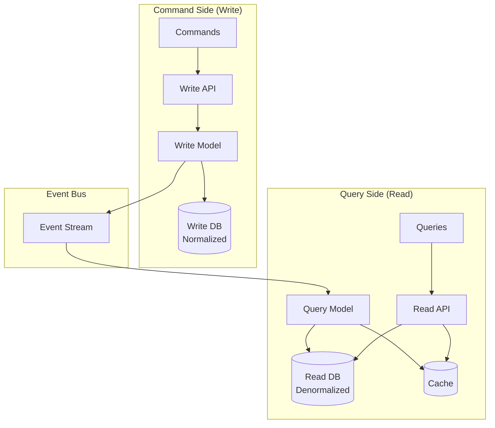

# CQRS Pattern - Command Query Responsibility Segregation

## What You'll Learn

Master the **CQRS pattern** for scaling read-heavy systems:
- **Separate read and write models** - Optimize independently
- **Event sourcing integration** - Rebuild state from events
- **Read replicas** - Scale reads infinitely
- **Eventual consistency** - Trade-offs and solutions

**Used by**: Amazon, Microsoft Azure, Greg Young (CQRS creator), event-driven systems

**Time**: 35 minutes | **Difficulty**: Advanced

---

## Why This Matters

### The Read/Write Imbalance

**Scenario**: E-commerce product catalog - 10,000 writes/day, 10,000,000 reads/day.

**Traditional CRUD (same model for read/write)**:
```javascript
// Single model for everything
class Product {
  async save() {
    // Write: Complex validation, inventory, pricing
    await db.query(`
      UPDATE products SET
        name = $1, price = $2, stock = $3,
        categories = $4, reviews_count = $5
      WHERE id = $6
    `, [this.name, this.price, ...]);
  }

  async getDetails() {
    // Read: Needs 5 JOINs!
    const result = await db.query(`
      SELECT p.*, c.name as category, b.name as brand,
             AVG(r.rating) as avg_rating,
             COUNT(r.id) as review_count
      FROM products p
      JOIN categories c ON p.category_id = c.id
      JOIN brands b ON p.brand_id = b.id
      LEFT JOIN reviews r ON p.id = r.product_id
      WHERE p.id = $1
      GROUP BY p.id
    `, [this.id]);
    // Query time: 500ms (slow!)
  }
}

// Problems:
// 1. Reads slow (complex JOINs)
// 2. Can't optimize separately
// 3. Same database for 10M reads + 10K writes
// 4. Writes blocked by reads (lock contention)
```

**With CQRS (separate models)**:
```javascript
// WRITE MODEL: Simple, fast, normalized
class ProductWriteModel {
  async update() {
    await db.query('UPDATE products SET name = $1', [this.name]);
    // Publish event
    await events.publish('PRODUCT_UPDATED', this);
  }
}

// READ MODEL: Denormalized, optimized for queries
class ProductReadModel {
  async getDetails() {
    // Pre-joined, cached, fast!
    return await cache.get(`product:${this.id}`);
    // Query time: 5ms (100x faster!)
  }
}

// Result:
// - Reads: 5ms (pre-computed, cached)
// - Writes: Fast (simple, no joins)
// - Independent scaling (read replicas)
```

---

## The Problem: One Model Can't Serve Both

### Write Model vs Read Model Needs

```
┌─────────────────────────────────────────────────────────────┐
│              CONFLICTING REQUIREMENTS                        │
├─────────────────────────────────────────────────────────────┤
│                                                             │
│  WRITE MODEL needs:                                         │
│  ✓ Normalized (avoid duplication)                          │
│  ✓ Strong consistency                                       │
│  ✓ Validation logic                                         │
│  ✓ Complex relationships                                    │
│  ✓ Transaction boundaries                                   │
│                                                             │
│  READ MODEL needs:                                          │
│  ✓ Denormalized (fast queries)                             │
│  ✓ Eventual consistency OK                                  │
│  ✓ No validation                                            │
│  ✓ Flat structures                                          │
│  ✓ Cached, replicated                                       │
│                                                             │
│  Using SAME model = Compromise on both!                     │
└─────────────────────────────────────────────────────────────┘
```

---

## The Paradigm Shift: Separate Models

**Old thinking**: "One model for both reads and writes"

**New thinking**: "Optimize write model for writes, read model for reads"

### CQRS Architecture



---

## The Solution: CQRS Implementation

### Basic CQRS Pattern

```javascript
// ============================================
// COMMAND SIDE (Write)
// ============================================

// Command: Intent to change state
class CreateProductCommand {
  constructor(productId, name, price, stock) {
    this.productId = productId;
    this.name = name;
    this.price = price;
    this.stock = stock;
  }
}

// Command Handler: Validates and applies changes
class CreateProductHandler {
  constructor(writeRepository, eventBus) {
    this.writeRepository = writeRepository;
    this.eventBus = eventBus;
  }

  async handle(command) {
    // 1. Validate
    if (command.price < 0) {
      throw new Error('Price must be positive');
    }

    // 2. Save to write model (normalized)
    const product = await this.writeRepository.save({
      id: command.productId,
      name: command.name,
      price: command.price,
      stock: command.stock,
      created_at: new Date()
    });

    // 3. Publish event
    await this.eventBus.publish('PRODUCT_CREATED', {
      productId: product.id,
      name: product.name,
      price: product.price,
      stock: product.stock,
      timestamp: new Date()
    });

    return { success: true, productId: product.id };
  }
}

// Write Repository (normalized schema)
class ProductWriteRepository {
  async save(product) {
    // Normalized: Separate tables
    await db.query(`
      INSERT INTO products (id, name, price, created_at)
      VALUES ($1, $2, $3, $4)
    `, [product.id, product.name, product.price, product.created_at]);

    await db.query(`
      INSERT INTO inventory (product_id, stock)
      VALUES ($1, $2)
    `, [product.id, product.stock]);

    return product;
  }
}

// ============================================
// QUERY SIDE (Read)
// ============================================

// Event Handler: Updates read model
class ProductCreatedEventHandler {
  constructor(readRepository, cache) {
    this.readRepository = readRepository;
    this.cache = cache;
  }

  async handle(event) {
    // Build denormalized read model
    const readModel = {
      id: event.productId,
      name: event.name,
      price: event.price,
      priceFormatted: `$${event.price.toFixed(2)}`,
      stock: event.stock,
      inStock: event.stock > 0,
      createdAt: event.timestamp,
      // Denormalized fields added here
      categoryName: null,
      brandName: null,
      averageRating: 0,
      reviewCount: 0
    };

    // Save to read database (denormalized)
    await this.readRepository.save(readModel);

    // Cache for ultra-fast access
    await this.cache.set(`product:${event.productId}`, readModel, 3600);
  }
}

// Query: Request for data
class GetProductQuery {
  constructor(productId) {
    this.productId = productId;
  }
}

// Query Handler: Returns data from read model
class GetProductQueryHandler {
  constructor(readRepository, cache) {
    this.readRepository = readRepository;
    this.cache = cache;
  }

  async handle(query) {
    // 1. Check cache first
    let product = await this.cache.get(`product:${query.productId}`);

    if (product) {
      return product;
    }

    // 2. Query read model (single table, no joins!)
    product = await this.readRepository.getById(query.productId);

    if (!product) {
      throw new Error('Product not found');
    }

    // 3. Cache for next time
    await this.cache.set(`product:${query.productId}`, product, 3600);

    return product;
  }
}

// Read Repository (denormalized)
class ProductReadRepository {
  async getById(productId) {
    // Single table, no joins!
    const result = await db.query(`
      SELECT * FROM product_read_model
      WHERE id = $1
    `, [productId]);

    return result.rows[0];
  }

  async search(criteria) {
    // Optimized for queries
    const result = await db.query(`
      SELECT * FROM product_read_model
      WHERE category_name = $1 AND in_stock = true
      ORDER BY average_rating DESC
      LIMIT 20
    `, [criteria.category]);

    return result.rows;
  }
}
```

### Complete Example with Events

```javascript
// app.js - Wire everything together
const { Kafka } = require('kafkajs');
const redis = require('redis');

const kafka = new Kafka({ brokers: ['kafka:9092'] });
const producer = kafka.producer();
const consumer = kafka.consumer({ groupId: 'product-read-model' });
const cache = redis.createClient();

// Command Bus
class CommandBus {
  constructor() {
    this.handlers = new Map();
  }

  register(commandName, handler) {
    this.handlers.set(commandName, handler);
  }

  async execute(commandName, command) {
    const handler = this.handlers.get(commandName);
    if (!handler) {
      throw new Error(`No handler for command: ${commandName}`);
    }
    return await handler.handle(command);
  }
}

// Event Bus
class EventBus {
  async publish(eventType, data) {
    await producer.send({
      topic: 'product-events',
      messages: [{
        key: data.productId,
        value: JSON.stringify({ type: eventType, data })
      }]
    });
  }
}

// Setup
const commandBus = new CommandBus();
const eventBus = new EventBus();

const writeRepo = new ProductWriteRepository();
const readRepo = new ProductReadRepository();

// Register command handlers
commandBus.register('CREATE_PRODUCT',
  new CreateProductHandler(writeRepo, eventBus));

// Event listener (updates read model)
async function startEventListener() {
  await consumer.subscribe({ topic: 'product-events' });

  await consumer.run({
    eachMessage: async ({ message }) => {
      const event = JSON.parse(message.value.toString());

      if (event.type === 'PRODUCT_CREATED') {
        const handler = new ProductCreatedEventHandler(readRepo, cache);
        await handler.handle(event.data);
      }
    }
  });
}

startEventListener();

// API Routes
app.post('/products', async (req, res) => {
  // COMMAND: Write operation
  const command = new CreateProductCommand(
    uuid(),
    req.body.name,
    req.body.price,
    req.body.stock
  );

  const result = await commandBus.execute('CREATE_PRODUCT', command);
  res.json(result);
});

app.get('/products/:id', async (req, res) => {
  // QUERY: Read operation
  const query = new GetProductQuery(req.params.id);
  const handler = new GetProductQueryHandler(readRepo, cache);
  const product = await handler.handle(query);
  res.json(product);
});
```

---

## Advanced: CQRS with Event Sourcing

```javascript
// Event Sourcing: Store events, not state
class ProductAggregate {
  constructor(id) {
    this.id = id;
    this.uncommittedEvents = [];
    this.version = 0;

    // Current state
    this.name = null;
    this.price = null;
    this.stock = null;
  }

  // Command: Create product
  create(name, price, stock) {
    if (this.name) {
      throw new Error('Product already created');
    }

    this.apply({
      type: 'PRODUCT_CREATED',
      data: { name, price, stock }
    });
  }

  // Command: Update price
  updatePrice(newPrice) {
    if (newPrice < 0) {
      throw new Error('Price must be positive');
    }

    this.apply({
      type: 'PRODUCT_PRICE_UPDATED',
      data: { oldPrice: this.price, newPrice }
    });
  }

  // Apply event (update state)
  apply(event) {
    switch (event.type) {
      case 'PRODUCT_CREATED':
        this.name = event.data.name;
        this.price = event.data.price;
        this.stock = event.data.stock;
        break;

      case 'PRODUCT_PRICE_UPDATED':
        this.price = event.data.newPrice;
        break;
    }

    this.version++;
    this.uncommittedEvents.push(event);
  }

  // Rebuild state from events
  static fromEvents(id, events) {
    const product = new ProductAggregate(id);
    events.forEach(event => product.apply(event));
    product.uncommittedEvents = [];
    return product;
  }
}

// Event Store (stores all events)
class EventStore {
  async save(aggregateId, events, expectedVersion) {
    for (const event of events) {
      await db.query(`
        INSERT INTO event_store (aggregate_id, event_type, data, version)
        VALUES ($1, $2, $3, $4)
      `, [aggregateId, event.type, JSON.stringify(event.data), expectedVersion + 1]);

      expectedVersion++;
    }
  }

  async getEvents(aggregateId) {
    const result = await db.query(`
      SELECT event_type, data, version
      FROM event_store
      WHERE aggregate_id = $1
      ORDER BY version
    `, [aggregateId]);

    return result.rows.map(row => ({
      type: row.event_type,
      data: JSON.parse(row.data)
    }));
  }
}

// Usage
const eventStore = new EventStore();

// Create product
const product = new ProductAggregate('product-123');
product.create('Laptop', 999.99, 10);
await eventStore.save(product.id, product.uncommittedEvents, 0);

// Later: Rebuild from events
const events = await eventStore.getEvents('product-123');
const rebuiltProduct = ProductAggregate.fromEvents('product-123', events);
// rebuiltProduct has same state as original!
```

---

## Eventual Consistency Handling

```javascript
// Problem: Read model may lag behind write
app.post('/products', async (req, res) => {
  const result = await commandBus.execute('CREATE_PRODUCT', command);

  // Return immediately (write committed)
  res.status(202).json({
    productId: result.productId,
    message: 'Product created, will be available shortly',
    checkUrl: `/products/${result.productId}`
  });
});

app.get('/products/:id', async (req, res) => {
  const product = await queryHandler.handle(new GetProductQuery(req.params.id));

  if (!product) {
    return res.status(404).json({
      error: 'Product not found or still processing',
      retryAfter: 5
    });
  }

  res.json(product);
});

// Alternative: Poll until available
async function waitForReadModel(productId, maxWait = 10000) {
  const start = Date.now();

  while (Date.now() - start < maxWait) {
    const product = await readRepo.getById(productId);
    if (product) return product;
    await sleep(100);
  }

  throw new Error('Timeout waiting for read model');
}
```

---

## Real-World Validation

### Who Uses CQRS?

| Company | Use Case | Scale |
|---------|----------|-------|
| **Microsoft Azure** | Event Store | Built-in CQRS support |
| **Amazon** | Order processing | Separate read/write DBs |
| **Stack Overflow** | Question/Answer | Read replicas |
| **Greg Young** | CQRS creator | Event Store DB |

---

## Interview Tips

### Common Questions

**Q: When should you use CQRS?**

**Answer:**
1. **Use CQRS when**:
   - Read/write ratio > 10:1
   - Complex queries (many joins)
   - Need different scaling for reads/writes
   - Event sourcing in place
2. **Don't use when**:
   - Simple CRUD app
   - Read/write ratio ~1:1
   - Small scale
   - Strong consistency required everywhere

---

**Q: CQRS vs Event Sourcing - are they the same?**

**Answer:**
1. **CQRS**: Separate read and write models
   - Can work without event sourcing
   - Just needs events to sync models
2. **Event Sourcing**: Store events as source of truth
   - Can work without CQRS
   - Often combined for power
3. Together: CQRS + ES = Ultimate scalability

---

**Q: How do you handle eventual consistency?**

**Answer:**
1. **Accept it**: Most systems don't need real-time
2. **Version numbers**: Track which version read model has
3. **Optimistic UI**: Show immediately, sync later
4. **Polling**: Wait for read model to catch up
5. **Webhooks**: Notify when ready

### Red Flags to Avoid

- ❌ **Using CQRS for simple CRUD** (overengineering)
- ❌ **No event versioning** (breaking changes break consumers)
- ❌ **Synchronous read model updates** (defeats purpose)
- ❌ **Complex queries on write model** (use read model!)
- ❌ **No idempotency in event handlers** (duplicate processing)

---

## Key Takeaways

**What you learned**:
1. CQRS separates read and write models
2. Optimize each model independently
3. Events synchronize the models
4. Eventual consistency is the trade-off
5. Combine with event sourcing for full power

**What you can do Monday**:
1. Identify read-heavy operations
2. Create separate read model (view/materialized view)
3. Use events to keep in sync
4. Cache read model aggressively
5. Scale read model independently

---

## Related Articles

- [Event-Driven Architecture](/interview-prep/system-design/event-driven-architecture) - Event foundation
- [Event Sourcing](/interview-prep/system-design/event-sourcing) - Store events
- [Database Replication](/interview-prep/system-design/database-replication) - Read replicas

---

**Production Examples**:
- **Microsoft**: Azure Event Store built on CQRS
- **Stack Overflow**: Read replicas for queries
- **Amazon**: Order system uses separate read/write paths

**Remember**: CQRS isn't about the pattern - it's about **optimizing for your workload**. If you have 1000:1 read/write ratio, paying the complexity cost of CQRS is worth the 100x performance gain!
