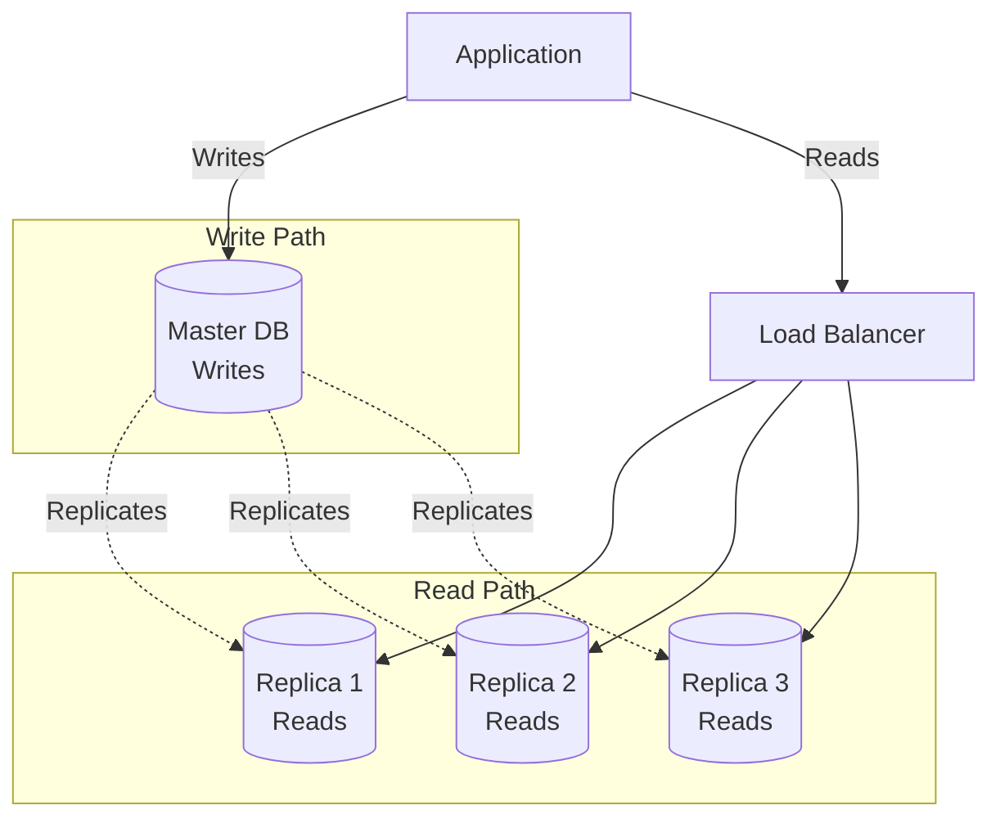

# Database Replication - Scale Reads and High Availability

## What You'll Learn

Master **database replication** for read scaling and fault tolerance:
- **Master-slave replication** - Write to master, read from slaves
- **Replication lag** - Handling eventual consistency
- **Failover strategies** - Automatic recovery from master failure
- **Multi-master replication** - Advanced patterns

**Used by**: MySQL, PostgreSQL, MongoDB, every production database

**Time**: 30 minutes | **Difficulty**: Intermediate

---

## Why This Matters

### The Read Bottleneck

**Scenario**: Your app has 10,000 writes/sec, 100,000 reads/sec (10:1 ratio).

**Single database**:
```
All 110,000 req/sec → Single Database

Database load:
- Writes: 10K/sec (must handle)
- Reads: 100K/sec (bottleneck!)
- CPU: 95%
- Disk I/O: Maxed out
- Response time: 2 seconds

Result: Slow queries, timeouts, angry users
```

**With read replicas**:
```
Writes (10K/sec) → Master Database
Reads (100K/sec) → 5 Read Replicas (20K each)

Master load:
- Writes: 10K/sec
- CPU: 20%

Each replica load:
- Reads: 20K/sec
- CPU: 30%

Result: Fast queries (50ms), happy users, room to grow
```

---

## The Problem: Single Database Limitations

```
┌─────────────────────────────────────────────────────────────┐
│          SINGLE DATABASE BOTTLENECK                          │
├─────────────────────────────────────────────────────────────┤
│                                                             │
│  Single Database Server                                     │
│  ┌───────────────────────────────────────────────────────┐  │
│  │                                                        │  │
│  │  Writes: 10,000/sec                                   │  │
│  │  Reads:  100,000/sec                                  │  │
│  │                                                        │  │
│  │  Total: 110,000 req/sec                               │  │
│  │  CPU: 95% (reads dominate!)                           │  │
│  │  Disk I/O: Saturated                                  │  │
│  │  Query latency: 2+ seconds                            │  │
│  │                                                        │  │
│  └───────────────────────────────────────────────────────┘  │
│                                                             │
│  Problems:                                                  │
│  1. Read queries slow down writes                           │
│  2. Can't scale reads independently                         │
│  3. Single point of failure                                 │
│  4. No geographic distribution                              │
└─────────────────────────────────────────────────────────────┘
```

---

## The Paradigm Shift: Separate Read and Write

**Old thinking**: "All operations on one database"

**New thinking**: "Write to master, read from replicas"

### Replication Architecture



---

## The Solution: Master-Slave Replication

### Basic Setup

```javascript
// Database configuration
const masterDB = new PostgresClient({
  host: 'master.db.example.com',
  database: 'app',
  user: 'app',
  password: '***'
});

const replicaDBs = [
  new PostgresClient({ host: 'replica1.db.example.com', database: 'app' }),
  new PostgresClient({ host: 'replica2.db.example.com', database: 'app' }),
  new PostgresClient({ host: 'replica3.db.example.com', database: 'app' })
];

// Smart routing: writes to master, reads to replicas
class DatabaseRouter {
  constructor(master, replicas) {
    this.master = master;
    this.replicas = replicas;
    this.currentReplica = 0;
  }

  // Write operations → Master
  async insert(sql, params) {
    return await this.master.query(sql, params);
  }

  async update(sql, params) {
    return await this.master.query(sql, params);
  }

  async delete(sql, params) {
    return await this.master.query(sql, params);
  }

  // Read operations → Replica (round-robin)
  async select(sql, params) {
    const replica = this.getNextReplica();
    return await replica.query(sql, params);
  }

  getNextReplica() {
    const replica = this.replicas[this.currentReplica];
    this.currentReplica = (this.currentReplica + 1) % this.replicas.length;
    return replica;
  }

  // Critical reads → Master (avoid replication lag)
  async selectFromMaster(sql, params) {
    return await this.master.query(sql, params);
  }
}

const db = new DatabaseRouter(masterDB, replicaDBs);

// Usage
await db.insert('INSERT INTO users (name, email) VALUES ($1, $2)', ['Alice', 'alice@example.com']);
const users = await db.select('SELECT * FROM users WHERE active = true');
```

### PostgreSQL Replication Setup

```sql
-- On Master: Configure for replication
-- postgresql.conf
wal_level = replica
max_wal_senders = 5
wal_keep_segments = 64

-- Create replication user
CREATE USER replicator WITH REPLICATION ENCRYPTED PASSWORD 'secret';

-- pg_hba.conf: Allow replica to connect
host replication replicator 10.0.1.0/24 md5

-- On Replica: Configure to follow master
-- recovery.conf (PostgreSQL < 12) or postgresql.conf (>= 12)
primary_conninfo = 'host=master.db.example.com port=5432 user=replicator password=secret'
standby_mode = 'on'

-- Start replica
pg_basebackup -h master.db.example.com -D /var/lib/postgresql/data -U replicator -P
```

---

## Handling Replication Lag

### Problem: Eventual Consistency

```javascript
// User updates profile
await db.update('UPDATE users SET name = $1 WHERE id = $2', ['Bob', userId]);

// Immediately read from replica
const user = await db.select('SELECT * FROM users WHERE id = $1', [userId]);
console.log(user.name); // Still "Alice"! (replication lag)

// Why? Update is on master, but hasn't replicated to replica yet
```

### Solution 1: Read from Master After Write

```javascript
class SmartDatabaseRouter extends DatabaseRouter {
  constructor(master, replicas) {
    super(master, replicas);
    this.recentWrites = new Map(); // userId → timestamp
    this.lagThreshold = 1000; // 1 second
  }

  async update(sql, params, userId) {
    const result = await this.master.query(sql, params);

    // Track write timestamp
    if (userId) {
      this.recentWrites.set(userId, Date.now());
    }

    return result;
  }

  async select(sql, params, userId) {
    // Check if recent write
    if (userId && this.recentWrites.has(userId)) {
      const writeTime = this.recentWrites.get(userId);
      const elapsed = Date.now() - writeTime;

      if (elapsed < this.lagThreshold) {
        // Read from master to avoid lag
        return await this.master.query(sql, params);
      } else {
        // Enough time passed, safe to read from replica
        this.recentWrites.delete(userId);
      }
    }

    // Normal replica read
    return await super.select(sql, params);
  }
}

// Usage
await db.update('UPDATE users SET name = $1 WHERE id = $2', ['Bob', userId], userId);

// This reads from master (recent write)
const user1 = await db.select('SELECT * FROM users WHERE id = $1', [userId], userId);
console.log(user1.name); // "Bob" ✓

// Wait 1 second...
await sleep(1000);

// Now reads from replica
const user2 = await db.select('SELECT * FROM users WHERE id = $1', [userId], userId);
console.log(user2.name); // "Bob" ✓ (replicated)
```

### Solution 2: Session Consistency (Sticky Reads)

```javascript
// Use session cookie to track user's write timestamp
app.post('/profile', async (req, res) => {
  await db.update('UPDATE users SET name = $1 WHERE id = $2', [req.body.name, req.user.id]);

  // Set cookie with write timestamp
  res.cookie('last_write', Date.now(), { httpOnly: true });
  res.json({ success: true });
});

app.get('/profile', async (req, res) => {
  const lastWrite = parseInt(req.cookies.last_write || '0');
  const elapsed = Date.now() - lastWrite;

  let user;
  if (elapsed < 1000) {
    // Read from master
    user = await db.selectFromMaster('SELECT * FROM users WHERE id = $1', [req.user.id]);
  } else {
    // Read from replica
    user = await db.select('SELECT * FROM users WHERE id = $1', [req.user.id]);
  }

  res.json(user);
});
```

### Solution 3: Causality Tokens (LSN-based)

```javascript
// PostgreSQL Log Sequence Number (LSN) tracking
class LSNAwareDatabaseRouter {
  async update(sql, params) {
    const result = await this.master.query(sql, params);

    // Get current LSN (write position)
    const lsn = await this.master.query('SELECT pg_current_wal_lsn()');

    return {
      ...result,
      lsn: lsn.rows[0].pg_current_wal_lsn
    };
  }

  async select(sql, params, minLSN = null) {
    if (minLSN) {
      // Wait for replica to catch up to minLSN
      const replica = this.getNextReplica();
      await this.waitForLSN(replica, minLSN);
      return await replica.query(sql, params);
    }

    return await super.select(sql, params);
  }

  async waitForLSN(replica, targetLSN, timeout = 5000) {
    const start = Date.now();

    while (Date.now() - start < timeout) {
      const result = await replica.query('SELECT pg_last_wal_replay_lsn()');
      const currentLSN = result.rows[0].pg_last_wal_replay_lsn;

      if (this.compareLSN(currentLSN, targetLSN) >= 0) {
        return; // Caught up
      }

      await sleep(10);
    }

    // Fallback to master if replica too slow
    throw new Error('Replica lag too high, use master');
  }
}

// Usage
const { lsn } = await db.update('UPDATE users SET name = $1', ['Bob']);
const user = await db.select('SELECT * FROM users WHERE id = $1', [userId], lsn);
// Guaranteed to see "Bob"
```

---

## Automatic Failover

### Detecting Master Failure

```javascript
class FailoverManager {
  constructor(master, replicas) {
    this.master = master;
    this.replicas = replicas;
    this.isMasterHealthy = true;
    this.startHealthCheck();
  }

  startHealthCheck() {
    setInterval(async () => {
      try {
        await this.master.query('SELECT 1');
        if (!this.isMasterHealthy) {
          console.log('Master recovered');
          this.isMasterHealthy = true;
        }
      } catch (error) {
        if (this.isMasterHealthy) {
          console.error('Master is down! Initiating failover...');
          this.isMasterHealthy = false;
          await this.failover();
        }
      }
    }, 5000); // Check every 5 seconds
  }

  async failover() {
    // 1. Choose new master (replica with most recent data)
    const newMaster = await this.chooseBestReplica();

    // 2. Promote replica to master
    await newMaster.query('SELECT pg_promote()'); // PostgreSQL

    // 3. Update application config
    this.master = newMaster;
    this.replicas = this.replicas.filter(r => r !== newMaster);

    // 4. Reconfigure remaining replicas to follow new master
    for (const replica of this.replicas) {
      await this.reconfigureReplica(replica, newMaster);
    }

    console.log('Failover complete. New master:', newMaster.host);
  }

  async chooseBestReplica() {
    // Choose replica with highest LSN (most up-to-date)
    const replicaLSNs = await Promise.all(
      this.replicas.map(async replica => {
        const result = await replica.query('SELECT pg_last_wal_replay_lsn()');
        return {
          replica,
          lsn: result.rows[0].pg_last_wal_replay_lsn
        };
      })
    );

    return replicaLSNs.sort((a, b) => this.compareLSN(b.lsn, a.lsn))[0].replica;
  }
}
```

---

## Multi-Master Replication

### Conflict Resolution

```javascript
// Problem: Two masters accept conflicting writes
// Master 1: UPDATE users SET name = 'Alice' WHERE id = 123
// Master 2: UPDATE users SET name = 'Bob' WHERE id = 123

// Who wins?

// Strategy 1: Last Write Wins (LWW)
class LastWriteWinsResolver {
  resolve(value1, value2) {
    return value1.timestamp > value2.timestamp ? value1 : value2;
  }
}

// Strategy 2: Vector Clocks
class VectorClockResolver {
  resolve(value1, value2) {
    if (this.happenedBefore(value1.clock, value2.clock)) {
      return value2; // value2 is newer
    } else if (this.happenedBefore(value2.clock, value1.clock)) {
      return value1; // value1 is newer
    } else {
      // Concurrent writes - need application-specific resolution
      return this.applicationResolve(value1, value2);
    }
  }
}

// Strategy 3: CRDT (Conflict-Free Replicated Data Types)
// Mathematical guarantee of convergence
class CRDTCounter {
  constructor() {
    this.increments = {}; // nodeId → count
  }

  increment(nodeId) {
    this.increments[nodeId] = (this.increments[nodeId] || 0) + 1;
  }

  value() {
    return Object.values(this.increments).reduce((sum, count) => sum + count, 0);
  }

  merge(other) {
    for (const [nodeId, count] of Object.entries(other.increments)) {
      this.increments[nodeId] = Math.max(this.increments[nodeId] || 0, count);
    }
  }
}
```

---

## Real-World Validation

### Who Uses Replication?

| Company | Setup | Scale |
|---------|-------|-------|
| **Netflix** | Multi-region replicas | 1000+ databases |
| **GitHub** | Master + replicas | 100+ replicas |
| **Instagram** | Read replicas per region | Thousands |
| **Airbnb** | Geographic replicas | Hundreds |

### GitHub's Replication

```
Architecture:
- 1 master (us-east)
- 5+ replicas (same region)
- Geographic replicas (EU, Asia)

Read distribution:
- 90% reads from replicas
- 10% reads from master (critical)

Lag handling:
- Track LSN per session
- Force master read if lag > 100ms

Failover:
- Automated with orchestrator
- Promotion time: < 30 seconds
- Zero data loss (synchronous replica)
```

---

## Interview Tips

### Common Questions

**Q: How do you handle replication lag?**

**Answer:**
1. **Read-your-writes**: Read from master after write
2. **Session consistency**: Track per-user write timestamp
3. **Causality tokens**: Use LSN to ensure consistency
4. **Acceptable staleness**: Cache-Control header
5. **Monitoring**: Alert if lag > threshold

---

**Q: Master vs replica - when to read from master?**

**Answer:**
1. **Read from master**:
   - Immediately after write
   - Critical reads (payments, inventory)
   - User's own data
2. **Read from replica**:
   - Dashboards, analytics
   - Other users' data
   - Lists, search results

---

**Q: How does automatic failover work?**

**Answer:**
1. **Health check** detects master down
2. **Choose new master** (most up-to-date replica)
3. **Promote replica** to master
4. **Reconfigure** remaining replicas
5. **Update DNS/load balancer**
6. Time: 10-60 seconds

### Red Flags to Avoid

- ❌ **Always reading from master** (defeats purpose)
- ❌ **Ignoring replication lag** (inconsistent data)
- ❌ **No monitoring** (lag can spike)
- ❌ **Manual failover** (slow recovery)
- ❌ **Single replica** (no redundancy)

---

## Key Takeaways

**What you learned**:
1. Replication scales reads and provides HA
2. Master handles writes, replicas handle reads
3. Replication lag requires careful handling
4. Automatic failover enables high availability
5. Multi-master adds complexity (conflicts)

**What you can do Monday**:
1. Add 1-2 read replicas to your database
2. Route 80% of reads to replicas
3. Read from master after writes
4. Monitor replication lag
5. Test failover manually

---

## Related Articles

- [Database Sharding](/interview-prep/system-design/database-sharding) - Scale writes
- [CQRS Pattern](/interview-prep/system-design/cqrs-pattern) - Read/write separation
- [High Availability](/interview-prep/system-design/high-availability) - Fault tolerance

---

**Production Examples**:
- **GitHub**: 100+ replicas, automated failover
- **Netflix**: Multi-region replication
- **MySQL**: Built-in master-slave replication

**Remember**: Replication solves **read scaling** and **availability**, not write scaling (use sharding). The 10:1 read/write ratio makes replication one of the best ROI optimizations!
