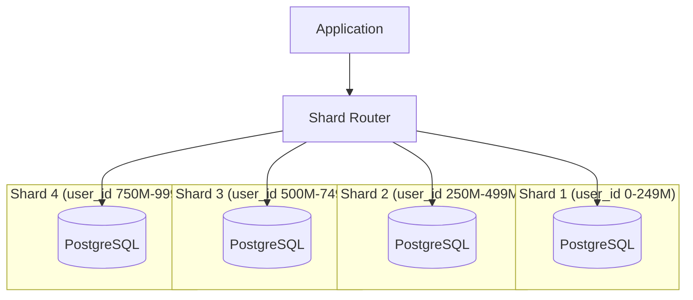

# Database Sharding - Horizontal Scaling for Massive Data

## What You'll Learn

Master **database sharding** to scale beyond single database limits:
- **Sharding strategies** - Hash, range, geographic
- **Shard key selection** - Most critical decision
- **Routing & query** - Finding the right shard
- **Resharding** - Growing without downtime

**Used by**: Instagram (Cassandra), Discord (ScyllaDB), Uber (MySQL sharding)

**Time**: 35 minutes | **Difficulty**: Advanced

---

## Why This Matters

### The Single Database Wall

**Scenario**: Your user table has 1 billion rows. Single PostgreSQL instance.

**The limits**:
```
Single Database Limits:
- Storage: 16TB max (PostgreSQL)
- CPU: 96 cores max
- Memory: 4TB max
- IOPS: 80,000 max
- Cost: $40,000/month

Your data:
- Users: 1B rows × 2KB = 2TB
- Orders: 5B rows × 1KB = 5TB
- Total: 7TB (hitting limits!)

Problems:
- Can't scale vertically more
- Slow queries (scanning billions)
- Single point of failure
- Expensive backups (hours)
- Maintenance downtime affects everyone
```

**With sharding (4 shards)**:
```
Each shard: 250M users, 1.75TB

Shard 1: Users 0-249M     (500GB)
Shard 2: Users 250M-499M  (500GB)
Shard 3: Users 500M-749M  (500GB)
Shard 4: Users 750M-999M  (500GB)

Benefits:
- 4x query speed (smaller datasets)
- Scale to 100+ shards
- Failure isolation
- Parallel backups
- No downtime maintenance
```

---

## The Problem: Vertical Scaling Limits

```
┌─────────────────────────────────────────────────────────────┐
│            SINGLE DATABASE BOTTLENECK                        │
├─────────────────────────────────────────────────────────────┤
│                                                             │
│  Single PostgreSQL Server                                   │
│  ┌───────────────────────────────────────────────────────┐  │
│  │  users table: 1B rows                                 │  │
│  │  orders table: 5B rows                                │  │
│  │  products table: 10M rows                             │  │
│  │                                                        │  │
│  │  Total: 7TB, 200K IOPS                                │  │
│  └───────────────────────────────────────────────────────┘  │
│                                                             │
│  Problems:                                                  │
│  1. Storage: Running out                                    │
│  2. CPU: 100% during peak                                   │
│  3. I/O: Maxed out                                          │
│  4. Queries: Scanning billions of rows                      │
│  5. Backups: 6 hours (blocking writes)                      │
│  6. Failure: Everyone down                                  │
│                                                             │
│  Solution needed: Horizontal scaling (sharding)             │
└─────────────────────────────────────────────────────────────┘
```

---

## The Paradigm Shift: Horizontal Partitioning

**Old thinking**: "Buy bigger server (vertical scaling)"

**New thinking**: "Split data across many servers (horizontal scaling)"

### Sharding Architecture



---

## The Solution: Sharding Strategies

### 1. Hash-Based Sharding

```javascript
// Hash sharding: user_id → shard
function getShardForUser(userId) {
  const shardCount = 4;
  const hash = md5(userId.toString());
  const shardId = parseInt(hash.substring(0, 8), 16) % shardCount;
  return shardId;
}

// Examples:
getShardForUser(123)     → Shard 2
getShardForUser(456)     → Shard 0
getShardForUser(789)     → Shard 3

// Pros: Even distribution
// Cons: Can't do range queries (user_id 1-1000)
```

**Implementation**:
```javascript
class HashShardRouter {
  constructor(shards) {
    this.shards = shards; // [db1, db2, db3, db4]
  }

  getShardForKey(key) {
    const hash = this.hash(key);
    const shardIndex = hash % this.shards.length;
    return this.shards[shardIndex];
  }

  hash(key) {
    // Simple hash (use crypto.createHash in production)
    let hash = 0;
    const str = String(key);
    for (let i = 0; i < str.length; i++) {
      hash = (hash << 5) - hash + str.charCodeAt(i);
      hash = hash & hash; // Convert to 32bit integer
    }
    return Math.abs(hash);
  }

  async getUserById(userId) {
    const shard = this.getShardForKey(userId);
    const result = await shard.query(
      'SELECT * FROM users WHERE id = $1',
      [userId]
    );
    return result.rows[0];
  }

  async createUser(user) {
    const shard = this.getShardForKey(user.id);
    await shard.query(
      'INSERT INTO users (id, name, email) VALUES ($1, $2, $3)',
      [user.id, user.name, user.email]
    );
  }

  // Scatter-gather for cross-shard queries
  async getAllActiveUsers() {
    // Query ALL shards in parallel
    const results = await Promise.all(
      this.shards.map(shard =>
        shard.query('SELECT * FROM users WHERE active = true')
      )
    );

    // Merge results
    return results.flatMap(r => r.rows);
  }
}

// Usage
const router = new HashShardRouter([
  new PostgresClient('db-shard-0'),
  new PostgresClient('db-shard-1'),
  new PostgresClient('db-shard-2'),
  new PostgresClient('db-shard-3')
]);

const user = await router.getUserById(123456);
```

### 2. Range-Based Sharding

```javascript
// Range sharding: Divide by ranges
const SHARD_RANGES = [
  { min: 0, max: 249_999_999, shard: 0 },
  { min: 250_000_000, max: 499_999_999, shard: 1 },
  { min: 500_000_000, max: 749_999_999, shard: 2 },
  { min: 750_000_000, max: 999_999_999, shard: 3 }
];

function getShardForUser(userId) {
  for (const range of SHARD_RANGES) {
    if (userId >= range.min && userId <= range.max) {
      return range.shard;
    }
  }
  throw new Error('User ID out of range');
}

// Pros: Range queries easy (users 1M-2M all on same shard)
// Cons: Uneven distribution if sequential IDs
```

**Implementation**:
```javascript
class RangeShardRouter {
  constructor(shards, ranges) {
    this.shards = shards;
    this.ranges = ranges; // [{ min, max, shard }]
  }

  getShardForKey(key) {
    for (const range of this.ranges) {
      if (key >= range.min && key <= range.max) {
        return this.shards[range.shard];
      }
    }
    throw new Error('Key out of range');
  }

  // Range queries are efficient!
  async getUsersInRange(minId, maxId) {
    // Find relevant shards
    const relevantShards = [];
    for (const range of this.ranges) {
      if (maxId >= range.min && minId <= range.max) {
        relevantShards.push(this.shards[range.shard]);
      }
    }

    // Query only relevant shards
    const results = await Promise.all(
      relevantShards.map(shard =>
        shard.query(
          'SELECT * FROM users WHERE id >= $1 AND id <= $2',
          [minId, maxId]
        )
      )
    );

    return results.flatMap(r => r.rows);
  }
}
```

### 3. Geographic Sharding

```javascript
// Geographic sharding: By user location
const GEO_SHARDS = {
  'us-east': { shard: 0, db: 'db-us-east' },
  'us-west': { shard: 1, db: 'db-us-west' },
  'eu': { shard: 2, db: 'db-eu' },
  'asia': { shard: 3, db: 'db-asia' }
};

function getShardForUser(user) {
  return GEO_SHARDS[user.region].shard;
}

// Pros: Data locality (low latency), compliance (GDPR)
// Cons: Uneven distribution (US has more users)
```

### 4. Consistent Hashing (Dynamic Resharding)

```javascript
// Consistent hashing: Minimal data movement when resharding
class ConsistentHashShardRouter {
  constructor() {
    this.ring = [];
    this.virtualNodesPerShard = 150; // For better distribution
  }

  addShard(shardId, db) {
    // Add virtual nodes to ring
    for (let i = 0; i < this.virtualNodesPerShard; i++) {
      const hash = this.hash(`${shardId}:${i}`);
      this.ring.push({ hash, shardId, db });
    }

    // Sort ring by hash
    this.ring.sort((a, b) => a.hash - b.hash);
  }

  hash(key) {
    // Use crypto hash in production
    return parseInt(
      crypto.createHash('md5').update(String(key)).digest('hex').substring(0, 8),
      16
    );
  }

  getShardForKey(key) {
    const keyHash = this.hash(key);

    // Find next node on ring (binary search)
    let left = 0;
    let right = this.ring.length - 1;

    while (left < right) {
      const mid = Math.floor((left + right) / 2);
      if (this.ring[mid].hash < keyHash) {
        left = mid + 1;
      } else {
        right = mid;
      }
    }

    return this.ring[left].db;
  }
}

// Usage
const router = new ConsistentHashShardRouter();
router.addShard(0, db0);
router.addShard(1, db1);
router.addShard(2, db2);

// Later: Add shard 3 - only 25% of data needs to move!
router.addShard(3, db3);
```

---

## Shard Key Selection (Critical!)

```javascript
// BAD shard key: timestamp
// All new data goes to same shard (hot shard)
getShardForOrder(order.created_at) // DON'T DO THIS

// GOOD shard key: user_id
// Even distribution
getShardForOrder(order.user_id) // ✓

// GOOD shard key: composite (tenant_id + user_id)
// Multi-tenant apps
getShardForOrder(`${order.tenant_id}:${order.user_id}`) // ✓

// Criteria for good shard key:
// 1. High cardinality (many unique values)
// 2. Even distribution
// 3. Rarely changes
// 4. Supports most queries
```

---

## Cross-Shard Queries

```javascript
// Problem: JOIN across shards
// BAD: Can't join users (shard 1) with orders (shard 2)

// Solution 1: Denormalization
// Store user info with order
await shard2.query(`
  INSERT INTO orders (id, user_id, user_name, user_email, ...)
  VALUES ($1, $2, $3, $4, ...)
`);

// Solution 2: Application-level join
async function getOrdersWithUsers(userId) {
  // Get user from shard
  const user = await getUserById(userId);

  // Get orders from (potentially different) shard
  const orders = await getOrdersByUserId(userId);

  // Join in application
  return orders.map(order => ({
    ...order,
    user
  }));
}

// Solution 3: Scatter-gather
async function searchOrders(criteria) {
  // Query all shards
  const results = await Promise.all(
    shards.map(shard =>
      shard.query('SELECT * FROM orders WHERE status = $1', [criteria.status])
    )
  );

  // Merge and sort
  const allOrders = results.flatMap(r => r.rows);
  return allOrders.sort((a, b) => b.created_at - a.created_at);
}
```

---

## Resharding (Adding Shards)

```javascript
// Problem: Need to add shards as data grows

// Strategy 1: Double the shards (4 → 8)
async function reshard() {
  // 1. Add new shards
  for (let i = 4; i < 8; i++) {
    await addShard(i);
  }

  // 2. Redistribute data (each old shard splits in half)
  for (let oldShard = 0; oldShard < 4; oldShard++) {
    const newShard = oldShard + 4;

    // Copy half the data to new shard
    await copyDataBetweenShards(oldShard, newShard, (userId) => {
      // New hash function with 8 shards
      return hash(userId) % 8 === newShard;
    });
  }

  // 3. Switch to new shard mapping
  updateShardMapping(8);
}

// Strategy 2: Virtual shards (logical → physical)
// Logical: 1000 virtual shards
// Physical: 4 servers
// Mapping: Virtual 0-249 → Server 0, 250-499 → Server 1, etc.

// Adding server: Just remap virtual shards
// Virtual 125-249 → Server 4 (new)
// Only 12.5% of data moves!
```

---

## Production Example: Complete Sharding Layer

```javascript
// sharding-middleware.js
class ShardingMiddleware {
  constructor(config) {
    this.config = config;
    this.shards = this.initializeShards(config.shards);
    this.router = new HashShardRouter(this.shards);
  }

  initializeShards(shardConfigs) {
    return shardConfigs.map(config =>
      new PostgresClient({
        host: config.host,
        database: config.database,
        pool: { max: 20 }
      })
    );
  }

  // Intercept queries and route to correct shard
  async query(sql, params, shardKey) {
    if (!shardKey) {
      // Scatter-gather
      return await this.scatterGather(sql, params);
    }

    // Route to single shard
    const shard = this.router.getShardForKey(shardKey);
    return await shard.query(sql, params);
  }

  async scatterGather(sql, params) {
    const results = await Promise.all(
      this.shards.map(shard => shard.query(sql, params))
    );

    return {
      rows: results.flatMap(r => r.rows),
      rowCount: results.reduce((sum, r) => sum + r.rowCount, 0)
    };
  }

  // Transaction support (single shard only!)
  async transaction(shardKey, callback) {
    const shard = this.router.getShardForKey(shardKey);
    const client = await shard.connect();

    try {
      await client.query('BEGIN');
      const result = await callback(client);
      await client.query('COMMIT');
      return result;
    } catch (error) {
      await client.query('ROLLBACK');
      throw error;
    } finally {
      client.release();
    }
  }
}

// Usage
const sharding = new ShardingMiddleware({
  shards: [
    { host: 'db-shard-0.example.com', database: 'app_shard_0' },
    { host: 'db-shard-1.example.com', database: 'app_shard_1' },
    { host: 'db-shard-2.example.com', database: 'app_shard_2' },
    { host: 'db-shard-3.example.com', database: 'app_shard_3' }
  ]
});

// Single-shard query
const user = await sharding.query(
  'SELECT * FROM users WHERE id = $1',
  [userId],
  userId // shard key
);

// Cross-shard query
const activeUsers = await sharding.query(
  'SELECT COUNT(*) FROM users WHERE active = true'
  // No shard key = scatter-gather
);
```

---

## Real-World Validation

### Who Uses Sharding?

| Company | Sharding Strategy | Scale |
|---------|-------------------|-------|
| **Instagram** | User ID hash | 1B+ users, Cassandra |
| **Discord** | Guild ID hash | 100M+ users, ScyllaDB |
| **Uber** | City-based | 100M+ users, MySQL |
| **Twitter** | User ID hash | 330M users, Manhattan |

### Instagram's Sharding

```
Strategy: Hash-based on user_id
- 4000+ PostgreSQL shards
- Each shard: ~250K users
- Shard key: user_id
- Cross-shard queries: Avoid

Data model:
- Photos colocated with user
- Feed stored per user (denormalized)
- No joins across shards

Resharding:
- Started with 100 shards
- Doubled to 200, then 400, etc.
- Consistent hashing minimizes moves
```

---

## Interview Tips

### Common Questions

**Q: How do you choose a shard key?**

**Answer:**
1. **High cardinality** - Many unique values
2. **Even distribution** - No hot shards
3. **Immutable** - Rarely changes
4. **Query-friendly** - Supports common queries
5. Example: `user_id` ✓, `timestamp` ❌

---

**Q: How do you handle transactions across shards?**

**Answer:**
1. **Avoid** - Design to keep transactions within shard
2. **Two-phase commit** - Slow, not recommended
3. **Saga pattern** - Eventual consistency
4. **Denormalize** - Colocate related data

---

**Q: What's the difference between sharding and partitioning?**

**Answer:**
1. **Partitioning** - Split table within same database
   - Vertical: Split columns
   - Horizontal: Split rows (but same server)
2. **Sharding** - Horizontal partitioning ACROSS servers
   - Different physical machines
   - True horizontal scaling

### Red Flags to Avoid

- ❌ **Bad shard key** (timestamp, creates hot shards)
- ❌ **Cross-shard transactions** (distributed transaction hell)
- ❌ **Cross-shard joins** (impossible, need denormalization)
- ❌ **No resharding plan** (stuck when growing)
- ❌ **Ignoring data locality** (network latency)

---

## Key Takeaways

**What you learned**:
1. Sharding splits data across multiple databases
2. Shard key selection is most critical decision
3. Hash sharding = even distribution
4. Range sharding = efficient range queries
5. Cross-shard queries require scatter-gather

**What you can do Monday**:
1. Identify tables > 100M rows
2. Choose shard key (user_id, tenant_id)
3. Implement shard router
4. Test with 2 shards locally
5. Plan resharding strategy

---

## Related Articles

- [Database Replication](/interview-prep/system-design/database-replication) - Read scaling
- [Consistent Hashing](/interview-prep/system-design/consistent-hashing) - Resharding
- [CQRS Pattern](/interview-prep/system-design/cqrs-pattern) - Read/write separation

---

**Production Examples**:
- **Instagram**: 4000+ shards, hash on user_id
- **Discord**: ScyllaDB sharded by guild_id
- **Uber**: MySQL sharded by city

**Remember**: Sharding is **one-way door** - once sharded, hard to unshard. Only shard when you've exhausted vertical scaling and read replicas. The complexity cost is high!
