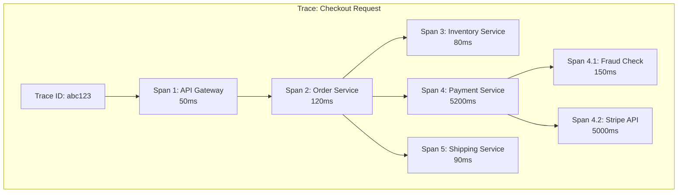

# Distributed Tracing - Debugging Microservices at Scale

## What You'll Learn

Master **distributed tracing** to debug and monitor complex microservice architectures:
- **Trace context propagation** - Track requests across services
- **Spans and traces** - Understand the data model
- **Implementation** - Jaeger, Zipkin, OpenTelemetry
- **Performance analysis** - Find bottlenecks in distributed systems

**Used by**: Uber, Lyft, Netflix, Google (Dapper), all modern microservices

**Time**: 30 minutes | **Difficulty**: Intermediate

---

## Why This Matters

### The Debugging Nightmare

**Scenario**: User reports "Checkout is slow". You have 15 microservices in the checkout flow.

**Without distributed tracing**:
```
User: "Checkout took 8 seconds!"

You check logs:
- API Gateway: 50ms
- Order Service: 120ms
- Inventory Service: 80ms
- Payment Service: 180ms
- Shipping Service: 90ms
- Email Service: 70ms

Total: 590ms ❓ Where are the other 7.4 seconds?

Problems:
1. Can't see the full request path
2. No visibility into service dependencies
3. Logs scattered across 15 services
4. Can't correlate related logs
5. Network time invisible
6. Retries not tracked
```

**With distributed tracing**:
```
Trace ID: abc123

Timeline:
00ms  → API Gateway (50ms)
50ms  → Order Service (120ms)
170ms → Inventory Service (80ms)
250ms → Payment Service (5,200ms) ⚠️ BOTTLENECK!
      → 3 retries (1s + 2s + 2s)
      → External Stripe API timeout (2s each)
5,450ms → Shipping Service (90ms)
5,540ms → Email Service (70ms)

Total: 5,610ms

Root cause found: Payment service timing out on Stripe!
```

---

## The Problem: Lost Visibility

### Microservices Complexity

```
┌─────────────────────────────────────────────────────────────┐
│           REQUEST FLOW (15 services involved)                │
├─────────────────────────────────────────────────────────────┤
│                                                             │
│  User Request                                               │
│      │                                                      │
│      ▼                                                      │
│  API Gateway ────▶ Order Service                            │
│                        │                                    │
│                        ├─▶ User Service                     │
│                        │                                    │
│                        ├─▶ Inventory Service                │
│                        │      ├─▶ Database                  │
│                        │      └─▶ Cache (Redis)             │
│                        │                                    │
│                        ├─▶ Pricing Service                  │
│                        │      └─▶ Discount Service          │
│                        │                                    │
│                        ├─▶ Payment Service                  │
│                        │      ├─▶ Fraud Detection           │
│                        │      └─▶ External: Stripe API      │
│                        │                                    │
│                        ├─▶ Shipping Service                 │
│                        │      └─▶ Address Validation        │
│                        │                                    │
│                        └─▶ Notification Service             │
│                               ├─▶ Email Service             │
│                               └─▶ SMS Service               │
│                                                             │
│  Without tracing: Which service is slow? No idea!           │
└─────────────────────────────────────────────────────────────┘
```

---

## The Paradigm Shift: End-to-End Request Tracking

**Old thinking**: "Look at each service's logs individually"

**New thinking**: "Track the entire request journey with a trace ID"

### Distributed Trace Model



**Key Concepts**:
- **Trace**: Complete request journey (one trace per user request)
- **Span**: Single operation within a trace
- **Trace ID**: Unique ID passed through all services
- **Parent-child**: Spans form a tree structure

---

## The Solution: OpenTelemetry Implementation

### Step 1: Context Propagation

```javascript
// api-gateway/src/index.js
const { trace, context, propagation } = require('@opentelemetry/api');
const { W3CTraceContextPropagator } = require('@opentelemetry/core');

const express = require('express');
const app = express();

// Middleware: Start trace and inject context
app.use((req, res, next) => {
  const tracer = trace.getTracer('api-gateway');

  // Start span for this request
  const span = tracer.startSpan('api-gateway.handle-request', {
    kind: trace.SpanKind.SERVER,
    attributes: {
      'http.method': req.method,
      'http.url': req.url,
      'http.target': req.path,
      'http.user_agent': req.headers['user-agent']
    }
  });

  // Store span in request for later
  req.span = span;

  // Continue with span context
  context.with(trace.setSpan(context.active(), span), () => {
    next();
  });

  // End span when response finishes
  res.on('finish', () => {
    span.setAttributes({
      'http.status_code': res.statusCode
    });
    span.end();
  });
});

// Route: Forward to Order Service
app.post('/checkout', async (req, res) => {
  const tracer = trace.getTracer('api-gateway');
  const span = tracer.startSpan('api-gateway.call-order-service');

  try {
    // Inject trace context into HTTP headers
    const headers = {};
    propagation.inject(context.active(), headers);

    const response = await fetch('http://order-service/create-order', {
      method: 'POST',
      headers: {
        ...headers,
        'Content-Type': 'application/json'
      },
      body: JSON.stringify(req.body)
    });

    const result = await response.json();

    span.setStatus({ code: trace.SpanStatusCode.OK });
    res.json(result);

  } catch (error) {
    span.recordException(error);
    span.setStatus({
      code: trace.SpanStatusCode.ERROR,
      message: error.message
    });
    res.status(500).json({ error: error.message });
  } finally {
    span.end();
  }
});
```

### Step 2: Service Instrumentation

```javascript
// order-service/src/index.js
const { trace, context, propagation } = require('@opentelemetry/api');
const express = require('express');
const app = express();

// Middleware: Extract trace context from headers
app.use((req, res, next) => {
  // Extract parent span context from headers
  const parentContext = propagation.extract(context.active(), req.headers);

  const tracer = trace.getTracer('order-service');

  // Create child span linked to parent
  const span = tracer.startSpan(
    'order-service.create-order',
    {
      kind: trace.SpanKind.SERVER,
      attributes: {
        'service.name': 'order-service',
        'http.method': req.method,
        'http.url': req.url
      }
    },
    parentContext
  );

  req.span = span;

  // Continue with this span context
  context.with(trace.setSpan(parentContext, span), () => {
    next();
  });

  res.on('finish', () => {
    span.end();
  });
});

app.post('/create-order', async (req, res) => {
  const tracer = trace.getTracer('order-service');

  // Span for database operation
  const dbSpan = tracer.startSpan('order-service.save-order-db', {
    kind: trace.SpanKind.CLIENT,
    attributes: {
      'db.system': 'postgresql',
      'db.operation': 'INSERT',
      'db.table': 'orders'
    }
  });

  try {
    const order = await db.query(`
      INSERT INTO orders (user_id, items, total)
      VALUES ($1, $2, $3)
      RETURNING *
    `, [req.body.userId, req.body.items, req.body.total]);

    dbSpan.setStatus({ code: trace.SpanStatusCode.OK });
    dbSpan.end();

    // Call downstream services in parallel
    const results = await Promise.all([
      callInventoryService(order),
      callPaymentService(order),
      callShippingService(order)
    ]);

    res.json({ success: true, order, results });

  } catch (error) {
    dbSpan.recordException(error);
    dbSpan.setStatus({ code: trace.SpanStatusCode.ERROR });
    dbSpan.end();
    res.status(500).json({ error: error.message });
  }
});

async function callPaymentService(order) {
  const tracer = trace.getTracer('order-service');
  const span = tracer.startSpan('order-service.call-payment-service', {
    kind: trace.SpanKind.CLIENT,
    attributes: {
      'peer.service': 'payment-service',
      'order.id': order.id,
      'order.total': order.total
    }
  });

  const startTime = Date.now();

  try {
    // Inject context into outgoing request
    const headers = {};
    propagation.inject(context.active(), headers);

    const response = await fetch('http://payment-service/charge', {
      method: 'POST',
      headers: {
        ...headers,
        'Content-Type': 'application/json'
      },
      body: JSON.stringify(order)
    });

    const result = await response.json();

    const duration = Date.now() - startTime;
    span.setAttributes({
      'http.status_code': response.status,
      'payment.result': result.status,
      'duration_ms': duration
    });

    span.setStatus({ code: trace.SpanStatusCode.OK });
    return result;

  } catch (error) {
    span.recordException(error);
    span.setStatus({ code: trace.SpanStatusCode.ERROR });
    throw error;
  } finally {
    span.end();
  }
}
```

### Step 3: Auto-Instrumentation

```javascript
// tracing.js - Initialize once at app start
const { NodeTracerProvider } = require('@opentelemetry/sdk-trace-node');
const { registerInstrumentations } = require('@opentelemetry/instrumentation');
const { HttpInstrumentation } = require('@opentelemetry/instrumentation-http');
const { ExpressInstrumentation } = require('@opentelemetry/instrumentation-express');
const { PgInstrumentation } = require('@opentelemetry/instrumentation-pg');
const { RedisInstrumentation } = require('@opentelemetry/instrumentation-redis');
const { JaegerExporter } = require('@opentelemetry/exporter-jaeger');
const { BatchSpanProcessor } = require('@opentelemetry/sdk-trace-base');
const { Resource } = require('@opentelemetry/resources');
const { SemanticResourceAttributes } = require('@opentelemetry/semantic-conventions');

function initTracing(serviceName) {
  const provider = new NodeTracerProvider({
    resource: new Resource({
      [SemanticResourceAttributes.SERVICE_NAME]: serviceName,
      [SemanticResourceAttributes.SERVICE_VERSION]: process.env.VERSION || '1.0.0',
      [SemanticResourceAttributes.DEPLOYMENT_ENVIRONMENT]: process.env.NODE_ENV || 'development'
    })
  });

  // Export to Jaeger
  const exporter = new JaegerExporter({
    endpoint: 'http://jaeger:14268/api/traces'
  });

  provider.addSpanProcessor(new BatchSpanProcessor(exporter, {
    maxQueueSize: 100,
    scheduledDelayMillis: 1000
  }));

  provider.register();

  // Auto-instrument libraries
  registerInstrumentations({
    instrumentations: [
      new HttpInstrumentation({
        requestHook: (span, request) => {
          span.setAttributes({
            'http.url': request.url,
            'http.method': request.method
          });
        }
      }),
      new ExpressInstrumentation(),
      new PgInstrumentation(),
      new RedisInstrumentation()
    ]
  });

  console.log(`Tracing initialized for ${serviceName}`);
}

module.exports = { initTracing };

// In your app entry point
const { initTracing } = require('./tracing');
initTracing('order-service');

const express = require('express');
// ... rest of your app
```

### Step 4: Custom Attributes & Events

```javascript
const { trace } = require('@opentelemetry/api');

async function processOrder(order) {
  const tracer = trace.getTracer('order-service');
  const span = tracer.startSpan('order-service.process-order');

  // Add custom attributes
  span.setAttributes({
    'order.id': order.id,
    'order.items_count': order.items.length,
    'order.total': order.total,
    'order.user_id': order.userId,
    'order.payment_method': order.paymentMethod
  });

  try {
    // Add events for important milestones
    span.addEvent('validation_started');

    await validateOrder(order);
    span.addEvent('validation_completed', {
      'validation.result': 'success'
    });

    span.addEvent('inventory_check_started');
    const inventoryOk = await checkInventory(order);
    span.addEvent('inventory_check_completed', {
      'inventory.available': inventoryOk
    });

    if (!inventoryOk) {
      span.setStatus({
        code: trace.SpanStatusCode.ERROR,
        message: 'Insufficient inventory'
      });
      throw new Error('Insufficient inventory');
    }

    span.addEvent('payment_started');
    const payment = await processPayment(order);
    span.addEvent('payment_completed', {
      'payment.id': payment.id,
      'payment.status': payment.status
    });

    span.setStatus({ code: trace.SpanStatusCode.OK });
    return { success: true, payment };

  } catch (error) {
    span.recordException(error);
    span.setStatus({
      code: trace.SpanStatusCode.ERROR,
      message: error.message
    });
    throw error;
  } finally {
    span.end();
  }
}
```

### Jaeger Setup (Docker Compose)

```yaml
# docker-compose.yml
version: '3.8'

services:
  jaeger:
    image: jaegertracing/all-in-one:latest
    ports:
      - "5775:5775/udp"   # Accept zipkin.thrift over compact thrift protocol
      - "6831:6831/udp"   # Accept jaeger.thrift over compact thrift protocol
      - "6832:6832/udp"   # Accept jaeger.thrift over binary thrift protocol
      - "5778:5778"       # Serve configs
      - "16686:16686"     # Jaeger UI
      - "14268:14268"     # Accept jaeger.thrift directly from clients
      - "14250:14250"     # Accept model.proto
    environment:
      - COLLECTOR_ZIPKIN_HOST_PORT=:9411

  api-gateway:
    build: ./api-gateway
    ports:
      - "3000:3000"
    environment:
      - JAEGER_ENDPOINT=http://jaeger:14268/api/traces
    depends_on:
      - jaeger

  order-service:
    build: ./order-service
    environment:
      - JAEGER_ENDPOINT=http://jaeger:14268/api/traces
    depends_on:
      - jaeger
```

---

## Performance Analysis

### Finding Bottlenecks

```javascript
// Generate performance report from traces
async function analyzeServicePerformance(traceId) {
  const trace = await jaeger.getTrace(traceId);

  const spans = trace.spans;
  const timeline = [];

  for (const span of spans) {
    timeline.push({
      service: span.process.serviceName,
      operation: span.operationName,
      startTime: span.startTime,
      duration: span.duration,
      parent: span.references.find(r => r.refType === 'CHILD_OF')?.spanID
    });
  }

  // Sort by duration
  timeline.sort((a, b) => b.duration - a.duration);

  console.log('Top 5 slowest operations:');
  timeline.slice(0, 5).forEach(span => {
    console.log(`${span.service}.${span.operation}: ${span.duration}μs`);
  });

  // Calculate service time
  const serviceTime = {};
  for (const span of timeline) {
    serviceTime[span.service] = (serviceTime[span.service] || 0) + span.duration;
  }

  console.log('\nTime per service:');
  Object.entries(serviceTime)
    .sort((a, b) => b[1] - a[1])
    .forEach(([service, time]) => {
      console.log(`${service}: ${time}μs`);
    });
}
```

---

## Real-World Validation

### Who Uses This?

| Company | Solution | Scale |
|---------|----------|-------|
| **Google** | Dapper (internal) | Origin of tracing |
| **Uber** | Jaeger (open-sourced by Uber) | 2000+ services |
| **Lyft** | Zipkin | Millions of traces/day |
| **Netflix** | Custom (previously Zipkin) | Billions of requests |

### Uber's Jaeger

```
Scale:
- 2000+ microservices
- 100B+ spans/day
- 10TB/day trace data

Benefits:
- Reduced MTTR (Mean Time To Resolution) by 60%
- Identified performance bottlenecks in minutes
- Visualize complex request flows
- Root cause analysis for failures
```

---

## Interview Tips

### Common Questions

**Q: How does distributed tracing differ from logging?**

**Answer:**
1. **Logs**: Individual events per service
   - What happened in one service
   - Hard to correlate across services
2. **Traces**: Request journey across services
   - How request flowed through system
   - Parent-child relationship
   - Duration and dependencies visible

---

**Q: What's the performance impact of tracing?**

**Answer:**
1. **Overhead**: 1-5% latency increase
2. **Sampling**: Trace only 1-10% of requests in production
3. **Async export**: Don't block on trace export
4. **Tail-based sampling**: Keep only slow/failed traces

---

**Q: How do you handle trace context in async operations?**

**Answer:**
1. **Pass context explicitly** in async callbacks
2. **Use context manager** (OpenTelemetry context API)
3. **Store in async storage** (Node.js AsyncLocalStorage)
4. **Message headers** for queue-based async

### Red Flags to Avoid

- ❌ **100% sampling in production** (overwhelming data)
- ❌ **No trace context propagation** (broken traces)
- ❌ **Logging sensitive data in spans** (PII exposure)
- ❌ **Blocking on trace export** (adds latency)
- ❌ **No trace retention policy** (storage explosion)

---

## Key Takeaways

**What you learned**:
1. Distributed tracing tracks requests across services
2. Trace ID propagates through headers
3. Spans represent operations, form parent-child tree
4. Auto-instrumentation reduces boilerplate
5. Essential for debugging microservices

**What you can do Monday**:
1. Add OpenTelemetry to your services
2. Deploy Jaeger for trace collection
3. Propagate trace context in HTTP headers
4. Add custom spans for critical operations
5. Use traces to find performance bottlenecks

---

## Related Articles

- [Service Discovery](/interview-prep/system-design/service-discovery) - Finding services
- [API Gateway](/interview-prep/system-design/api-gateway-pattern) - Entry point tracing
- [Observability](/interview-prep/system-design/observability-metrics-logging) - Full picture

---

**Production Examples**:
- **Uber**: Jaeger handles 100B+ spans/day
- **Google**: Dapper pioneered distributed tracing
- **Lyft**: Zipkin for service mesh observability

**Remember**: Distributed tracing is **essential** for microservices. Without it, debugging is impossible. Logs tell you what happened in one service; traces tell you what happened across the entire system!
