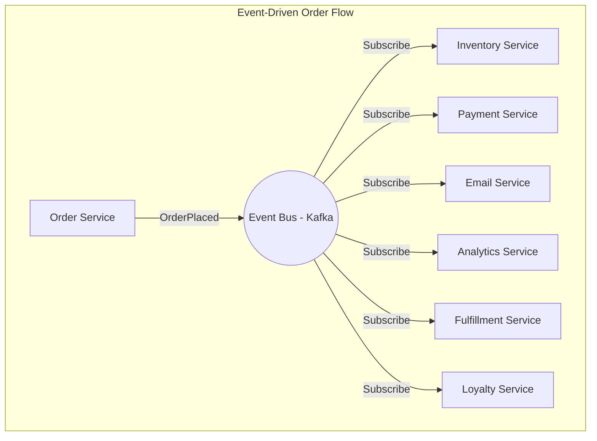
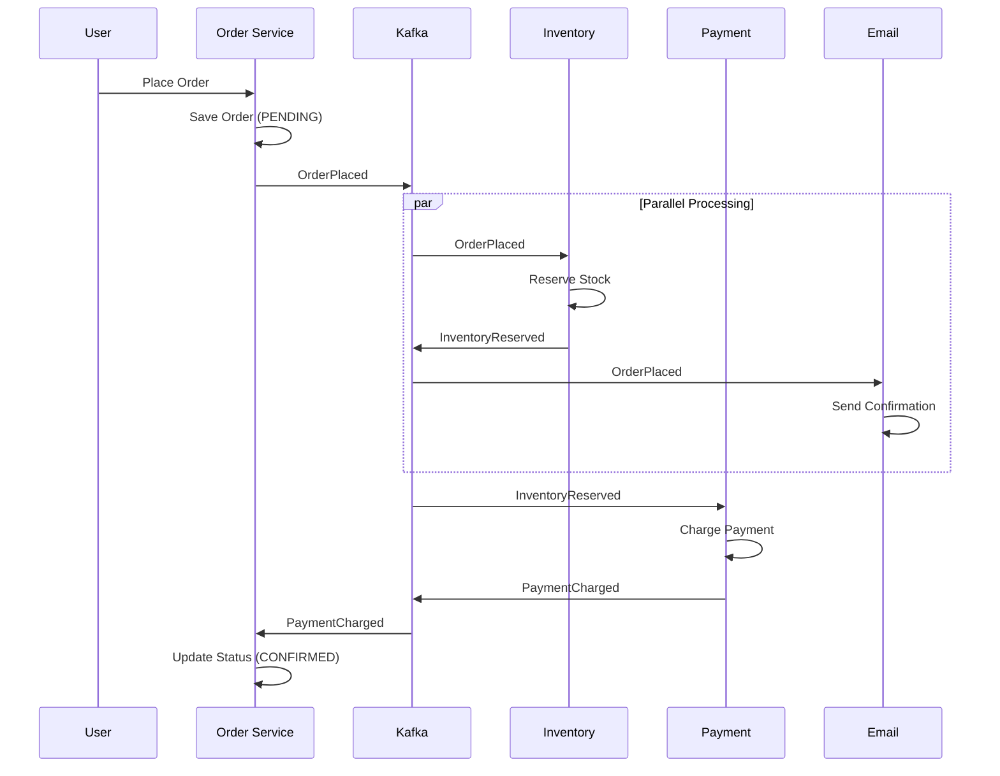

# Event-Driven Architecture - Building Decoupled Systems at Scale

## What You'll Learn

Master **Event-Driven Architecture (EDA)** patterns used by the world's largest systems:
- **Event sourcing vs event-driven** - Understanding the difference
- **Pub/Sub patterns** - Decouple producers and consumers
- **Event choreography** - Services react to events
- **Implementation** - Build event-driven systems with Kafka

**Used by**: Netflix, Uber, LinkedIn, Amazon - handling billions of events daily

**Time**: 35 minutes | **Difficulty**: Intermediate

---

## Why This Matters

### The Coupling Problem

**Scenario**: User places an order. Your system needs to:
1. Update inventory
2. Process payment
3. Send confirmation email
4. Update analytics
5. Trigger fulfillment
6. Update loyalty points

**Synchronous (coupled) approach**:
```javascript
async function placeOrder(order) {
  // Sequential calls - each must succeed
  await inventoryService.reserve(order);     // 100ms
  await paymentService.charge(order);         // 200ms
  await emailService.sendConfirmation(order); // 150ms
  await analyticsService.track(order);        // 50ms
  await fulfillmentService.start(order);      // 100ms
  await loyaltyService.addPoints(order);      // 50ms

  return { success: true };  // Total: 650ms
}

// Problems:
// 1. Slow: 650ms response time
// 2. Fragile: Email down = order fails
// 3. Coupled: Order service knows all downstream services
// 4. Hard to add new features: New service = modify Order code
```

**Event-driven (decoupled) approach**:
```javascript
async function placeOrder(order) {
  // Just save order and publish event
  await db.insert(order);                     // 10ms

  await kafka.publish('order-events', {
    type: 'ORDER_PLACED',
    data: order
  });                                         // 5ms

  return { success: true };  // Total: 15ms (43x faster!)
}

// Benefits:
// 1. Fast: 15ms response time
// 2. Resilient: Services process independently
// 3. Decoupled: Order service doesn't know consumers
// 4. Extensible: New service = new consumer, no code change
```

---

## The Problem: Tight Coupling

### Request-Response Coupling

```
┌─────────────────────────────────────────────────────────────┐
│              REQUEST-RESPONSE COUPLING                       │
├─────────────────────────────────────────────────────────────┤
│                                                             │
│  Order Service                                              │
│      │                                                      │
│      ├──sync call──▶ Inventory Service                      │
│      │                    │                                 │
│      │◀──response────────┘                                  │
│      │                                                      │
│      ├──sync call──▶ Payment Service                        │
│      │                    │                                 │
│      │◀──response────────┘                                  │
│      │                                                      │
│      ├──sync call──▶ Email Service (DOWN!)                  │
│      │                    │                                 │
│      │◀──ERROR──────────┘                                   │
│      │                                                      │
│      └──▶ ORDER FAILS (even though payment succeeded!)      │
│                                                             │
│  Problems:                                                  │
│  - Order service depends on ALL services                    │
│  - One failure = complete failure                           │
│  - Adding service = changing Order code                     │
│  - Response time = sum of all calls                         │
└─────────────────────────────────────────────────────────────┘
```

---

## The Paradigm Shift: Events as First-Class Citizens

**Old thinking**: "Services call other services"

**New thinking**: "Services publish events, others react"

### Event-Driven Architecture



**Key Principles**:
1. **Producers don't know consumers** - Just publish events
2. **Consumers process independently** - At their own pace
3. **Events are immutable facts** - Things that happened
4. **Loose coupling** - Services evolve independently

---

## The Solution: Event-Driven Patterns

### Pattern 1: Simple Event Publishing

```javascript
// Order Service - Publisher
const { Kafka } = require('kafkajs');

const kafka = new Kafka({
  clientId: 'order-service',
  brokers: ['kafka:9092']
});

const producer = kafka.producer();

class OrderService {
  async placeOrder(orderData) {
    // 1. Save to database (source of truth)
    const order = await db.query(`
      INSERT INTO orders (user_id, items, total, status)
      VALUES ($1, $2, $3, 'PENDING')
      RETURNING *
    `, [orderData.userId, orderData.items, orderData.total]);

    // 2. Publish event
    await producer.send({
      topic: 'order-events',
      messages: [{
        key: String(order.id),
        value: JSON.stringify({
          eventType: 'ORDER_PLACED',
          eventId: uuid(),
          timestamp: new Date().toISOString(),
          data: {
            orderId: order.id,
            userId: orderData.userId,
            items: orderData.items,
            total: orderData.total
          }
        }),
        headers: {
          'correlation-id': correlationId,
          'source': 'order-service'
        }
      }]
    });

    return { orderId: order.id, status: 'PENDING' };
  }
}
```

### Pattern 2: Event Consumers

```javascript
// Inventory Service - Consumer
const consumer = kafka.consumer({ groupId: 'inventory-service' });

async function startInventoryConsumer() {
  await consumer.connect();
  await consumer.subscribe({ topic: 'order-events', fromBeginning: false });

  await consumer.run({
    eachMessage: async ({ topic, partition, message }) => {
      const event = JSON.parse(message.value.toString());

      if (event.eventType === 'ORDER_PLACED') {
        await handleOrderPlaced(event.data);
      }
    }
  });
}

async function handleOrderPlaced(orderData) {
  const { orderId, items } = orderData;

  try {
    // Reserve inventory for each item
    for (const item of items) {
      await db.query(`
        UPDATE products
        SET reserved_stock = reserved_stock + $1
        WHERE id = $2 AND available_stock >= $1
      `, [item.quantity, item.productId]);
    }

    // Publish success event
    await producer.send({
      topic: 'inventory-events',
      messages: [{
        key: String(orderId),
        value: JSON.stringify({
          eventType: 'INVENTORY_RESERVED',
          data: { orderId, items }
        })
      }]
    });

  } catch (error) {
    // Publish failure event
    await producer.send({
      topic: 'inventory-events',
      messages: [{
        key: String(orderId),
        value: JSON.stringify({
          eventType: 'INVENTORY_RESERVATION_FAILED',
          data: { orderId, reason: error.message }
        })
      }]
    });
  }
}

// Email Service - Consumer
async function startEmailConsumer() {
  await consumer.subscribe({ topic: 'order-events' });

  await consumer.run({
    eachMessage: async ({ message }) => {
      const event = JSON.parse(message.value.toString());

      if (event.eventType === 'ORDER_PLACED') {
        await sendOrderConfirmation(event.data);
      }
    }
  });
}

async function sendOrderConfirmation(orderData) {
  const user = await userService.getUser(orderData.userId);

  await emailClient.send({
    to: user.email,
    template: 'order-confirmation',
    data: {
      orderId: orderData.orderId,
      items: orderData.items,
      total: orderData.total
    }
  });
}

// Analytics Service - Consumer
async function startAnalyticsConsumer() {
  await consumer.subscribe({
    topics: ['order-events', 'inventory-events', 'payment-events']
  });

  await consumer.run({
    eachMessage: async ({ topic, message }) => {
      const event = JSON.parse(message.value.toString());

      // Track all events for analytics
      await analyticsDb.insert({
        event_type: event.eventType,
        event_data: event.data,
        timestamp: event.timestamp,
        topic
      });

      // Update real-time dashboards
      await updateDashboard(event);
    }
  });
}
```

### Pattern 3: Event Choreography (Full Flow)



### Pattern 4: Event Schema & Versioning

```javascript
// Event schema with versioning
const orderPlacedSchema = {
  $schema: 'http://json-schema.org/draft-07/schema#',
  type: 'object',
  required: ['eventType', 'eventId', 'timestamp', 'version', 'data'],
  properties: {
    eventType: { const: 'ORDER_PLACED' },
    eventId: { type: 'string', format: 'uuid' },
    timestamp: { type: 'string', format: 'date-time' },
    version: { type: 'integer', enum: [1, 2] },
    data: {
      type: 'object',
      required: ['orderId', 'userId', 'items', 'total'],
      properties: {
        orderId: { type: 'string' },
        userId: { type: 'string' },
        items: {
          type: 'array',
          items: {
            type: 'object',
            properties: {
              productId: { type: 'string' },
              quantity: { type: 'integer' },
              price: { type: 'number' }
            }
          }
        },
        total: { type: 'number' },
        // v2 additions
        currency: { type: 'string' },
        discountCode: { type: 'string' }
      }
    }
  }
};

// Consumer handles multiple versions
function handleOrderPlaced(event) {
  const { version, data } = event;

  if (version === 1) {
    // Handle v1 format
    processOrderV1(data);
  } else if (version === 2) {
    // Handle v2 format with currency
    processOrderV2(data);
  } else {
    console.warn(`Unknown event version: ${version}`);
  }
}
```

### Pattern 5: Idempotent Consumers

```javascript
// CRITICAL: Events may be delivered multiple times
class IdempotentConsumer {
  constructor(consumerGroupId) {
    this.consumerGroupId = consumerGroupId;
  }

  async processEvent(event) {
    const eventKey = `${this.consumerGroupId}:${event.eventId}`;

    // Check if already processed
    const processed = await redis.get(eventKey);
    if (processed) {
      console.log(`Event ${event.eventId} already processed, skipping`);
      return;
    }

    // Process the event
    await this.handleEvent(event);

    // Mark as processed (with TTL for cleanup)
    await redis.setex(eventKey, 86400 * 7, 'processed'); // 7 days
  }

  // Alternative: Database-based idempotency
  async processEventWithDb(event) {
    const client = await db.getClient();

    try {
      await client.query('BEGIN');

      // Try to insert processed event (unique constraint)
      const result = await client.query(`
        INSERT INTO processed_events (event_id, consumer_group, processed_at)
        VALUES ($1, $2, NOW())
        ON CONFLICT (event_id, consumer_group) DO NOTHING
        RETURNING id
      `, [event.eventId, this.consumerGroupId]);

      if (result.rowCount === 0) {
        // Already processed
        await client.query('ROLLBACK');
        return;
      }

      // Process event within same transaction
      await this.handleEvent(event, client);

      await client.query('COMMIT');
    } catch (error) {
      await client.query('ROLLBACK');
      throw error;
    } finally {
      client.release();
    }
  }
}
```

---

## Advanced: Transactional Outbox

### Problem: Dual Write

```javascript
// DANGEROUS: Not atomic!
async function placeOrder(order) {
  await db.insert(order);        // Succeeds
  await kafka.publish(event);    // FAILS! Event lost!

  // Order saved but event never published
  // Downstream services never know about order
}
```

### Solution: Outbox Pattern

```javascript
// SAFE: Single transaction, then background publish
async function placeOrder(order) {
  await db.transaction(async (client) => {
    // Save order
    const savedOrder = await client.query(`
      INSERT INTO orders (user_id, items, total, status)
      VALUES ($1, $2, $3, 'PENDING')
      RETURNING *
    `, [order.userId, order.items, order.total]);

    // Save event to outbox (same transaction!)
    await client.query(`
      INSERT INTO event_outbox (event_type, payload, status)
      VALUES ($1, $2, 'PENDING')
    `, ['ORDER_PLACED', JSON.stringify({
      eventType: 'ORDER_PLACED',
      data: savedOrder
    })]);
  });

  // Event publishing handled by background job
  return { success: true };
}

// Background job: Publish events from outbox
async function publishOutboxEvents() {
  const events = await db.query(`
    SELECT * FROM event_outbox
    WHERE status = 'PENDING'
    ORDER BY created_at
    LIMIT 100
    FOR UPDATE SKIP LOCKED
  `);

  for (const event of events.rows) {
    try {
      await kafka.publish(event.event_type, JSON.parse(event.payload));

      await db.query(`
        UPDATE event_outbox SET status = 'PUBLISHED' WHERE id = $1
      `, [event.id]);

    } catch (error) {
      console.error(`Failed to publish event ${event.id}:`, error);
      // Will retry on next run
    }
  }
}

// Run every second
setInterval(publishOutboxEvents, 1000);
```

---

## Real-World Validation

### Who Uses This?

| Company | Scale | Events/Day |
|---------|-------|------------|
| **LinkedIn** | 7T events/day | Kafka at scale |
| **Uber** | 1T events/day | Trip events |
| **Netflix** | 1T+ events/day | Viewing events |
| **Walmart** | 1.5B events/hour | Inventory, orders |

### LinkedIn's Event-Driven Architecture

```
Event Pipeline:
- 7 trillion events/day
- 100+ Kafka clusters
- 3,000+ consumers

Use cases:
- Activity tracking (views, clicks)
- Ad delivery
- Search indexing
- Recommendations
- Anti-fraud

Benefits:
- Decoupled teams (300+ services)
- Real-time processing
- Replay capability (reprocess events)
- Scale independently
```

---

## Interview Tips

### Common Questions

**Q: Event-driven vs event sourcing - what's the difference?**

**Answer:**
1. **Event-driven**: Services communicate via events
   - Events are messages to trigger actions
   - Current state stored in database
2. **Event sourcing**: Events are the source of truth
   - State reconstructed from event history
   - Events stored forever, never deleted

---

**Q: How do you handle out-of-order events?**

**Answer:**
1. **Event timestamps** - Order by timestamp, not arrival
2. **Sequence numbers** - Track expected sequence
3. **Buffering** - Wait for missing events
4. **Idempotency** - Process events safely multiple times
5. **Last-writer-wins** - Use timestamp to resolve conflicts

---

**Q: How do you debug event-driven systems?**

**Answer:**
1. **Correlation IDs** - Track event chains
2. **Event logging** - Log all events with context
3. **Distributed tracing** - Jaeger, Zipkin
4. **Event replay** - Reproduce issues
5. **Dead letter queues** - Capture failed events

### Red Flags to Avoid

- ❌ **No idempotency** (duplicate events cause bugs)
- ❌ **Synchronous in disguise** (waiting for response events)
- ❌ **No schema versioning** (breaking changes break consumers)
- ❌ **Giant events** (put references, not full data)
- ❌ **No dead letter queue** (losing failed events)
- ❌ **Dual writes** (use outbox pattern)

---

## Key Takeaways

**What you learned**:
1. EDA decouples services via events
2. Producers don't know consumers
3. Events are immutable facts
4. Idempotency is mandatory
5. Outbox pattern ensures reliability

**What you can do Monday**:
1. Identify synchronous calls that could be events
2. Add Kafka/RabbitMQ for event bus
3. Implement outbox pattern for reliability
4. Add correlation IDs for tracing
5. Build idempotent consumers

---

## Related Articles

- [Message Queues (Kafka vs RabbitMQ)](/interview-prep/system-design/message-queues-kafka-rabbitmq) - Event transport
- [Saga Pattern](/interview-prep/system-design/saga-pattern) - Distributed transactions
- [Event Sourcing & CQRS](/interview-prep/system-design/event-sourcing-cqrs) - Events as truth

---

**Production Examples**:
- **LinkedIn**: 7T events/day across 300+ services
- **Uber**: Real-time trip events, surge pricing
- **Netflix**: Viewing events, recommendations

**Remember**: Event-driven architecture isn't about events - it's about **decoupling**. When services don't need to know about each other, they can evolve, scale, and fail independently. Start with the outbox pattern and idempotent consumers!
