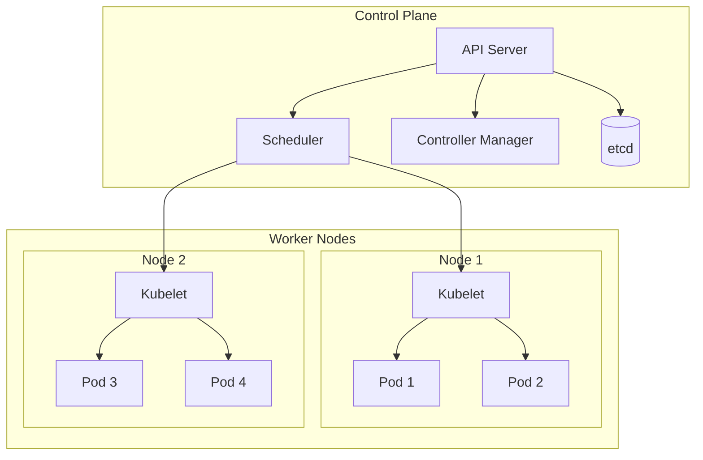

# Kubernetes Basics - Container Orchestration at Scale

## What You'll Learn

Master **Kubernetes fundamentals** for deploying and managing containerized applications:
- **Pods, Deployments, Services** - Core abstractions
- **Auto-scaling & self-healing** - Keep apps running
- **Service discovery & load balancing** - Internal networking
- **ConfigMaps & Secrets** - Configuration management

**Used by**: Google, Spotify, Airbnb, Uber - running millions of containers

**Time**: 35 minutes | **Difficulty**: Intermediate

---

## Why This Matters

### The Container Management Problem

**Scenario**: You have 50 microservices, each needs to scale independently.

**Without Kubernetes**:
```bash
# Manual container management nightmare
docker run -d payment-service
docker run -d order-service
docker run -d inventory-service
# ... 47 more services

# Service crashes - you don't know until users complain
# Need to scale? Manually start more containers
# Update version? Stop old, start new (downtime!)
# Load balancing? Configure NGINX manually
# Health checks? Write scripts
# Networking? Manual IP management
```

**With Kubernetes**:
```yaml
# Declare desired state
apiVersion: apps/v1
kind: Deployment
metadata:
  name: payment-service
spec:
  replicas: 3  # Always 3 instances
  template:
    spec:
      containers:
      - name: payment
        image: payment-service:v2
        resources:
          limits:
            cpu: "500m"
            memory: "512Mi"

# Kubernetes handles:
# - Start 3 containers
# - Restart if crashed (self-healing)
# - Rolling updates (zero downtime)
# - Auto-scale based on CPU
# - Load balance across pods
# - Health checks built-in
```

---

## The Problem: Container Management at Scale

### Manual Management Doesn't Scale

```
┌─────────────────────────────────────────────────────────────┐
│          MANUAL CONTAINER MANAGEMENT                         │
├─────────────────────────────────────────────────────────────┤
│                                                             │
│  Developer: "Deploy to production"                          │
│     │                                                       │
│     ├─ SSH into Server 1                                   │
│     │   └─ docker run payment-service                      │
│     │                                                       │
│     ├─ SSH into Server 2                                   │
│     │   └─ docker run order-service                        │
│     │                                                       │
│     └─ Update load balancer config                         │
│                                                             │
│  Container crashes at 2 AM:                                │
│     ├─ No automatic restart                                │
│     ├─ No alerts                                           │
│     └─ Customers can't checkout                            │
│                                                             │
│  Need to scale:                                            │
│     ├─ Manually SSH to servers                             │
│     ├─ Start more containers                               │
│     └─ Update load balancer                                │
│                                                             │
│  Result: Operations nightmare                              │
└─────────────────────────────────────────────────────────────┘
```

---

## The Paradigm Shift: Declarative Infrastructure

**Old thinking**: "Manually run and manage containers"

**New thinking**: "Declare desired state, Kubernetes makes it happen"

### Kubernetes Architecture



---

## The Solution: Core Kubernetes Concepts

### 1. Pods - Smallest Deployable Unit

```yaml
# pod.yaml - A pod running a single container
apiVersion: v1
kind: Pod
metadata:
  name: payment-service
  labels:
    app: payment
    version: v1
spec:
  containers:
  - name: payment
    image: payment-service:1.0.0
    ports:
    - containerPort: 3000
    env:
    - name: DATABASE_URL
      value: "postgresql://db:5432/payments"
    resources:
      requests:
        memory: "256Mi"
        cpu: "250m"
      limits:
        memory: "512Mi"
        cpu: "500m"
    livenessProbe:
      httpGet:
        path: /health
        port: 3000
      initialDelaySeconds: 10
      periodSeconds: 5
    readinessProbe:
      httpGet:
        path: /ready
        port: 3000
      initialDelaySeconds: 5
      periodSeconds: 3
```

### 2. Deployments - Manage Replicas

```yaml
# deployment.yaml - Manage multiple pods
apiVersion: apps/v1
kind: Deployment
metadata:
  name: payment-service
  labels:
    app: payment
spec:
  replicas: 3  # Run 3 pods
  selector:
    matchLabels:
      app: payment
  template:
    metadata:
      labels:
        app: payment
    spec:
      containers:
      - name: payment
        image: payment-service:1.0.0
        ports:
        - containerPort: 3000
        resources:
          requests:
            memory: "256Mi"
            cpu: "250m"
          limits:
            memory: "512Mi"
            cpu: "500m"
        env:
        - name: DATABASE_URL
          valueFrom:
            secretKeyRef:
              name: db-secret
              key: url
        livenessProbe:
          httpGet:
            path: /health
            port: 3000
          initialDelaySeconds: 10
          periodSeconds: 5
        readinessProbe:
          httpGet:
            path: /ready
            port: 3000

# Deploy
kubectl apply -f deployment.yaml

# Check status
kubectl get pods
# NAME                              READY   STATUS    RESTARTS   AGE
# payment-service-7d8f9b5c4-abc12   1/1     Running   0          2m
# payment-service-7d8f9b5c4-def34   1/1     Running   0          2m
# payment-service-7d8f9b5c4-ghi56   1/1     Running   0          2m
```

### 3. Services - Internal Load Balancing

```yaml
# service.yaml - Expose pods with load balancing
apiVersion: v1
kind: Service
metadata:
  name: payment-service
spec:
  selector:
    app: payment  # Targets pods with this label
  ports:
  - port: 80          # Service port
    targetPort: 3000  # Container port
  type: ClusterIP     # Internal only

---
# Other service can call it
# http://payment-service/charge
# Kubernetes DNS resolves to ClusterIP
# kube-proxy load balances across 3 pods
```

**Service Types**:
```yaml
# ClusterIP (internal only - default)
spec:
  type: ClusterIP

# NodePort (exposed on node IP)
spec:
  type: NodePort
  ports:
  - port: 80
    targetPort: 3000
    nodePort: 30080  # Accessible on <node-ip>:30080

# LoadBalancer (cloud provider LB)
spec:
  type: LoadBalancer  # AWS creates ELB, GCP creates LB
  ports:
  - port: 80
    targetPort: 3000
```

### 4. ConfigMaps & Secrets

```yaml
# configmap.yaml - Non-sensitive configuration
apiVersion: v1
kind: ConfigMap
metadata:
  name: app-config
data:
  LOG_LEVEL: "info"
  MAX_CONNECTIONS: "100"
  CACHE_TTL: "300"

---
# secret.yaml - Sensitive data (base64 encoded)
apiVersion: v1
kind: Secret
metadata:
  name: db-secret
type: Opaque
data:
  # echo -n 'postgresql://...' | base64
  url: cG9zdGdyZXNxbDovL2RiOjU0MzIvcGF5bWVudHM=
  password: c3VwZXJzZWNyZXQ=

---
# Use in deployment
spec:
  containers:
  - name: payment
    envFrom:
    - configMapRef:
        name: app-config
    env:
    - name: DATABASE_URL
      valueFrom:
        secretKeyRef:
          name: db-secret
          key: url
```

### 5. Rolling Updates (Zero Downtime)

```yaml
# deployment.yaml - Update strategy
spec:
  replicas: 5
  strategy:
    type: RollingUpdate
    rollingUpdate:
      maxUnavailable: 1  # Max 1 pod down at a time
      maxSurge: 1        # Max 1 extra pod during update

# Update to new version
kubectl set image deployment/payment-service \
  payment=payment-service:2.0.0

# Kubernetes performs rolling update:
# 1. Start 1 new pod (v2.0.0)
# 2. Wait for readiness
# 3. Terminate 1 old pod (v1.0.0)
# 4. Repeat until all updated
# 5. Zero downtime!

# Rollback if issues
kubectl rollout undo deployment/payment-service
```

### 6. Horizontal Pod Autoscaler

```yaml
# hpa.yaml - Scale based on metrics
apiVersion: autoscaling/v2
kind: HorizontalPodAutoscaler
metadata:
  name: payment-service-hpa
spec:
  scaleTargetRef:
    apiVersion: apps/v1
    kind: Deployment
    name: payment-service
  minReplicas: 2
  maxReplicas: 10
  metrics:
  - type: Resource
    resource:
      name: cpu
      target:
        type: Utilization
        averageUtilization: 70  # Scale at 70% CPU
  - type: Resource
    resource:
      name: memory
      target:
        type: Utilization
        averageUtilization: 80

# Kubernetes automatically:
# - Scales up when CPU/memory high
# - Scales down when usage drops
# - Respects min/max replicas
```

### 7. Complete Example

```yaml
# Complete microservice deployment
---
# ConfigMap
apiVersion: v1
kind: ConfigMap
metadata:
  name: payment-config
data:
  LOG_LEVEL: "info"
  STRIPE_TIMEOUT: "5000"

---
# Secret
apiVersion: v1
kind: Secret
metadata:
  name: payment-secret
type: Opaque
stringData:
  STRIPE_API_KEY: "sk_test_..."
  DATABASE_URL: "postgresql://..."

---
# Deployment
apiVersion: apps/v1
kind: Deployment
metadata:
  name: payment-service
spec:
  replicas: 3
  selector:
    matchLabels:
      app: payment
  template:
    metadata:
      labels:
        app: payment
        version: v1
    spec:
      containers:
      - name: payment
        image: payment-service:1.0.0
        ports:
        - containerPort: 3000
          name: http
        envFrom:
        - configMapRef:
            name: payment-config
        - secretRef:
            name: payment-secret
        resources:
          requests:
            memory: "256Mi"
            cpu: "250m"
          limits:
            memory: "512Mi"
            cpu: "500m"
        livenessProbe:
          httpGet:
            path: /health
            port: 3000
          initialDelaySeconds: 10
          periodSeconds: 10
        readinessProbe:
          httpGet:
            path: /ready
            port: 3000
          initialDelaySeconds: 5
          periodSeconds: 5

---
# Service
apiVersion: v1
kind: Service
metadata:
  name: payment-service
spec:
  selector:
    app: payment
  ports:
  - port: 80
    targetPort: 3000
  type: ClusterIP

---
# HPA
apiVersion: autoscaling/v2
kind: HorizontalPodAutoscaler
metadata:
  name: payment-hpa
spec:
  scaleTargetRef:
    apiVersion: apps/v1
    kind: Deployment
    name: payment-service
  minReplicas: 2
  maxReplicas: 10
  metrics:
  - type: Resource
    resource:
      name: cpu
      target:
        type: Utilization
        averageUtilization: 70

# Deploy everything
kubectl apply -f payment-service.yaml

# Check status
kubectl get all -l app=payment
```

---

## Common kubectl Commands

```bash
# Get resources
kubectl get pods
kubectl get deployments
kubectl get services
kubectl get all  # All resources

# Describe (detailed info)
kubectl describe pod payment-service-abc123
kubectl describe deployment payment-service

# Logs
kubectl logs payment-service-abc123
kubectl logs -f payment-service-abc123  # Follow
kubectl logs payment-service-abc123 --previous  # Previous container

# Execute commands in pod
kubectl exec -it payment-service-abc123 -- /bin/bash
kubectl exec payment-service-abc123 -- env

# Scale manually
kubectl scale deployment payment-service --replicas=5

# Update image
kubectl set image deployment/payment-service \
  payment=payment-service:2.0.0

# Rollout status
kubectl rollout status deployment/payment-service
kubectl rollout history deployment/payment-service
kubectl rollout undo deployment/payment-service

# Delete resources
kubectl delete pod payment-service-abc123
kubectl delete deployment payment-service
kubectl delete -f payment-service.yaml
```

---

## Real-World Validation

### Who Uses Kubernetes?

| Company | Scale | Use Case |
|---------|-------|----------|
| **Google** | 2B+ containers/week | Everything |
| **Spotify** | 300+ services | Music streaming |
| **Airbnb** | 1000+ services | Booking platform |
| **Uber** | 4000+ services | Ride sharing |

### Spotify on Kubernetes

```
Scale:
- 300+ microservices
- 10,000+ pods
- 150+ clusters
- Multi-region

Benefits:
- Deploy 100+ times/day
- Auto-scaling during peak
- Self-healing (auto restart)
- 99.99% availability

Key learnings:
- Start with managed K8s (GKE, EKS)
- Use namespaces per team
- Monitoring is essential
- GitOps for deployments
```

---

## Interview Tips

### Common Questions

**Q: What's the difference between a Pod and a Deployment?**

**Answer:**
1. **Pod**: Single instance, manual management
   - Create 1 pod, it runs
   - Crashes? Stays dead
   - Update? Manual delete + recreate
2. **Deployment**: Manages pods, desired state
   - Declares 3 replicas, K8s ensures 3 running
   - Crashes? Auto restarts
   - Update? Rolling update, zero downtime

---

**Q: How does Kubernetes networking work?**

**Answer:**
1. **Pod IP**: Each pod gets unique cluster IP
2. **Service**: Stable DNS name + ClusterIP
3. **kube-proxy**: Load balances across pod IPs
4. **DNS**: `service-name.namespace.svc.cluster.local`
5. **Network plugin** (CNI): Flannel, Calico, etc.

---

**Q: What's a readiness vs liveness probe?**

**Answer:**
1. **Liveness**: Is container alive?
   - Fails → Kill and restart container
   - Use for deadlock detection
2. **Readiness**: Can container serve traffic?
   - Fails → Remove from Service endpoints
   - Use for startup time, dependency checks

### Red Flags to Avoid

- ❌ **Running without resource limits** (OOMKiller chaos)
- ❌ **No health checks** (routing to dead pods)
- ❌ **Using :latest tag** (unknown versions)
- ❌ **Storing state in pods** (pods are ephemeral)
- ❌ **No monitoring** (blind to issues)
- ❌ **Running as root** (security risk)

---

## Key Takeaways

**What you learned**:
1. Kubernetes automates container orchestration
2. Pods are smallest unit, Deployments manage them
3. Services provide load balancing and discovery
4. HPA enables auto-scaling
5. Declarative config (YAML) describes desired state

**What you can do Monday**:
1. Install minikube for local testing
2. Create Deployment with 3 replicas
3. Expose with Service
4. Add resource limits
5. Implement health checks

---

## Related Articles

- [Service Discovery](/interview-prep/system-design/service-discovery) - K8s DNS
- [API Gateway](/interview-prep/system-design/api-gateway-pattern) - Ingress controller
- [Distributed Tracing](/interview-prep/system-design/distributed-tracing) - Observability

---

**Production Examples**:
- **Google**: Runs everything on Kubernetes (Borg → K8s)
- **Spotify**: 10,000+ pods across 150+ clusters
- **Airbnb**: 1000+ services, multi-region K8s

**Remember**: Kubernetes solves **orchestration**, not application design. It automates deployment, scaling, and healing, but you still need to design stateless, observable, resilient services!
