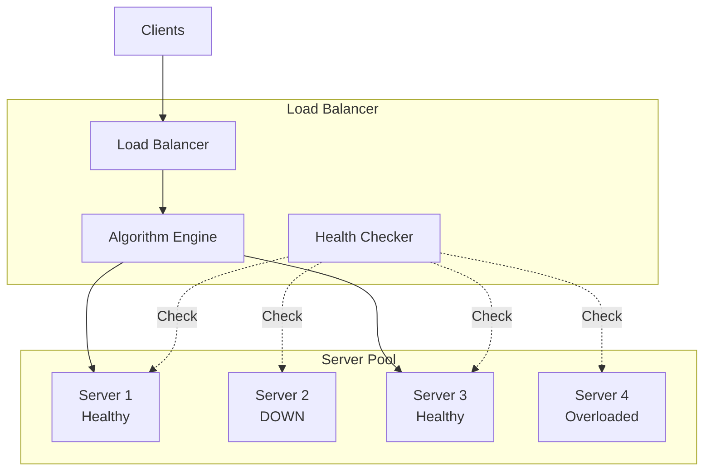

# Load Balancing Strategies - Distribute Traffic at Scale

## What You'll Learn

Master **load balancing** algorithms and strategies used in production systems:
- **Load balancing algorithms** - Round-robin, least connections, consistent hashing
- **L4 vs L7 load balancing** - Transport vs application layer
- **Health checking** - Remove unhealthy servers
- **Implementation** - NGINX, HAProxy, cloud load balancers

**Used by**: Every large-scale system - Netflix, Amazon, Google, Facebook

**Time**: 30 minutes | **Difficulty**: Intermediate

---

## Why This Matters

### The Single Server Problem

**Scenario**: Your API server handles 1000 req/s. Black Friday: 50,000 req/s incoming.

**Without load balancing**:
```
All 50,000 req/s → Single Server

Result:
- CPU: 100%
- Memory: Exhausted
- Response time: 30+ seconds
- Connections: Rejected
- Server: CRASHES
- Revenue: $500K lost in 1 hour
```

**With load balancing**:
```
50,000 req/s → Load Balancer
                    ↓
        ┌───────────┼───────────┐
        ↓           ↓           ↓
    Server 1    Server 2    Server 3 ...  Server 50
    1K req/s    1K req/s    1K req/s      1K req/s

Result:
- Each server: 1K req/s (comfortable)
- Response time: 50ms
- Zero downtime
- Revenue: $500K earned
```

---

## The Problem: Uneven Traffic Distribution

### Naive Approaches Fail

```
┌─────────────────────────────────────────────────────────────┐
│               BAD LOAD BALANCING                             │
├─────────────────────────────────────────────────────────────┤
│                                                             │
│  Random Distribution:                                       │
│  ┌─────────┐  ┌─────────┐  ┌─────────┐                     │
│  │Server 1 │  │Server 2 │  │Server 3 │                     │
│  │  98%    │  │   1%    │  │   1%    │                     │
│  └─────────┘  └─────────┘  └─────────┘                     │
│  Problem: Uneven distribution                               │
│                                                             │
│  No Health Checks:                                          │
│  ┌─────────┐  ┌─────────┐  ┌─────────┐                     │
│  │Server 1 │  │Server 2 │  │Server 3 │                     │
│  │ Healthy │  │  DOWN!  │  │ Healthy │                     │
│  └─────────┘  └─────────┘  └─────────┘                     │
│  Problem: Routing to dead server                            │
│                                                             │
│  No Session Affinity:                                       │
│  User Login → Server 1 (session stored)                     │
│  User Request → Server 2 (no session, logout!)              │
│  Problem: Lost user sessions                                │
└─────────────────────────────────────────────────────────────┘
```

---

## The Paradigm Shift: Smart Traffic Distribution

**Old thinking**: "Distribute requests randomly"

**New thinking**: "Distribute based on server health, capacity, and session affinity"

### Load Balancer Architecture



---

## The Solution: Load Balancing Algorithms

### 1. Round Robin (Simple & Fair)

```
Requests: R1, R2, R3, R4, R5, R6
Servers:  3 servers

Distribution:
R1 → Server 1
R2 → Server 2
R3 → Server 3
R4 → Server 1 (wrap around)
R5 → Server 2
R6 → Server 3

Result: Perfectly even (33.3% each)
```

```javascript
// Round-robin implementation
class RoundRobinBalancer {
  constructor(servers) {
    this.servers = servers;
    this.currentIndex = 0;
  }

  getNextServer() {
    const server = this.servers[this.currentIndex];
    this.currentIndex = (this.currentIndex + 1) % this.servers.length;
    return server;
  }
}

const balancer = new RoundRobinBalancer([
  { host: '10.0.1.1', port: 3000 },
  { host: '10.0.1.2', port: 3000 },
  { host: '10.0.1.3', port: 3000 }
]);

// Handle request
const server = balancer.getNextServer();
await proxyToServer(request, server);
```

**Pros**: Simple, fair distribution
**Cons**: Ignores server capacity, slow servers get same load

---

### 2. Weighted Round Robin (Capacity-Aware)

```
Servers:
- Server 1: weight=3 (powerful, 8 CPU)
- Server 2: weight=2 (medium, 4 CPU)
- Server 3: weight=1 (weak, 2 CPU)

Distribution (6 requests):
R1 → Server 1 (weight 3)
R2 → Server 1
R3 → Server 1
R4 → Server 2 (weight 2)
R5 → Server 2
R6 → Server 3 (weight 1)

Result: 50% to S1, 33% to S2, 17% to S3
```

```javascript
class WeightedRoundRobin {
  constructor(servers) {
    this.servers = servers.map(s => ({ ...s, currentWeight: 0 }));
    this.totalWeight = servers.reduce((sum, s) => sum + s.weight, 0);
  }

  getNextServer() {
    let selected = null;
    let maxWeight = -1;

    // Increase all current weights
    for (const server of this.servers) {
      server.currentWeight += server.weight;

      if (server.currentWeight > maxWeight) {
        maxWeight = server.currentWeight;
        selected = server;
      }
    }

    // Decrease selected server's weight
    selected.currentWeight -= this.totalWeight;

    return selected;
  }
}

const balancer = new WeightedRoundRobin([
  { host: '10.0.1.1', weight: 3 },
  { host: '10.0.1.2', weight: 2 },
  { host: '10.0.1.3', weight: 1 }
]);
```

---

### 3. Least Connections (Dynamic Load)

```
Current connections:
- Server 1: 50 active connections
- Server 2: 20 active connections (LEAST)
- Server 3: 35 active connections

New request → Server 2 (has least connections)

Ideal for: Long-lived connections (WebSocket, streaming)
```

```javascript
class LeastConnectionsBalancer {
  constructor(servers) {
    this.servers = servers.map(s => ({ ...s, activeConnections: 0 }));
  }

  getNextServer() {
    // Find server with fewest connections
    let selected = this.servers[0];
    for (const server of this.servers) {
      if (server.activeConnections < selected.activeConnections) {
        selected = server;
      }
    }
    return selected;
  }

  async handleRequest(request) {
    const server = this.getNextServer();

    server.activeConnections++;

    try {
      const response = await proxyToServer(request, server);
      return response;
    } finally {
      server.activeConnections--;
    }
  }
}
```

---

### 4. Consistent Hashing (Session Affinity)

```
Problem: User sessions stored on specific servers

Without consistent hashing:
User Login → Server 1 (stores session)
User Request → Server 2 (no session, 404!)

With consistent hashing:
User Login → hash(userId) % 3 = 1 → Server 1
User Request → hash(userId) % 3 = 1 → Server 1 (same!)

Result: User always routed to same server
```

```javascript
const crypto = require('crypto');

class ConsistentHashBalancer {
  constructor(servers) {
    this.servers = servers;
    this.ring = [];

    // Add virtual nodes (replicas) for better distribution
    const replicaCount = 150;
    for (const server of servers) {
      for (let i = 0; i < replicaCount; i++) {
        const hash = this.hash(`${server.host}:${i}`);
        this.ring.push({ hash, server });
      }
    }

    // Sort ring by hash
    this.ring.sort((a, b) => a.hash - b.hash);
  }

  hash(key) {
    return parseInt(crypto.createHash('md5').update(key).digest('hex').substring(0, 8), 16);
  }

  getServer(key) {
    const keyHash = this.hash(key);

    // Binary search for next server on ring
    let left = 0;
    let right = this.ring.length - 1;

    while (left < right) {
      const mid = Math.floor((left + right) / 2);
      if (this.ring[mid].hash < keyHash) {
        left = mid + 1;
      } else {
        right = mid;
      }
    }

    return this.ring[left].server;
  }
}

const balancer = new ConsistentHashBalancer([
  { host: '10.0.1.1', port: 3000 },
  { host: '10.0.1.2', port: 3000 },
  { host: '10.0.1.3', port: 3000 }
]);

// Route by user ID (session affinity)
const server = balancer.getServer(request.userId);
```

---

### 5. IP Hash (Simple Affinity)

```javascript
// Simple but effective for session affinity
class IpHashBalancer {
  constructor(servers) {
    this.servers = servers;
  }

  getServer(clientIp) {
    const hash = this.simpleHash(clientIp);
    const index = hash % this.servers.length;
    return this.servers[index];
  }

  simpleHash(str) {
    let hash = 0;
    for (let i = 0; i < str.length; i++) {
      hash = (hash << 5) - hash + str.charCodeAt(i);
      hash = hash & hash; // Convert to 32bit integer
    }
    return Math.abs(hash);
  }
}

// Usage
const server = balancer.getServer(request.ip);
// Same IP always goes to same server
```

---

## L4 vs L7 Load Balancing

### Layer 4 (Transport Layer)

```
Routes based on:
- IP address
- Port number
- Protocol (TCP/UDP)

Pros:
- Very fast (no packet inspection)
- Low latency
- High throughput

Cons:
- Can't route based on URL/headers
- No SSL termination
- Basic health checks only
```

**NGINX L4 config**:
```nginx
stream {
    upstream backend {
        server 10.0.1.1:3000;
        server 10.0.1.2:3000;
        server 10.0.1.3:3000;
    }

    server {
        listen 80;
        proxy_pass backend;
    }
}
```

### Layer 7 (Application Layer)

```
Routes based on:
- URL path
- HTTP headers
- Cookies
- Request body

Pros:
- Smart routing (/api → backend, /static → CDN)
- SSL termination
- Header manipulation
- Caching

Cons:
- Slower (packet inspection)
- Higher CPU usage
```

**NGINX L7 config**:
```nginx
http {
    upstream api_backend {
        least_conn;
        server 10.0.1.1:3000;
        server 10.0.1.2:3000;
    }

    upstream web_backend {
        server 10.0.2.1:3000;
        server 10.0.2.2:3000;
    }

    server {
        listen 80;

        # Route /api to API servers
        location /api {
            proxy_pass http://api_backend;
            proxy_set_header X-Real-IP $remote_addr;
        }

        # Route / to web servers
        location / {
            proxy_pass http://web_backend;
        }
    }
}
```

---

## Health Checking

```nginx
# Active health checks
upstream backend {
    server 10.0.1.1:3000;
    server 10.0.1.2:3000;
    server 10.0.1.3:3000;

    # Health check configuration
    check interval=3000 rise=2 fall=5 timeout=1000 type=http;
    check_http_send "GET /health HTTP/1.0\r\n\r\n";
    check_http_expect_alive http_2xx http_3xx;
}

# How it works:
# - Check /health every 3 seconds
# - 2 successes = mark server UP
# - 5 failures = mark server DOWN
# - 1 second timeout per check
```

```javascript
// Custom health checker
class HealthChecker {
  constructor(servers, options = {}) {
    this.servers = servers;
    this.interval = options.interval || 5000;
    this.timeout = options.timeout || 3000;
    this.healthPath = options.path || '/health';
  }

  start() {
    setInterval(() => this.checkAll(), this.interval);
  }

  async checkAll() {
    for (const server of this.servers) {
      try {
        const response = await fetch(`http://${server.host}:${server.port}${this.healthPath}`, {
          timeout: this.timeout
        });

        if (response.ok) {
          server.healthy = true;
          server.failureCount = 0;
        } else {
          this.markUnhealthy(server);
        }
      } catch (error) {
        this.markUnhealthy(server);
      }
    }
  }

  markUnhealthy(server) {
    server.failureCount = (server.failureCount || 0) + 1;

    // Mark unhealthy after 3 failures
    if (server.failureCount >= 3) {
      server.healthy = false;
      console.log(`Server ${server.host} marked unhealthy`);
    }
  }

  getHealthyServers() {
    return this.servers.filter(s => s.healthy !== false);
  }
}
```

---

## Production Example: Complete Load Balancer

```javascript
// production-load-balancer.js
class ProductionLoadBalancer {
  constructor(servers, algorithm = 'round-robin') {
    this.servers = servers.map(s => ({
      ...s,
      healthy: true,
      activeConnections: 0,
      failureCount: 0
    }));

    this.algorithm = this.selectAlgorithm(algorithm);
    this.healthChecker = new HealthChecker(this.servers);
    this.healthChecker.start();
  }

  selectAlgorithm(name) {
    const algorithms = {
      'round-robin': new RoundRobinBalancer(this.servers),
      'least-connections': new LeastConnectionsBalancer(this.servers),
      'consistent-hash': new ConsistentHashBalancer(this.servers),
      'ip-hash': new IpHashBalancer(this.servers)
    };
    return algorithms[name];
  }

  async handleRequest(request) {
    const healthyServers = this.healthChecker.getHealthyServers();

    if (healthyServers.length === 0) {
      throw new Error('No healthy servers available');
    }

    // Get server based on algorithm
    let server;
    if (this.algorithm instanceof ConsistentHashBalancer) {
      server = this.algorithm.getServer(request.userId || request.sessionId);
    } else if (this.algorithm instanceof IpHashBalancer) {
      server = this.algorithm.getServer(request.ip);
    } else {
      server = this.algorithm.getNextServer();
    }

    // Proxy request with retries
    const maxRetries = 3;
    for (let attempt = 0; attempt < maxRetries; attempt++) {
      try {
        server.activeConnections++;
        const response = await this.proxyToServer(request, server);
        server.activeConnections--;
        server.failureCount = 0;
        return response;
      } catch (error) {
        server.activeConnections--;
        server.failureCount++;

        if (attempt === maxRetries - 1) {
          throw error;
        }

        // Try different server on retry
        server = this.algorithm.getNextServer();
      }
    }
  }
}
```

---

## Real-World Validation

### Who Uses What?

| Company | Solution | Algorithm |
|---------|----------|-----------|
| **Netflix** | ELB + Zuul | Zone-aware LB |
| **Amazon** | ALB/NLB | Least connections |
| **Cloudflare** | Custom | Consistent hashing |
| **HAProxy** | Industry standard | All algorithms |

---

## Interview Tips

### Common Questions

**Q: When to use round-robin vs least connections?**

**Answer:**
1. **Round-robin**: Short-lived requests (HTTP REST)
   - Equal processing time
   - Stateless services
2. **Least connections**: Long-lived connections
   - WebSocket, streaming
   - Variable processing time

---

**Q: How does consistent hashing help with cache misses?**

**Answer:**
1. Without: Server removed → all keys rehashed → 100% cache miss
2. With: Server removed → only 1/N keys rehashed → 10% cache miss
3. Virtual nodes improve distribution

---

**Q: L4 vs L7 load balancing - trade-offs?**

**Answer:**
1. **L4**: Fast, low latency, basic routing
2. **L7**: Smart routing, SSL termination, slower
3. Use both: L4 for entry, L7 for routing

### Red Flags to Avoid

- ❌ **No health checks** (routing to dead servers)
- ❌ **Single load balancer** (SPOF)
- ❌ **No connection draining** (abrupt shutdowns)
- ❌ **Ignoring server capacity** (overloading weak servers)
- ❌ **No monitoring** (can't see distribution)

---

## Key Takeaways

**What you learned**:
1. Load balancers distribute traffic across servers
2. Algorithms: round-robin, least connections, consistent hashing
3. Health checks remove unhealthy servers
4. L4 = fast, L7 = smart routing
5. Session affinity via consistent hashing or IP hash

**What you can do Monday**:
1. Deploy NGINX as load balancer
2. Configure health checks
3. Test failover (kill a server)
4. Monitor traffic distribution
5. Add session affinity if needed

---

## Related Articles

- [API Gateway](/interview-prep/system-design/api-gateway-pattern) - Gateway as LB
- [Service Discovery](/interview-prep/system-design/service-discovery) - Finding backends
- [High Availability](/interview-prep/system-design/high-availability) - Redundancy

---

**Production Examples**:
- **Netflix**: ELB + zone-aware routing for 200M users
- **HAProxy**: Powers many Fortune 500 companies
- **NGINX**: 400M+ websites

**Remember**: Load balancing isn't just about distribution - it's about **resilience**. Health checks, failover, and graceful degradation are just as important as the algorithm!
