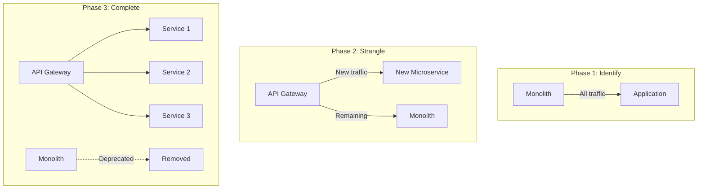
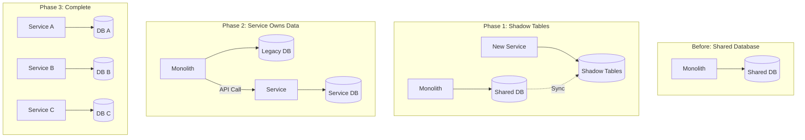
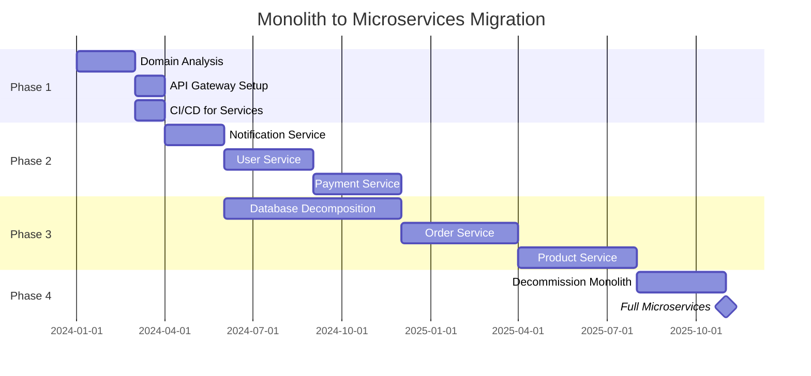

# Monolith to Microservices - Migration Strategies at Scale

## What You'll Learn

Master the **migration from monolith to microservices** used by Netflix, Amazon, and Uber:
- **Strangler Fig Pattern** - Incrementally replace monolith components
- **Domain-Driven Design** - Identify service boundaries
- **Database decomposition** - Split the shared database
- **Migration patterns** - Branch by abstraction, parallel run

**Used by**: Netflix (1000+ microservices), Amazon (2-pizza teams), Uber (4000+ services), Airbnb

**Time**: 35 minutes | **Difficulty**: Advanced

---

## Why This Matters

### The $100M Problem

**Scenario**: Your e-commerce platform started as a simple Rails app. Now you have:
- 2M lines of code in one repository
- 500 developers stepping on each other's toes
- 6-hour deployment cycles
- One bug brings down everything
- Scaling means scaling the entire application

**The real cost**:
```
Development velocity:
- Feature development: 3 weeks → 3 months
- Bug fixes: 1 day → 1 week
- Deployment frequency: Daily → Monthly
- Developer onboarding: 1 week → 3 months

Infrastructure cost:
- Scaling: $50K → $500K/month (scaling everything)
- Downtime: 99.9% → 95% availability
- Incident response: 15 min → 4 hours

Business impact:
- Time-to-market: 10x slower
- Customer churn: 5% increase
- Revenue loss: $100M/year in delayed features
```

**Amazon's story**: In 2001, Amazon's monolith was so slow that adding a feature took months. They decomposed into services - now they deploy every 11.7 seconds.

---

## The Problem: Monolith Pain Points

### Death by Monolith

```
┌─────────────────────────────────────────────────────────────────┐
│                        MONOLITH                                  │
├─────────────────────────────────────────────────────────────────┤
│  ┌──────────┐  ┌──────────┐  ┌──────────┐  ┌──────────┐       │
│  │  Users   │  │  Orders  │  │ Products │  │ Payments │       │
│  └────┬─────┘  └────┬─────┘  └────┬─────┘  └────┬─────┘       │
│       │             │             │             │              │
│       └─────────────┴─────────────┴─────────────┘              │
│                         │                                       │
│              ┌──────────┴──────────┐                           │
│              │   SHARED DATABASE   │                           │
│              │   (PostgreSQL)      │                           │
│              └─────────────────────┘                           │
└─────────────────────────────────────────────────────────────────┘

Problems:
1. Tight coupling - Change users, break orders
2. Single database - Lock contention, scaling limits
3. One deployment - Deploy orders, deploy everything
4. Technology lock-in - Can't use best tool for each job
5. Team dependencies - Need 5 team approvals for 1 feature
```

### When to Migrate

**Migrate when**:
- Deployment takes hours, not minutes
- Teams block each other frequently
- Scaling is all-or-nothing expensive
- New developers take months to be productive
- Bug in one area crashes the whole system

**Don't migrate when**:
- Team is small (<10 developers)
- Product is still finding market fit
- You don't have DevOps maturity
- Just because "Netflix did it"

---

## The Paradigm Shift: Strangler Fig Pattern

**Old thinking**: "Rewrite the whole thing from scratch"

**New thinking**: "Incrementally strangle the monolith"

### The Strangler Fig



**Why this works**:
- **Zero big bang**: No risky massive rewrite
- **Incremental value**: Each service delivers immediate benefit
- **Rollback safe**: Can route back to monolith if service fails
- **Team autonomy**: Teams own services end-to-end

---

## The Solution: Step-by-Step Migration

### Step 1: Domain Analysis (DDD)

```javascript
// Before: Tightly coupled monolith
class OrderService {
  async createOrder(userId, items) {
    // User validation
    const user = await this.db.query('SELECT * FROM users WHERE id = $1', [userId]);
    if (!user) throw new Error('User not found');

    // Inventory check
    for (const item of items) {
      const product = await this.db.query('SELECT stock FROM products WHERE id = $1', [item.productId]);
      if (product.stock < item.quantity) throw new Error('Out of stock');
    }

    // Payment processing
    const payment = await this.processPayment(user.paymentMethod, total);

    // Order creation
    const order = await this.db.query('INSERT INTO orders...');

    // Inventory update
    for (const item of items) {
      await this.db.query('UPDATE products SET stock = stock - $1', [item.quantity]);
    }

    // Email notification
    await this.sendEmail(user.email, 'Order confirmed');

    return order;
  }
}
```

**Domain Boundaries Identified**:

```
┌──────────────────────────────────────────────────────────────┐
│                    BOUNDED CONTEXTS                          │
├──────────────────────────────────────────────────────────────┤
│                                                              │
│  ┌─────────────┐    ┌─────────────┐    ┌─────────────┐     │
│  │   USER      │    │   CATALOG   │    │   ORDER     │     │
│  │   CONTEXT   │    │   CONTEXT   │    │   CONTEXT   │     │
│  │             │    │             │    │             │     │
│  │ - Profiles  │    │ - Products  │    │ - Orders    │     │
│  │ - Auth      │    │ - Inventory │    │ - Cart      │     │
│  │ - Addresses │    │ - Categories│    │ - Checkout  │     │
│  └─────────────┘    └─────────────┘    └─────────────┘     │
│                                                              │
│  ┌─────────────┐    ┌─────────────┐    ┌─────────────┐     │
│  │  PAYMENT    │    │  SHIPPING   │    │ NOTIFICATION│     │
│  │  CONTEXT    │    │  CONTEXT    │    │   CONTEXT   │     │
│  │             │    │             │    │             │     │
│  │ - Payments  │    │ - Delivery  │    │ - Email     │     │
│  │ - Refunds   │    │ - Tracking  │    │ - SMS       │     │
│  │ - Invoices  │    │ - Returns   │    │ - Push      │     │
│  └─────────────┘    └─────────────┘    └─────────────┘     │
│                                                              │
└──────────────────────────────────────────────────────────────┘
```

### Step 2: Extract First Service

**Choose the right first service**:
1. **Low coupling**: Minimal dependencies on other modules
2. **High value**: Significant business impact
3. **Clear boundary**: Well-defined inputs/outputs
4. **Team ready**: Skilled team available

**Example: Extract Notification Service**

```javascript
// notification-service/src/index.js
const express = require('express');
const { Kafka } = require('kafkajs');

const app = express();
const kafka = new Kafka({ brokers: ['kafka:9092'] });
const consumer = kafka.consumer({ groupId: 'notification-service' });

// Event-driven: Listen for events, send notifications
async function startConsumer() {
  await consumer.connect();
  await consumer.subscribe({ topics: ['order-events', 'user-events'] });

  await consumer.run({
    eachMessage: async ({ topic, message }) => {
      const event = JSON.parse(message.value.toString());

      switch (event.type) {
        case 'ORDER_CREATED':
          await sendOrderConfirmation(event.data);
          break;
        case 'ORDER_SHIPPED':
          await sendShippingNotification(event.data);
          break;
        case 'USER_REGISTERED':
          await sendWelcomeEmail(event.data);
          break;
      }
    }
  });
}

async function sendOrderConfirmation(order) {
  // Email service integration
  await emailClient.send({
    to: order.userEmail,
    template: 'order-confirmation',
    data: { orderId: order.id, items: order.items, total: order.total }
  });

  // SMS for high-value orders
  if (order.total > 500) {
    await smsClient.send({
      to: order.userPhone,
      message: `Order #${order.id} confirmed! Total: $${order.total}`
    });
  }

  // Push notification
  await pushClient.send({
    userId: order.userId,
    title: 'Order Confirmed',
    body: `Your order #${order.id} has been confirmed`
  });
}

// API endpoints for direct notifications
app.post('/api/notify', async (req, res) => {
  const { type, channel, recipient, data } = req.body;

  switch (channel) {
    case 'email':
      await emailClient.send({ to: recipient, template: type, data });
      break;
    case 'sms':
      await smsClient.send({ to: recipient, message: formatMessage(type, data) });
      break;
    case 'push':
      await pushClient.send({ userId: recipient, ...formatPush(type, data) });
      break;
  }

  res.json({ success: true });
});

startConsumer();
app.listen(3001);
```

### Step 3: Database Decomposition

**The hardest part**: Splitting the shared database



**Database decomposition pattern**:

```javascript
// Step 1: Create sync mechanism
class DatabaseSync {
  async syncNotifications() {
    // Read from legacy table
    const notifications = await legacyDb.query(`
      SELECT * FROM notifications
      WHERE updated_at > $1
    `, [lastSyncTime]);

    // Write to new service database
    for (const notification of notifications) {
      await serviceDb.query(`
        INSERT INTO notifications (id, user_id, type, content, created_at)
        VALUES ($1, $2, $3, $4, $5)
        ON CONFLICT (id) DO UPDATE SET content = $4
      `, [notification.id, notification.user_id, notification.type,
          notification.content, notification.created_at]);
    }
  }
}

// Step 2: Parallel writes during transition
class NotificationRepository {
  async create(notification) {
    // Write to both databases during transition
    const [legacyResult, serviceResult] = await Promise.all([
      this.writeLegacy(notification),
      this.writeService(notification)
    ]);

    // Compare for consistency
    if (!this.resultsMatch(legacyResult, serviceResult)) {
      await this.reconcile(legacyResult, serviceResult);
      metrics.increment('database.sync.mismatch');
    }

    return serviceResult;
  }

  async writeLegacy(notification) {
    // Feature flag to disable once migration complete
    if (!featureFlags.isEnabled('legacy_notifications_write')) {
      return null;
    }
    return await legacyDb.query('INSERT INTO notifications...', [...]);
  }

  async writeService(notification) {
    return await serviceDb.query('INSERT INTO notifications...', [...]);
  }
}

// Step 3: Switch reads to service
class NotificationService {
  async getNotifications(userId) {
    // Feature flag controlled switch
    if (featureFlags.isEnabled('read_from_service')) {
      return await this.serviceRepository.findByUserId(userId);
    }
    return await this.legacyRepository.findByUserId(userId);
  }
}
```

### Step 4: API Gateway & Routing

```javascript
// api-gateway/src/routes.js
const express = require('express');
const httpProxy = require('http-proxy-middleware');

const app = express();

// Routing configuration
const serviceRoutes = {
  '/api/notifications': 'http://notification-service:3001',
  '/api/payments': 'http://payment-service:3002',
  '/api/users': 'http://user-service:3003',
  // Routes still in monolith
  '/api/orders': 'http://monolith:3000',
  '/api/products': 'http://monolith:3000'
};

// Dynamic routing with feature flags
app.use('/api/:service/*', async (req, res, next) => {
  const service = req.params.service;
  const route = `/api/${service}`;

  // Check if service is migrated
  const isMigrated = await featureFlags.isEnabled(`service.${service}.migrated`);

  let targetUrl;
  if (isMigrated && serviceRoutes[route]) {
    targetUrl = serviceRoutes[route];
  } else {
    targetUrl = 'http://monolith:3000'; // Fallback to monolith
  }

  // Proxy request
  const proxy = httpProxy.createProxyMiddleware({
    target: targetUrl,
    changeOrigin: true,
    onError: async (err, req, res) => {
      // Circuit breaker: Fallback to monolith on service failure
      if (targetUrl !== 'http://monolith:3000') {
        metrics.increment('service.fallback', { service });
        await forwardToMonolith(req, res);
      } else {
        res.status(503).json({ error: 'Service unavailable' });
      }
    }
  });

  proxy(req, res, next);
});

// Request transformation for compatibility
app.use((req, res, next) => {
  // Add correlation ID for distributed tracing
  req.headers['x-correlation-id'] = req.headers['x-correlation-id'] || uuid();

  // Transform legacy request format if needed
  if (req.path.startsWith('/api/v1/')) {
    req.url = req.url.replace('/api/v1/', '/api/v2/');
  }

  next();
});
```

### Step 5: Event-Driven Communication

```javascript
// Monolith: Publish events for extracted services
class OrderService {
  constructor(kafka) {
    this.producer = kafka.producer();
  }

  async createOrder(userId, items) {
    // Create order in monolith database
    const order = await this.db.query('INSERT INTO orders...', [...]);

    // Publish event for downstream services
    await this.producer.send({
      topic: 'order-events',
      messages: [{
        key: String(order.id),
        value: JSON.stringify({
          type: 'ORDER_CREATED',
          timestamp: new Date().toISOString(),
          data: {
            orderId: order.id,
            userId,
            items,
            total: this.calculateTotal(items),
            userEmail: user.email,
            userPhone: user.phone
          }
        }),
        headers: {
          'correlation-id': correlationId,
          'source': 'monolith'
        }
      }]
    });

    // Don't call notification service directly anymore
    // It will pick up the event from Kafka

    return order;
  }
}

// Event schema versioning
const eventSchemas = {
  'ORDER_CREATED': {
    v1: {
      required: ['orderId', 'userId', 'items'],
      optional: ['total']
    },
    v2: {
      required: ['orderId', 'userId', 'items', 'total'],
      optional: ['userEmail', 'userPhone', 'shippingAddress']
    }
  }
};

function validateEvent(event) {
  const schema = eventSchemas[event.type]?.[event.version || 'v1'];
  if (!schema) throw new Error(`Unknown event type: ${event.type}`);

  for (const field of schema.required) {
    if (!event.data[field]) {
      throw new Error(`Missing required field: ${field}`);
    }
  }
}
```

### Complete Migration Timeline



---

## Real-World Validation

### Who Did This?

| Company | Before | After | Timeline |
|---------|--------|-------|----------|
| **Netflix** | 1 monolith | 1000+ services | 7 years |
| **Amazon** | 1 monolith | 2-pizza teams | 6 years |
| **Uber** | 1 Python monolith | 4000+ services | 5 years |
| **Airbnb** | 1 Rails monolith | 1000+ services | 4 years |

### Netflix Migration Story

```
2008: Single Java monolith on Oracle DB
- Deploy cycle: 2 weeks
- Incidents: Weekly
- Scale: 10M subscribers

2015: Full microservices
- Deploy cycle: Minutes
- Incidents: Rare
- Scale: 100M+ subscribers

Key decisions:
1. Started with edge services (API gateway)
2. Moved stateless services first
3. Database per service (Cassandra)
4. Eventual consistency everywhere
5. Built Chaos Monkey to test resilience
```

---

## Interview Tips

### Common Questions

**Q: When should you NOT migrate to microservices?**

**Answer:**
1. **Small team** (<10 developers) - Overhead outweighs benefits
2. **Early stage product** - Requirements change too fast
3. **Simple domain** - CRUD apps don't need it
4. **No DevOps maturity** - Can't manage distributed systems
5. **Tight deadline** - Migration takes years, not months

---

**Q: What's the biggest challenge in migration?**

**Answer:**
1. **Database decomposition** - Breaking shared database is hardest
2. **Distributed transactions** - No more ACID across services
3. **Network failures** - Everything becomes an RPC
4. **Testing complexity** - Integration testing across services
5. **Organizational change** - Teams must own services end-to-end

---

**Q: How do you handle data consistency across services?**

**Answer:**
1. **Saga pattern** - Compensating transactions for rollback
2. **Event sourcing** - Events as source of truth
3. **Eventual consistency** - Accept temporary inconsistency
4. **Idempotency** - Retry-safe operations
5. **Outbox pattern** - Reliable event publishing

---

**Q: What's the Strangler Fig pattern?**

**Answer:**
1. **Create abstraction layer** (API Gateway)
2. **Route traffic** to new service for specific paths
3. **Keep monolith** for remaining functionality
4. **Incrementally migrate** feature by feature
5. **Decommission monolith** when empty

### Red Flags to Avoid

- ❌ **Big bang rewrite** (Netflix rule: never rewrite from scratch)
- ❌ **Shared database across services** (creates tight coupling)
- ❌ **Synchronous calls everywhere** (cascading failures)
- ❌ **No feature flags** (can't safely rollback)
- ❌ **Migrating without clear boundaries** (creates distributed monolith)
- ❌ **Starting with the hardest service** (start with lowest risk)
- ❌ **No observability** (can't debug distributed systems)

---

## Key Takeaways

**What you learned**:
1. Strangler Fig pattern enables safe, incremental migration
2. Domain-Driven Design identifies service boundaries
3. Database decomposition is the hardest part
4. Event-driven communication decouples services
5. Migration is measured in years, not months

**What you can do Monday**:
1. Map your monolith's domain boundaries
2. Identify a low-risk, high-value extraction candidate
3. Set up API gateway for gradual routing
4. Implement event publishing from monolith
5. Start with notification or email service (often easiest)

---

## Related Articles

- [Service Discovery Patterns](/interview-prep/system-design/service-discovery-patterns) - Consul, Eureka
- [Circuit Breaker Pattern](/interview-prep/system-design/circuit-breaker-pattern) - Resilience
- [Saga Pattern](/interview-prep/system-design/saga-pattern) - Distributed transactions

---

**Production Examples**:
- **Netflix**: 7-year migration, 1000+ services, built Zuul gateway
- **Amazon**: Two-pizza teams, service-oriented architecture since 2002
- **Uber**: Domain-Oriented Microservices Architecture (DOMA)

**Remember**: The goal isn't microservices - it's **organizational scalability**. If your team can move fast with a monolith, keep it. Migrate only when the pain of the monolith exceeds the cost of distribution!
