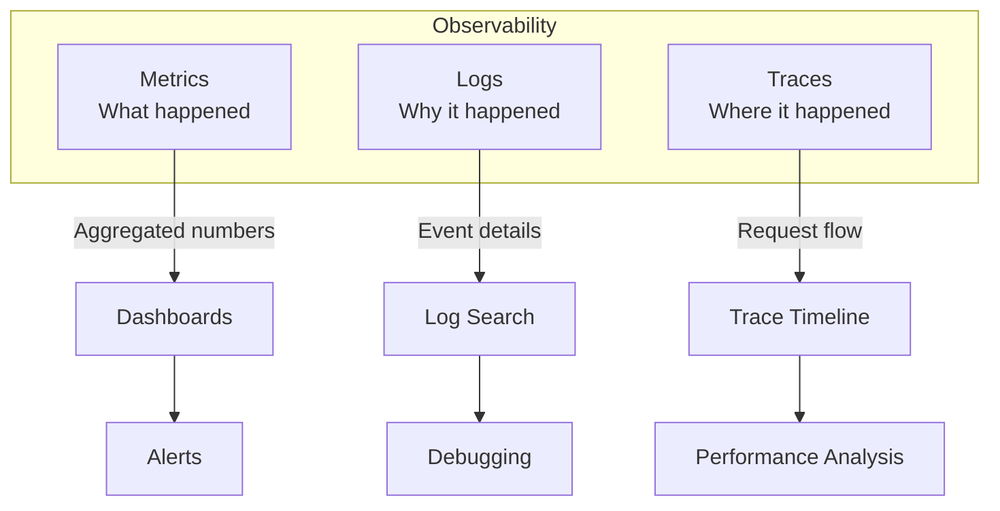

# Observability & Monitoring - See What's Happening in Production

## What You'll Learn

Master **observability** for understanding production systems:
- **Three pillars**: Metrics, logs, traces
- **Monitoring strategies** - What to measure and why
- **Alerting** - When and how to alert
- **Dashboards** - Visualize system health

**Used by**: Datadog, New Relic, Prometheus, Grafana - every production system

**Time**: 30 minutes | **Difficulty**: Intermediate

---

## Why This Matters

### The Blind Production Problem

**Scenario**: User reports "Checkout is slow". You have no metrics.

**Without observability**:
```
User: "Checkout took 30 seconds!"

You: "Let me check..."
- No metrics → Don't know if slow
- No logs → Don't know what happened
- No traces → Don't know where bottleneck is
- SSH to servers → Check CPU manually
- grep logs → Find errors manually
- 2 hours later → Still debugging

Result: Poor user experience, long MTTR
```

**With observability**:
```
Alert: "P95 latency > 10s in checkout"

Dashboard shows:
- API latency: 50ms (normal)
- Database: 50ms (normal)
- Payment service: 25,000ms (PROBLEM!)

Trace shows:
- Payment service → Stripe API timeout

Logs show:
- "Stripe API rate limit exceeded"

Fix: Implement request queuing
Time to resolution: 5 minutes
```

---

## The Problem: Production is a Black Box

```
┌─────────────────────────────────────────────────────────────┐
│              WITHOUT OBSERVABILITY                           │
├─────────────────────────────────────────────────────────────┤
│                                                             │
│  Production System                                          │
│  ┌───────────────────────────────────────────────────────┐  │
│  │                                                        │  │
│  │  API Gateway → Order Service → Payment Service        │  │
│  │                                                        │  │
│  │  Something is slow... but what?                       │  │
│  │  Something crashed... but why?                        │  │
│  │  Memory leak... but where?                            │  │
│  │                                                        │  │
│  └───────────────────────────────────────────────────────┘  │
│                                                             │
│  Debugging approach:                                        │
│  1. SSH to servers                                          │
│  2. tail logs                                               │
│  3. Check CPU/memory manually                               │
│  4. Guess and restart services                              │
│  5. Hope it works                                           │
│                                                             │
│  Result: Slow debugging, high MTTR, guesswork              │
└─────────────────────────────────────────────────────────────┘
```

---

## The Paradigm Shift: Three Pillars of Observability

**Old thinking**: "Monitor CPU and memory"

**New thinking**: "Metrics, logs, and traces together tell the complete story"

### The Three Pillars



---

## The Solution: Complete Observability Stack

### Pillar 1: Metrics (What Happened)

```javascript
// Instrument your code with metrics
const prometheus = require('prom-client');

// Counter: Things that only go up
const requestCounter = new prometheus.Counter({
  name: 'http_requests_total',
  help: 'Total HTTP requests',
  labelNames: ['method', 'path', 'status']
});

// Histogram: Distribution of values
const requestDuration = new prometheus.Histogram({
  name: 'http_request_duration_seconds',
  help: 'HTTP request latency',
  labelNames: ['method', 'path'],
  buckets: [0.1, 0.5, 1, 2, 5, 10] // seconds
});

// Gauge: Values that go up and down
const activeConnections = new prometheus.Gauge({
  name: 'active_connections',
  help: 'Number of active connections'
});

// Middleware: Automatically track metrics
app.use((req, res, next) => {
  const start = Date.now();

  res.on('finish', () => {
    const duration = (Date.now() - start) / 1000;

    requestCounter.inc({
      method: req.method,
      path: req.route?.path || req.path,
      status: res.statusCode
    });

    requestDuration.observe({
      method: req.method,
      path: req.route?.path || req.path
    }, duration);
  });

  next();
});

// Business metrics
const orderCounter = new prometheus.Counter({
  name: 'orders_total',
  help: 'Total orders',
  labelNames: ['status'] // 'success', 'failed', 'pending'
});

const revenueGauge = new prometheus.Gauge({
  name: 'revenue_dollars',
  help: 'Total revenue in dollars'
});

app.post('/orders', async (req, res) => {
  try {
    const order = await createOrder(req.body);

    orderCounter.inc({ status: 'success' });
    revenueGauge.inc(order.total);

    res.json(order);
  } catch (error) {
    orderCounter.inc({ status: 'failed' });
    res.status(500).json({ error: error.message });
  }
});

// Expose metrics endpoint for Prometheus
app.get('/metrics', async (req, res) => {
  res.set('Content-Type', prometheus.register.contentType);
  res.end(await prometheus.register.metrics());
});
```

### Key Metrics to Track

```javascript
// RED Method (for request-driven services)
const metrics = {
  // Rate: Requests per second
  rate: new prometheus.Counter({
    name: 'requests_total',
    labelNames: ['service', 'endpoint']
  }),

  // Errors: Failed requests
  errors: new prometheus.Counter({
    name: 'errors_total',
    labelNames: ['service', 'endpoint', 'error_type']
  }),

  // Duration: Response time distribution
  duration: new prometheus.Histogram({
    name: 'request_duration_seconds',
    labelNames: ['service', 'endpoint'],
    buckets: [0.01, 0.05, 0.1, 0.5, 1, 2, 5]
  })
};

// USE Method (for resources)
const resourceMetrics = {
  // Utilization: % time resource busy
  cpuUtilization: new prometheus.Gauge({
    name: 'cpu_utilization_percent',
    labelNames: ['host']
  }),

  // Saturation: Amount of queued work
  queueDepth: new prometheus.Gauge({
    name: 'queue_depth',
    labelNames: ['queue_name']
  }),

  // Errors: Error count
  diskErrors: new prometheus.Counter({
    name: 'disk_errors_total',
    labelNames: ['host', 'device']
  })
};

// Golden Signals (Google SRE)
const goldenSignals = {
  latency: requestDuration, // Time to serve request
  traffic: requestCounter,  // Demand on system
  errors: errorCounter,     // Rate of failed requests
  saturation: activeConnections // How "full" service is
};
```

### Pillar 2: Logs (Why It Happened)

```javascript
// Structured logging
const winston = require('winston');

const logger = winston.createLogger({
  level: 'info',
  format: winston.format.combine(
    winston.format.timestamp(),
    winston.format.errors({ stack: true }),
    winston.format.json()
  ),
  defaultMeta: { service: 'order-service' },
  transports: [
    new winston.transports.Console(),
    new winston.transports.File({ filename: 'app.log' })
  ]
});

// Contextual logging
app.post('/orders', async (req, res) => {
  const correlationId = req.headers['x-correlation-id'] || uuid();

  logger.info('Order creation started', {
    correlationId,
    userId: req.user.id,
    itemCount: req.body.items.length,
    total: req.body.total
  });

  try {
    const order = await createOrder(req.body);

    logger.info('Order created successfully', {
      correlationId,
      orderId: order.id,
      userId: req.user.id,
      total: order.total,
      duration: Date.now() - startTime
    });

    res.json(order);

  } catch (error) {
    logger.error('Order creation failed', {
      correlationId,
      userId: req.user.id,
      error: error.message,
      stack: error.stack,
      itemCount: req.body.items.length
    });

    res.status(500).json({ error: 'Failed to create order' });
  }
});

// Log levels
logger.error('Critical failure', { orderId });    // Immediate action needed
logger.warn('Payment retry', { attempt: 3 });     // Warning, may need attention
logger.info('Order created', { orderId });        // Normal operations
logger.debug('Inventory checked', { productId }); // Detailed debugging
```

### Pillar 3: Distributed Tracing (Where It Happened)

```javascript
// Already covered in detail in distributed-tracing.md
// Quick example:

const { trace } = require('@opentelemetry/api');

app.post('/orders', async (req, res) => {
  const tracer = trace.getTracer('order-service');
  const span = tracer.startSpan('create-order');

  span.setAttributes({
    'user.id': req.user.id,
    'order.items': req.body.items.length,
    'order.total': req.body.total
  });

  try {
    // Each downstream call gets traced
    const inventory = await checkInventory(req.body.items); // Child span
    const payment = await processPayment(req.body.total);    // Child span
    const shipping = await scheduleShipping(order);          // Child span

    span.setStatus({ code: SpanStatusCode.OK });
    res.json({ success: true });

  } catch (error) {
    span.recordException(error);
    span.setStatus({ code: SpanStatusCode.ERROR });
    res.status(500).json({ error: error.message });
  } finally {
    span.end();
  }
});
```

---

## Dashboards & Visualization

```javascript
// Grafana dashboard JSON (simplified)
const orderServiceDashboard = {
  title: "Order Service",
  panels: [
    {
      title: "Request Rate",
      targets: [{
        expr: 'rate(http_requests_total{service="order-service"}[5m])'
      }]
    },
    {
      title: "P95 Latency",
      targets: [{
        expr: 'histogram_quantile(0.95, rate(http_request_duration_seconds_bucket[5m]))'
      }]
    },
    {
      title: "Error Rate",
      targets: [{
        expr: 'rate(http_requests_total{status=~"5.."}[5m]) / rate(http_requests_total[5m])'
      }]
    },
    {
      title: "Active Orders (Last Hour)",
      targets: [{
        expr: 'sum(orders_total{status="success"}[1h])'
      }]
    }
  ]
};
```

---

## Alerting Rules

```yaml
# Prometheus alerts
groups:
  - name: order-service
    rules:
      # High error rate
      - alert: HighErrorRate
        expr: |
          rate(http_requests_total{status=~"5..", service="order-service"}[5m])
          / rate(http_requests_total{service="order-service"}[5m])
          > 0.05
        for: 5m
        labels:
          severity: critical
        annotations:
          summary: "High error rate in order service"
          description: "Error rate is {{ $value | humanizePercentage }}"

      # High latency
      - alert: HighLatency
        expr: |
          histogram_quantile(0.95,
            rate(http_request_duration_seconds_bucket{service="order-service"}[5m])
          ) > 2
        for: 10m
        labels:
          severity: warning
        annotations:
          summary: "High latency in order service"
          description: "P95 latency is {{ $value }}s"

      # Service down
      - alert: ServiceDown
        expr: up{service="order-service"} == 0
        for: 1m
        labels:
          severity: critical
        annotations:
          summary: "Order service is down"

      # High memory usage
      - alert: HighMemory
        expr: |
          (node_memory_MemTotal_bytes - node_memory_MemAvailable_bytes)
          / node_memory_MemTotal_bytes > 0.9
        for: 5m
        labels:
          severity: warning
        annotations:
          summary: "High memory usage on {{ $labels.instance }}"
```

---

## Complete Example: Fully Instrumented Service

```javascript
// instrumented-service.js
const express = require('express');
const prometheus = require('prom-client');
const winston = require('winston');
const { trace } = require('@opentelemetry/api');

const app = express();

// Metrics
const requestCounter = new prometheus.Counter({
  name: 'requests_total',
  labelNames: ['method', 'path', 'status']
});

const requestDuration = new prometheus.Histogram({
  name: 'request_duration_seconds',
  labelNames: ['method', 'path'],
  buckets: [0.1, 0.5, 1, 2, 5]
});

const orderCounter = new prometheus.Counter({
  name: 'orders_total',
  labelNames: ['status']
});

// Logger
const logger = winston.createLogger({
  format: winston.format.json(),
  defaultMeta: { service: 'order-service' },
  transports: [new winston.transports.Console()]
});

// Middleware: Observability
app.use((req, res, next) => {
  const start = Date.now();
  const correlationId = req.headers['x-correlation-id'] || uuid();

  // Add correlation ID to all logs
  req.log = logger.child({ correlationId });

  // Start trace span
  const tracer = trace.getTracer('order-service');
  const span = tracer.startSpan(`${req.method} ${req.path}`);

  req.log.info('Request started', {
    method: req.method,
    path: req.path,
    userAgent: req.headers['user-agent']
  });

  res.on('finish', () => {
    const duration = (Date.now() - start) / 1000;

    // Record metrics
    requestCounter.inc({
      method: req.method,
      path: req.route?.path || req.path,
      status: res.statusCode
    });

    requestDuration.observe({
      method: req.method,
      path: req.route?.path || req.path
    }, duration);

    // Log completion
    req.log.info('Request completed', {
      status: res.statusCode,
      duration
    });

    // End span
    span.setAttributes({
      'http.status_code': res.statusCode,
      'http.method': req.method,
      'http.path': req.path
    });
    span.end();
  });

  next();
});

// Route
app.post('/orders', async (req, res) => {
  try {
    req.log.info('Creating order', {
      userId: req.body.userId,
      items: req.body.items.length
    });

    const order = await createOrder(req.body);

    orderCounter.inc({ status: 'success' });

    req.log.info('Order created', {
      orderId: order.id,
      total: order.total
    });

    res.json(order);

  } catch (error) {
    orderCounter.inc({ status: 'failed' });

    req.log.error('Order creation failed', {
      error: error.message,
      stack: error.stack
    });

    res.status(500).json({ error: 'Failed to create order' });
  }
});

// Metrics endpoint
app.get('/metrics', async (req, res) => {
  res.set('Content-Type', prometheus.register.contentType);
  res.end(await prometheus.register.metrics());
});

// Health endpoint
app.get('/health', (req, res) => {
  res.json({
    status: 'healthy',
    timestamp: new Date().toISOString(),
    uptime: process.uptime()
  });
});

app.listen(3000);
```

---

## Real-World Validation

### Who Uses What?

| Company | Solution | Scale |
|---------|----------|-------|
| **Netflix** | Atlas (custom) | Billions of metrics/day |
| **Uber** | M3 + Jaeger | 100B+ metrics/day |
| **Shopify** | Prometheus + Grafana | Millions of metrics |
| **Datadog** | Datadog (own product) | Trillions of events |

---

## Interview Tips

### Common Questions

**Q: What metrics should you monitor for a web service?**

**Answer:**
1. **RED metrics**: Rate, Errors, Duration
2. **Resource metrics**: CPU, memory, disk
3. **Business metrics**: Orders/sec, revenue
4. **Saturation**: Queue depth, connection pool
5. **Dependencies**: External API latency

---

**Q: How do you debug slow requests in production?**

**Answer:**
1. **Check metrics**: Which service slow?
2. **Find trace**: Full request path
3. **Check logs**: Error messages, context
4. **Identify bottleneck**: Database? External API?
5. **Fix and verify**: Monitor metrics improve

---

**Q: When should you alert?**

**Answer:**
1. **Alert on symptoms**, not causes
   - ✓ P95 latency > 2s (symptom)
   - ❌ CPU > 80% (cause)
2. **Alert on impact to users**
3. **Require human action**
4. **Avoid alert fatigue**

### Red Flags to Avoid

- ❌ **No metrics** (flying blind)
- ❌ **Alerting on everything** (alert fatigue)
- ❌ **No correlation IDs** (can't trace requests)
- ❌ **Logging sensitive data** (PII, passwords)
- ❌ **No dashboards** (can't visualize)

---

## Key Takeaways

**What you learned**:
1. Three pillars: Metrics, logs, traces
2. RED method for services (rate, errors, duration)
3. Structured logging with correlation IDs
4. Alert on symptoms, not causes
5. Dashboards show system health

**What you can do Monday**:
1. Add Prometheus metrics to your services
2. Implement structured logging (JSON)
3. Add correlation IDs to all requests
4. Create Grafana dashboard for key metrics
5. Set up alerts for P95 latency and error rate

---

## Related Articles

- [Distributed Tracing](/interview-prep/system-design/distributed-tracing) - Trace pillar
- [Logging Best Practices](/interview-prep/system-design/logging-best-practices) - Log details
- [SRE Principles](/interview-prep/system-design/sre-principles) - Google SRE

---

**Production Examples**:
- **Netflix**: Atlas handles billions of metrics/day
- **Uber**: M3 + Jaeger for complete observability
- **Google**: Invented distributed tracing (Dapper)

**Remember**: Observability isn't optional - it's the difference between debugging for hours and resolving issues in minutes. Instrument everything from day one!
