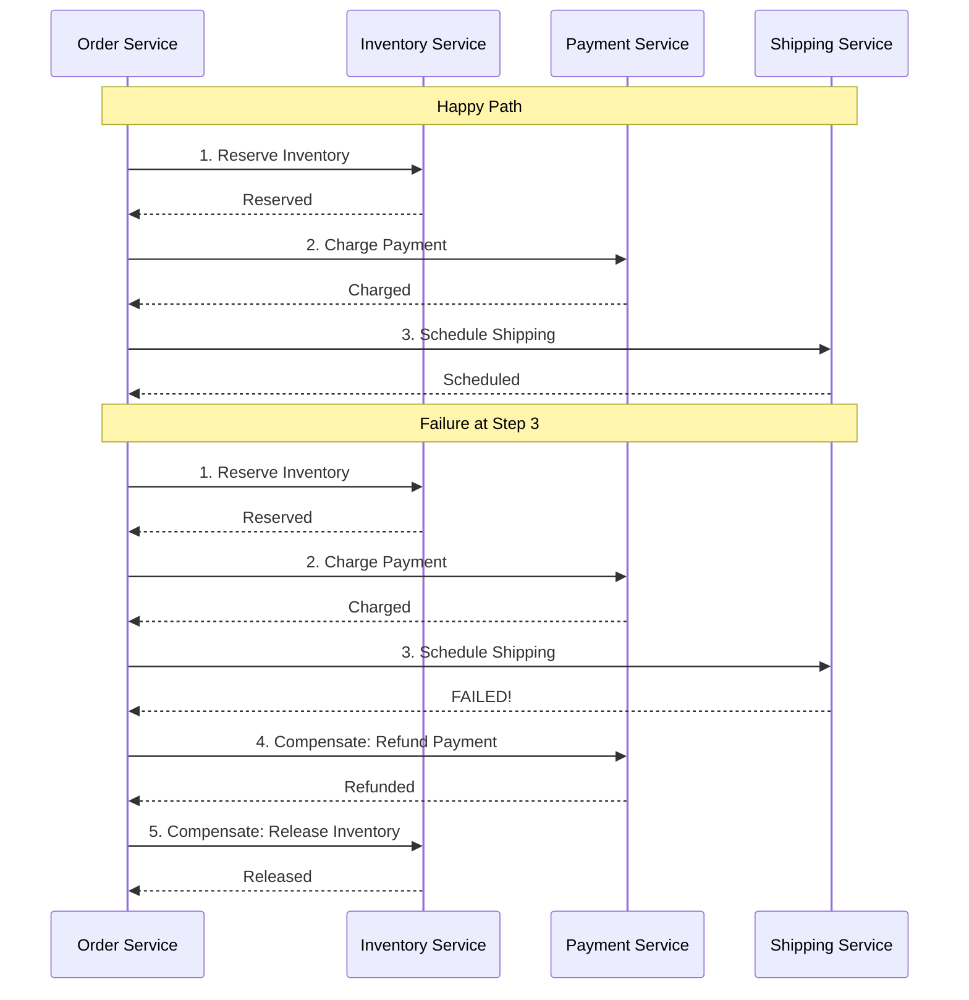
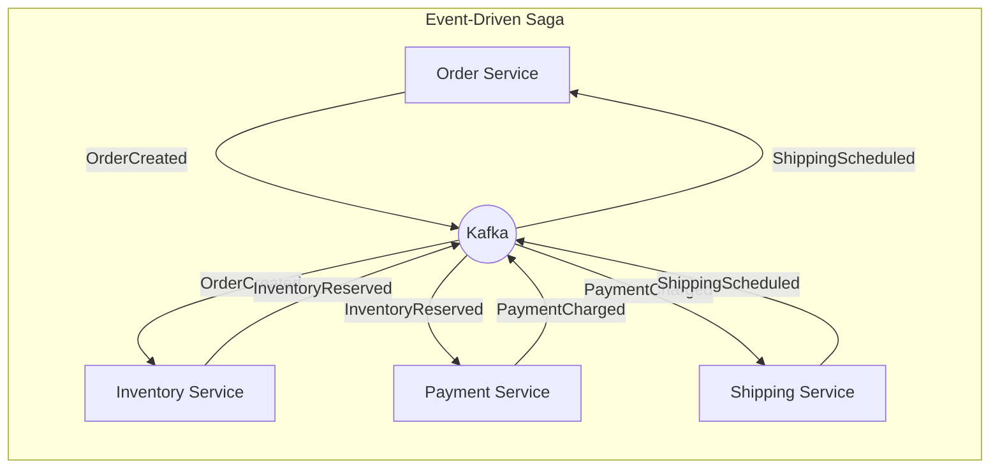
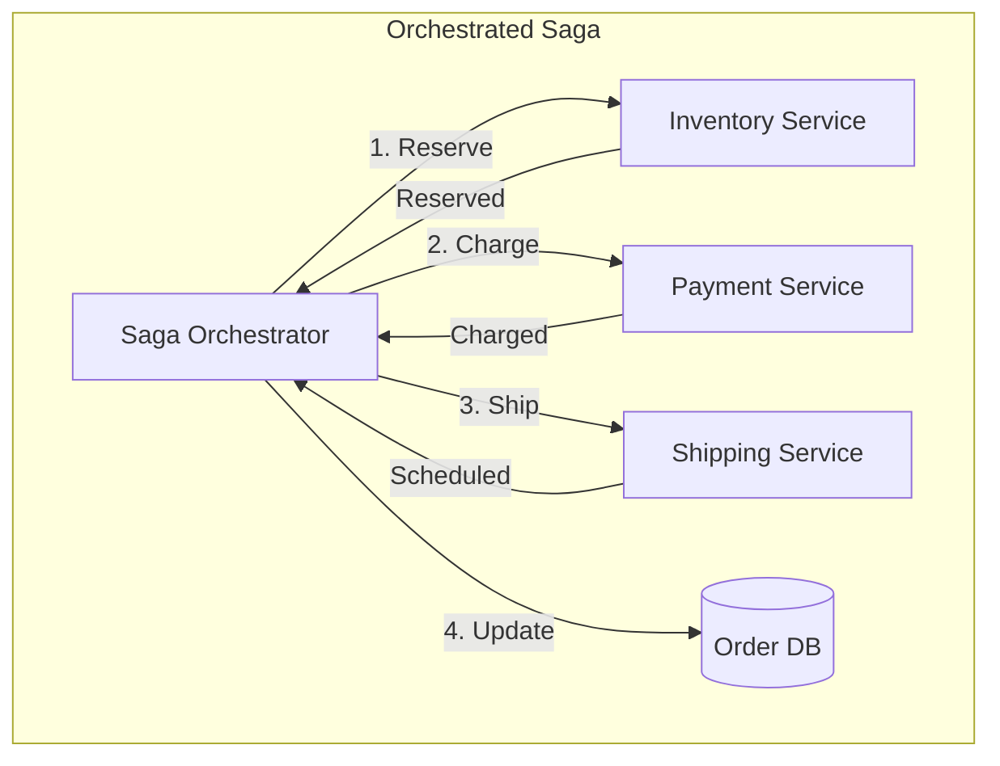

# Saga Pattern - Distributed Transactions at Scale

## What You'll Learn

Master the **Saga pattern** for managing distributed transactions across microservices:
- **Choreography vs Orchestration** - Two approaches to saga coordination
- **Compensating transactions** - Rolling back distributed operations
- **Failure handling** - What happens when step 3 of 5 fails?
- **Implementation** - Build production-grade sagas

**Used by**: Uber, Amazon, Airbnb, Netflix - anyone with microservices

**Time**: 35 minutes | **Difficulty**: Advanced

---

## Why This Matters

### The Impossible Problem

**Scenario**: User places an order in your e-commerce system. You need to:
1. Reserve inventory (Inventory Service)
2. Charge payment (Payment Service)
3. Create order record (Order Service)
4. Schedule shipping (Shipping Service)
5. Send confirmation (Notification Service)

**The problem**: Each service has its own database. No shared transactions.

```
Traditional Monolith:
BEGIN TRANSACTION;
  UPDATE inventory SET stock = stock - 1;
  INSERT INTO payments (...);
  INSERT INTO orders (...);
  INSERT INTO shipments (...);
COMMIT;
-- All or nothing - ACID guaranteed

Microservices:
Service A: UPDATE inventory... (committed)
Service B: INSERT payment... (committed)
Service C: INSERT order... (FAILS!)
-- What now? A and B are already committed!
-- Can't rollback - different databases!
```

**Without Saga**:
- Inventory reserved but order never created
- Payment charged but no order
- Data inconsistent across services
- Customer charged, no product
- Support tickets, refund chaos

---

## The Problem: No Distributed ACID

### Why 2PC Doesn't Work

Two-Phase Commit (2PC) seems like the answer but:

```
┌─────────────────────────────────────────────────────────────┐
│              2PC Problems at Scale                          │
├─────────────────────────────────────────────────────────────┤
│                                                             │
│  Coordinator                                                │
│      │                                                      │
│      ├── Prepare? ──▶ Service A (Locks row)                │
│      ├── Prepare? ──▶ Service B (Locks row)                │
│      ├── Prepare? ──▶ Service C (Locks row)                │
│      │                                                      │
│      │   All locked... waiting for coordinator              │
│      │                                                      │
│      │   ⚠️ Coordinator crashes!                            │
│      │                                                      │
│      └── All services: Locked forever!                      │
│                                                             │
│  Problems:                                                  │
│  1. Blocking: Resources locked during vote                 │
│  2. Single point of failure: Coordinator crash = deadlock  │
│  3. Latency: Network round-trips for every transaction     │
│  4. Not cloud-native: Doesn't work across services/DBs     │
└─────────────────────────────────────────────────────────────┘
```

---

## The Paradigm Shift: Eventual Consistency

**Old thinking**: "All operations must commit together (ACID)"

**New thinking**: "Operations commit separately, compensate on failure (BASE)"

### Saga: A Sequence of Local Transactions



Each step has a **compensating transaction** to undo its effects.

---

## The Solution: Two Saga Patterns

### Pattern 1: Choreography (Event-Driven)



**Implementation**:

```javascript
// order-service/src/handlers/createOrder.js
async function createOrder(orderData) {
  // Step 1: Create order in PENDING state
  const order = await db.query(`
    INSERT INTO orders (user_id, items, total, status)
    VALUES ($1, $2, $3, 'PENDING')
    RETURNING id
  `, [orderData.userId, orderData.items, orderData.total]);

  // Step 2: Publish event to start saga
  await kafka.send({
    topic: 'order-events',
    messages: [{
      key: String(order.id),
      value: JSON.stringify({
        type: 'ORDER_CREATED',
        orderId: order.id,
        userId: orderData.userId,
        items: orderData.items,
        total: orderData.total,
        timestamp: new Date().toISOString()
      })
    }]
  });

  return { orderId: order.id, status: 'PENDING' };
}

// inventory-service/src/handlers/reserveInventory.js
kafka.subscribe('order-events', async (message) => {
  const event = JSON.parse(message.value);

  if (event.type === 'ORDER_CREATED') {
    try {
      // Reserve inventory
      for (const item of event.items) {
        const result = await db.query(`
          UPDATE products
          SET reserved_stock = reserved_stock + $1
          WHERE id = $2 AND available_stock >= $1
          RETURNING id
        `, [item.quantity, item.productId]);

        if (result.rowCount === 0) {
          throw new Error(`Insufficient stock for product ${item.productId}`);
        }
      }

      // Success: Publish InventoryReserved
      await kafka.send({
        topic: 'inventory-events',
        messages: [{
          key: String(event.orderId),
          value: JSON.stringify({
            type: 'INVENTORY_RESERVED',
            orderId: event.orderId,
            items: event.items
          })
        }]
      });

    } catch (error) {
      // Failure: Publish InventoryReservationFailed
      await kafka.send({
        topic: 'inventory-events',
        messages: [{
          key: String(event.orderId),
          value: JSON.stringify({
            type: 'INVENTORY_RESERVATION_FAILED',
            orderId: event.orderId,
            reason: error.message
          })
        }]
      });
    }
  }
});

// payment-service/src/handlers/chargePayment.js
kafka.subscribe('inventory-events', async (message) => {
  const event = JSON.parse(message.value);

  if (event.type === 'INVENTORY_RESERVED') {
    try {
      const order = await getOrderDetails(event.orderId);

      // Charge payment
      const payment = await stripeClient.charges.create({
        amount: order.total * 100,
        currency: 'usd',
        customer: order.userId,
        metadata: { orderId: event.orderId }
      });

      // Success: Publish PaymentCharged
      await kafka.send({
        topic: 'payment-events',
        messages: [{
          key: String(event.orderId),
          value: JSON.stringify({
            type: 'PAYMENT_CHARGED',
            orderId: event.orderId,
            paymentId: payment.id,
            amount: order.total
          })
        }]
      });

    } catch (error) {
      // Failure: Trigger compensation
      await kafka.send({
        topic: 'payment-events',
        messages: [{
          key: String(event.orderId),
          value: JSON.stringify({
            type: 'PAYMENT_FAILED',
            orderId: event.orderId,
            reason: error.message
          })
        }]
      });
    }
  }

  // Handle compensation request
  if (event.type === 'SHIPPING_FAILED') {
    // Refund payment
    const payment = await getPaymentByOrderId(event.orderId);
    await stripeClient.refunds.create({ charge: payment.id });

    await kafka.send({
      topic: 'payment-events',
      messages: [{
        key: String(event.orderId),
        value: JSON.stringify({
          type: 'PAYMENT_REFUNDED',
          orderId: event.orderId
        })
      }]
    });
  }
});

// order-service/src/handlers/updateOrderStatus.js
kafka.subscribe(['inventory-events', 'payment-events', 'shipping-events'], async (message) => {
  const event = JSON.parse(message.value);

  switch (event.type) {
    case 'SHIPPING_SCHEDULED':
      await db.query('UPDATE orders SET status = $1 WHERE id = $2', ['CONFIRMED', event.orderId]);
      break;

    case 'INVENTORY_RESERVATION_FAILED':
    case 'PAYMENT_FAILED':
    case 'SHIPPING_FAILED':
      await db.query('UPDATE orders SET status = $1, failure_reason = $2 WHERE id = $3',
        ['FAILED', event.reason, event.orderId]);
      break;

    case 'PAYMENT_REFUNDED':
      await db.query('UPDATE orders SET status = $1 WHERE id = $2', ['CANCELLED', event.orderId]);
      break;
  }
});
```

### Pattern 2: Orchestration (Central Coordinator)



**Implementation**:

```javascript
// saga-orchestrator/src/OrderSaga.js
class OrderSaga {
  constructor(orderId, steps) {
    this.orderId = orderId;
    this.steps = steps;
    this.completedSteps = [];
    this.state = 'STARTED';
  }

  async execute() {
    for (let i = 0; i < this.steps.length; i++) {
      const step = this.steps[i];

      try {
        console.log(`Executing step ${i + 1}: ${step.name}`);
        const result = await step.action(this.orderId);
        this.completedSteps.push({ step, result });
        await this.saveState();

      } catch (error) {
        console.log(`Step ${i + 1} failed: ${error.message}`);
        this.state = 'COMPENSATING';
        await this.compensate();
        this.state = 'FAILED';
        await this.saveState();
        throw new SagaFailedError(error.message, this.completedSteps);
      }
    }

    this.state = 'COMPLETED';
    await this.saveState();
    return { success: true, orderId: this.orderId };
  }

  async compensate() {
    // Compensate in reverse order
    for (let i = this.completedSteps.length - 1; i >= 0; i--) {
      const { step, result } = this.completedSteps[i];

      if (step.compensate) {
        try {
          console.log(`Compensating step: ${step.name}`);
          await step.compensate(this.orderId, result);
        } catch (error) {
          // Log but continue compensating other steps
          console.error(`Compensation failed for ${step.name}: ${error.message}`);
          await this.alertOperations(step, error);
        }
      }
    }
  }

  async saveState() {
    await db.query(`
      INSERT INTO saga_state (saga_id, order_id, state, completed_steps, updated_at)
      VALUES ($1, $2, $3, $4, NOW())
      ON CONFLICT (saga_id) DO UPDATE
      SET state = $3, completed_steps = $4, updated_at = NOW()
    `, [this.sagaId, this.orderId, this.state, JSON.stringify(this.completedSteps)]);
  }

  async alertOperations(step, error) {
    await notificationService.alert({
      type: 'SAGA_COMPENSATION_FAILED',
      orderId: this.orderId,
      step: step.name,
      error: error.message,
      severity: 'HIGH'
    });
  }
}

// Define saga steps
const orderSagaSteps = [
  {
    name: 'RESERVE_INVENTORY',
    action: async (orderId) => {
      const response = await inventoryService.reserve(orderId);
      return { reservationId: response.reservationId };
    },
    compensate: async (orderId, result) => {
      await inventoryService.release(result.reservationId);
    }
  },
  {
    name: 'CHARGE_PAYMENT',
    action: async (orderId) => {
      const response = await paymentService.charge(orderId);
      return { paymentId: response.paymentId };
    },
    compensate: async (orderId, result) => {
      await paymentService.refund(result.paymentId);
    }
  },
  {
    name: 'SCHEDULE_SHIPPING',
    action: async (orderId) => {
      const response = await shippingService.schedule(orderId);
      return { shipmentId: response.shipmentId };
    },
    compensate: async (orderId, result) => {
      await shippingService.cancel(result.shipmentId);
    }
  },
  {
    name: 'SEND_CONFIRMATION',
    action: async (orderId) => {
      await notificationService.sendOrderConfirmation(orderId);
      return { sent: true };
    }
    // No compensate - can't unsend email, idempotent
  }
];

// Execute saga
async function placeOrder(orderData) {
  const order = await createPendingOrder(orderData);
  const saga = new OrderSaga(order.id, orderSagaSteps);

  try {
    await saga.execute();
    return { success: true, orderId: order.id };
  } catch (error) {
    return { success: false, orderId: order.id, error: error.message };
  }
}
```

### Comparison: Choreography vs Orchestration

| Aspect | Choreography | Orchestration |
|--------|--------------|---------------|
| **Coupling** | Loose (event-driven) | Tighter (central coordinator) |
| **Complexity** | Distributed across services | Centralized in orchestrator |
| **Visibility** | Hard to track flow | Easy to monitor saga state |
| **Single point of failure** | None | Orchestrator |
| **Testing** | Integration tests complex | Unit test orchestrator |
| **Best for** | Simple flows | Complex flows with conditions |

---

## Advanced Patterns

### Idempotency

```javascript
// Every saga step must be idempotent
class IdempotentSagaStep {
  async execute(orderId) {
    // Check if already processed
    const existing = await db.query(`
      SELECT * FROM saga_step_results
      WHERE order_id = $1 AND step_name = $2
    `, [orderId, this.name]);

    if (existing.rowCount > 0) {
      console.log(`Step ${this.name} already executed for order ${orderId}`);
      return existing.rows[0].result;
    }

    // Execute step
    const result = await this.action(orderId);

    // Record execution
    await db.query(`
      INSERT INTO saga_step_results (order_id, step_name, result, executed_at)
      VALUES ($1, $2, $3, NOW())
    `, [orderId, this.name, JSON.stringify(result)]);

    return result;
  }
}
```

### Saga Recovery

```javascript
// Recover sagas after system restart
async function recoverPendingSagas() {
  const pendingSagas = await db.query(`
    SELECT * FROM saga_state
    WHERE state IN ('STARTED', 'COMPENSATING')
    AND updated_at < NOW() - INTERVAL '5 minutes'
  `);

  for (const sagaState of pendingSagas.rows) {
    const saga = await reconstructSaga(sagaState);

    if (sagaState.state === 'STARTED') {
      // Resume from last completed step
      await saga.resumeFromStep(sagaState.completed_steps.length);
    } else if (sagaState.state === 'COMPENSATING') {
      // Continue compensation
      await saga.compensate();
    }
  }
}

// Run on startup
recoverPendingSagas();

// Periodic check for stuck sagas
setInterval(recoverPendingSagas, 60000);
```

---

## Real-World Validation

### Who Uses This?

| Company | Implementation | Use Case |
|---------|----------------|----------|
| **Uber** | Cadence/Temporal | Trip lifecycle |
| **Amazon** | Step Functions | Order processing |
| **Airbnb** | Custom orchestrator | Booking flow |
| **Netflix** | Conductor | Media processing |

### Uber's Saga Implementation

```
Uber Trip Saga:
1. Request ride → Create trip record
2. Match driver → Assign driver to trip
3. Driver accepts → Update trip status
4. Pickup → Start trip
5. Dropoff → End trip, calculate fare
6. Charge payment → Process payment
7. Pay driver → Transfer earnings

Compensation:
- If payment fails after trip: Queue for retry
- If driver cancels: Find new driver
- If passenger cancels: Charge cancellation fee

Scale: 17M trips/day, each is a saga
```

---

## Interview Tips

### Common Questions

**Q: When would you use Saga vs 2PC?**

**Answer:**
1. **Use Saga** when:
   - Services have separate databases
   - Long-running transactions (minutes/hours)
   - Cloud-native microservices
   - Eventual consistency is acceptable
2. **Use 2PC** when:
   - Same database (distributed DB like Spanner)
   - Strict consistency required
   - Short transactions (milliseconds)

---

**Q: How do you handle compensation failure?**

**Answer:**
1. **Retry** with exponential backoff
2. **Dead letter queue** for manual intervention
3. **Alert operations** for human resolution
4. **Reconciliation job** to fix inconsistencies
5. **Design for idempotency** so retry is safe

---

**Q: Choreography vs Orchestration - how to choose?**

**Answer:**
1. **Choreography** for:
   - Simple, linear flows (3-4 steps)
   - Teams own their event handlers
   - High decoupling needed
2. **Orchestration** for:
   - Complex flows with conditionals
   - Need visibility into saga state
   - Central team manages workflows

### Red Flags to Avoid

- ❌ **Non-idempotent steps** (duplicate messages cause corruption)
- ❌ **No compensation defined** (can't rollback on failure)
- ❌ **Ignoring partial failures** (data inconsistency)
- ❌ **Tight timeouts** (saga needs time to compensate)
- ❌ **No saga state persistence** (can't recover after crash)
- ❌ **Synchronous compensation** (slow, blocking)

---

## Key Takeaways

**What you learned**:
1. Sagas enable distributed transactions without 2PC
2. Each step needs a compensating transaction
3. Choreography = events, Orchestration = central coordinator
4. Idempotency is critical for reliability
5. Saga state must be persisted for recovery

**What you can do Monday**:
1. Identify multi-service operations in your system
2. Define compensating transactions for each step
3. Implement idempotency keys for all operations
4. Add saga state tracking for visibility
5. Start simple (choreography), add orchestrator if needed

---

## Related Articles

- [Circuit Breaker Pattern](/interview-prep/system-design/circuit-breaker-pattern) - Resilience
- [Event Sourcing](/interview-prep/system-design/event-sourcing-cqrs) - Event-driven architecture
- [Message Queues](/interview-prep/system-design/message-queues-kafka-rabbitmq) - Async communication

---

**Production Examples**:
- **Uber**: Cadence handles 17M trip sagas daily
- **Amazon**: Step Functions for order processing
- **Airbnb**: Custom saga for booking flow

**Remember**: Sagas trade ACID for availability. You lose "all or nothing" but gain the ability to build resilient distributed systems. Design for eventual consistency, and always define your compensation strategy!
