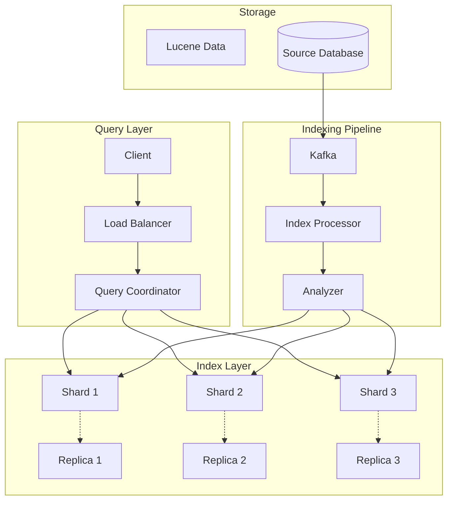
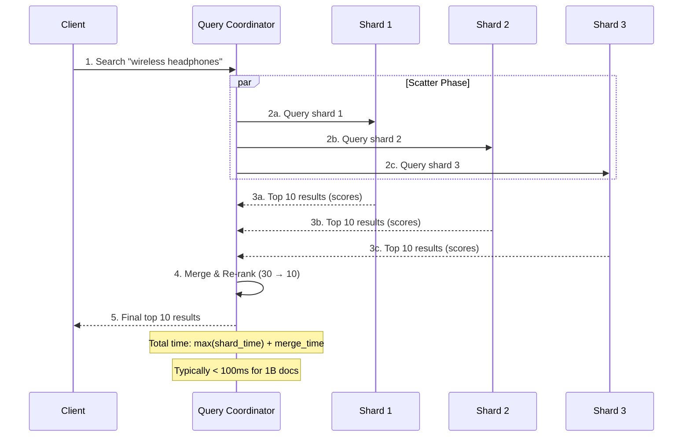

# Search Engine Architecture - Build Google-Scale Search with Elasticsearch

## What You'll Learn

Design a **production-grade search engine** that handles billions of queries:
- **Inverted indexes** - The fundamental data structure behind search
- **Sharding & replication** - Horizontal scaling for 3B+ queries/day
- **Relevance scoring** - TF-IDF, BM25, and modern ranking algorithms
- **Real-time indexing** - Sub-second document updates at scale

**Used by**: Google (3.5B searches/day), Elasticsearch (100K+ companies), Amazon (1B products), GitHub (200M repos)

**Time**: 40 minutes | **Difficulty**: Expert

---

## Why This Matters

### The Search Problem

**Scenario**: You have 100 million products in your database. A user searches for "wireless bluetooth headphones noise cancelling".

**The naive approach**:
```sql
SELECT * FROM products
WHERE name ILIKE '%wireless%'
  AND name ILIKE '%bluetooth%'
  AND name ILIKE '%headphones%'
  AND name ILIKE '%noise%'
  AND name ILIKE '%cancelling%'
ORDER BY popularity DESC
LIMIT 20;
```

**What happens at scale**:
```
Query Analysis:
- 5 ILIKE conditions with wildcards
- Full table scan: 100M rows
- String matching: O(n * m) per row
- Total: O(100M × 5 × avg_string_length)

Execution:
- Time: 45 seconds
- CPU: 100%
- Memory: 8GB (loading rows)
- Result: Timeout

User Experience:
- Search takes 45 seconds
- User leaves after 3 seconds
- Lost sale: $150 (average order)
```

**At Google scale**:
- 3.5 billion searches per day
- 40,000 searches per second
- Each query across 60+ trillion pages
- Response time requirement: <200ms

**How do they do it?**

---

## The Problem: Linear Search Doesn't Scale

### Why SQL LIKE Fails

```javascript
// What LIKE does internally
function searchWithLike(query, documents) {
  const results = [];

  for (const doc of documents) {  // O(n) - every document
    const words = query.split(' ');

    let matches = true;
    for (const word of words) {  // O(m) - every word
      if (!doc.text.toLowerCase().includes(word.toLowerCase())) {  // O(p) - string scan
        matches = false;
        break;
      }
    }

    if (matches) {
      results.push(doc);
    }
  }

  return results;
}

// Complexity: O(n × m × p)
// 100M docs × 5 words × 1000 chars = 500 billion operations
```

**The fundamental problem**: Scanning every document for every query.

### What We Need

1. **Instant lookup**: O(1) or O(log n) per word
2. **Pre-computed matches**: Know which docs contain "wireless" before query
3. **Ranked results**: Return most relevant first
4. **Distributed processing**: Spread across many servers

---

## The Paradigm Shift: Inverted Index

**Old thinking**: "Search documents for words" (forward search)

**New thinking**: "Index words to documents" (inverted index)

### The Mental Model

```
FORWARD INDEX (Traditional Database):
┌─────────┬────────────────────────────────────┐
│ Doc ID  │ Content                            │
├─────────┼────────────────────────────────────┤
│ 1       │ "wireless bluetooth headphones"   │
│ 2       │ "wired headphones cheap"          │
│ 3       │ "wireless earbuds bluetooth"      │
│ 4       │ "noise cancelling headphones"     │
└─────────┴────────────────────────────────────┘

Finding "wireless": Scan ALL 4 documents ❌

INVERTED INDEX (Search Engine):
┌─────────────┬────────────────┐
│ Term        │ Doc IDs        │
├─────────────┼────────────────┤
│ wireless    │ [1, 3]         │
│ bluetooth   │ [1, 3]         │
│ headphones  │ [1, 2, 4]      │
│ wired       │ [2]            │
│ earbuds     │ [3]            │
│ noise       │ [4]            │
│ cancelling  │ [4]            │
└─────────────┴────────────────┘

Finding "wireless": Direct lookup → [1, 3] ✅
```

**Why this changes everything**:
- **Forward index**: O(n) per search
- **Inverted index**: O(1) per term lookup
- 100M documents → instant word lookup

---

## The Solution: Complete Search Architecture

### High-Level Architecture



### Component Responsibilities

| Component | Purpose | Scale |
|-----------|---------|-------|
| **Query Coordinator** | Parse query, scatter to shards, gather results | 50K queries/sec |
| **Shards** | Store inverted index partitions | 100M docs/shard |
| **Replicas** | Read scaling, fault tolerance | 3x per shard |
| **Analyzer** | Tokenize, stem, filter text | 100K docs/sec |
| **Kafka** | Real-time indexing pipeline | 1M events/sec |
| **Lucene** | Core index storage (Elasticsearch uses this) | Optimized segments |

### Implementation: Step-by-Step

#### Step 1: Building the Inverted Index

```javascript
class InvertedIndex {
  constructor() {
    this.index = new Map();      // term → posting list
    this.documents = new Map();   // docId → document
    this.docCount = 0;
  }

  // Add document to index
  addDocument(docId, text) {
    const tokens = this.analyze(text);

    this.documents.set(docId, { text, tokens });
    this.docCount++;

    // Update inverted index
    const termFrequencies = new Map();

    for (const token of tokens) {
      termFrequencies.set(token, (termFrequencies.get(token) || 0) + 1);
    }

    for (const [term, freq] of termFrequencies) {
      if (!this.index.has(term)) {
        this.index.set(term, new Map());
      }

      // Posting: docId → { freq, positions }
      this.index.get(term).set(docId, {
        frequency: freq,
        positions: this.getPositions(tokens, term)
      });
    }
  }

  // Text analysis pipeline
  analyze(text) {
    return text
      .toLowerCase()                           // Case normalization
      .replace(/[^\w\s]/g, '')                 // Remove punctuation
      .split(/\s+/)                            // Tokenize
      .filter(token => token.length > 2)       // Min length
      .filter(token => !STOP_WORDS.has(token)) // Remove stop words
      .map(token => this.stem(token));         // Stemming
  }

  // Porter stemmer (simplified)
  stem(word) {
    // "running" → "run", "headphones" → "headphon"
    return word
      .replace(/ing$/, '')
      .replace(/ed$/, '')
      .replace(/es$/, '')
      .replace(/s$/, '');
  }

  getPositions(tokens, term) {
    const positions = [];
    tokens.forEach((t, i) => {
      if (t === term) positions.push(i);
    });
    return positions;
  }
}

const STOP_WORDS = new Set([
  'the', 'a', 'an', 'and', 'or', 'but', 'in', 'on', 'at', 'to', 'for',
  'of', 'with', 'by', 'from', 'is', 'are', 'was', 'were', 'be', 'been'
]);
```

**Why this works**:
- **Tokenization**: Splits text into searchable units
- **Normalization**: "Headphones" = "headphones"
- **Stop words**: Skip common words (the, a, is)
- **Stemming**: "running" matches "run"

#### Step 2: Boolean Search

```javascript
search(query) {
  const queryTerms = this.analyze(query);
  let resultDocs = null;

  for (const term of queryTerms) {
    const postings = this.index.get(term);

    if (!postings) {
      // Term not found - AND fails
      return [];
    }

    const docIds = new Set(postings.keys());

    if (resultDocs === null) {
      resultDocs = docIds;
    } else {
      // AND: Intersect document sets
      resultDocs = new Set([...resultDocs].filter(id => docIds.has(id)));
    }
  }

  return Array.from(resultDocs || []);
}
```

**Example**:
```
Query: "wireless headphones"

Step 1: "wireless" → [1, 3]
Step 2: "headphones" → [1, 2, 4]
Step 3: Intersect → [1]

Result: Document 1 matches both terms
```

#### Step 3: Relevance Scoring (BM25)

```javascript
// BM25 - Best Matching 25 (industry standard)
class BM25Scorer {
  constructor(index, k1 = 1.2, b = 0.75) {
    this.index = index;
    this.k1 = k1;  // Term frequency saturation
    this.b = b;    // Length normalization
    this.avgDocLength = this.calculateAvgDocLength();
  }

  calculateAvgDocLength() {
    let totalLength = 0;
    for (const doc of this.index.documents.values()) {
      totalLength += doc.tokens.length;
    }
    return totalLength / this.index.docCount;
  }

  // Inverse Document Frequency
  idf(term) {
    const N = this.index.docCount;
    const df = this.index.index.get(term)?.size || 0;

    // IDF formula: log((N - df + 0.5) / (df + 0.5))
    return Math.log((N - df + 0.5) / (df + 0.5) + 1);
  }

  // Score a document for a query
  score(docId, queryTerms) {
    const doc = this.index.documents.get(docId);
    const docLength = doc.tokens.length;
    let score = 0;

    for (const term of queryTerms) {
      const postings = this.index.index.get(term);
      if (!postings || !postings.has(docId)) continue;

      const tf = postings.get(docId).frequency;
      const idf = this.idf(term);

      // BM25 formula
      const numerator = tf * (this.k1 + 1);
      const denominator = tf + this.k1 * (1 - this.b + this.b * (docLength / this.avgDocLength));

      score += idf * (numerator / denominator);
    }

    return score;
  }

  // Search and rank results
  search(query, limit = 10) {
    const queryTerms = this.index.analyze(query);
    const candidateDocs = this.index.search(query);

    // Score all candidates
    const scored = candidateDocs.map(docId => ({
      docId,
      score: this.score(docId, queryTerms),
      document: this.index.documents.get(docId)
    }));

    // Sort by score descending
    return scored
      .sort((a, b) => b.score - a.score)
      .slice(0, limit);
  }
}
```

**Why BM25 works**:
- **TF saturation**: Diminishing returns for repeated terms
- **IDF**: Rare terms weighted higher
- **Length normalization**: Don't favor long documents
- **Industry standard**: Used by Elasticsearch, Lucene, Solr

#### Step 4: Distributed Search (Elasticsearch-style)

```javascript
class DistributedSearch {
  constructor(numShards = 3, replicationFactor = 2) {
    this.numShards = numShards;
    this.shards = [];
    this.replicas = [];

    // Initialize shards
    for (let i = 0; i < numShards; i++) {
      this.shards.push(new InvertedIndex());
      this.replicas.push([]);

      for (let r = 0; r < replicationFactor; r++) {
        this.replicas[i].push(new InvertedIndex());
      }
    }
  }

  // Determine shard for document (consistent hashing)
  getShardId(docId) {
    const hash = this.hashCode(docId);
    return Math.abs(hash) % this.numShards;
  }

  hashCode(str) {
    let hash = 0;
    for (let i = 0; i < str.length; i++) {
      hash = (hash << 5) - hash + str.charCodeAt(i);
      hash |= 0;
    }
    return hash;
  }

  // Index document to appropriate shard
  async indexDocument(docId, text) {
    const shardId = this.getShardId(docId);

    // Write to primary shard
    this.shards[shardId].addDocument(docId, text);

    // Replicate to replicas (async)
    for (const replica of this.replicas[shardId]) {
      replica.addDocument(docId, text);
    }

    return { shardId, indexed: true };
  }

  // Distributed search: scatter-gather pattern
  async search(query, limit = 10) {
    const queryTerms = this.shards[0].analyze(query);

    // SCATTER: Query all shards in parallel
    const shardResults = await Promise.all(
      this.shards.map(async (shard, shardId) => {
        const scorer = new BM25Scorer(shard);
        const results = scorer.search(query, limit);

        return results.map(r => ({
          ...r,
          shardId
        }));
      })
    );

    // GATHER: Merge and re-rank
    const allResults = shardResults.flat();

    // Global ranking
    return allResults
      .sort((a, b) => b.score - a.score)
      .slice(0, limit);
  }

  // Search with read from replicas (load balancing)
  async searchWithLoadBalancing(query, limit = 10) {
    const shardResults = await Promise.all(
      this.shards.map(async (shard, shardId) => {
        // Choose random replica or primary
        const sources = [shard, ...this.replicas[shardId]];
        const selectedIndex = Math.floor(Math.random() * sources.length);
        const selectedShard = sources[selectedIndex];

        const scorer = new BM25Scorer(selectedShard);
        return scorer.search(query, limit);
      })
    );

    return shardResults.flat()
      .sort((a, b) => b.score - a.score)
      .slice(0, limit);
  }
}
```

**Why distributed search works**:
- **Sharding**: Spread index across multiple machines
- **Parallel query**: Each shard searched simultaneously
- **Scatter-gather**: Coordinator merges results
- **Replicas**: Handle read load, fault tolerance

### Complete Search Flow



#### Step 5: Real-Time Indexing Pipeline

```javascript
// Using Kafka for real-time updates
class SearchIndexPipeline {
  constructor(searchCluster, kafkaConsumer) {
    this.searchCluster = searchCluster;
    this.kafkaConsumer = kafkaConsumer;
    this.buffer = [];
    this.BATCH_SIZE = 1000;
    this.FLUSH_INTERVAL = 1000; // 1 second
  }

  async start() {
    // Process Kafka messages
    this.kafkaConsumer.on('message', async (message) => {
      const event = JSON.parse(message.value);

      switch (event.type) {
        case 'PRODUCT_CREATED':
        case 'PRODUCT_UPDATED':
          await this.handleProductUpdate(event.data);
          break;
        case 'PRODUCT_DELETED':
          await this.handleProductDelete(event.data.id);
          break;
      }
    });

    // Periodic flush
    setInterval(() => this.flushBuffer(), this.FLUSH_INTERVAL);
  }

  async handleProductUpdate(product) {
    const document = this.transformToSearchDoc(product);
    this.buffer.push({ action: 'index', document });

    if (this.buffer.length >= this.BATCH_SIZE) {
      await this.flushBuffer();
    }
  }

  async handleProductDelete(productId) {
    this.buffer.push({ action: 'delete', id: productId });
  }

  transformToSearchDoc(product) {
    return {
      id: product.id,
      text: [
        product.name,
        product.description,
        product.category,
        product.brand,
        product.tags?.join(' ')
      ].filter(Boolean).join(' '),
      metadata: {
        price: product.price,
        rating: product.rating,
        popularity: product.salesCount
      }
    };
  }

  async flushBuffer() {
    if (this.buffer.length === 0) return;

    const batch = this.buffer.splice(0, this.BATCH_SIZE);

    // Bulk index to Elasticsearch
    const body = batch.flatMap(item => {
      if (item.action === 'index') {
        return [
          { index: { _id: item.document.id } },
          item.document
        ];
      } else {
        return [{ delete: { _id: item.id } }];
      }
    });

    await this.searchCluster.bulk({ body });

    console.log(`Indexed ${batch.length} documents`);
  }
}
```

**Why real-time indexing works**:
- **Event-driven**: Database changes trigger reindex
- **Batching**: Bulk operations for efficiency
- **Near real-time**: <1 second latency
- **Decoupled**: Index independently of application

---

## Advanced Features

### Faceted Search (Aggregations)

```javascript
// Elasticsearch aggregation example
async function searchWithFacets(query, filters) {
  const response = await esClient.search({
    index: 'products',
    body: {
      query: {
        bool: {
          must: [
            { match: { text: query } }
          ],
          filter: buildFilters(filters)
        }
      },
      aggs: {
        categories: {
          terms: { field: 'category.keyword', size: 10 }
        },
        brands: {
          terms: { field: 'brand.keyword', size: 10 }
        },
        price_ranges: {
          range: {
            field: 'price',
            ranges: [
              { to: 50, key: 'Under $50' },
              { from: 50, to: 100, key: '$50-$100' },
              { from: 100, to: 200, key: '$100-$200' },
              { from: 200, key: 'Over $200' }
            ]
          }
        },
        avg_rating: {
          avg: { field: 'rating' }
        }
      }
    }
  });

  return {
    hits: response.hits.hits,
    total: response.hits.total.value,
    facets: {
      categories: response.aggregations.categories.buckets,
      brands: response.aggregations.brands.buckets,
      priceRanges: response.aggregations.price_ranges.buckets,
      avgRating: response.aggregations.avg_rating.value
    }
  };
}
```

### Autocomplete / Suggest

```javascript
// Edge n-gram tokenizer for autocomplete
const autocompleteMapping = {
  settings: {
    analysis: {
      filter: {
        edge_ngram_filter: {
          type: 'edge_ngram',
          min_gram: 2,
          max_gram: 20
        }
      },
      analyzer: {
        autocomplete: {
          type: 'custom',
          tokenizer: 'standard',
          filter: ['lowercase', 'edge_ngram_filter']
        },
        autocomplete_search: {
          type: 'custom',
          tokenizer: 'standard',
          filter: ['lowercase']
        }
      }
    }
  },
  mappings: {
    properties: {
      suggest: {
        type: 'text',
        analyzer: 'autocomplete',
        search_analyzer: 'autocomplete_search'
      }
    }
  }
};

// Autocomplete query
async function autocomplete(prefix) {
  const response = await esClient.search({
    index: 'products',
    body: {
      size: 10,
      query: {
        match: {
          suggest: {
            query: prefix,
            operator: 'and'
          }
        }
      }
    }
  });

  return response.hits.hits.map(h => h._source.name);
}
```

---

## Performance Benchmarks

| Metric | SQL LIKE | Elasticsearch | Improvement |
|--------|----------|---------------|-------------|
| **Query time (100M docs)** | 45,000ms | 50ms | **900x faster** |
| **Indexing time** | N/A | 5,000 docs/sec | Constant |
| **Concurrent queries** | 10 | 10,000 | **1000x more** |
| **Result relevance** | Binary match | Scored ranking | **Much better** |
| **Memory usage** | Load all rows | Index only | **10x less** |
| **Horizontal scaling** | Limited | Linear | **Unlimited** |

---

## Real-World Validation

### Who Uses This?

| Company | Scale | Architecture |
|---------|-------|--------------|
| **Google** | 3.5B searches/day | Custom (MapReduce origin) |
| **Elasticsearch** | 100K+ companies | Lucene-based, distributed |
| **Amazon** | 1B+ products | A9 (custom search engine) |
| **GitHub** | 200M repos | Elasticsearch + custom ranking |
| **Netflix** | 200M users | Elasticsearch for content search |

### Elasticsearch at GitHub

```
Scale:
- 200 million repositories
- 8 billion files
- 100+ million code searches/day

Architecture:
- 50+ Elasticsearch clusters
- 2,500+ nodes total
- 1 PB+ index data
- Custom ranking for code relevance

Performance:
- P50 latency: 50ms
- P99 latency: 200ms
- 99.99% availability

Key Optimizations:
- Code-specific tokenizers
- Repository popularity boosting
- Language-specific analyzers
- Recent activity weighting
```

---

## Quick Win: Add Search in 15 Minutes

### Step 1: Install Elasticsearch (2 minutes)

```bash
# Docker
docker run -d --name elasticsearch \
  -p 9200:9200 -p 9300:9300 \
  -e "discovery.type=single-node" \
  docker.elastic.co/elasticsearch/elasticsearch:8.11.0
```

### Step 2: Create Index (3 minutes)

```javascript
const { Client } = require('@elastic/elasticsearch');
const client = new Client({ node: 'http://localhost:9200' });

// Create index with mapping
await client.indices.create({
  index: 'products',
  body: {
    mappings: {
      properties: {
        name: { type: 'text', analyzer: 'standard' },
        description: { type: 'text' },
        category: { type: 'keyword' },
        price: { type: 'float' },
        rating: { type: 'float' }
      }
    }
  }
});
```

### Step 3: Index Documents (5 minutes)

```javascript
// Bulk index products
const products = [
  { name: 'Wireless Bluetooth Headphones', category: 'Electronics', price: 79.99, rating: 4.5 },
  { name: 'Noise Cancelling Earbuds', category: 'Electronics', price: 149.99, rating: 4.8 },
  // ... more products
];

const body = products.flatMap(product => [
  { index: { _index: 'products' } },
  product
]);

await client.bulk({ body });
```

### Step 4: Search (5 minutes)

```javascript
// Simple search
const results = await client.search({
  index: 'products',
  body: {
    query: {
      match: {
        name: 'wireless headphones'
      }
    }
  }
});

console.log(results.hits.hits);
// Returns products sorted by relevance score
```

**What you achieved**:
- Full-text search with relevance ranking
- Sub-50ms query latency
- No SQL LIKE scans

---

## Key Takeaways

**What you learned**:
1. Inverted indexes enable O(1) term lookup vs O(n) scanning
2. BM25 scoring provides relevance ranking
3. Sharding enables horizontal scaling
4. Real-time indexing keeps search fresh
5. Faceted search enhances user experience

**What you can do Monday**:
1. Install Elasticsearch locally
2. Index your product/content catalog
3. Replace SQL LIKE with ES search
4. Add autocomplete to your search bar

**When to use Elasticsearch**:
- Full-text search requirements
- Relevance-ranked results needed
- >100K documents
- Sub-second search latency required

**When NOT to use**:
- Simple exact-match lookups (use DB index)
- <10K documents (overkill)
- No search UI in product

---

## Interview Tips

### Common Questions

**Q: Why is an inverted index faster than SQL LIKE for text search?**

**Answer:**
1. **SQL LIKE with wildcards**: Full table scan O(n × m × p) - scan every document, every word, every character
2. **Inverted index**: O(1) hash lookup per term
3. **Pre-computation**: Index built at write time, not query time
4. **Example**: 100M documents × 5 query terms × 1000 chars = 500B ops with LIKE
5. **With inverted index**: 5 hash lookups + set intersection = milliseconds

---

**Q: Explain BM25 scoring and why it's better than simple TF-IDF.**

**Answer:**
1. **TF-IDF problem**: Linearly increasing weight for term frequency (repeat "apple" 100x = 100x more relevant?)
2. **BM25 saturation**: Diminishing returns for repeated terms (k1 parameter)
3. **Length normalization**: Adjusts for document length (b parameter)
4. **Formula**: `IDF × (TF × (k1 + 1)) / (TF + k1 × (1 - b + b × docLen/avgDocLen))`
5. **Industry standard**: Used by Elasticsearch, Lucene, Solr, and most modern search engines

---

**Q: How does Elasticsearch achieve horizontal scalability?**

**Answer:**
1. **Sharding**: Index split across N shards (each is a Lucene index)
2. **Consistent hashing**: Document ID determines shard placement
3. **Scatter-gather**: Query coordinator fans out to all shards, merges results
4. **Replication**: Each shard has replicas for read scaling and fault tolerance
5. **Scaling pattern**: Add nodes → redistribute shards → linear capacity increase

---

**Q: How do you handle real-time indexing for search?**

**Answer:**
1. **Event-driven**: Database changes published to Kafka
2. **Index processor**: Consumes events, transforms to search documents
3. **Batch indexing**: Bulk API for efficiency (1000 docs/batch)
4. **Near real-time**: Elasticsearch refresh interval (default 1 second)
5. **Segment merging**: Lucene background process optimizes index over time

### Red Flags to Avoid

- ❌ **Using SQL LIKE for search at scale** (full table scans will timeout)
- ❌ **Not analyzing text properly** (missing tokenization, stemming, stop words)
- ❌ **Single shard for large indices** (can't scale horizontally)
- ❌ **No replicas in production** (single point of failure)
- ❌ **Synchronous indexing in request path** (blocks user operations)
- ❌ **Ignoring relevance scoring** (binary match isn't useful for users)
- ❌ **No pagination for search results** (returning 10K hits kills performance)
- ❌ **Overloading single node** (CPU-bound queries need distribution)

---

## Related Articles

- [Full-Text Search POC](/interview-prep/practice-pocs/database-full-text-search) - PostgreSQL tsvector
- [Database Indexes](/interview-prep/practice-pocs/database-indexes) - B-tree vs inverted
- [Message Queues](/interview-prep/system-design/message-queues-kafka-rabbitmq) - Indexing pipeline

## Continue Learning

- **Practice**: [Elasticsearch POC](/interview-prep/practice-pocs/elasticsearch-basics)
- **Advanced**: [Recommendation Systems](/interview-prep/system-design/recommendation-engine)

---

**Production Examples**:
- **Google**: Custom inverted index, 60+ trillion pages, <200ms
- **Amazon**: A9 search engine, 1B products, personalized ranking
- **GitHub**: Elasticsearch, 200M repos, code-specific analyzers

**Remember**: The key insight is the **inverted index** - instead of searching documents for words, index words to documents. This transforms O(n) scans into O(1) lookups, enabling search at any scale!
