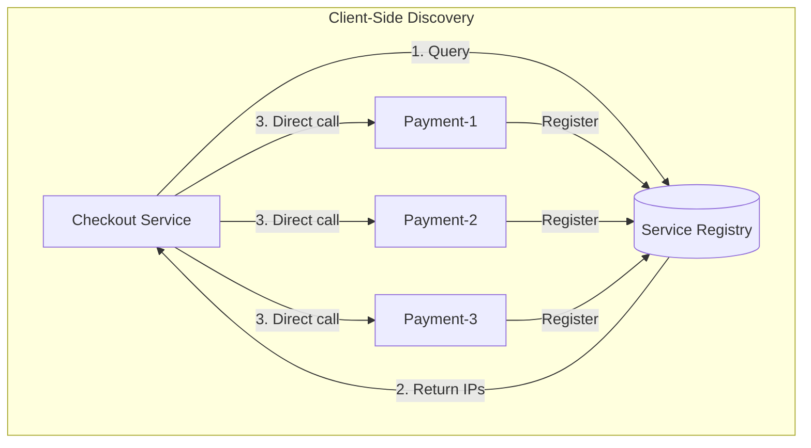
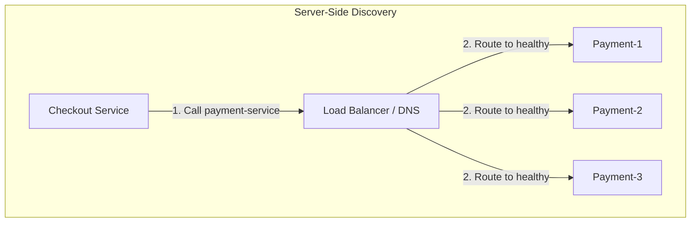
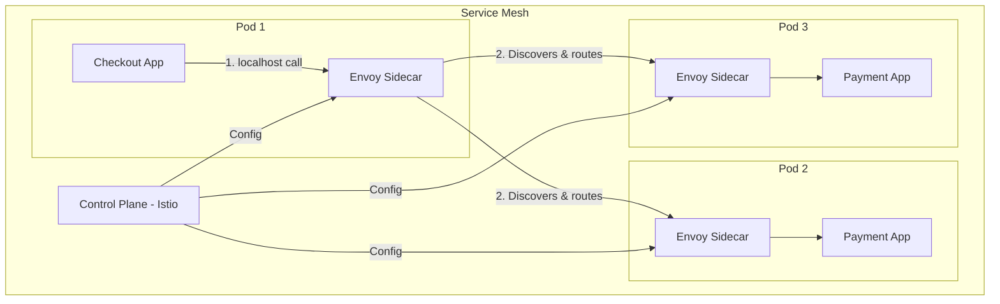

# Service Discovery - How Microservices Find Each Other

## What You'll Learn

Master **service discovery** patterns used in production microservices:
- **Client-side discovery** - Eureka, direct load balancing
- **Server-side discovery** - Kubernetes, AWS ALB
- **Service mesh** - Istio, Envoy sidecar proxies
- **Implementation** - Build discovery from scratch

**Used by**: Netflix (Eureka), Kubernetes (kube-dns), AWS (Cloud Map), Consul

**Time**: 30 minutes | **Difficulty**: Intermediate

---

## Why This Matters

### The IP Address Problem

**Scenario**: Your checkout service needs to call the payment service.

**In monolith**:
```javascript
// Simple - just call the function
const result = paymentModule.charge(order);
```

**In microservices**:
```javascript
// Where is payment service?
const response = await fetch('http://???:???/charge', {
  method: 'POST',
  body: JSON.stringify(order)
});
```

**The problem with hardcoded IPs**:
```
payment-service: 10.0.1.42:3000

What happens when:
1. Service crashes → New IP: 10.0.1.87
2. Auto-scaling → 3 new instances: 10.0.1.88, 10.0.1.89, 10.0.1.90
3. Deployment → Containers recreated with new IPs
4. Multi-region → Different IPs per region

Result: Hardcoded IPs = BROKEN SYSTEM
```

**Without service discovery**:
- Services can't find each other
- No load balancing across instances
- Manual config updates on every deployment
- Downtime during scaling events

---

## The Problem: Dynamic Infrastructure

### Cloud-Native Reality

```
┌─────────────────────────────────────────────────────────────┐
│                 DYNAMIC INFRASTRUCTURE                       │
├─────────────────────────────────────────────────────────────┤
│                                                             │
│  Time T1:                                                   │
│  ┌──────────┐  ┌──────────┐                                │
│  │Payment-1 │  │Payment-2 │                                │
│  │10.0.1.42 │  │10.0.1.43 │                                │
│  └──────────┘  └──────────┘                                │
│                                                             │
│  Time T2 (Auto-scale event):                               │
│  ┌──────────┐  ┌──────────┐  ┌──────────┐  ┌──────────┐   │
│  │Payment-1 │  │Payment-2 │  │Payment-3 │  │Payment-4 │   │
│  │10.0.1.42 │  │10.0.1.43 │  │10.0.1.88 │  │10.0.1.89 │   │
│  └──────────┘  └──────────┘  └──────────┘  └──────────┘   │
│                                                             │
│  Time T3 (Instance failure):                               │
│  ┌──────────┐  ┌──────────┐              ┌──────────┐     │
│  │Payment-1 │  │    X     │              │Payment-4 │     │
│  │10.0.1.42 │  │  DEAD    │              │10.0.1.89 │     │
│  └──────────┘  └──────────┘              └──────────┘     │
│                                                             │
│  How does checkout-service know current payment instances?  │
└─────────────────────────────────────────────────────────────┘
```

---

## The Solution: Service Discovery Patterns

### Pattern 1: Client-Side Discovery



**Implementation**:

```javascript
// Service Registry (using Consul/Eureka pattern)
class ServiceRegistry {
  constructor() {
    this.services = new Map(); // service -> Set of instances
    this.heartbeatTimeout = 30000; // 30 seconds
  }

  // Register a service instance
  register(serviceName, instance) {
    if (!this.services.has(serviceName)) {
      this.services.set(serviceName, new Map());
    }

    const instances = this.services.get(serviceName);
    instances.set(instance.id, {
      ...instance,
      lastHeartbeat: Date.now(),
      status: 'UP'
    });

    console.log(`Registered ${serviceName}:${instance.id} at ${instance.address}:${instance.port}`);
  }

  // Deregister on shutdown
  deregister(serviceName, instanceId) {
    const instances = this.services.get(serviceName);
    if (instances) {
      instances.delete(instanceId);
      console.log(`Deregistered ${serviceName}:${instanceId}`);
    }
  }

  // Heartbeat to stay alive
  heartbeat(serviceName, instanceId) {
    const instances = this.services.get(serviceName);
    if (instances && instances.has(instanceId)) {
      instances.get(instanceId).lastHeartbeat = Date.now();
    }
  }

  // Get healthy instances
  getInstances(serviceName) {
    const instances = this.services.get(serviceName);
    if (!instances) return [];

    const now = Date.now();
    const healthyInstances = [];

    for (const [id, instance] of instances) {
      if (now - instance.lastHeartbeat < this.heartbeatTimeout) {
        healthyInstances.push(instance);
      } else {
        // Mark as DOWN if heartbeat missed
        instance.status = 'DOWN';
      }
    }

    return healthyInstances;
  }

  // Cleanup dead instances
  evictDeadInstances() {
    const now = Date.now();
    for (const [serviceName, instances] of this.services) {
      for (const [id, instance] of instances) {
        if (now - instance.lastHeartbeat > this.heartbeatTimeout * 2) {
          instances.delete(id);
          console.log(`Evicted dead instance: ${serviceName}:${id}`);
        }
      }
    }
  }
}

// Client with built-in discovery
class DiscoveryClient {
  constructor(registryUrl) {
    this.registryUrl = registryUrl;
    this.cache = new Map(); // Local cache of service instances
    this.cacheTimeout = 30000; // Refresh every 30s
  }

  async getService(serviceName) {
    // Check cache first
    const cached = this.cache.get(serviceName);
    if (cached && Date.now() - cached.timestamp < this.cacheTimeout) {
      return this.selectInstance(cached.instances);
    }

    // Fetch from registry
    const response = await fetch(`${this.registryUrl}/services/${serviceName}`);
    const instances = await response.json();

    // Update cache
    this.cache.set(serviceName, {
      instances,
      timestamp: Date.now()
    });

    return this.selectInstance(instances);
  }

  selectInstance(instances) {
    if (instances.length === 0) {
      throw new Error('No healthy instances available');
    }
    // Round-robin load balancing
    const index = Math.floor(Math.random() * instances.length);
    return instances[index];
  }

  async call(serviceName, path, options = {}) {
    const instance = await this.getService(serviceName);
    const url = `http://${instance.address}:${instance.port}${path}`;

    return await fetch(url, options);
  }
}

// Service self-registration
class ServiceInstance {
  constructor(serviceName, port, registry) {
    this.serviceName = serviceName;
    this.instanceId = `${serviceName}-${process.pid}-${Date.now()}`;
    this.port = port;
    this.registry = registry;
  }

  async start() {
    // Register with registry
    await fetch(`${this.registry}/register`, {
      method: 'POST',
      headers: { 'Content-Type': 'application/json' },
      body: JSON.stringify({
        serviceName: this.serviceName,
        instanceId: this.instanceId,
        address: this.getIPAddress(),
        port: this.port,
        healthCheckUrl: `/health`
      })
    });

    // Start heartbeat
    this.heartbeatInterval = setInterval(() => this.sendHeartbeat(), 10000);

    // Graceful shutdown
    process.on('SIGTERM', () => this.shutdown());
    process.on('SIGINT', () => this.shutdown());
  }

  async sendHeartbeat() {
    try {
      await fetch(`${this.registry}/heartbeat`, {
        method: 'POST',
        headers: { 'Content-Type': 'application/json' },
        body: JSON.stringify({
          serviceName: this.serviceName,
          instanceId: this.instanceId
        })
      });
    } catch (error) {
      console.error('Failed to send heartbeat:', error);
    }
  }

  async shutdown() {
    clearInterval(this.heartbeatInterval);
    await fetch(`${this.registry}/deregister`, {
      method: 'POST',
      headers: { 'Content-Type': 'application/json' },
      body: JSON.stringify({
        serviceName: this.serviceName,
        instanceId: this.instanceId
      })
    });
    process.exit(0);
  }

  getIPAddress() {
    const interfaces = require('os').networkInterfaces();
    for (const name of Object.keys(interfaces)) {
      for (const iface of interfaces[name]) {
        if (iface.family === 'IPv4' && !iface.internal) {
          return iface.address;
        }
      }
    }
    return 'localhost';
  }
}
```

### Pattern 2: Server-Side Discovery (Kubernetes/AWS)



**Kubernetes DNS**:

```yaml
# payment-service.yaml
apiVersion: v1
kind: Service
metadata:
  name: payment-service
spec:
  selector:
    app: payment
  ports:
    - port: 80
      targetPort: 3000
  type: ClusterIP

---
apiVersion: apps/v1
kind: Deployment
metadata:
  name: payment
spec:
  replicas: 3
  selector:
    matchLabels:
      app: payment
  template:
    metadata:
      labels:
        app: payment
    spec:
      containers:
        - name: payment
          image: payment-service:latest
          ports:
            - containerPort: 3000
          readinessProbe:
            httpGet:
              path: /health
              port: 3000
            initialDelaySeconds: 5
            periodSeconds: 10
```

```javascript
// In Kubernetes - just use service name
async function callPayment(order) {
  // Kubernetes DNS resolves 'payment-service' to ClusterIP
  // kube-proxy load balances across pods
  const response = await fetch('http://payment-service/charge', {
    method: 'POST',
    body: JSON.stringify(order)
  });

  return await response.json();
}
```

### Pattern 3: Service Mesh (Istio/Envoy)



```javascript
// Application code is simple - mesh handles discovery
async function callPayment(order) {
  // Envoy sidecar intercepts and routes
  // Application doesn't know about discovery
  const response = await fetch('http://payment-service:3000/charge', {
    method: 'POST',
    body: JSON.stringify(order)
  });

  return await response.json();
}

// Envoy handles:
// - Service discovery
// - Load balancing
// - Retries
// - Circuit breaking
// - mTLS
// - Observability
```

### Comparison Table

| Aspect | Client-Side | Server-Side | Service Mesh |
|--------|-------------|-------------|--------------|
| **Load balancing** | In client | In LB/proxy | In sidecar |
| **Complexity** | Client code | Infrastructure | Platform |
| **Features** | Basic | Medium | Full (retries, mTLS) |
| **Latency** | Lowest | Medium | Slightly higher |
| **Observability** | Manual | Basic | Built-in |
| **Example** | Eureka | Kubernetes | Istio |

---

## Health Checking

### Implementation

```javascript
// Health check endpoint
app.get('/health', async (req, res) => {
  const health = {
    status: 'UP',
    timestamp: new Date().toISOString(),
    checks: {}
  };

  // Check database
  try {
    await db.query('SELECT 1');
    health.checks.database = { status: 'UP' };
  } catch (error) {
    health.checks.database = { status: 'DOWN', error: error.message };
    health.status = 'DOWN';
  }

  // Check Redis
  try {
    await redis.ping();
    health.checks.redis = { status: 'UP' };
  } catch (error) {
    health.checks.redis = { status: 'DOWN', error: error.message };
    health.status = 'DOWN';
  }

  // Check downstream services
  try {
    const response = await fetch('http://payment-service/health', { timeout: 5000 });
    health.checks.paymentService = { status: response.ok ? 'UP' : 'DOWN' };
  } catch (error) {
    health.checks.paymentService = { status: 'DOWN', error: 'Timeout or unreachable' };
    // Don't fail health check for downstream - just report
  }

  res.status(health.status === 'UP' ? 200 : 503).json(health);
});

// Readiness vs Liveness
app.get('/ready', async (req, res) => {
  // Ready = can serve traffic
  // Check all dependencies
  const ready = await checkAllDependencies();
  res.status(ready ? 200 : 503).json({ ready });
});

app.get('/live', (req, res) => {
  // Live = process is running
  // Don't check dependencies - just that app responds
  res.status(200).json({ alive: true });
});
```

---

## Real-World Validation

### Who Uses What?

| Company | Solution | Scale |
|---------|----------|-------|
| **Netflix** | Eureka | 1000+ services |
| **Uber** | Custom + Consul | 4000+ services |
| **Google** | Kubernetes | Origin of K8s |
| **AWS** | Cloud Map, ALB | Managed services |
| **Lyft** | Envoy (they built it) | Service mesh |

### Netflix Eureka

```
How it works:
1. Every service runs Eureka client
2. On startup: Register with Eureka server
3. Every 30s: Send heartbeat
4. To call service: Query Eureka, cache locally
5. Client-side load balancing with Ribbon

Scale:
- 1000+ microservices
- 100K+ instances
- Millions of registrations/day
```

---

## Interview Tips

### Common Questions

**Q: Client-side vs server-side discovery - when to use which?**

**Answer:**
1. **Client-side** (Eureka):
   - Full control over load balancing
   - Works across clusters
   - More complex client code
2. **Server-side** (Kubernetes):
   - Simpler client code
   - Platform handles complexity
   - Limited to single cluster

---

**Q: How do you handle discovery in multi-region deployments?**

**Answer:**
1. **Regional registries** - Each region has its own registry
2. **Global load balancer** - Route to nearest healthy region
3. **Failover** - If local region down, query other regions
4. **Latency-based routing** - Prefer low-latency instances

---

**Q: What happens if the service registry goes down?**

**Answer:**
1. **Cached data** - Clients use cached instances
2. **Registry HA** - Multiple registry replicas
3. **Peer replication** - Registries sync with each other
4. **Degraded mode** - Use last known good config

### Red Flags to Avoid

- ❌ **Hardcoded IPs** in configuration
- ❌ **No health checks** - routing to dead instances
- ❌ **Single registry instance** - SPOF
- ❌ **No client caching** - registry overload
- ❌ **Ignoring graceful shutdown** - requests to dying instances

---

## Key Takeaways

**What you learned**:
1. Service discovery solves dynamic IP problem
2. Client-side = more control, server-side = simpler
3. Health checks are critical for routing
4. Service mesh provides advanced features
5. Always cache discovery results

**What you can do Monday**:
1. Use Kubernetes Services (server-side discovery)
2. Implement health check endpoints
3. Add graceful shutdown with deregistration
4. Cache service instances client-side
5. Monitor registry health

---

## Related Articles

- [Circuit Breaker Pattern](/interview-prep/system-design/circuit-breaker-pattern) - Handle discovery failures
- [API Gateway](/interview-prep/system-design/api-gateway-pattern) - External-facing discovery
- [Load Balancing](/interview-prep/system-design/load-balancing-strategies) - Distribute traffic

---

**Production Examples**:
- **Netflix**: Eureka with Ribbon for client-side LB
- **Kubernetes**: kube-dns + kube-proxy
- **AWS**: Cloud Map + ALB for ECS/EKS

**Remember**: Service discovery is the foundation of microservices. Without it, services can't communicate. Start with server-side (Kubernetes), add client-side caching, and consider service mesh for advanced needs!
