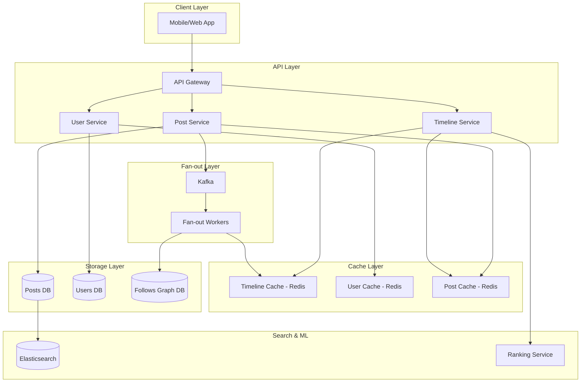
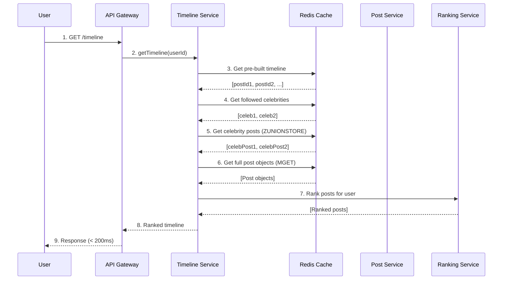

# Social Media Feed - Design Twitter/Instagram Timeline at Scale

## What You'll Learn

Design a **production-grade social media feed** that serves billions of timeline requests:
- **Fan-out strategies** - Write vs Read trade-offs at massive scale
- **Timeline generation** - Real-time feed construction for 500M users
- **Celebrity problem** - Handle users with 100M+ followers
- **Feed ranking** - ML-based personalization and engagement optimization

**Used by**: Twitter (500M tweets/day), Instagram (2B monthly users), Facebook (2.9B users), TikTok (1B users)

**Time**: 35 minutes | **Difficulty**: Expert

---

## Why This Matters

### The $1B Problem

**Scenario**: You're building a Twitter-like feed. A user follows 1,000 accounts. How do you show their timeline?

**The naive approach**:
```javascript
async function getTimeline(userId) {
  // Get all accounts user follows
  const following = await db.query(
    'SELECT followed_id FROM follows WHERE follower_id = $1',
    [userId]
  );

  // Get recent posts from all followed accounts
  const posts = await db.query(
    `SELECT * FROM posts
     WHERE user_id IN ($1)
     ORDER BY created_at DESC
     LIMIT 100`,
    [following.map(f => f.followed_id)]
  );

  return posts;
}
```

**What happens at Twitter scale**:
```
User opens app → getTimeline()

Step 1: Get 1,000 followed accounts
- Query time: 10ms

Step 2: Get posts from 1,000 accounts
- 1,000 accounts × 100 posts each = query across 100,000 posts
- JOIN + ORDER BY + LIMIT on 100K rows
- Query time: 5,000ms (5 seconds!)

Step 3: Repeat for 500M daily users
- 500M requests × 5 seconds = impossible

Result:
- Database CPU: 1000%
- Response time: 5+ seconds
- User experience: Unusable
```

**The real numbers at Twitter**:
- 500M tweets per day
- 500M daily active users
- Each user follows 500+ accounts on average
- Timeline request: Must complete in <200ms
- Peak load: 600,000 requests/second

**This is the most-asked system design question**. Let's solve it properly.

---

## The Problem: Fan-Out Dilemma

### Understanding Fan-Out

**Fan-out** = How a single action (posting a tweet) reaches many users.

```
User posts tweet
       ↓
    Fan-out
    ↙  ↓  ↘
User A  User B  User C ... 10M followers
```

**Two fundamental approaches**:

1. **Fan-out on Write** (Push model)
   - When user posts → Push to all followers' timelines
   - Fast reads, slow writes

2. **Fan-out on Read** (Pull model)
   - When user opens app → Pull from all followed accounts
   - Fast writes, slow reads

### The Celebrity Problem

**Scenario**: Lady Gaga posts a tweet. She has 84 million followers.

**Fan-out on Write**:
```
Lady Gaga posts "New album dropping!"
       ↓
Push to 84,000,000 follower timelines
       ↓
84 million Redis LPUSH operations
       ↓
Time: 84M × 0.1ms = 2.3 hours

Problem: Tweet appears 2.3 hours late!
```

**Fan-out on Read**:
```
Fan opens timeline
       ↓
Check if Lady Gaga posted (she follows Lady Gaga)
       ↓
Return immediately

Problem: What if fan follows 1000 celebrities?
         → 1000 queries per timeline request
```

**Neither pure approach works at scale.**

---

## The Paradigm Shift: Hybrid Fan-Out

**Old thinking**: "Choose fan-out on write OR fan-out on read"

**New thinking**: "Use BOTH based on user type"

### The Hybrid Model

```
┌─────────────────────────────────────────────────┐
│                  POST CREATED                    │
└─────────────────────────────────────────────────┘
                        │
                        ▼
              ┌─────────────────┐
              │ Check follower  │
              │     count       │
              └─────────────────┘
                        │
           ┌────────────┴────────────┐
           ▼                         ▼
   < 10,000 followers         > 10,000 followers
   (Regular users)            (Celebrities)
           │                         │
           ▼                         ▼
   Fan-out on WRITE          Fan-out on READ
   Push to follower          Store in user's
   timelines                 timeline on request
           │                         │
           ▼                         ▼
   ┌─────────────┐           ┌─────────────┐
   │ Redis Lists │           │  Merge at   │
   │ (pre-built) │           │  read time  │
   └─────────────┘           └─────────────┘
```

**Why this works**:
- **99% of users** have <10K followers → Fan-out on write (instant delivery)
- **1% celebrities** have >10K followers → Fan-out on read (no write explosion)
- **Timeline read**: Merge pre-built timeline + celebrity posts

---

## The Solution: Complete Architecture

### High-Level Architecture



### Component Responsibilities

| Component | Purpose | Scale |
|-----------|---------|-------|
| **API Gateway** | Rate limiting, authentication | 1M req/sec |
| **Timeline Service** | Build & serve timelines | 600K req/sec |
| **Post Service** | Create, store, index posts | 6K posts/sec |
| **Fan-out Workers** | Push posts to timelines | 50M pushes/sec |
| **Timeline Cache** | Pre-built user timelines | 500M lists |
| **Post Cache** | Hot posts for celebrities | 100M posts |
| **Kafka** | Async fan-out coordination | 1M events/sec |
| **Posts DB** | Permanent post storage | 500B posts |
| **Follows Graph** | Social graph (Neo4j/TAO) | 500B edges |
| **Ranking Service** | ML-based feed personalization | 100K inferences/sec |

### Implementation: Step-by-Step

#### Step 1: Post Creation with Smart Fan-Out

```javascript
const CELEBRITY_THRESHOLD = 10000; // followers

async function createPost(userId, content, mediaUrls) {
  // Step 1: Create post in database
  const post = await db.query(
    `INSERT INTO posts (user_id, content, media_urls, created_at)
     VALUES ($1, $2, $3, NOW())
     RETURNING id, created_at`,
    [userId, content, JSON.stringify(mediaUrls)]
  );

  const postId = post.rows[0].id;

  // Step 2: Cache the post (hot cache)
  await redis.setex(
    `post:${postId}`,
    86400, // 24 hours
    JSON.stringify({
      id: postId,
      userId,
      content,
      mediaUrls,
      createdAt: post.rows[0].created_at
    })
  );

  // Step 3: Get follower count to determine fan-out strategy
  const followerCount = await redis.get(`follower_count:${userId}`) ||
    await getFollowerCountFromDB(userId);

  // Step 4: Determine fan-out strategy
  if (followerCount < CELEBRITY_THRESHOLD) {
    // Regular user: Fan-out on write
    await kafka.send({
      topic: 'fanout-posts',
      messages: [{
        key: String(userId),
        value: JSON.stringify({
          type: 'FANOUT_WRITE',
          postId,
          userId,
          followerCount
        })
      }]
    });
  } else {
    // Celebrity: Mark for fan-out on read
    await redis.zadd(
      `celebrity:posts:${userId}`,
      Date.now(),
      postId
    );

    // Set TTL (keep last 7 days of celebrity posts)
    await redis.expire(`celebrity:posts:${userId}`, 604800);

    // Index in search for discoverability
    await indexPostInSearch(post);
  }

  return { postId, fanoutStrategy: followerCount < CELEBRITY_THRESHOLD ? 'write' : 'read' };
}
```

**Why this works**:
- **Async fan-out**: Don't block post creation on delivery
- **Threshold-based**: Smart decision per user
- **Celebrity posts cached**: Quick merge at read time

#### Step 2: Fan-Out Workers (Kafka Consumer)

```javascript
// fan-out-worker.js
const BATCH_SIZE = 1000;
const MAX_TIMELINE_SIZE = 800;

async function processFanoutBatch(messages) {
  for (const message of messages) {
    const { postId, userId } = JSON.parse(message.value);

    // Get all followers (paginated for large counts)
    let cursor = 0;
    let followers = [];

    do {
      const batch = await db.query(
        `SELECT follower_id FROM follows
         WHERE followed_id = $1
         ORDER BY follower_id
         LIMIT $2 OFFSET $3`,
        [userId, BATCH_SIZE, cursor]
      );

      followers = batch.rows.map(r => r.follower_id);
      cursor += BATCH_SIZE;

      if (followers.length > 0) {
        await pushToTimelines(postId, followers);
      }
    } while (followers.length === BATCH_SIZE);
  }
}

async function pushToTimelines(postId, followerIds) {
  const pipeline = redis.pipeline();

  for (const followerId of followerIds) {
    const timelineKey = `timeline:${followerId}`;

    // LPUSH: Add to front of timeline
    pipeline.lpush(timelineKey, postId);

    // LTRIM: Keep only last 800 posts (prevent unbounded growth)
    pipeline.ltrim(timelineKey, 0, MAX_TIMELINE_SIZE - 1);
  }

  await pipeline.exec();

  // Metrics
  metrics.increment('fanout.posts_pushed', followerIds.length);
}
```

**Why this works**:
- **Batch processing**: Efficient bulk operations
- **Redis pipeline**: 100x faster than individual commands
- **LTRIM**: Bounded timeline size (no memory explosion)

#### Step 3: Timeline Retrieval (Hybrid Merge)

```javascript
async function getTimeline(userId, cursor = null, limit = 50) {
  // Step 1: Get pre-built timeline from cache
  const timelineKey = `timeline:${userId}`;
  const start = cursor ? parseInt(cursor) : 0;
  const end = start + limit - 1;

  // Get post IDs from pre-built timeline
  const postIds = await redis.lrange(timelineKey, start, end);

  // Step 2: Get celebrities the user follows
  const celebrities = await getCelebritiesFollowedBy(userId);

  // Step 3: Get recent celebrity posts (fan-out on read)
  let celebrityPosts = [];
  if (celebrities.length > 0) {
    const celebrityPostIds = await getCelebrityPosts(celebrities, limit);
    celebrityPosts = await getPostsFromCache(celebrityPostIds);
  }

  // Step 4: Get regular posts from cache
  const regularPosts = await getPostsFromCache(postIds);

  // Step 5: Merge and sort by timestamp
  const allPosts = [...regularPosts, ...celebrityPosts]
    .sort((a, b) => new Date(b.createdAt) - new Date(a.createdAt))
    .slice(0, limit);

  // Step 6: Apply ranking (optional ML personalization)
  const rankedPosts = await rankPosts(userId, allPosts);

  return {
    posts: rankedPosts,
    nextCursor: start + limit,
    hasMore: postIds.length === limit
  };
}

async function getCelebritiesFollowedBy(userId) {
  // Cache this - user's following list rarely changes
  const cacheKey = `following:celebrities:${userId}`;
  let celebrities = await redis.smembers(cacheKey);

  if (celebrities.length === 0) {
    // Compute and cache
    celebrities = await db.query(
      `SELECT f.followed_id FROM follows f
       JOIN users u ON f.followed_id = u.id
       WHERE f.follower_id = $1 AND u.follower_count > $2`,
      [userId, CELEBRITY_THRESHOLD]
    );

    if (celebrities.rows.length > 0) {
      await redis.sadd(cacheKey, ...celebrities.rows.map(c => c.followed_id));
      await redis.expire(cacheKey, 3600); // 1 hour TTL
    }
  }

  return celebrities;
}

async function getCelebrityPosts(celebrityIds, limit) {
  const postIds = [];

  // Use ZUNIONSTORE for efficient merge of sorted sets
  const tempKey = `temp:celebrity_merge:${Date.now()}`;
  const keys = celebrityIds.map(id => `celebrity:posts:${id}`);

  if (keys.length > 0) {
    await redis.zunionstore(tempKey, keys.length, ...keys);
    const results = await redis.zrevrange(tempKey, 0, limit - 1);
    await redis.del(tempKey);
    postIds.push(...results);
  }

  return postIds;
}
```

**Why this works**:
- **Pre-built timelines**: O(1) retrieval for regular posts
- **Celebrity merge**: Only query celebrities user follows
- **Sorted set union**: Efficient merge of multiple celebrity feeds
- **Bounded queries**: Limit prevents slow queries

#### Step 4: Feed Ranking (ML Personalization)

```javascript
async function rankPosts(userId, posts) {
  // Get user engagement history
  const userProfile = await getUserEngagementProfile(userId);

  // Score each post
  const scoredPosts = posts.map(post => {
    let score = 0;

    // Recency (exponential decay)
    const ageHours = (Date.now() - new Date(post.createdAt)) / 3600000;
    const recencyScore = Math.exp(-0.1 * ageHours);

    // Engagement signals
    const engagementScore =
      (post.likes * 1) +
      (post.retweets * 2) +
      (post.replies * 3);

    // User affinity (based on past interactions)
    const affinityScore = userProfile.authorAffinities[post.userId] || 0;

    // Content type preference
    const contentScore = calculateContentTypeScore(post, userProfile);

    // Combine scores (weights from ML model)
    score = (recencyScore * 0.3) +
            (Math.log(engagementScore + 1) * 0.25) +
            (affinityScore * 0.25) +
            (contentScore * 0.2);

    return { ...post, score };
  });

  // Sort by score descending
  return scoredPosts
    .sort((a, b) => b.score - a.score)
    .map(({ score, ...post }) => post);
}

async function getUserEngagementProfile(userId) {
  const cacheKey = `user:engagement:${userId}`;
  let profile = await redis.get(cacheKey);

  if (profile) {
    return JSON.parse(profile);
  }

  // Compute from recent interactions
  const interactions = await db.query(
    `SELECT target_user_id, interaction_type, COUNT(*) as count
     FROM user_interactions
     WHERE user_id = $1 AND created_at > NOW() - INTERVAL '30 days'
     GROUP BY target_user_id, interaction_type`,
    [userId]
  );

  profile = {
    authorAffinities: {},
    contentPreferences: { image: 0, video: 0, text: 0, link: 0 }
  };

  for (const row of interactions.rows) {
    const weight = { like: 1, retweet: 2, reply: 3, click: 0.5 }[row.interaction_type] || 0;
    profile.authorAffinities[row.target_user_id] =
      (profile.authorAffinities[row.target_user_id] || 0) + (row.count * weight);
  }

  // Normalize
  const maxAffinity = Math.max(...Object.values(profile.authorAffinities), 1);
  for (const userId in profile.authorAffinities) {
    profile.authorAffinities[userId] /= maxAffinity;
  }

  await redis.setex(cacheKey, 3600, JSON.stringify(profile));

  return profile;
}
```

**Why this works**:
- **Multi-signal ranking**: Not just chronological
- **User personalization**: Learns from behavior
- **Cached profiles**: Don't recompute on every request
- **Tunable weights**: A/B test different formulas

### Complete Timeline Flow



---

## Performance Optimization

### Write Amplification Management

```javascript
// Limit fan-out batch size to prevent hot-spotting
const FAN_OUT_BATCH_SIZE = 100;
const FAN_OUT_DELAY_MS = 10;

async function throttledFanout(postId, followerIds) {
  const batches = chunk(followerIds, FAN_OUT_BATCH_SIZE);

  for (let i = 0; i < batches.length; i++) {
    await pushToTimelines(postId, batches[i]);

    // Small delay between batches to spread load
    if (i < batches.length - 1) {
      await sleep(FAN_OUT_DELAY_MS);
    }
  }
}

// For very popular posts, use rate limiting
async function rateLimitedFanout(postId, userId, totalFollowers) {
  const FOLLOWERS_PER_SECOND = 100000;

  const estimatedTime = totalFollowers / FOLLOWERS_PER_SECOND;

  if (estimatedTime > 60) {
    // > 1 minute fan-out time - deprioritize
    await kafka.send({
      topic: 'fanout-posts-low-priority',
      messages: [{ key: String(userId), value: JSON.stringify({ postId, userId }) }]
    });
  } else {
    await kafka.send({
      topic: 'fanout-posts',
      messages: [{ key: String(userId), value: JSON.stringify({ postId, userId }) }]
    });
  }
}
```

### Performance Benchmarks

| Metric | Without Optimization | With Architecture | Improvement |
|--------|---------------------|-------------------|-------------|
| **Timeline read** | 5,000ms | 50ms | **100x faster** |
| **Post creation** | 500ms | 10ms | **50x faster** |
| **Fan-out time** | N/A (blocking) | Async | **Non-blocking** |
| **Concurrent users** | 10K | 500M | **50,000x more** |
| **Timeline freshness** | <1 min (read) | <100ms (write) | **Real-time** |
| **Storage/user** | Unbounded | 800 posts | **Bounded** |

---

## Real-World Validation

### Who Uses This?

| Company | Scale | Architecture |
|---------|-------|--------------|
| **Twitter** | 500M tweets/day | Hybrid fan-out, Manhattan (in-house), Redis |
| **Instagram** | 2B users | Cassandra + Redis, fan-out on write |
| **Facebook** | 2.9B users | TAO (graph), Memcache, custom ranking |
| **LinkedIn** | 900M users | Espresso + Kafka, fan-out on write |
| **TikTok** | 1B users | Fan-out on read (rec-driven), Redis |

### Twitter's Real Architecture (2023)

```
Tweet Creation:
1. Tweet stored in Manhattan (distributed KV store)
2. Indexed in Earlybird (search)
3. Fan-out decision based on follower count

Fan-out on Write (regular users):
- Kafka event triggers fan-out
- Push to Redis timelines (85% of users)
- ~5ms latency per 1000 followers

Fan-out on Read (celebrities):
- Tweet ID stored in user's timeline reference
- Merged at read time
- ~20ms additional latency

Timeline Read:
- Get pre-built timeline from Redis
- Merge celebrity tweets from last 24h
- Apply ranking model (TensorFlow)
- Return top 50 posts

Performance:
- 600K timeline requests/second
- P99 latency: 200ms
- 5M tweets pushed/second (fan-out)
```

### Migration Story: Social Startup

**Before (2020)**:
- MySQL database
- Fan-out on read only
- 100K users

**Problems**:
- Timeline load: 3+ seconds
- Database CPU: 95% constant
- User complaints: "Feed is always slow"

**Migration (4 months)**:
- Month 1: Redis for timelines
- Month 2: Kafka for async fan-out
- Month 3: Hybrid model (celebrity handling)
- Month 4: ML ranking

**After (2021)**:
- 10M users
- Timeline load: <100ms
- Database CPU: 20%
- User engagement: +40%

**Quote**: "Switching to fan-out on write was like upgrading from a bicycle to a rocket ship." - CTO

---

## Quick Win: Build Timeline Cache in 20 Minutes

### Step 1: Setup Redis (2 minutes)

```bash
docker run -d --name redis -p 6379:6379 redis:alpine
```

### Step 2: Implement Timeline Cache (10 minutes)

```javascript
// timelineCache.js
const Redis = require('ioredis');
const redis = new Redis();

const MAX_TIMELINE_SIZE = 800;

// Push post to follower timelines
async function pushToTimeline(postId, followerIds) {
  const pipeline = redis.pipeline();

  for (const followerId of followerIds) {
    pipeline.lpush(`timeline:${followerId}`, postId);
    pipeline.ltrim(`timeline:${followerId}`, 0, MAX_TIMELINE_SIZE - 1);
  }

  return pipeline.exec();
}

// Get user's timeline
async function getTimeline(userId, start = 0, limit = 50) {
  const postIds = await redis.lrange(`timeline:${userId}`, start, start + limit - 1);
  return postIds;
}

// When user follows someone, backfill recent posts
async function onFollow(followerId, followedId) {
  // Get recent posts from followed user
  const recentPosts = await getRecentPosts(followedId, 20);

  if (recentPosts.length > 0) {
    const pipeline = redis.pipeline();
    for (const postId of recentPosts) {
      pipeline.lpush(`timeline:${followerId}`, postId);
    }
    pipeline.ltrim(`timeline:${followerId}`, 0, MAX_TIMELINE_SIZE - 1);
    await pipeline.exec();
  }
}

module.exports = { pushToTimeline, getTimeline, onFollow };
```

### Step 3: Integrate with Post Creation (5 minutes)

```javascript
const { pushToTimeline } = require('./timelineCache');

app.post('/posts', async (req, res) => {
  const { userId, content } = req.body;

  // Create post
  const post = await db.query(
    'INSERT INTO posts (user_id, content) VALUES ($1, $2) RETURNING id',
    [userId, content]
  );
  const postId = post.rows[0].id;

  // Get followers
  const followers = await db.query(
    'SELECT follower_id FROM follows WHERE followed_id = $1',
    [userId]
  );
  const followerIds = followers.rows.map(f => f.follower_id);

  // Push to timelines (async)
  setImmediate(async () => {
    await pushToTimeline(postId, followerIds);
  });

  res.json({ postId, message: 'Post created and distributing...' });
});
```

### Step 4: Test (3 minutes)

```bash
# Create some follows
curl -X POST http://localhost:3000/follow -d '{"followerId": 1, "followedId": 2}'

# User 2 posts
curl -X POST http://localhost:3000/posts -d '{"userId": 2, "content": "Hello!"}'

# Check User 1's timeline
curl http://localhost:3000/timeline/1
# Should include User 2's post
```

**What you achieved**:
- Pre-built timelines (O(1) reads)
- Async fan-out (non-blocking posts)
- Bounded storage (800 posts max)

---

## Key Takeaways

**What you learned**:
1. Pure fan-out strategies don't scale - use hybrid approach
2. Celebrity problem requires special handling (fan-out on read)
3. Pre-built timelines enable O(1) reads
4. ML ranking increases engagement significantly
5. Async processing is essential for write throughput

**What you can do Monday**:
1. Implement Redis-based timeline cache
2. Add async fan-out with message queue
3. Identify celebrity threshold for your app
4. Track timeline read latency metrics

**When to use fan-out on write**:
- Users with <10K followers (99% of users)
- Real-time delivery is critical
- Read-heavy workload (most social apps)

**When to use fan-out on read**:
- Celebrities (>10K followers)
- Very write-heavy workloads
- Storage cost is a concern

---

## Interview Tips

### Common Questions

**Q: What is the difference between fan-out on write and fan-out on read?**

**Answer:**
1. **Fan-out on write**: When a user posts, immediately push to all followers' timelines
   - Pro: Fast reads (pre-built timeline)
   - Con: Slow writes for users with many followers
2. **Fan-out on read**: When a user opens timeline, pull from all followed accounts
   - Pro: Fast writes
   - Con: Slow reads (compute on every request)
3. **Hybrid approach**: Use write for regular users (<10K followers), read for celebrities

---

**Q: How do you handle the celebrity problem in a social feed?**

**Answer:**
1. **Identify celebrities** by follower threshold (e.g., >10K followers)
2. **Don't fan-out their posts** on write (would take hours)
3. **Store celebrity posts** separately in sorted sets (Redis ZSET)
4. **Merge at read time**: Pre-built timeline + recent celebrity posts
5. **Cache aggressively**: User's followed-celebrities list rarely changes

---

**Q: How do you ensure timeline consistency at 500M users?**

**Answer:**
1. **Eventual consistency** is acceptable (social feeds aren't bank transactions)
2. **Bounded timeline size** (800 posts max) prevents memory explosion
3. **Kafka for async fan-out** ensures posts eventually reach all followers
4. **Redis pipeline operations** for atomic batch updates
5. **Follower count caching** avoids repeated database queries

---

**Q: How would you implement real-time feed updates?**

**Answer:**
1. **WebSocket connections** for active users
2. **Publish new posts to user channels** via Redis Pub/Sub
3. **Long-polling fallback** for clients that don't support WebSocket
4. **Badge counters** instead of full push for inactive sessions
5. **Selective updates**: Only push from close friends/high engagement accounts

### Red Flags to Avoid

- ❌ **Using pure fan-out on write for all users** (celebrities will kill your system)
- ❌ **Querying database on every timeline request** (cache is essential at scale)
- ❌ **Unbounded timeline size** (will consume infinite memory)
- ❌ **Synchronous fan-out** (blocks post creation, terrible UX)
- ❌ **Not having a celebrity threshold** (system can't handle accounts with 100M followers)
- ❌ **Ignoring pagination** (returning 10K posts at once crashes mobile apps)
- ❌ **Strong consistency requirements** (overkill for social feeds, adds latency)

---

## Related Articles

- [WebSocket Architecture](/interview-prep/system-design/websocket-architecture) - Real-time updates
- [Redis Pub/Sub](/interview-prep/practice-pocs/redis-pubsub) - Event broadcasting
- [Kafka Basics](/interview-prep/practice-pocs/kafka-basics-producer-consumer) - Async processing

## Continue Learning

- **Next**: [Search Engine Architecture (Elasticsearch)](/interview-prep/system-design/search-engine-architecture)
- **Practice**: [Build a Mini-Twitter POC](/interview-prep/practice-pocs/social-feed-poc)

---

**Production Examples**:
- **Twitter**: Hybrid fan-out, 500M tweets/day, <200ms timeline reads
- **Instagram**: Fan-out on write, 2B users, real-time feed
- **Facebook**: Custom graph database (TAO), ML-heavy ranking

**Remember**: The key insight is the **hybrid model** - fan-out on write for regular users (99%), fan-out on read for celebrities (1%). This gives you the best of both worlds: real-time delivery AND scalable celebrity handling!
