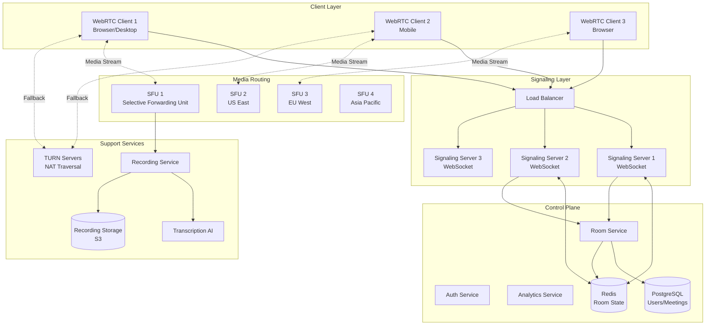
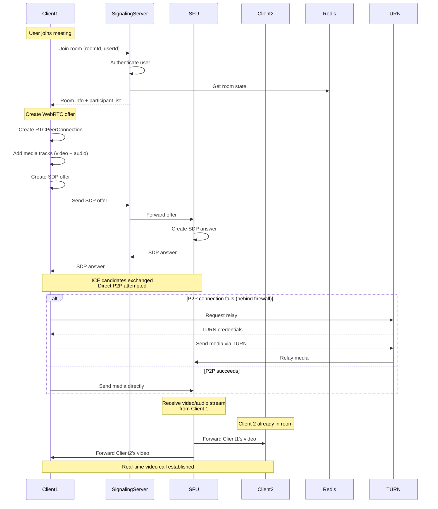
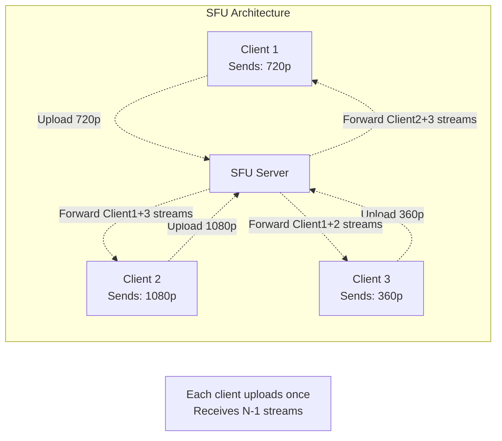
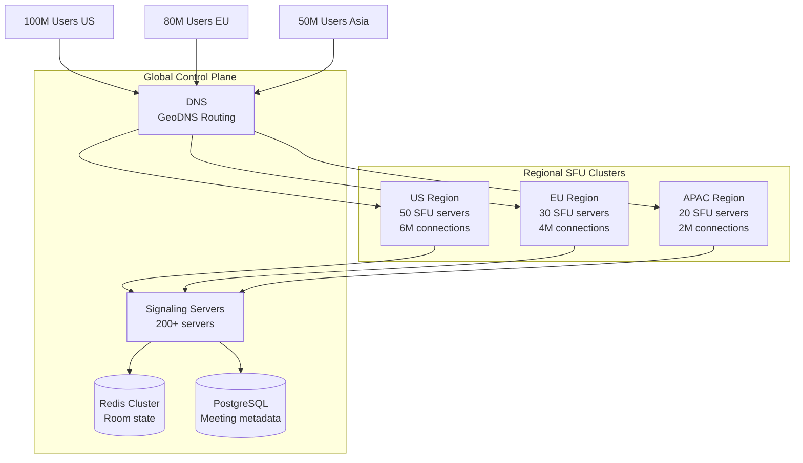

# Video Conferencing System Architecture (Zoom/Google Meet Scale)

## Overview

Design a video conferencing platform that can handle:
- **300M+ daily meeting participants** (Zoom scale)
- **Real-time video/audio** with <100ms latency
- **Screen sharing** and collaboration features
- **Recording and transcription**
- **Global distribution** with regional routing

## Real-World Examples
- **Zoom**: 300M+ daily participants, 3.3 trillion meeting minutes in 2020
- **Google Meet**: 100M+ daily participants
- **Microsoft Teams**: 145M+ daily active users
- **Webex**: 600M+ meeting participants monthly

---

## System Architecture



---

## Key Components Breakdown

### 1. WebRTC Connection Flow with SFU



---

### 2. Production Signaling Server (WebSocket)

```javascript
// signaling-server.js
const WebSocket = require('ws');
const Redis = require('ioredis');
const jwt = require('jsonwebtoken');

class SignalingServer {
  constructor() {
    this.wss = new WebSocket.Server({ port: 8080 });
    this.redis = new Redis.Cluster([
      { host: 'redis-1', port: 6379 },
      { host: 'redis-2', port: 6379 },
      { host: 'redis-3', port: 6379 }
    ]);

    // Track connections on THIS server
    this.connections = new Map(); // userId -> WebSocket
    this.rooms = new Map();        // roomId -> Set<userId>

    this.setupWebSocketHandlers();
  }

  setupWebSocketHandlers() {
    this.wss.on('connection', async (ws, req) => {
      try {
        const token = this.extractToken(req);
        const user = await this.verifyToken(token);

        if (!user) {
          ws.close(1008, 'Authentication failed');
          return;
        }

        ws.userId = user.id;
        ws.username = user.name;

        this.connections.set(user.id, ws);

        console.log(`✅ User ${user.name} connected for signaling`);

        ws.on('message', (data) => this.handleMessage(ws, data));
        ws.on('close', () => this.handleDisconnect(ws));

      } catch (error) {
        console.error('Connection error:', error);
        ws.close(1011, 'Internal error');
      }
    });
  }

  async handleMessage(ws, rawData) {
    try {
      const message = JSON.parse(rawData);

      switch (message.type) {
        case 'join':
          await this.handleJoin(ws, message);
          break;

        case 'offer':
          await this.handleOffer(ws, message);
          break;

        case 'answer':
          await this.handleAnswer(ws, message);
          break;

        case 'ice-candidate':
          await this.handleIceCandidate(ws, message);
          break;

        case 'leave':
          await this.handleLeave(ws, message);
          break;

        case 'mute':
        case 'unmute':
        case 'video-off':
        case 'video-on':
          await this.broadcastStateChange(ws, message);
          break;

        default:
          ws.send(JSON.stringify({ type: 'error', message: 'Unknown type' }));
      }

    } catch (error) {
      console.error('Message error:', error);
      ws.send(JSON.stringify({ type: 'error', message: 'Invalid message' }));
    }
  }

  async handleJoin(ws, message) {
    const { roomId } = message;
    const userId = ws.userId;

    // 1. Create room if not exists
    if (!this.rooms.has(roomId)) {
      this.rooms.set(roomId, new Set());
    }

    // 2. Add user to room
    this.rooms.get(roomId).add(userId);

    // 3. Store in Redis (global room state)
    await this.redis.sadd(`room:${roomId}:participants`, userId);
    await this.redis.hset(`user:${userId}`, 'roomId', roomId, 'joinedAt', Date.now());

    // 4. Get list of existing participants
    const existingParticipants = await this.getParticipants(roomId);

    // 5. Notify user of existing participants
    ws.send(JSON.stringify({
      type: 'joined',
      roomId,
      participants: existingParticipants.filter(p => p.userId !== userId)
    }));

    // 6. Notify others in room
    this.broadcastToRoom(roomId, {
      type: 'user-joined',
      userId,
      username: ws.username
    }, userId); // Exclude self

    console.log(`✅ User ${ws.username} joined room ${roomId}`);

    // 7. Assign SFU server (based on user's region)
    const sfuServer = await this.assignSFU(userId, roomId);

    ws.send(JSON.stringify({
      type: 'sfu-assigned',
      sfuUrl: sfuServer.url,
      turnServers: await this.getTurnServers()
    }));
  }

  async handleOffer(ws, message) {
    const { roomId, sdp, targetUserId } = message;

    // Forward SDP offer to SFU server
    const sfuServer = await this.getSFUForRoom(roomId);

    // Send offer to SFU
    await fetch(`${sfuServer}/api/offer`, {
      method: 'POST',
      headers: { 'Content-Type': 'application/json' },
      body: JSON.stringify({
        roomId,
        userId: ws.userId,
        sdp
      })
    });

    console.log(`📡 Forwarded offer from ${ws.username} to SFU`);
  }

  async handleAnswer(ws, message) {
    // Answers come from SFU, forward to client
    const { sdp, targetUserId } = message;

    const targetWs = this.connections.get(targetUserId);
    if (targetWs) {
      targetWs.send(JSON.stringify({
        type: 'answer',
        sdp,
        userId: ws.userId
      }));
    }
  }

  async handleIceCandidate(ws, message) {
    const { roomId, candidate } = message;

    // Forward ICE candidate to SFU
    const sfuServer = await this.getSFUForRoom(roomId);

    await fetch(`${sfuServer}/api/ice-candidate`, {
      method: 'POST',
      headers: { 'Content-Type': 'application/json' },
      body: JSON.stringify({
        roomId,
        userId: ws.userId,
        candidate
      })
    });
  }

  async handleLeave(ws, message) {
    const { roomId } = message;
    const userId = ws.userId;

    // Remove from room
    if (this.rooms.has(roomId)) {
      this.rooms.get(roomId).delete(userId);
    }

    // Remove from Redis
    await this.redis.srem(`room:${roomId}:participants`, userId);
    await this.redis.del(`user:${userId}`);

    // Notify others
    this.broadcastToRoom(roomId, {
      type: 'user-left',
      userId
    });

    console.log(`✅ User ${ws.username} left room ${roomId}`);

    // If room empty, clean up
    const remaining = await this.redis.scard(`room:${roomId}:participants`);
    if (remaining === 0) {
      await this.redis.del(`room:${roomId}:participants`);
      this.rooms.delete(roomId);
    }
  }

  async handleDisconnect(ws) {
    const userId = ws.userId;

    // Get user's room
    const userData = await this.redis.hgetall(`user:${userId}`);
    if (userData.roomId) {
      await this.handleLeave(ws, { roomId: userData.roomId });
    }

    this.connections.delete(userId);
    console.log(`❌ User ${ws.username} disconnected`);
  }

  broadcastToRoom(roomId, message, excludeUserId = null) {
    if (!this.rooms.has(roomId)) return;

    const participants = this.rooms.get(roomId);

    participants.forEach(userId => {
      if (userId !== excludeUserId) {
        const ws = this.connections.get(userId);
        if (ws && ws.readyState === WebSocket.OPEN) {
          ws.send(JSON.stringify(message));
        }
      }
    });
  }

  async broadcastStateChange(ws, message) {
    const userData = await this.redis.hgetall(`user:${ws.userId}`);
    const roomId = userData.roomId;

    if (roomId) {
      this.broadcastToRoom(roomId, {
        ...message,
        userId: ws.userId
      }, ws.userId);
    }
  }

  async assignSFU(userId, roomId) {
    // Get user's geolocation from IP (simplified)
    const region = await this.getUserRegion(userId);

    const sfuServers = {
      'us-east': { url: 'wss://sfu-us-east.example.com', region: 'us-east' },
      'eu-west': { url: 'wss://sfu-eu-west.example.com', region: 'eu-west' },
      'ap-south': { url: 'wss://sfu-ap-south.example.com', region: 'ap-south' }
    };

    return sfuServers[region] || sfuServers['us-east'];
  }

  async getSFUForRoom(roomId) {
    // Get SFU server assigned to this room
    const sfu = await this.redis.get(`room:${roomId}:sfu`);
    return sfu || 'https://sfu-us-east.example.com';
  }

  async getTurnServers() {
    // Return TURN servers for NAT traversal
    return [
      {
        urls: 'turn:turn1.example.com:3478',
        username: 'user',
        credential: 'pass'
      },
      {
        urls: 'turn:turn2.example.com:3478',
        username: 'user',
        credential: 'pass'
      }
    ];
  }

  async getParticipants(roomId) {
    const userIds = await this.redis.smembers(`room:${roomId}:participants`);

    return Promise.all(userIds.map(async (userId) => {
      const userData = await this.redis.hgetall(`user:${userId}`);
      return {
        userId,
        joinedAt: userData.joinedAt
      };
    }));
  }

  extractToken(req) {
    const url = new URL(req.url, `http://${req.headers.host}`);
    return url.searchParams.get('token');
  }

  async verifyToken(token) {
    try {
      return jwt.verify(token, process.env.JWT_SECRET);
    } catch {
      return null;
    }
  }

  async getUserRegion(userId) {
    // Simplified - in production, use IP geolocation
    return 'us-east';
  }
}

const server = new SignalingServer();
console.log('🎥 Signaling server running on port 8080');
```

---

### 3. SFU (Selective Forwarding Unit) - Media Router

**What is SFU?**
- Receives video/audio streams from all participants
- **Forwards** streams to other participants (doesn't mix/transcode)
- Much more efficient than MCU (Multi-point Control Unit)



**SFU vs MCU:**

| Feature | SFU (Selective Forwarding) | MCU (Multipoint Control) |
|---------|---------------------------|--------------------------|
| CPU usage | Low (just forwarding) | High (mixing/transcoding) |
| Bandwidth | Higher client bandwidth | Lower client bandwidth |
| Latency | <50ms | 100-300ms |
| Quality | Original quality preserved | Re-encoded (quality loss) |
| Scalability | Excellent (100+ participants) | Limited (10-20 participants) |
| **Used by** | **Zoom, Google Meet, Teams** | Legacy systems |

**Simplified SFU Implementation (Node.js + mediasoup):**

```javascript
// sfu-server.js
const mediasoup = require('mediasoup');
const express = require('express');

class SFUServer {
  constructor() {
    this.workers = [];
    this.routers = new Map(); // roomId -> Router
    this.transports = new Map(); // transportId -> Transport
    this.producers = new Map(); // producerId -> Producer
    this.consumers = new Map(); // consumerId -> Consumer
  }

  async init() {
    // Create mediasoup workers (one per CPU core)
    const numWorkers = os.cpus().length;

    for (let i = 0; i < numWorkers; i++) {
      const worker = await mediasoup.createWorker({
        logLevel: 'warn',
        rtcMinPort: 10000,
        rtcMaxPort: 10100
      });

      this.workers.push(worker);
      console.log(`✅ Mediasoup worker ${i} created`);
    }
  }

  async createRoom(roomId) {
    // Get worker with least load
    const worker = this.getLeastLoadedWorker();

    // Create router for this room
    const router = await worker.createRouter({
      mediaCodecs: [
        {
          kind: 'audio',
          mimeType: 'audio/opus',
          clockRate: 48000,
          channels: 2
        },
        {
          kind: 'video',
          mimeType: 'video/VP8',
          clockRate: 90000
        }
      ]
    });

    this.routers.set(roomId, router);

    console.log(`✅ Room ${roomId} created`);
    return router;
  }

  async createWebRtcTransport(roomId, direction) {
    const router = this.routers.get(roomId);

    const transport = await router.createWebRtcTransport({
      listenIps: [{ ip: '0.0.0.0', announcedIp: process.env.PUBLIC_IP }],
      enableUdp: true,
      enableTcp: true,
      preferUdp: true
    });

    this.transports.set(transport.id, transport);

    return {
      id: transport.id,
      iceParameters: transport.iceParameters,
      iceCandidates: transport.iceCandidates,
      dtlsParameters: transport.dtlsParameters
    };
  }

  async produce(transportId, kind, rtpParameters) {
    const transport = this.transports.get(transportId);

    const producer = await transport.produce({
      kind,
      rtpParameters
    });

    this.producers.set(producer.id, producer);

    console.log(`✅ Producer created: ${kind} (${producer.id})`);

    return { producerId: producer.id };
  }

  async consume(transportId, producerId, rtpCapabilities) {
    const transport = this.transports.get(transportId);
    const producer = this.producers.get(producerId);

    const consumer = await transport.consume({
      producerId: producer.id,
      rtpCapabilities
    });

    this.consumers.set(consumer.id, consumer);

    return {
      id: consumer.id,
      producerId: producer.id,
      kind: consumer.kind,
      rtpParameters: consumer.rtpParameters
    };
  }

  getLeastLoadedWorker() {
    // Simple round-robin
    return this.workers[Math.floor(Math.random() * this.workers.length)];
  }
}

const sfu = new SFUServer();
sfu.init();

const app = express();
app.use(express.json());

app.post('/api/create-room', async (req, res) => {
  const { roomId } = req.body;
  await sfu.createRoom(roomId);
  res.json({ success: true });
});

app.post('/api/create-transport', async (req, res) => {
  const { roomId, direction } = req.body;
  const params = await sfu.createWebRtcTransport(roomId, direction);
  res.json(params);
});

app.post('/api/produce', async (req, res) => {
  const { transportId, kind, rtpParameters } = req.body;
  const result = await sfu.produce(transportId, kind, rtpParameters);
  res.json(result);
});

app.post('/api/consume', async (req, res) => {
  const { transportId, producerId, rtpCapabilities } = req.body;
  const result = await sfu.consume(transportId, producerId, rtpCapabilities);
  res.json(result);
});

app.listen(3000, () => {
  console.log('🎥 SFU server running on port 3000');
});
```

---

## Scalability Deep Dive

### How Zoom Handles 300M Daily Participants



**Key Scalability Patterns:**

#### 1. **Regional SFU Routing**
- Users connect to **nearest SFU** based on geolocation
- **Reduces latency** (50ms vs 200ms cross-continent)
- Each SFU handles **50K-100K concurrent connections**
- Auto-scales based on connection count

#### 2. **Bandwidth Optimization**

**Simulcast**: Client uploads multiple quality streams
```javascript
// Client sends 3 versions simultaneously
const sender = pc.addTrack(videoTrack);
await sender.setParameters({
  encodings: [
    { rid: 'high', maxBitrate: 2000000 },  // 1080p
    { rid: 'mid', maxBitrate: 500000, scaleResolutionDownBy: 2 },  // 540p
    { rid: 'low', maxBitrate: 150000, scaleResolutionDownBy: 4 }   // 270p
  ]
});

// SFU forwards appropriate quality based on each receiver's bandwidth
```

**Result**:
- Mobile user with poor network receives 270p (150kbps)
- Desktop user with good network receives 1080p (2Mbps)
- **Same upload**, different downloads per client

#### 3. **Meeting Size Optimization**

| Meeting Size | Architecture | Why |
|--------------|--------------|-----|
| 2-10 participants | Peer-to-peer (P2P) | No server needed, lowest latency |
| 11-50 participants | Single SFU | Central routing, manageable bandwidth |
| 51-300 participants | Multi-SFU cascade | Distribute load across SFUs |
| 300+ participants (webinar) | Broadcasting mode | Only host sends video, others listen |

**Large Meeting Pattern (300+ participants):**
```javascript
// Only 1 host actively sends video
// Others muted by default
// Bandwidth: Host uploads once, SFU distributes to all

const meetingConfig = {
  mode: 'webinar',
  maxActiveSpeakers: 1,
  videoLayout: 'speaker-only',
  audioBitrate: 32  // Lower quality for hundreds of participants
};

// SFU automatically detects active speaker and prioritizes their stream
```

---

## Performance Benchmarks

### Latency Comparison (Glass-to-Glass)

| Technology | Latency | Use Case |
|------------|---------|----------|
| WebRTC P2P (same region) | **50-100ms** | 1-on-1 calls |
| WebRTC SFU (same region) | **100-150ms** | Group calls (10-50 people) |
| WebRTC SFU (cross-region) | **200-300ms** | Global meetings |
| Traditional RTMP streaming | **3-5 seconds** | One-way broadcasting |
| HLS/DASH streaming | **10-30 seconds** | Video on demand |

**Zoom P95 latency**: 120ms (glass-to-glass, same region)

### SFU Server Capacity

| Server Config | Max Connections | Bandwidth Out |
|---------------|----------------|---------------|
| 4 vCPU, 8GB RAM | 500 | 500 Mbps |
| 8 vCPU, 16GB RAM | 2,000 | 2 Gbps |
| 16 vCPU, 32GB RAM | 5,000 | 5 Gbps |
| **32 vCPU, 64GB RAM** | **10,000** | **10 Gbps** |

**Bottleneck**: Network bandwidth (not CPU)
- Each participant receives ~5 streams @ 500kbps = 2.5 Mbps download
- Server forwards to 100 participants = 250 Mbps upload

---

## Interview Tips

### Common Questions:

**Q: How would you reduce bandwidth for a 100-person meeting?**

**Answer:**
1. **Simulcast**: Client uploads once, SFU sends different qualities to each recipient
2. **Active speaker detection**: Only forward video from active speaker
3. **Spatial layers**: SFU drops frames for non-speakers
4. **Audio-only mode**: Option to disable video entirely (saves 80% bandwidth)

**Q: What happens if SFU server crashes during a meeting?**

**Answer:**
1. **Clients detect connection loss** (no ICE keepalives)
2. **Signaling server reassigns** to new SFU
3. **Clients reconnect** within 2-5 seconds
4. **Meeting continues** with temporary video freeze

**Q: How do you handle screen sharing?**

**Answer:**
```javascript
// Screen sharing requires higher bitrate + FPS
const screenStream = await navigator.mediaDevices.getDisplayMedia({
  video: {
    width: { ideal: 1920 },
    height: { ideal: 1080 },
    frameRate: { ideal: 15 }  // Lower FPS for screen
  }
});

// SFU prioritizes screen share over participant videos
```

**Q: How would you implement recording?**

**Answer:**
1. **SFU records all streams** to separate files
2. **Worker process merges** streams into single video
3. **Uploads to S3** when meeting ends
4. **Transcription service** (AWS Transcribe) processes audio
5. **Meeting host** receives link to recording

### Red Flags to Avoid:

- ❌ "Use HTTP polling for real-time video" (won't work, too slow)
- ❌ "Mix all videos on server" (MCU is outdated, too slow)
- ❌ Not mentioning NAT traversal/TURN servers
- ❌ "Store video streams in database" (streams are ephemeral, not stored)
- ❌ Not considering mobile clients (different bandwidth)

---

## Real-World Production Numbers (Zoom Scale)

- **Daily participants**: 300M+
- **Peak concurrent meetings**: 3M+
- **SFU servers**: 1,000+ globally
- **Signaling servers**: 500+
- **P95 latency**: 120ms (same region)
- **Bandwidth usage**: 500 kbps per participant (average)
- **Recording storage**: 50+ petabytes
- **Monthly cost**: ~$100M (mostly bandwidth + servers)

---

## Hands-On Practice

Want to build your own video conferencing app? Check out:
- [WebRTC Video Chat POC](/interview-prep/practice-pocs/webrtc-video-chat) - Build a 2-person video call
- [SFU Server Setup](/interview-prep/practice-pocs/sfu-setup) - Deploy mediasoup SFU
- [Load Testing WebRTC](/interview-prep/practice-pocs/webrtc-load-testing) - Simulate 100-person meeting

---

## Related Articles

- [WebSocket Architecture](/interview-prep/system-design/websocket-architecture) - Signaling server patterns
- [Video Streaming Platform](/interview-prep/system-design/video-streaming-platform) - Video encoding/delivery
- [Redis Fundamentals](/interview-prep/caching-cdn/redis-fundamentals) - Room state caching
- [Database Scaling Strategies](/interview-prep/database-storage/scaling-strategies) - Meeting metadata storage
- [Load Balancer (ALB/NLB)](/interview-prep/aws-cloud/load-balancer) - Routing SFU traffic

---

**Next**: [Database Replication (Master-Slave & Multi-Master)](/interview-prep/database-storage/database-replication)
